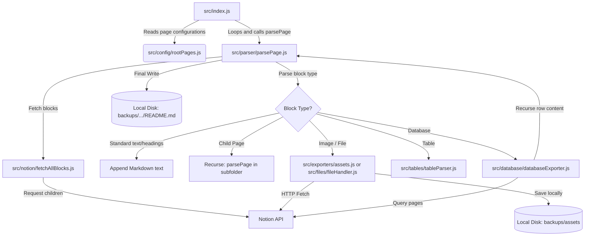

# Notion Backup Exporter: Overview & Automation Proposals

This document provides a comprehensive overview of how your current Notion backup project works, analyzes its architecture, and outlines concrete options to automate and optimize the export pipeline.

---

## 1. How the Current System Works

The project is a lightweight, recursive, Node.js-based exporter. It fetches page content from the Notion API and serializes it into local Markdown files and media assets.

### File-by-File Breakdown

- **Entry Point ([src/index.js](file:///d:/Workspace-Backup/src/index.js))**:
  Reads the list of root pages from configuration, initializes the backup output directory (`backups/`), and starts the recursive backup by calling `parsePage()` for each page.
- **Configuration ([src/config/rootPages.js](file:///d:/Workspace-Backup/src/config/rootPages.js))**:
  Stores an array of hardcoded Notion page IDs and names that you want to back up.
- **Notion Client & API ([src/notion/](file:///d:/Workspace-Backup/src/notion/))**:
  - `client.js` initializes the Notion SDK Client with your secret token from `.env`.
  - `fetchAllBlocks.js` implements a paginated loop using the Notion API to retrieve all blocks belonging to a parent block, fetching them in chunks of 100.
- **Core Parser ([src/parser/parsePage.js](file:///d:/Workspace-Backup/src/parser/parsePage.js))**:
  Iterates over all blocks in a page. For each block, it transforms Notion-specific structures to Markdown formatting:
  - Paragraphs, headings, list items, to-dos, code blocks, and dividers.
  - **Images & Files**: Calls download utilities and writes relative Markdown links.
  - **Tables**: Parses table rows into standard Markdown tables.
  - **Child Pages**: Triggers a recursive call to `parsePage()`, generating a subfolder structure.
  - **Child Databases**: Delegates database parsing to the database exporter.
- **Database Exporter ([src/database/databaseExporter.js](file:///d:/Workspace-Backup/src/database/databaseExporter.js))**:
  Queries all pages in a database, retrieves their schema properties (stored in `schema.json`), and exports each database page into an `entries/` subfolder using `parsePage()`.
- **Media Downloaders**:
  - `src/exporters/assets.js` downloads images with retry logic (3 attempts, 2-second delays) and saves them in `backups/assets/`.
  - `src/files/fileHandler.js` handles downloading attachments (PDFs, files, videos) and saves them in `backups/assets/`.

### System Data Flow

---

## 2. Limitations of the Current Design

1. **Manual Run & Configuration**: Every time you want to add a page, you have to find its ID, update `rootPages.js`, and manually run `node src/index.js` in your terminal.
2. **Double Storage (Local Disk Space)**: Running the script generates files locally in `backups/` and downloads large files to `backups/assets/`. If your goal is just to store them on GitHub, these local files waste space on your hard drive.
3. **No Incremental Sync**: The script deletes and rewrites everything from scratch on every run. For large workspaces, this is slow, wastes bandwidth, and risks hitting Notion API rate limits.
4. **Git Manual Push**: The script does not automatically push files to GitHub; you have to run `git add`, `git commit`, and `git push` manually.

---

## 3. Options for Automation and Improvements

We can implement several "next-level" features to automate the export, remove local disk waste, and dynamically sync pages.

### Feature 1: Fully Automated Execution (No Local Running)
Instead of running this on your machine, we can run it in the cloud.
- **GitHub Actions Workflow**:
  - We can create a GitHub Actions workflow file (e.g., `.github/workflows/backup.yml`).
  - This workflow can run on a **schedule** (e.g., every day at midnight) or on-demand via a button in your repository.
  - The workflow spins up a temporary runner (hosted for free by GitHub), runs your backup script, commits the generated files, and pushes them directly back to your repository.
  - **Benefit**: Zero local disk space used, zero manual steps, completely set-and-forget.

### Feature 2: Dynamic Page Discovery (No Hardcoding IDs)
Instead of editing code (`rootPages.js`) to add pages, we can manage configuration inside Notion itself.
- **The "Backup Hub" Notion Database**:
  - We can modify the script to fetch pages from a single "Backup Hub" database in Notion.
  - The database could look like this:
    | Page Name | Notion Page Link / ID | Active (Checkbox) | Last Synced (Date) |
    | :--- | :--- | :--- | :--- |
    | DSA Notes | `https://notion.so/...` | `[x]` | 2026-08-05 |
  - When the backup script runs, it queries this single database, retrieves all rows with `Active = true`, and exports them.
  - **Benefit**: You manage what gets backed up entirely inside Notion. If you write a new page, you just add a row to your database.

### Feature 3: Direct-to-GitHub Uploads (No Local Writes)
If you still want to run the script locally sometimes (or in a serverless function), we can upload content straight to GitHub using the GitHub REST API (`@octokit/rest`) or standard Git shell commands.
- **GitHub Contents API**:
  - Instead of using `fs.writeFileSync()`, we can convert Markdown and downloaded files into memory buffers and send them directly to GitHub via API requests.
- **Ephemeral Builds**:
  - If we use GitHub Actions, writing files locally on the Actions runner is completely fine (it's a temporary VM that gets deleted immediately after pushing to Git). This avoids rewriting the entire filesystem-based export code while still resolving your local disk space concerns.

### Feature 4: Incremental Backups (Checking Last Edited Time)
To make the backup fast and avoid rate limits:
- When querying Notion pages, the script can check the `last_edited_time` property of each page.
- We can maintain a small index file (e.g., `sync-metadata.json`) in the repository that tracks the last backed-up time of each page.
- If `last_edited_time` in Notion is **before or equal** to the date in `sync-metadata.json`, we skip fetching its blocks entirely.
- **Benefit**: Synchronizing 100 pages with only 2 updates takes seconds instead of minutes.

---

## 4. Next Steps & Recommendation

> [!TIP]
> **Recommended Approach**:
> 1. Keep the local folder-based parsing structure but migrate execution to a **GitHub Actions Workflow** scheduled to run automatically (e.g., daily). This immediately solves the local space issue and manual running.
> 2. Implement the **Backup Hub Database** or **Notion Search API** to dynamically discover pages, so you never have to copy page IDs into a config file again.
> 3. Implement **Incremental Sync** (checking `last_edited_time`) to keep runs short and reliable.

Let me know which of these improvements you would like to proceed with, and I can design an implementation plan for us!
