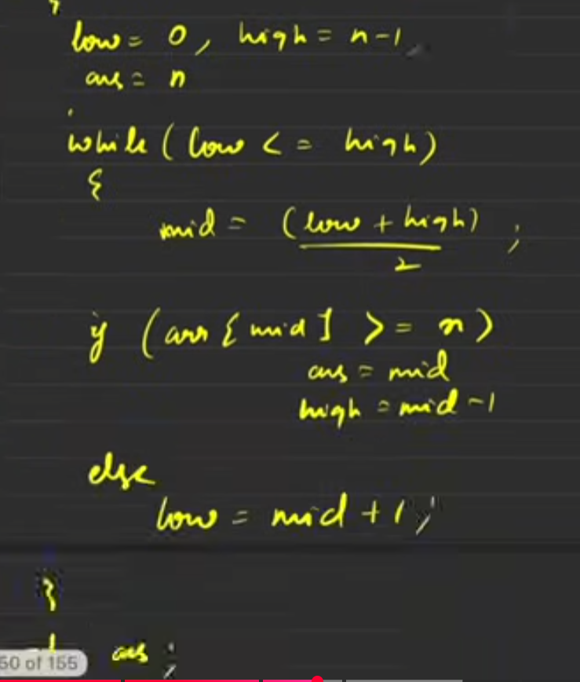
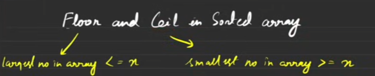

📎 Attachment: ../../assets/2e00eb7a-3bc3-808c-b3d7-e1ac29269063

`upper_bound(nums.begin(), nums.end(), target) - nums.begin()`  —> Gives Index

IMP!!!!!!

# 1. Lower Bound

The **lower bound** of a given number `x` in a sorted array is defined as the **smallest index** such that the number at that index is **greater than or equal to** `x` (0:02).

- **Edge Case****:** If `X` is greater than all elements in the array (e.g., `X = 20` for `[1, 2, 8, 15, 19]`), the lower bound is the *size of the array* (hypothetical index `5` in this case) (1:33-1:58).
- **Duplicate Values****:** If `X` has duplicates, the smallest index of `X` itself will be the lower bound (e.g., for `X = 19` in `[1, 2, 8, 19, 19]`, the lower bound is the index of the first `19`) (2:03-2:35).
**Naive Approach (Linear Search):**

- Time Complexity: **O(n)** (2:43-3:06).
**Optimal Approach (Binary Search):**

- **Initialization:**
- `low = 0` (start of the array) (3:37)
- `high = n - 1` (end of the array) (3:40)
- `ans = n` (initialize with the hypothetical last index, in case no element is found) (3:54-4:08)
- **Algorithm Logic:**
- In each iteration, calculate `mid = (low + high) / 2` (4:19).
- **If **`array[mid]`** is greater than or equal to **`X`:
- This `mid` could be a possible answer. Store `mid` in `ans` (e.g., `ans = mid`) (4:31-5:00).
- Since we need the *smallest* index, try to find a better answer on the left side of the `mid`. So, update `high = mid - 1` (5:10-5:35).
- **Else (**`array[mid]`** is less than **`X`**)**:
- This `mid` cannot be the answer, nor can any element to its left.
- Look for the answer on the right side. Update `low = mid + 1` (9:42-10:08).
- **Termination:** The loop continues as long as `low <= high`. When the loop ends, `ans` will hold the lower bound index (7:08-7:22).
- **Time Complexity:** **O(log N)** (15:34-15:43).
**C++ STL **`lower_bound`** Function:**
For C++ users, `std::lower_bound` can be used to find the lower bound without writing the full binary search code (13:54).

- **Syntax for Vectors:** `lower_bound(array.begin(), array.end(), X)` (14:15-14:24)
- **Syntax for Arrays:** `lower_bound(array, array + n, X)` (14:48-14:51)
- It returns an iterator pointing to the lower bound element. To get the index, subtract the beginning iterator: `index = lower_bound(...) - array.begin()` (14:27-14:45).
- You can also define a specific search range, e.g., `lower_bound(array.begin() + 2, array.begin() + 7, X)` for elements from index 2 to 6 (14:54-15:19).
# 2. Upper Bound

The **upper bound** of a given number `x` in a sorted array is defined as the **smallest index** such that the number at that index is **strictly greater than** `x` (15:46-16:08).

**C++ STL **`upper_bound`** Function:**
Similar to `lower_bound`, `std::upper_bound` exists in C++ (19:20-19:25).

# 4. Floor and Ceil in Sorted Array

This problem involves finding both the "floor" and "ceil" of a given number `x` in a sorted array (22:53-22:56).

- **Floor:** The **largest number** in the array that is either **equal to or lesser than** `x` (22:58-23:06).
- **Ceil:** The **smallest number** in the array that is either **equal to or greater than** `x` (23:07-23:14).
- **Example:** For `X = 25` in `[10, 20, 30, 40, 50]` (23:17-23:18).
- **Floor:** `20` (largest element <= 25) (23:19-23:37).
- **Ceil:** `30` (smallest element >= 25) (23:39-23:56).
- **Example with exact match:** For `X = 25` in `[10, 20, 25, 30, 40]` (24:00-24:06).
- **Floor:** `25`
- **Ceil:** `25` (24:09-24:18).
**Solution for Ceil:**
The definition of **Ceil** is identical to the definition of **Lower Bound**: "smallest number in the array which is either equal or greater than x" (24:27-25:15).

- Therefore, the same binary search logic used for lower bound can be applied to find the ceil.
- If no such element exists (e.g., `X` is greater than all elements), you might return -1 or a specific indicator based on problem requirements (25:26-25:37).
**Solution for Floor:**
The floor requires finding the "largest number in the array that is either equal or lesser than x" (25:58-26:05). This is essentially a modified binary search.

- **Initialization:**
- `ans = -1` (or a suitable default value, as you're returning the *value* not the index) (26:13-26:18).
- `low = 0`, `high = n - 1` (26:19-26:22).
- **Algorithm Logic:**
- Calculate `mid = (low + high) / 2`.
- **If **`array[mid]`** is less than or equal to **`X`:
- This `mid` could be a possible answer for the floor. Store `array[mid]` in `ans` (e.g., `ans = array[mid]`) (26:56-27:07).
- Since we need the *largest* element that satisfies the condition, we try to find a better answer on the right side. So, update `low = mid + 1` (27:10-27:30).
- **Else (**`array[mid]`** is strictly greater than **`X`**)**:
- This `mid` is too large to be the floor, and anything to its right will also be too large.
- Look for the answer on the left side. Update `high = mid - 1` (27:59-28:02).
- The logic here prioritizes moving right when a candidate is found because you're looking for the *largest* possible number that is still less than or equal to `X`. (27:19-27:55).
- **Time Complexity:** **O(log N)**.
**General Binary Search Template for these Problems:**
The video emphasizes a consistent binary search template with `low`, `high`, `mid`, and an `ans` variable to store potential answers (10:55-11:23).

- When `array[mid]` satisfies a condition (e.g., `>= X` for lower bound/ceil, `<= X` for floor):
- Store `mid` (or `array[mid]`) in `ans`.
- Adjust `high = mid - 1` to search for a *smaller* possible answer (for lower bound/ceil).
- Adjust `low = mid + 1` to search for a *larger* possible answer (for floor).
- When `array[mid]` does not satisfy the condition:
- Adjust `low = mid + 1` (for lower bound/ceil).
- Adjust `high = mid - 1` (for floor).
The video highly recommends practicing with pen and paper and doing dry runs with various examples to solidify understanding of how binary search guarantees finding the smallest/largest index/value based on the specific condition and search space elimination (30:08-30:38).

