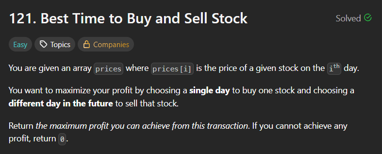
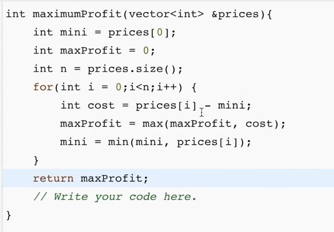
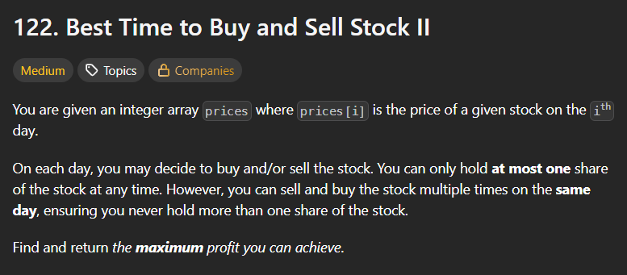
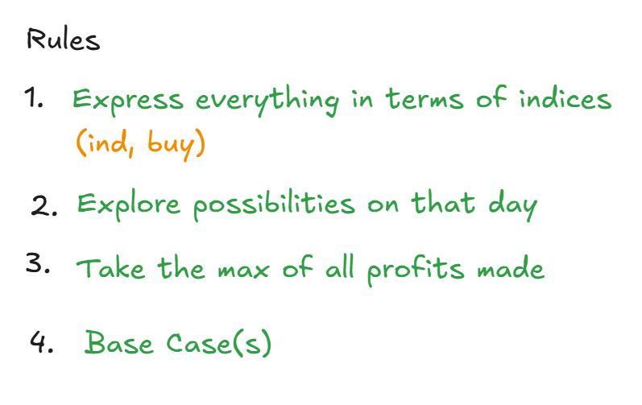
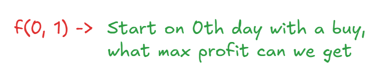
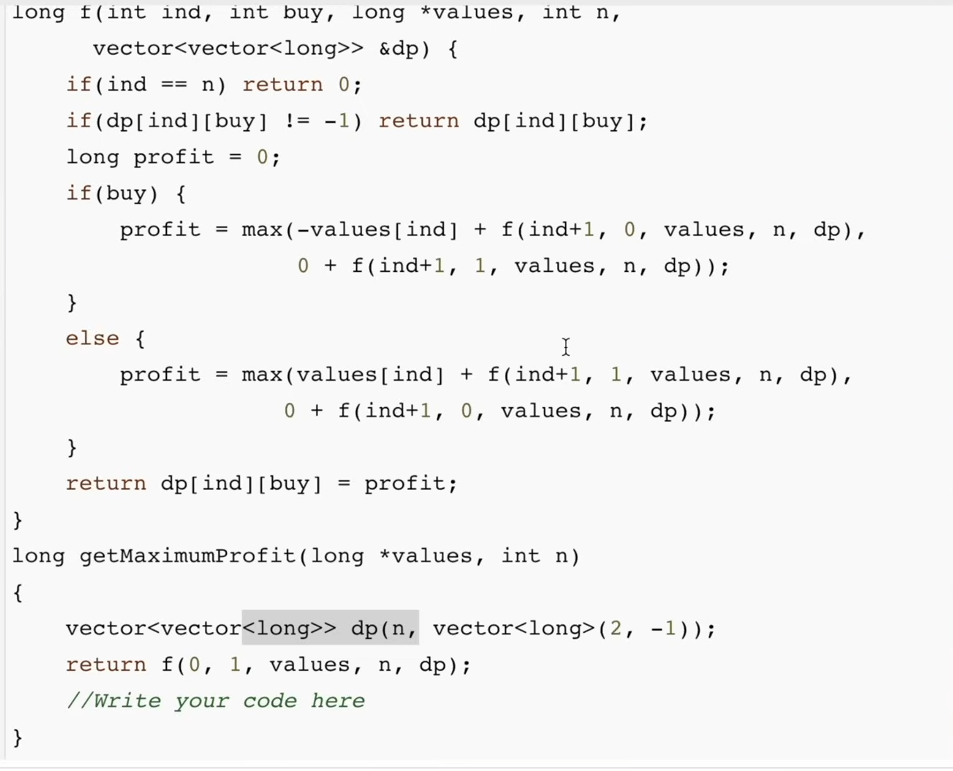
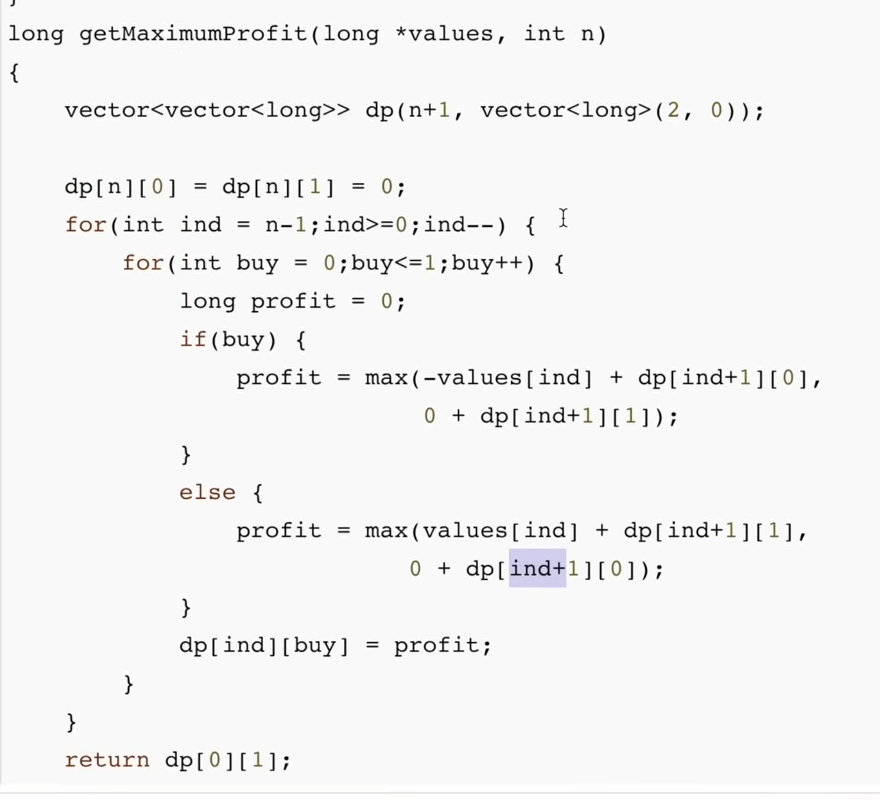
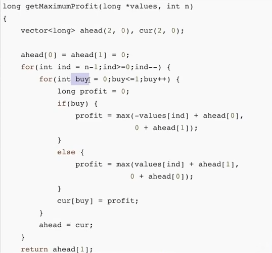
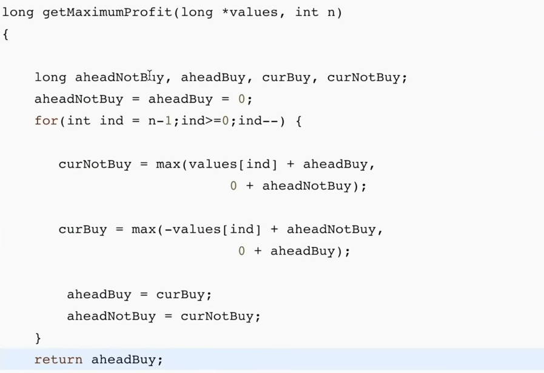

### Rewrite all space optimized solutions for all stocks problems.

# Best Time to buy and sell stock

## Code

## Why DP ?

Because DP basically just means remembering the past.

# Best Time to Buy and Sell Stock II

- Since now there are many ways of buying and selling, hence we have to explore all ways, therefore recursion comes into action.
- At every index, we need to know whether we have bought/sold this stock or not ??
- For this we carry another variable `buy` which tells whether we can buy a stock at the current day or not ??
## How to write recurrence ?

## Memoization

## Tabulation

## Space Optimization

## Similar Space Optimized 

