- Watching videos is recommended
# How to identify ?

# MCM | Matrix Chain Multiplication

- The number of operations required for multiplication of two matrices of order `A * B` and 
`B * C` is `A * B * C`

## Question

## How info is given in the question ?

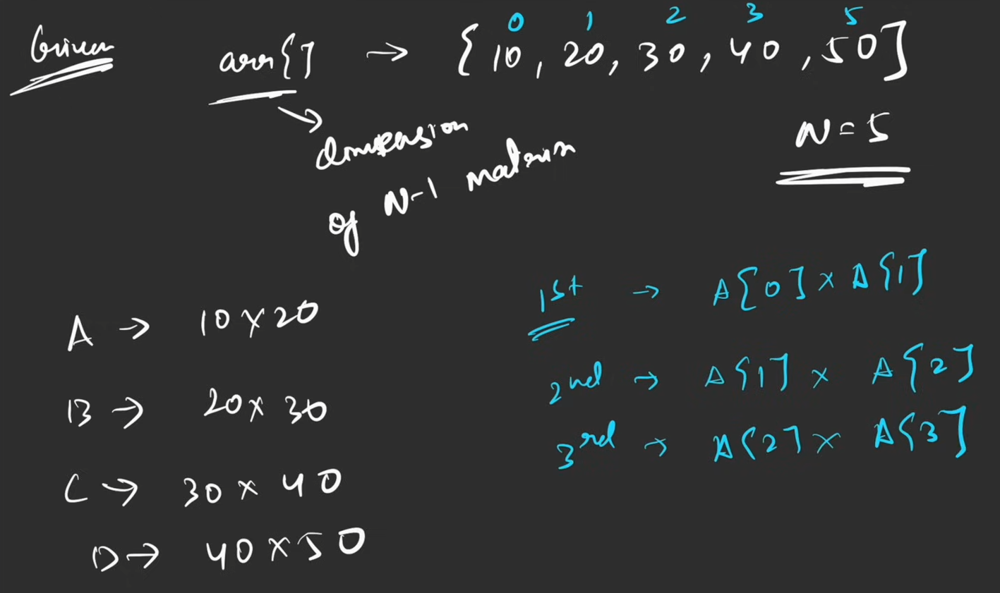

- The dimension of the `ith` matrix would be `arr[i -1] x arr[i]`

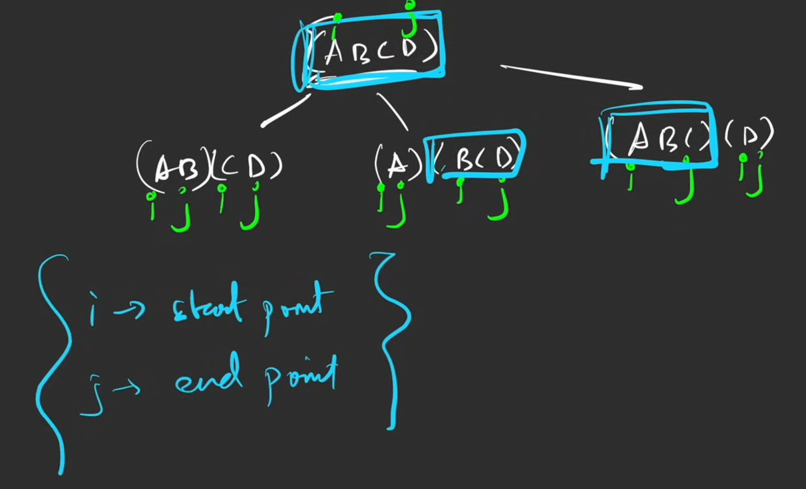

## Rules

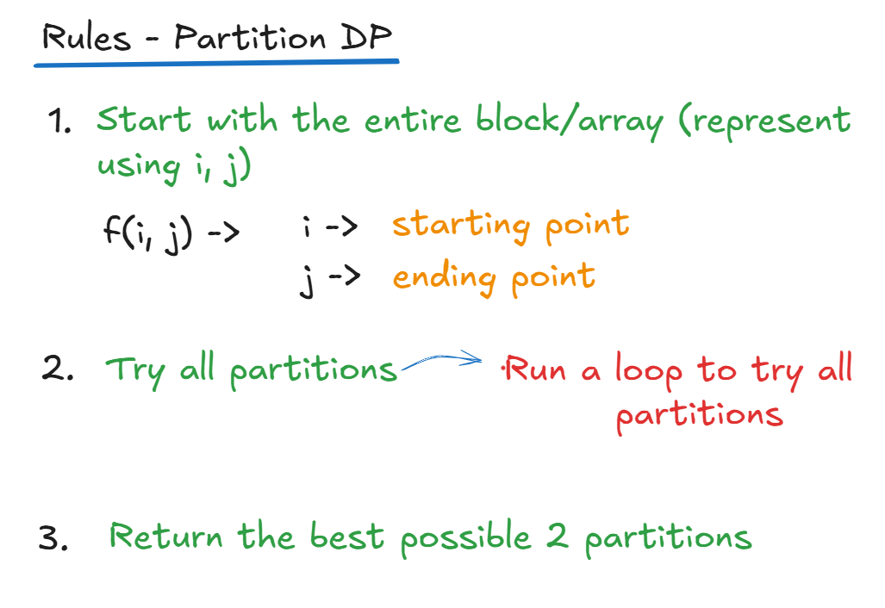

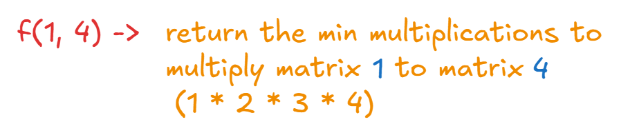

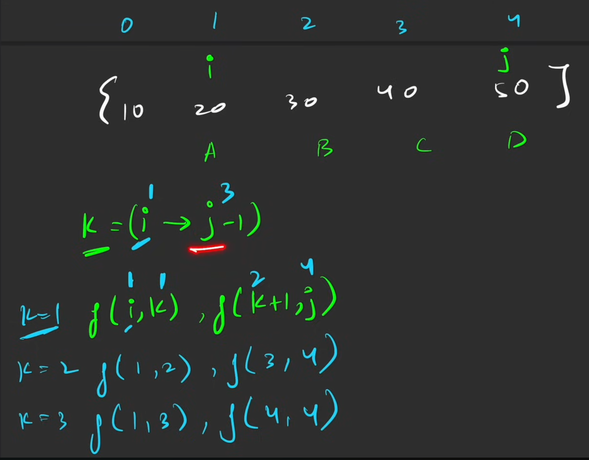

## Two ways of partitioning loops

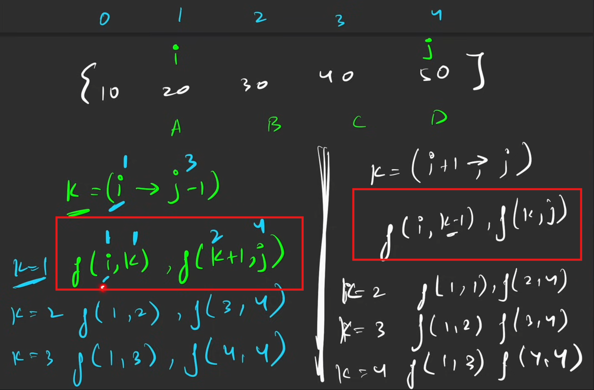

Dry Run Example

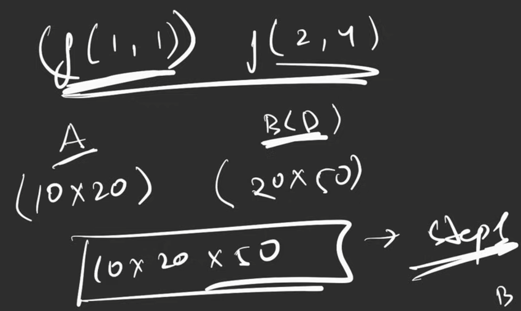

## Pseudocode

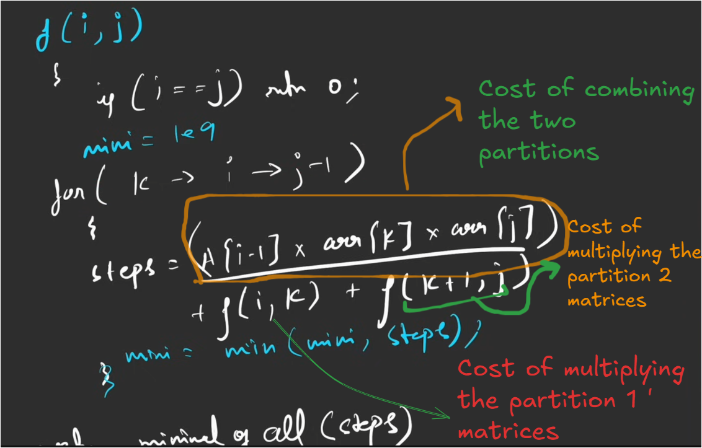

## Code

### Normal Recursive Version

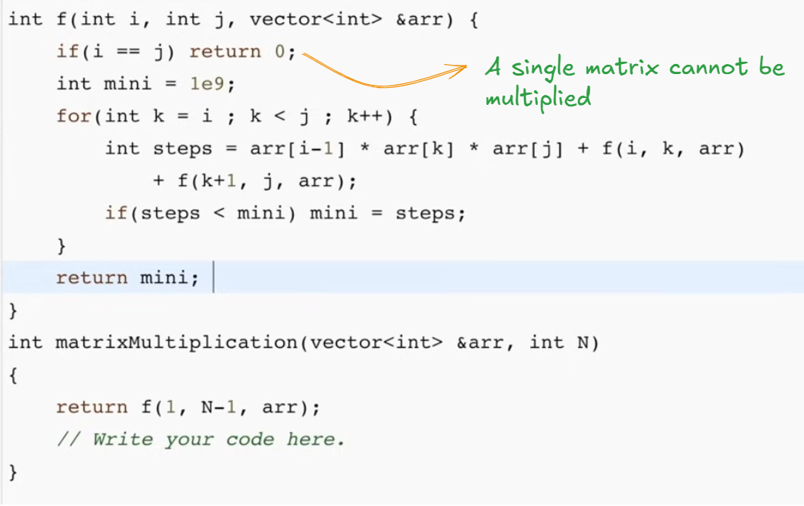

- Exponential time complexity
### Memoization

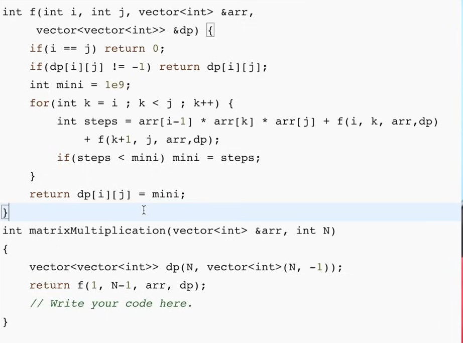

## Tabulation

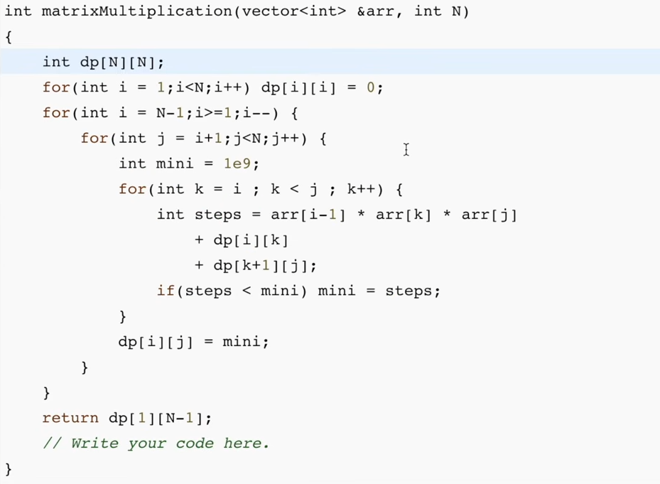

# Problem : Evaluate boolean expression to true

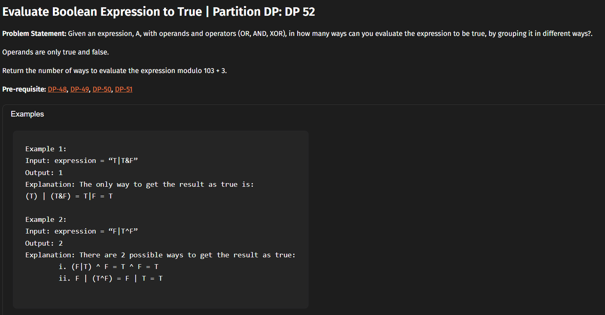

