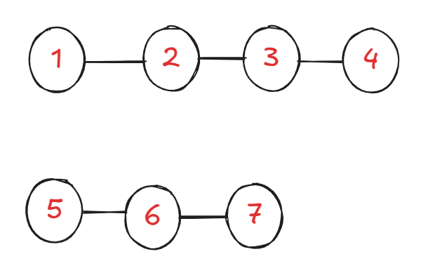
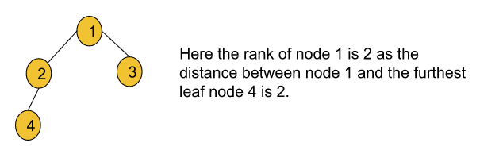
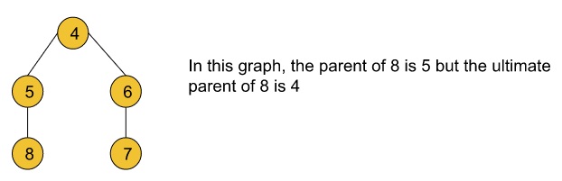
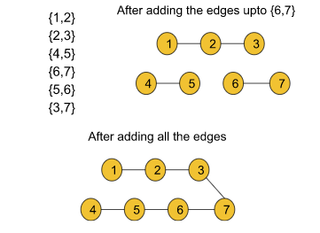
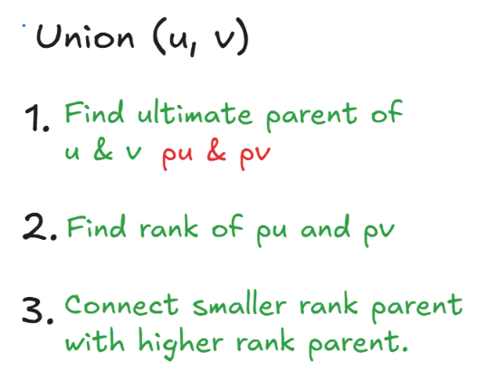

# Why ?

Suppose, we have a graph with two components, we have to determine whether 1 and 5 are are connected or not, for this we would have to start on 1 and do a full BFS / DFS traversal , similarly on 5 and do the same to find out, which takes `O(V + E)`time. 

Using a disjoint set, this can be brought down to `O(1)`or cons. time complexity.

- `Disjoint set` is generally used in dynamic graphs, i.e. graphs that keep on changing.
# Functionalities

- Find parent
- Union - Connects edges between two nodes in a graph
- Rank
- Size
# **Rank:**

The rank of a node generally refers to the distance (the number of nodes including the leaf node) between the furthest leaf node and the current node. Basically rank includes all the nodes beneath the current node.

# **Ultimate parent:**

The parent of a node generally refers to the node right above that particular node. But the ultimate parent refers to the topmost node or the root node.

# **Dynamic graph:**

A dynamic graph generally refers to a graph that keeps on changing its configuration. Let’s deep dive into it using an example:

- Let’s consider the edge information for the given graph as: `{{1,2}, {2,3}, {4,5}, {6,7}, {5,6}, {3,7}}`. Now if we start adding the edges one by one, in each step the structure of the graph will change. So, after each step, if we perform the same operation on the graph while updating the edges, the result might be different. In this case, the graph will be considered a dynamic graph.
- For example, after adding the first 4 edges if we look at the graph, we will find that node 4 and node 1 belong to different components but after adding all 6 edges if we search for the same we will figure out that node 4 and node 1 belong to the same component.

- So, ***after any step, if we try to figure out whether two arbitrary nodes u and v belong to the same component or not, Disjoint Set will be able to answer this query in constant time.***
# Union by Rank

## **Initial configuration:**

`Rank array`**: **This array is initialized with zero.

`Parent array`**: **The array is initialized with the value of nodes i.e. parent[i] = i.

- Firstly, the Union function requires two nodes(***let’s say u and v***) as arguments. Then we will find the ultimate parent (using the findPar() function that is discussed later) of u and v. Let’s consider the ultimate parent of u is ***pu ***and the ultimate parent of v is ***pv***.
- After that, we will find the rank of ***pu*** and ***pv***.
- Finally, we will connect the ultimate parent with a smaller rank to the other ultimate parent with a larger rank. But if the ranks are equal, we can connect any parent to the other parent and we will increase the rank by one for the parent node to whom we have connected the other one.
