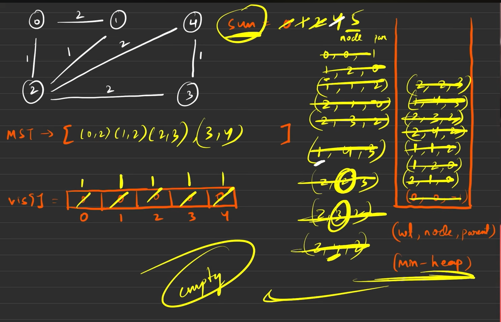
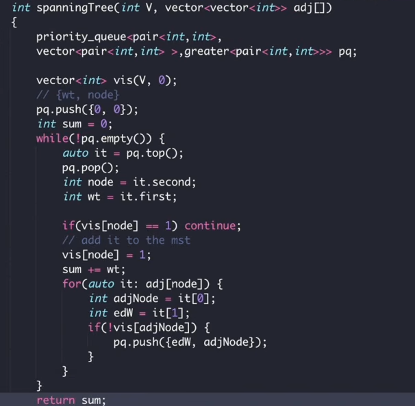

# Definition of Spanning Tree

A tree in which we have 

- `n` nodes and
-  `n - 1` edges and 
- all nodes are reachable from each other.
**NOTE** : There can be one/many STs/MSTs of a given graph.

# What is a Minimum Spanning Tree

The ST with the `minimum sum of edge weights` among all spanning trees will be the MST of the graph

# Ways to find MST

## - Kruskal’s Algo

## - Prim’s Algo

# Prim’s Algorithm (Greedy)

- We will first push edge weight 0, node value 0, and parent -1 as a triplet into the priority queue to start the algorithm.
**Note:** *We can start from any node of our choice. Here we have chosen node 0.*

- Then the top-most element (element with minimum edge weight as it is the min-heap we are using) of the priority queue is popped out.
- After that, we will check whether the popped-out node is visited or not. 
**If the node is visited****: **We will continue to the next element of the priority queue. 

**If the node is not visited****: **We will mark the node visited in the ***visited array*** and add the edge weight to the sum variable. If we wish to store the mst, we should insert the parent node and the current node into the mst array as a pair in this step.

- Now, we will iterate on all the unvisited adjacent nodes of the current node and will store each of their information in the specified triplet format i.e. (edge weight, node value, and parent node) in the priority queue.
- We will repeat steps 2, 3, and 4 using a loop until the priority queue becomes empty.
- Finally, the sum variable should store the sum of all the edge weights of the minimum spanning tree.
**Note: ***Points to remember if we do not wish to store the mst(minimum spanning tree) for the graph and are only concerned about the sum of all the edge weights of the minimum spanning tree:*

- *First of all, we will not use the triplet format instead, we will just use the pair in the format of (edge weight, node value). Basically, we do not need the parent node.*
- *In step 3, we need not store anything in the mst array and we need not even use the mst array in our whole algorithm as well.*

## Code

## Complexity

logarithmic time complexity due to operations in a priority queue

