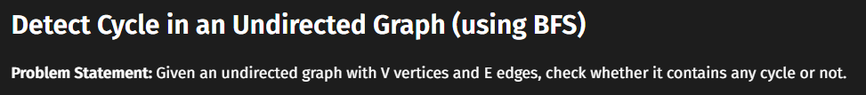
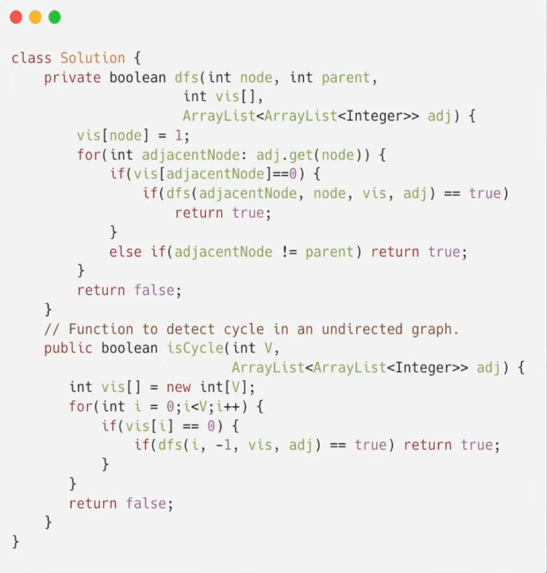
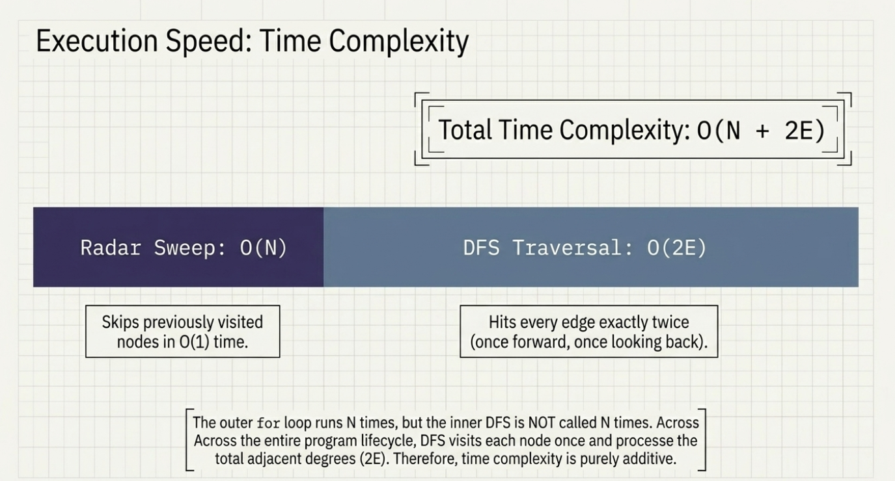

# Detect Cycle in undirected graph using BFS




When detecting a cycle in an undirected graph using BFS, storing a node-parent pair in the queue is crucial to prevent false positives caused by bidirectional edges. In a standard BFS, exploring a node's neighbors will naturally point back to the node you just came from, which is already marked as visited. Storing the parent allows the algorithm to explicitly ignore this immediate backward step; therefore, if a neighbor is already marked as visited and is not the parent, it proves the node was reached via an alternate, independent path, confirming the existence of a true cycle.


```c++
bool detect(int src, vector<int> adj[], int vis[]) {
      vis[src] = 1; 
      // store <source node, parent node>
      queue<pair<int,int>> q; 
      q.push({src, -1}); 
      // traverse until queue is not empty
      while(!q.empty()) {
          int node = q.front().first; 
          int parent = q.front().second; 
          q.pop(); 
          
          // go to all adjacent nodes
          for(auto adjacentNode: adj[node]) {
              // if adjacent node is unvisited
              if(!vis[adjacentNode]) {
                  vis[adjacentNode] = 1; 
                  q.push({adjacentNode, node}); 
              }
              // if adjacent node is visited and is not it's own parent node
              else if(parent != adjacentNode) {
                  // yes it is a cycle
                  return true; 
              }
          }
      }
      // there's no cycle
      return false; 
  }

bool isCycle(int V, vector <int> adj[]) {
	int vis[V] = {0};
	
	for(int i = 0; i < V; i++)
		if(!vis[i])
				if (detect(i, adj, vis)) return true;
				
	return false;
} 
```

# Detect Cycle in undirected graph using DFS







