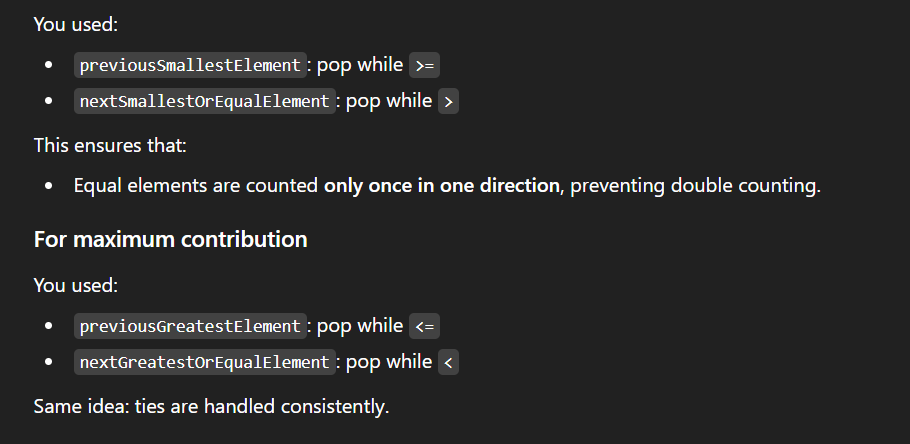

# 📘 Stack vs Monotonic Stack / Queue


---

## 1️⃣ Stack

### What it is

A **stack** is a **data structure** that follows:

### Operations

- `push(x)`
- `pop()`
- `top()`
- `empty()`
### Example


```plain text
Push: 2 → 5 → 7
Stack: [2, 5, 7]

Pop → 7 removed
Stack: [2, 5]

```

### Key point

A stack **does not care about order** of elements.

You can push anything anytime.


---

## 2️⃣ Monotonic Stack

### What it is

A **monotonic stack is NOT a new data structure.**

It is:

### Rule

Elements in the stack are kept in **monotonic order**:

- either **increasing**
- or **decreasing**
### Meaning of monotonic

- **Monotonic increasing** → elements increase from bottom to top
- **Monotonic decreasing** → elements decrease from bottom to top

---

## 3️⃣ Types of Monotonic Stack

### 🔹 Monotonic Increasing Stack


```plain text
Bottom → Top
2, 5, 8, 12

```

Condition while pushing:


```plain text
while stack.top() > current:
    pop()

```

Used for:

- Next Smaller Element
- Previous Smaller Element

---

### 🔹 Monotonic Decreasing Stack


```plain text
Bottom → Top
15, 11, 7, 3

```

Condition while pushing:


```plain text
while stack.top() < current:
    pop()

```

Used for:

- Next Greater Element
- Previous Greater Element

---

## 4️⃣ Why monotonic stack works

It **removes useless elements**.

If an element can never be an answer in future → remove it early.

That’s why:

- Each element is pushed once
- Each element is popped once
⏱ **Time Complexity = O(n)**


---

## 5️⃣ Typical Problems Solved


| Problem | Stack Type |
| --- | --- |
| Next Greater Element | Decreasing |
| Next Smaller Element | Increasing |
| Previous Greater | Decreasing |
| Previous Smaller | Increasing |
| Stock Span | Decreasing |
| Histogram Largest Area | Increasing |
| Daily Temperatures | Decreasing |


---

## 6️⃣ Visualization (important)

### Next Greater Element example

Array:


```plain text
[2, 1, 5, 3]

```

We use **monotonic decreasing stack**

Process:

- 2 → push
- 1 → push
- 5 → pop 1, pop 2 → 5 is next greater
- 3 → push
Stack always stays decreasing.


---

## 7️⃣ Monotonic Queue

Same idea — different container.

### Monotonic Queue = deque + monotonic order

Used when:

- sliding window
- need max/min in window

---

### Example: Sliding Window Maximum

Window size = k

Maintain queue such that:

- front = maximum
- elements in decreasing order
Operations:

- remove smaller elements from back
- remove out-of-window from front
⏱ Time: **O(n)**


---

## 8️⃣ Stack vs Monotonic Stack (important table)


| Feature | Stack | Monotonic Stack |
| --- | --- | --- |
| Data structure | Yes | ❌ No |
| Concept | Basic | Pattern |
| Order maintained | No | Yes |
| Used in | General problems | Optimization problems |
| Time complexity | varies | usually O(n) |


---

## 9️⃣ One-line definition (for exams)


---

