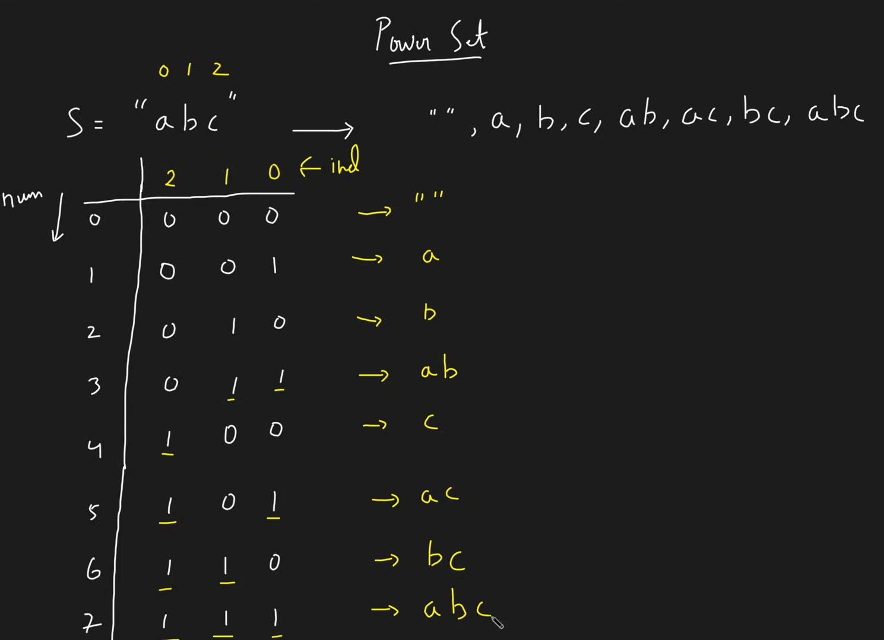
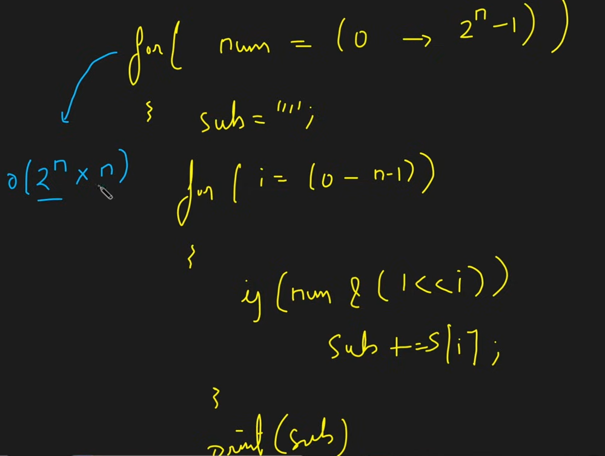

# Power Set


## Bit Masking Approach




- Iterate from 0 to 2^N - 1
- In the inner loop iterate over all bits → 0 to n - 1
- If bit is set, then pick the character at that index, otherwise do not pick



## Code for finding power set sum


```c++
#include <bits/stdc++.h>
using namespace std;

class Solution {
public:
    // Function to find all subset sums using bitmasking
    vector<int> subsetSums(vector<int>& arr) {
        int n = arr.size();
        vector<int> sums;

        // Iterate through all possible bitmasks from 0 to 2^n - 1
        for (int mask = 0; mask < (1 << n); mask++) {
            int sum = 0; // store sum of current subset
            for (int i = 0; i < n; i++) {
                // If ith bit is set, include arr[i] in sum
                if (mask & (1 << i)) {
                    sum += arr[i];
                }
            }
            sums.push_back(sum);
        }

        // Sort sums to get increasing order
        sort(sums.begin(), sums.end());
        return sums;
    }
};

// Driver code
int main() {
    Solution sol;
    vector<int> arr = {5, 2, 1};
    vector<int> result = sol.subsetSums(arr);

    // Print the subset sums
    for (int sum : result) {
        cout << sum << " ";
    }
    cout << endl;

    return 0;
}

```

## Recursive Approach


```c++
#include <bits/stdc++.h>
using namespace std;

class Solution {
public:
    // Helper function to generate subset sums recursively
    void findSums(int index, int currentSum, vector<int>& arr, vector<int>& sums) {
        // Base case: if we have considered all elements
        if (index == arr.size()) {
            sums.push_back(currentSum);
            return;
        }

        // Include current element
        findSums(index + 1, currentSum + arr[index], arr, sums);

        // Exclude current element
        findSums(index + 1, currentSum, arr, sums);
    }

    // Main function
    vector<int> subsetSums(vector<int>& arr) {
        vector<int> sums;
        findSums(0, 0, arr, sums);
        sort(sums.begin(), sums.end()); // Sort in increasing order
        return sums;
    }
};

// Driver code
int main() {
    Solution sol;
    vector<int> arr = {5, 2, 1};
    vector<int> result = sol.subsetSums(arr);

    for (int sum : result) {
        cout << sum << " ";
    }
    cout << endl;

    return 0;
}

```

