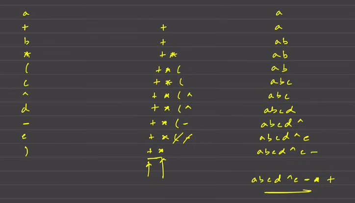

📎 Attachment: ../../../assets/2f90eb7a-3bc3-80ba-a7f8-d668be57572a

### **1. Basic Concepts: Operators, Operands, and Priority**

**Definitions**

- **Operator:** Mathematical symbols used to perform operations. 
- **Operand:** The entities being operated on
**Priority Order (Precedence)**

| Operator | Priority Value |
| --- | --- |
| Power (^) | 3 |
| Multiplication () and Division (/) | 2 |
| Addition (+) and Subtraction (-) | 1 |
| Other characters | -1 |

### **2. Types of Arithmetic Expressions**

- **Infix Expression:**
- **Format:** Operators are placed *between* operands (e.g., `b + q`).
- **Usage:** The most generic format, heavily used in programming languages like C++ and Java.
- **Prefix Expression**** (Polish Notation)****:**
- **Format:** Operators are placed *before* the operands (e.g., `+ P Q`).
- **Usage:** Extensively used in the *Lisp programming language and tree data structures.*
- **Postfix Expression (****Reverse Polish Notation****):**
- **Format:** Operators are placed *after* the operands (e.g., `P Q +`).
- **Usage:** Commonly used in *stack-based calculators.*

---

### **3. Expression Conversions**

The video details six specific conversion algorithms using the **Stack** data structure.

### **A. Infix to Postfix**

- **Goal:** Convert `A + B` to `A B +`.
- **Algorithm Steps:**
1. Initialize an empty stack and an empty answer string. Iterate through the infix string.
1. **If Operand:** Add it directly to the answer string.
1. **If **`(`** (Opening Bracket):** Push it into the stack.
1. **If **`)`** (Closing Bracket):** Pop elements from the stack and add them to the answer until an opening bracket `(` is encountered. Discard the brackets.
1. **If Operator:**
- Compare the current operator's priority with the operator at the top of the stack.
- If the current priority is **lower** than the stack top's priority, pop the stack top to the answer. You continue popping as long as the stack top has greater or equal priority.
- Push the current operator into the stack.
- *Special Case:* The power operator (`^`) has right-associativity logic (mentioned in context of prefix, but generally `^` allows stacking unless priority is strictly lower).
1. **End of String:** Pop any remaining operators from the stack to the answer.
- **Complexity:**
- **Time:** O(N) (The inner while loop runs at most N times total).
- **Space:** O(N) for the stack and answer variable.
### **B. Infix to Prefix**

- **Goal:** Convert `A + B` to `+ A B`.
- **Algorithm Steps:**
1. **Reverse** the infix expression.
1. **Swap Brackets:** Change every `(` to `)` and every `)` to `(`.
1. **Convert to Postfix:** Apply the "Infix to Postfix" logic on this modified string with a slight change in operator condition.
- *Condition Change:* When comparing priorities, for standard operators, pop only if the current priority is strictly **smaller** than the stack top (handle equal priority by pushing). However, for the power operator (`^`), pop if priority is smaller than or equal to the stack top.
1. **Reverse Again:** Reverse the resulting postfix string to get the final prefix expression.
- **Complexity:**
- **Time:** $O(N)$ (Includes multiple reversals and traversal).
- **Space:** $O(N)$.
### **C. Postfix to Infix**

- **Goal:** Convert `A B -` to `(A - B)`.
- **Algorithm Steps:**
1. Iterate through the string from **Left to Right**.
1. **If Operand:** Push it into the stack.
1. **If Operator:**
- Pop the top two elements. Let the first pop be $T_1$ and the second pop be $T_2$.
- Form a new string: `(T2 + Operator + T1)`. Note that $T_2$ comes before $T_1$.
- Push this new string back into the stack.
1. **Result:** The final element remaining in the stack is the infix expression.
- **Complexity:**
- **Time:** $O(N)$ (Note: String concatenation may increase this depending on language implementation).
- **Space:** $O(N)$.
### **D. Prefix to Infix**

- **Goal:** Convert `+ A B` to `(A + B)`.
- **Algorithm Steps:**
1. Iterate through the string from **Right to Left** (starting from $N-1$).
1. **If Operand:** Push it into the stack.
1. **If Operator:**
- Pop the top two elements. First pop is $T_1$, second pop is $T_2$.
- Form a new string: `(T1 + Operator + T2)`. Note that $T_1$ is placed before $T_2$.
- Push this new string back into the stack.
1. **Result:** The stack top contains the answer.
- **Complexity:**
- **Time:** $O(N)$ (approximated, subject to string concatenation costs).
- **Space:** $O(N)$.
### **E. Postfix to Prefix**

- **Goal:** Convert `A B +` to `+ A B`.
- **Algorithm Steps:**
1. Iterate from **Left to Right**.
1. **If Operand:** Push it into the stack.
1. **If Operator:**
- Pop the top two elements. First pop is $T_1$, second pop is $T_2$.
- Form a new string: `Operator + T2 + T1`.
- Push the string back into the stack.
1. **Result:** The stack top contains the prefix expression.
- **Complexity:**
- **Time:** ~$O(2N)$ (Linear).
- **Space:** $O(N)$.
### **F. Prefix to Postfix**

- **Goal:** Convert `+ A B` to `A B +`.
- **Algorithm Steps:**
1. Iterate from **Right to Left**.
1. **If Operand:** Push it into the stack.
1. **If Operator:**
- Pop the top two elements. First pop is $T_1$, second pop is $T_2$.
- Form a new string: `T1 + T2 + Operator`.
- Push the string back into the stack.
1. **Result:** The stack top contains the postfix expression.
- **Complexity:**
- **Time:** ~$O(2N)$.
- **Space:** $O(N)$.
### **4. Conclusion**

- The video emphasizes that while these questions are rarely asked directly in interviews (requiring memorization), practicing them is critical for solidifying the understanding of the **Stack** data structure.
- The time complexity for these conversions is generally **Linear ($O(N)$)**, and the space complexity is also **$O(N)$** due to stack usage.
