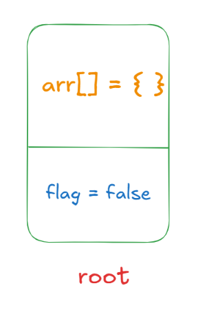
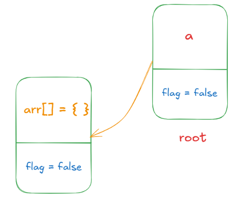
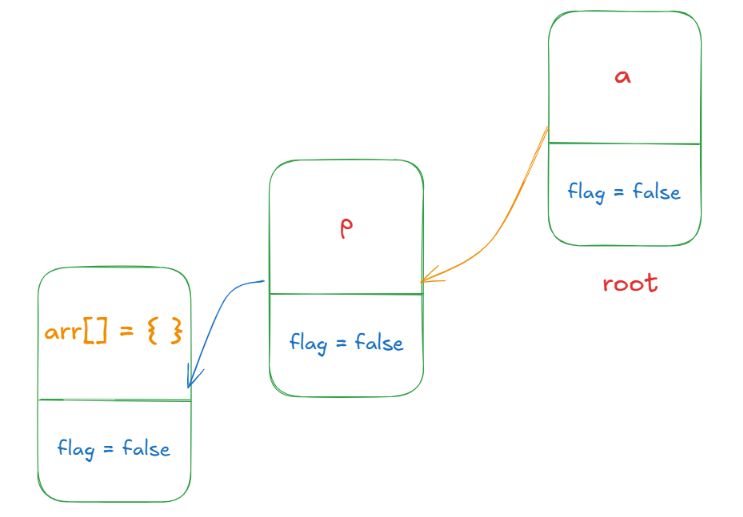
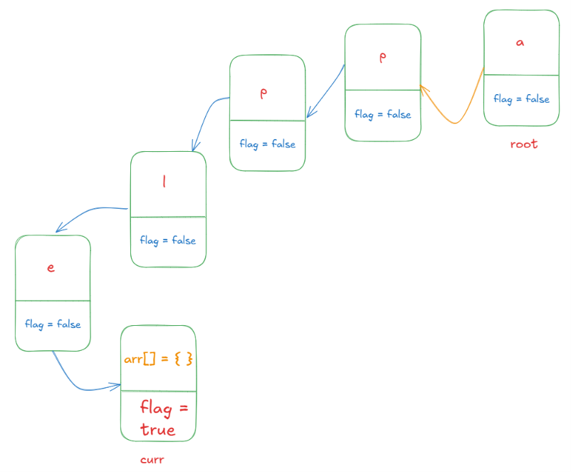
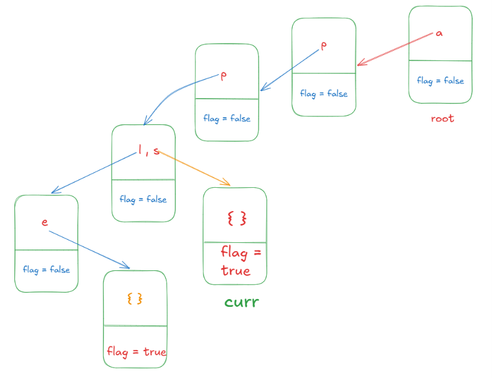
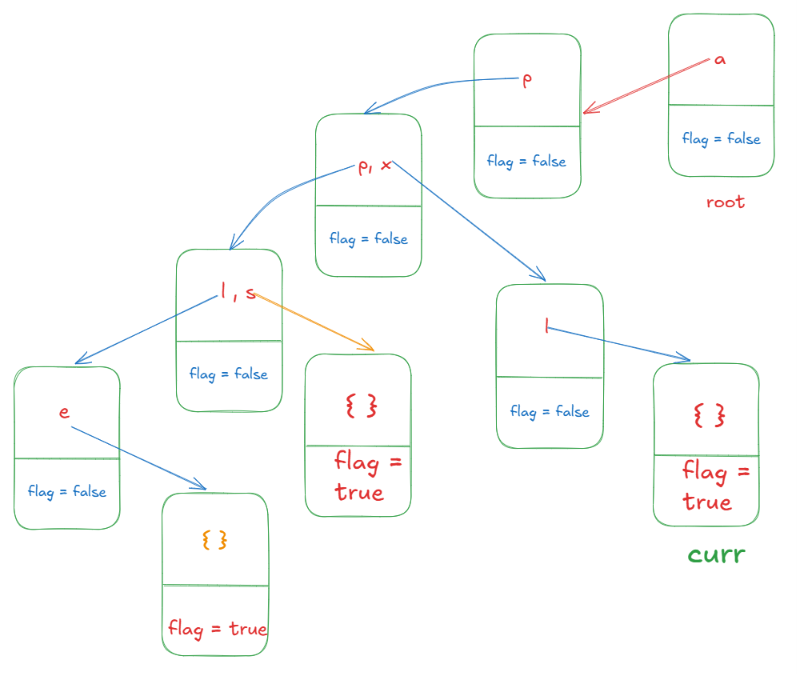
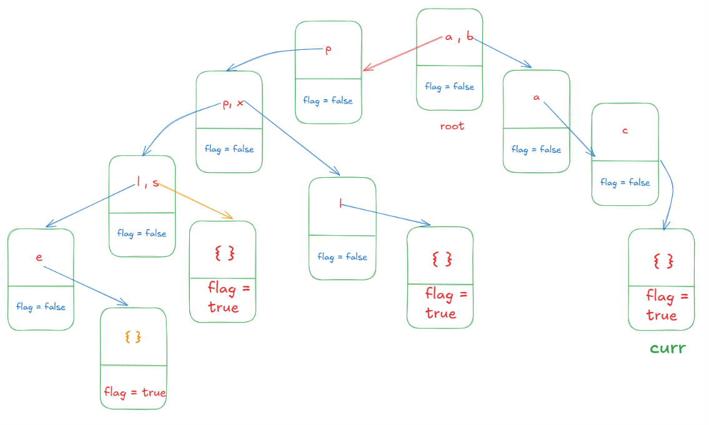

https://leetcode.com/problems/implement-trie-prefix-tree/

# What is Trie Data Structure ??


- Trie is a `class/struct` and it has 2 data members or two variables you can say.

```c++
trie {
	int arr[26];               //if only lowercase characters
	bool flag;
}
```

# `insert()` functionality


- Initially we always start with the `root` (trie class) with flag marked as `false`. 



- Let’s say we are inserting the worda `“apple”, "apps"` 
- We will start with the first letter and ask the `root` whether letter is present in the root or not.
- If not present, go the corresponding index in the `arr`in the `root` and add it there, also create another trie/node where this letter `a` points to.



- Now we move to the next letter ( `p` here ), we move from the root to the next node where a is pointing and add `p` there, also creating another node where `p` points to.



- Similarly we keep adding all other letters, which leads to the below network ⬇️⬇️⬇️, note that when we reach the end of the word and there are no characters to add, we mark the flag of the current node where we are standing as `true`



- Now lets say we are inserting `"apps"` , we again start from the `root` letterwise.
- We check whether the first letter a exists in the array of the current node (`root` here),  it does, so we move to its reference, we check for p, it also exists, so we move, the next p also exists, so we move to the next, now we check for `s`, it does not exist (`arr[]` contains only `l`) , so we add s in the arr, and create its reference and move there. The current situation is depicted below….. Since the word is finished, we mark the flag as true for that node.



- let’s say now we insert `apxl`, then this is how the network would look like



- Let’s insert `"bac”` now.



# `search()` functionality


For search just start from the root and traverse letterwise, if you reach a node where the `flag` is `true`, it means the word exists, if we end at the node where `flag` is `false`, it means word does not exist.

# `startswith()` functionality


We start from the `root` and traverse letterwise until the end of the word, if we end at a `non-null` trie/node, it means there exists a word that startswith the input word. If we end up or encounter a `nullptr`(basically the current letter is not present in the array in lay man terms), it means `startswith(input) = false`


---

🔗 **References**
- https://leetcode.com/problems/implement-trie-prefix-tree/ → https://leetcode.com/problems/implement-trie-prefix-tree/

