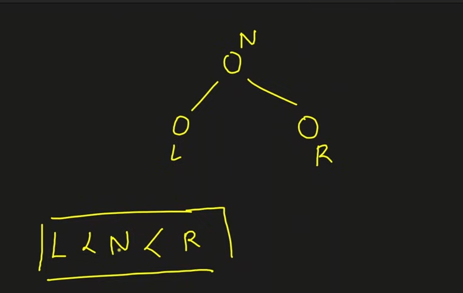

*“Everything on the left side of the node is less than it, and everything on the right side is greater”*

*“The entire left subtree should also itself be a binary search tree”*

*“The entire right subtree should also itself be a binary search tree”*

These three principles ensure that everything on the right of a node should be greater than it, and everything on the left of the node should be smaller.

Generally, duplicates are not allowed in Binary Search Tree.

***NOTE ***: 

- Inorder traversal of a BST gives BST nodes in a sorted order (Brute Force)
- Reverse inorder traversal can be used to find kth largest element
# Why BST ?


The height of BST is always kept as *log N* while in the worst case(degenerate tree) , the height of a simple BT can be *N*.

In BT for searching TC is *O(N)*, while is BST it is (generally) *O(log N)*.

- **Minimum value** → the **leftmost node**
- **Maximum value** → the **rightmost node**

| Term | Meaning |
| --- | --- |
| Floor | The largest value in the BST ≤ key |
| Ceil | The smallest value in the BST ≥ key |


# *FLOOR*


```javascript
int floor(node *root, int val)
{
    int ans = -1;
    while (root != nullptr)
    {
        if (root->data == val)
            return root->data;

        if (root->data > val)
            root = root->left;

        else
        {
            ans = root->data;
            root = root->right;
        }
    }
    return ans;
}
```

# *CEIL*


```javascript
int ceil(node *root, int val)
{
    int ans = -1;
    while (root != nullptr)
    {
        if (root->data == val)
            return root->data;

        if (root->data > val)
        {
            ans = root->data;
            root = root->left;
        }

        else
        {
            root = root->right;
        }
    }
    return ans;
}
```

# ***LCA***


**The BST LCA Rule**
To find the LCA of two values `p` and `q`:
1. If both `p` and `q` are **smaller** than the current node, the LCA must be in the **left** subtree.
2. If both `p` and `q` are **larger** than the current node, the LCA must be in the **right** subtree.
3. If one is smaller and one is larger (or the current node equals one of them), you have found the **split point**. This node is the LCA.

- Also if a root has both left and right children, then it will be LCA itself for that two pair of children.
**The Three Scenarios in a BST**
To make it concrete, when you are at any given `root`, there are only three possibilities:
1. **Both are on one side:** If both `p` and `q` are smaller (or both larger) than `root`, then `root` is just a common ancestor, but not the *lowest* one. You have to keep moving down.
2. **They are on opposite sides:** If `p` < root < `q` (or vice versa), the paths to `p` and `q` diverge right here. `root`** is the LCA.**
3. **The root is one of the nodes:** If `root == p` or `root == q`, then the current `root` is the LCA because a node is considered a descendant of itself.

### What if it wasn't a BST?

If the tree **wasn't** a Binary Search Tree (just a regular Binary Tree), your logic still holds true, but the way we *find* it changes. In a regular tree, we can't just compare values; we have to actually search both sides:


```javascript
// Logic for a General Binary Tree (Not BST)
TreeNode* lowestCommonAncestor(TreeNode* root, TreeNode* p, TreeNode* q) {
    if (!root || root == p || root == q) return root;

    TreeNode* left = lowestCommonAncestor(root->left, p, q);
    TreeNode* right = lowestCommonAncestor(root->right, p, q);

    // If both left and right returns something, 
    // it means p is on one side and q is on the other.
    if (left && right) return root; 

    // Otherwise, return the one that wasn't null
    return left ? left : right;
}
```

## For BST

***Recursive***


```javascript
TreeNode* lowestCommonAncestor(TreeNode* root, TreeNode* p, TreeNode* q)
{
    if(root == nullptr)
        return nullptr;

    if(p->val < root->val && q->val < root->val)
        return lowestCommonAncestor(root->left, p, q);

    if(p->val > root->val && q->val > root->val)
        return lowestCommonAncestor(root->right, p, q);

    return root;
}
```

***Iterative***


```javascript
TreeNode* lowestCommonAncestor(TreeNode* root, TreeNode* p, TreeNode* q) 
{
    while(root != nullptr)
    {
        if(p->val < root->val && q->val < root->val)
            root = root->left;

        else if(p->val > root->val && q->val > root->val)
            root = root->right;

        else
            return root;
    }

    return nullptr;
}
```

