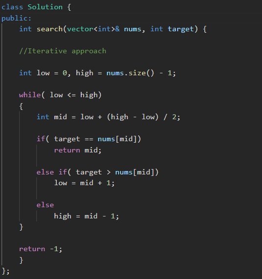
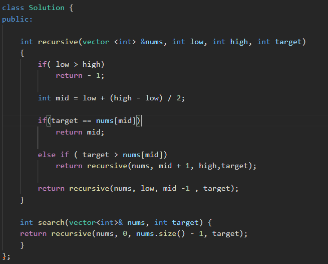
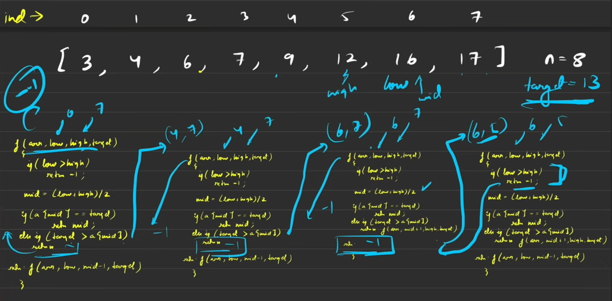

📎 Attachment: ../assets/2df0eb7a-3bc3-80cb-8cc7-ef972b17bec6

# **1. Introduction to Binary Search** (0:02)

- Binary search is a **searching algorithm** (1:29) used in a **sorted data structure** (1:32, 2:57–3:05).
# **2. Real-Life Example: Dictionary Search** (1:35)

- **Binary Search Application:** Dictionaries are **sorted alphabetically** (2:47–2:55).
- Open the dictionary in the middle (3:11–3:17).
- Compare the target word ("Raj") with the words on the opened page (e.g., words starting with 'S') (3:22–3:29).
- If the target word comes *before* 'S', eliminate the right half of the dictionary (3:55–4:03).
- Repeat this splitting process on the remaining (left) half until the word is found (4:03–4:37).
- **Key Takeaway:** Binary search works wherever the search space is **sorted** (4:51–5:13), not just in arrays.
# **3. Coding Problem: Searching in a Sorted Array** (5:20)

“Basically we have to keep shrinking our search space by modifying two pointers — low and high, after each iteration , and check for the condition using another third index - m“

- **Problem:** Find a target element (e.g., 6) in a sorted array (5:20–6:13).
- **Initial Setup:**
- Define `low` pointer at the first index (0) (7:06).
- Define `high` pointer at the last index (n-1) (7:09–7:14).
- The **search space** is everything **between **`low`** and **`high` (7:17–7:23, 8:57–9:03).
- **Algorithm Steps:**
1. Calculate `mid` (middle index) using `mid = (low + high) / 2` (7:34–7:49).
1. Compare `array\[mid\]` with the `target`:
- **If **`array\[mid\]`** equals **`target`**:** Element found! Return the `mid` index (10:23–10:33).
- **If **`target`** is greater than **`array\[mid\]`**:** The target is in the **right half**. Update `low = mid + 1` (11:36–11:49, 15:35–15:52). This eliminates the left half.
- **If **`target`** is less than **`array\[mid\]`**:** The target is in the **left half**. Update `high = mid - 1` (9:38–9:49, 16:20–16:34). This eliminates the right half.
1. Repeat steps 1 and 2 until the element is found or the search space is exhausted.
Below point is very important !!!!!!!!!!!⬇️⬇️⬇️⬇️⬇️

- **When Element is Not Found:** The search stops when `low` exceeds `high` (12:49–13:05). Return -1 (13:09–13:14).
# **4. Iterative Implementation (Pseudocode)** (13:16)

- Use a `while` loop that continues as long as `low &lt;= high` (14:10–14:31).
- Inside the loop:
- Calculate `mid = (low + high) / 2` (14:33–14:42).
- **If **`array\[mid\] == target`**:** `return mid` (14:48–15:06).
- **Else if **`target &gt; array\[mid\]`**:** `low = mid + 1` (15:09–15:52).
- **Else (**`target &lt; array\[mid\]`**):** `high = mid - 1` (16:16–16:34).
- If the loop finishes (meaning `low &gt; high`), `return -1` (16:35–16:48).
# **5. Recursive Implementation (Pseudocode)** (17:16)

- Recursion works because the same task (finding `mid`, comparing, and trimming the search space) repeats (17:43–18:20).
- **Function Signature:** `function binarySearch(array, low, high, target)` (18:30–18:38, 20:23–20:26).
- **Base Case:** If `low &gt; high`, the search space is exhausted. `return -1` (20:32–20:47).
- **Recursive Steps:**
- Calculate `mid = (low + high) / 2` (20:52–20:58).
- **If **`array\[mid\] == target`**:** `return mid` (21:02–21:28).
- **Else if **`target &gt; array\[mid\]`**:** `return binarySearch(array, mid + 1, high, target)` (21:32–22:07).
- **Else (**`target &lt; array\[mid\]`**):** `return binarySearch(array, low, mid - 1, target)` (22:15–22:38).
# **6. Time Complexity** (26:17)

- Binary search **halves** the search space in each step (26:43–27:18).
- For an array of size `N`:
- N → N/2 → N/4 → ... → 1
- The number of steps (k) is determined by `N / 2^k = 1`, which simplifies to `N = 2^k`.
- Solving for `k` gives `k = log base 2 N` (28:10–29:01).
- Therefore, the **time complexity is O(log N)** (28:22–29:07). This is significantly faster than linear search (O(N)).
# **7. Overflow Case in Mid Calculation** (29:10)

- **Problem:** The formula `mid = (low + high) / 2` can cause integer overflow if `low` and `high` are very large (e.g., `INT_MAX`) because their sum may exceed the maximum integer value (29:30–31:23).
- **Solutions:**
1. **Use **`long long`** data type** for `low`, `high`, and `mid` variables (31:23–31:32). This expands the range of values they can store.
1. **Alternative **`mid`** calculation:** `mid = low + (high - low) / 2` (31:34–31:55).
- This prevents overflow because `high - low` is smaller and won't overflow, even if `low` and `high` are large.
- This is mathematically equivalent to the first formula (31:57–32:13).
- This alternative is particularly useful when the search space can extend to `INT_MAX` (32:39–32:40).

---

🔗 **References**
- 0:02 → https://www.youtube.com/watch?v=MHf6awe89xw&t=2s
- 1:29 → https://www.youtube.com/watch?v=MHf6awe89xw&t=89s
- 1:32 → https://www.youtube.com/watch?v=MHf6awe89xw&t=92s
- 2:57 → https://www.youtube.com/watch?v=MHf6awe89xw&t=177s
- 3:05 → https://www.youtube.com/watch?v=MHf6awe89xw&t=185s
- 1:35 → https://www.youtube.com/watch?v=MHf6awe89xw&t=95s
- 2:47 → https://www.youtube.com/watch?v=MHf6awe89xw&t=167s
- 2:55 → https://www.youtube.com/watch?v=MHf6awe89xw&t=175s
- 3:11 → https://www.youtube.com/watch?v=MHf6awe89xw&t=191s
- 3:17 → https://www.youtube.com/watch?v=MHf6awe89xw&t=197s
- 3:22 → https://www.youtube.com/watch?v=MHf6awe89xw&t=202s
- 3:29 → https://www.youtube.com/watch?v=MHf6awe89xw&t=209s
- 3:55 → https://www.youtube.com/watch?v=MHf6awe89xw&t=235s
- 4:03 → https://www.youtube.com/watch?v=MHf6awe89xw&t=243s
- 4:03 → https://www.youtube.com/watch?v=MHf6awe89xw&t=243s
- 4:37 → https://www.youtube.com/watch?v=MHf6awe89xw&t=277s
- 4:51 → https://www.youtube.com/watch?v=MHf6awe89xw&t=291s
- 5:13 → https://www.youtube.com/watch?v=MHf6awe89xw&t=313s
- 5:20 → https://www.youtube.com/watch?v=MHf6awe89xw&t=320s
- 5:20 → https://www.youtube.com/watch?v=MHf6awe89xw&t=320s
- 6:13 → https://www.youtube.com/watch?v=MHf6awe89xw&t=373s
- 7:06 → https://www.youtube.com/watch?v=MHf6awe89xw&t=426s
- 7:09 → https://www.youtube.com/watch?v=MHf6awe89xw&t=429s
- 7:14 → https://www.youtube.com/watch?v=MHf6awe89xw&t=434s
- 7:17 → https://www.youtube.com/watch?v=MHf6awe89xw&t=437s
- 7:23 → https://www.youtube.com/watch?v=MHf6awe89xw&t=443s
- 8:57 → https://www.youtube.com/watch?v=MHf6awe89xw&t=537s
- 9:03 → https://www.youtube.com/watch?v=MHf6awe89xw&t=543s
- 7:34 → https://www.youtube.com/watch?v=MHf6awe89xw&t=454s
- 7:49 → https://www.youtube.com/watch?v=MHf6awe89xw&t=469s
- 10:23 → https://www.youtube.com/watch?v=MHf6awe89xw&t=623s
- 10:33 → https://www.youtube.com/watch?v=MHf6awe89xw&t=633s
- 11:36 → https://www.youtube.com/watch?v=MHf6awe89xw&t=696s
- 11:49 → https://www.youtube.com/watch?v=MHf6awe89xw&t=709s
- 15:35 → https://www.youtube.com/watch?v=MHf6awe89xw&t=935s
- 15:52 → https://www.youtube.com/watch?v=MHf6awe89xw&t=952s
- 9:38 → https://www.youtube.com/watch?v=MHf6awe89xw&t=578s
- 9:49 → https://www.youtube.com/watch?v=MHf6awe89xw&t=589s
- 16:20 → https://www.youtube.com/watch?v=MHf6awe89xw&t=980s
- 16:34 → https://www.youtube.com/watch?v=MHf6awe89xw&t=994s
- 12:49 → https://www.youtube.com/watch?v=MHf6awe89xw&t=769s
- 13:05 → https://www.youtube.com/watch?v=MHf6awe89xw&t=785s
- 13:09 → https://www.youtube.com/watch?v=MHf6awe89xw&t=789s
- 13:14 → https://www.youtube.com/watch?v=MHf6awe89xw&t=794s
- 13:16 → https://www.youtube.com/watch?v=MHf6awe89xw&t=796s
- 14:10 → https://www.youtube.com/watch?v=MHf6awe89xw&t=850s
- 14:31 → https://www.youtube.com/watch?v=MHf6awe89xw&t=871s
- 14:33 → https://www.youtube.com/watch?v=MHf6awe89xw&t=873s
- 14:42 → https://www.youtube.com/watch?v=MHf6awe89xw&t=882s
- 14:48 → https://www.youtube.com/watch?v=MHf6awe89xw&t=888s
- 15:06 → https://www.youtube.com/watch?v=MHf6awe89xw&t=906s
- 15:09 → https://www.youtube.com/watch?v=MHf6awe89xw&t=909s
- 15:52 → https://www.youtube.com/watch?v=MHf6awe89xw&t=952s
- 16:16 → https://www.youtube.com/watch?v=MHf6awe89xw&t=976s
- 16:34 → https://www.youtube.com/watch?v=MHf6awe89xw&t=994s
- 16:35 → https://www.youtube.com/watch?v=MHf6awe89xw&t=995s
- 16:48 → https://www.youtube.com/watch?v=MHf6awe89xw&t=1008s
- 17:16 → https://www.youtube.com/watch?v=MHf6awe89xw&t=1036s
- 17:43 → https://www.youtube.com/watch?v=MHf6awe89xw&t=1063s
- 18:20 → https://www.youtube.com/watch?v=MHf6awe89xw&t=1100s
- 18:30 → https://www.youtube.com/watch?v=MHf6awe89xw&t=1110s
- 18:38 → https://www.youtube.com/watch?v=MHf6awe89xw&t=1118s
- 20:23 → https://www.youtube.com/watch?v=MHf6awe89xw&t=1223s
- 20:26 → https://www.youtube.com/watch?v=MHf6awe89xw&t=1226s
- 20:32 → https://www.youtube.com/watch?v=MHf6awe89xw&t=1232s
- 20:47 → https://www.youtube.com/watch?v=MHf6awe89xw&t=1247s
- 20:52 → https://www.youtube.com/watch?v=MHf6awe89xw&t=1252s
- 20:58 → https://www.youtube.com/watch?v=MHf6awe89xw&t=1258s
- 21:02 → https://www.youtube.com/watch?v=MHf6awe89xw&t=1262s
- 21:28 → https://www.youtube.com/watch?v=MHf6awe89xw&t=1288s
- 21:32 → https://www.youtube.com/watch?v=MHf6awe89xw&t=1292s
- 22:07 → https://www.youtube.com/watch?v=MHf6awe89xw&t=1327s
- 22:15 → https://www.youtube.com/watch?v=MHf6awe89xw&t=1335s
- 22:38 → https://www.youtube.com/watch?v=MHf6awe89xw&t=1358s
- 26:17 → https://www.youtube.com/watch?v=MHf6awe89xw&t=1577s
- 26:43 → https://www.youtube.com/watch?v=MHf6awe89xw&t=1603s
- 27:18 → https://www.youtube.com/watch?v=MHf6awe89xw&t=1638s
- 28:10 → https://www.youtube.com/watch?v=MHf6awe89xw&t=1690s
- 29:01 → https://www.youtube.com/watch?v=MHf6awe89xw&t=1741s
- 28:22 → https://www.youtube.com/watch?v=MHf6awe89xw&t=1702s
- 29:07 → https://www.youtube.com/watch?v=MHf6awe89xw&t=1747s
- 29:10 → https://www.youtube.com/watch?v=MHf6awe89xw&t=1750s
- 29:30 → https://www.youtube.com/watch?v=MHf6awe89xw&t=1770s
- 31:23 → https://www.youtube.com/watch?v=MHf6awe89xw&t=1883s
- 31:23 → https://www.youtube.com/watch?v=MHf6awe89xw&t=1883s
- 31:32 → https://www.youtube.com/watch?v=MHf6awe89xw&t=1892s
- 31:34 → https://www.youtube.com/watch?v=MHf6awe89xw&t=1894s
- 31:55 → https://www.youtube.com/watch?v=MHf6awe89xw&t=1915s
- 31:57 → https://www.youtube.com/watch?v=MHf6awe89xw&t=1917s
- 32:13 → https://www.youtube.com/watch?v=MHf6awe89xw&t=1933s
- 32:39 → https://www.youtube.com/watch?v=MHf6awe89xw&t=1959s
- 32:40 → https://www.youtube.com/watch?v=MHf6awe89xw&t=1960s

