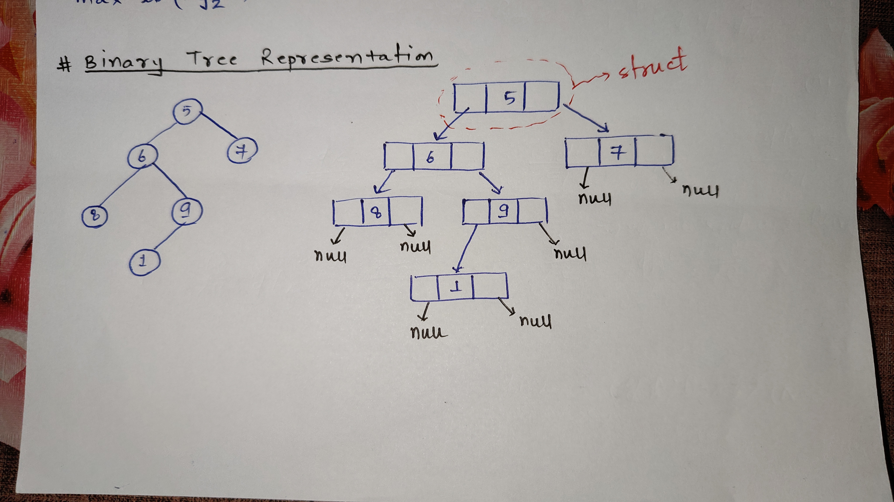
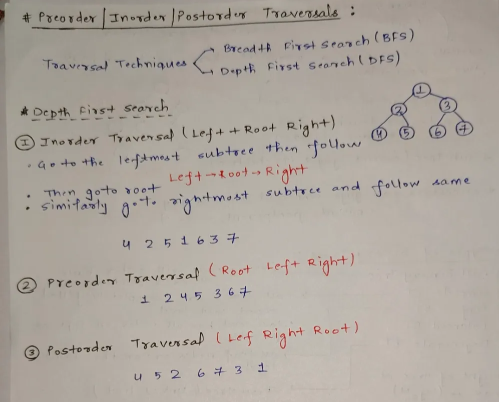
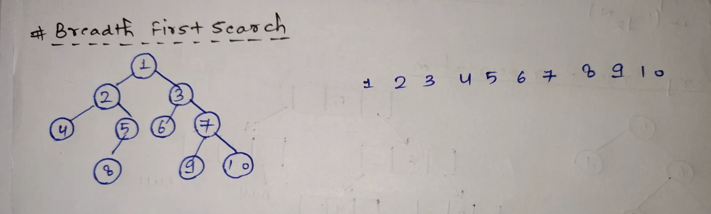
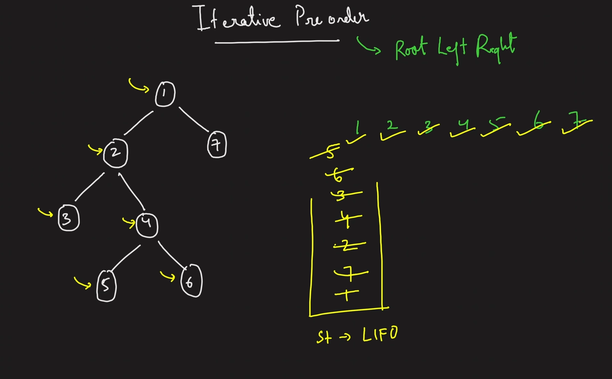
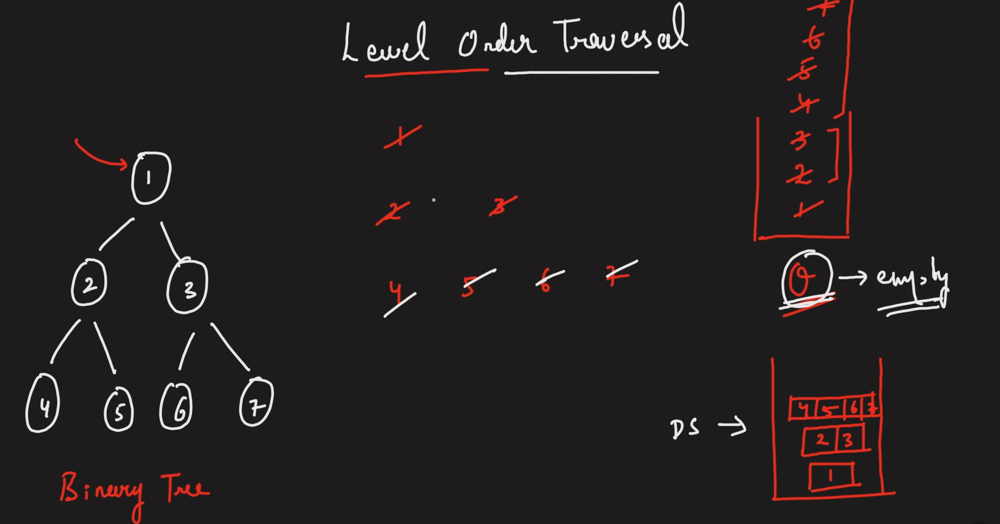
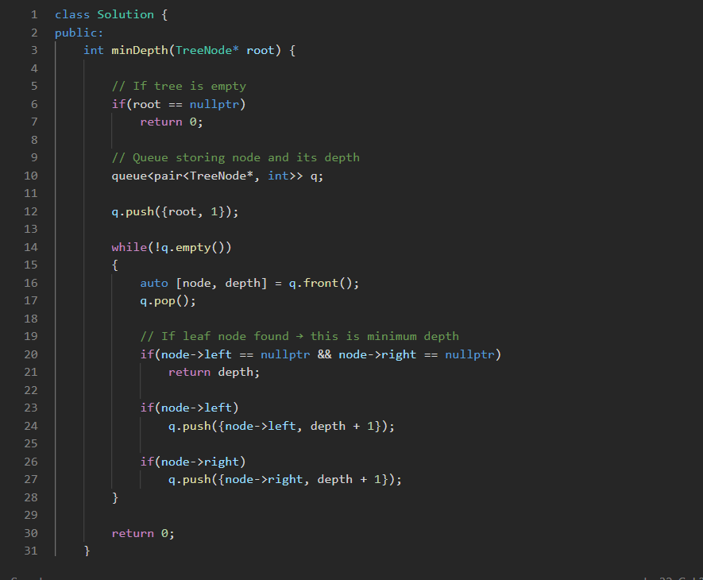
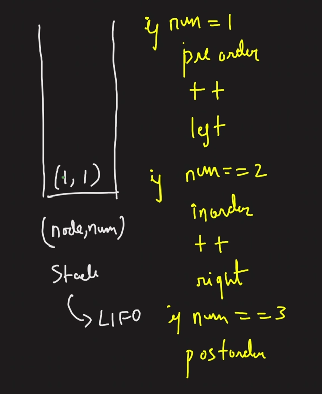

## Definition

A **Binary Tree** is a **hierarchical data structure** in which each node can have **at most two children**.

Hierarchical structures: Trees


---

## Basic Terminology

### Root

The **starting point** of the tree.

### Children

Nodes directly connected below a parent node.

### Leaf Node

A node that **does not have any children**.

### Subtree

A node together with **all its descendants**.

### Ancestors

All nodes connected **above a node** in the path toward the root.

Examples:

- Parent, Grandparent, Great-grandparent

---

## Types of Binary Trees

### 1️⃣ Full Binary Tree

Every node has either:

- **0 children** OR
- **2 children**
(No node has only one child.)


---

### 2️⃣ Complete Binary Tree

- All levels are completely filled **except possibly the last level**.
- The last level is filled **from left to right** as much as possible.

---

### 3️⃣ Perfect Binary Tree

- All internal nodes have **2 children**.
- All leaf nodes are at the **same level**.
- Completely filled at every level.
**NOTE**** : Perfect Binary Tree** as a subset of a **Complete Binary Tree**—every perfect tree is complete, but not every complete tree is perfect.


---

### 4️⃣ Balanced Binary Tree

A tree where the **height difference between left and right subtrees** is ≤ 1 for each node or height of tree at max is  log N

This keeps operations efficient.


---

### 5️⃣ Degenerate Binary Tree (Skewed Tree)

- Each parent has **only one child**.
- Looks like a **linked list**.
Types:

- Left skewed
- Right skewed

---

## Visual Intuition


```plain text
        Root
       /    \
   Child   Child
    /
 Leaf
```


---

## Quick Summary


| Type | Key Property |
| --- | --- |
| Full | 0 or 2 children only |
| Complete | Last level filled left → right |
| Perfect | All levels fully filled |
| Balanced | Height difference small |
| Degenerate | Like linked list |


---




# Traversals


For tree traversal problems you should know **3 approaches**:

1️⃣ Recursive

2️⃣ Iterative using stack

3️⃣ Morris Traversal (O(1) space)

## **Depth First Search**




## **Breadth First Search**





---

# 1️⃣Preorder Traversal


### *RECURSIVE*

***O(N), O(N)***


```javascript
#include <bits/stdc++.h>
using namespace std;

// TC : O(N)
void preorder(node *node)
{
    if (node == nullptr)
        return;

    cout << node->data << " ";
    preorder(node->left);
    preorder(node->right);
}
```

### ***ITERATIVE ******- Using  1 Stack ***

***O(N), O(N)***




1. First of all create a stack and add the root node in it.
1. Pop topmost node from stack and print its value.
1. Add curr→right in stack if present.
1. Add curr→left in stack if present.
1. Continue until stack becomes empty.

```javascript
void preorder(node *root)
{
    if (root == nullptr)
        return;

    stack<node *> st;
    st.push(root);

    while (!st.empty())
    {
        root = st.top();
        st.pop();

        cout << root->data << " ";
        if (root->right != nullptr)
            st.push(root->right);
        if (root->left != nullptr)
            st.push(root->left);
    }
}
```

# 2️⃣ Inorder Traversal


### *RECURSIVE*


```javascript
#include <bits/stdc++.h>
using namespace std;

void inorder(node *node)
{
    if (node == nullptr)
        return;

    inorder(node->left);
    cout << node->data << " ";
    inorder(node->right);
}

```

### ***ITERATIVE ****** - Using 1 stack***

We print when we get null

***O(N), O(N)***

1. Create a stack 
1. Create a curr pointer initially pointing to the root
1. Keep adding curr nodes into the stack while moving leftwards until curr reaches null.
1. Now print top most node’s value and move the pointer to the right.
1. Break out if the stack is empty and curr node is null.

```javascript
void inorder(node *root)
{
    stack<node *> st;
    node *curr_node = root;

    while (true)
    {
        if (curr_node != nullptr)
        {
            st.push(curr_node);
            curr_node = curr_node->left;
        }
        else
        {
            if (st.empty())
                break;

            curr_node = st.top();
            cout << curr_node->data << " ";
            st.pop();
            curr_node = curr_node->right;
        }
    }
} 
```

# 3️⃣ Postorder Traversal


### ***RECURSIVE***


```javascript
void postorder(node *node)
{
    if (node == nullptr)
        return;

    postorder(node->left);
    postorder(node->right);
    cout << node->data << " ";
}
```

### ***ITERATIVE****** - Using 2 stacks***

First Stack : *Children*

Second Stack : *Current Node*

Print after first stack becomes empty.


```javascript

vector<int> postorder_two_stack(node *root)
{
    vector<int> postorder;

    if (root == nullptr)
        return postorder;

    stack<node *> st1, st2;
    st1.push(root);

    while (!st1.empty())
    {
        root = st1.top();
        st1.pop();
        st2.push(root);

        if (root->left != nullptr)
            st1.push(root->left);
        if (root->right != nullptr)
            st1.push(root->right);
    }

    while (!st2.empty())
    {
        postorder.push_back(st2.top()->data);
        st2.pop();
    }
    return postorder;
}
```

***Using 1 stack***


```c++
// O(2n)
void postorder_one_stack(node *curr)
{
    stack<node *> st;
    vector<int> res;
    while (curr != nullptr || !st.empty())
    {
        if (curr != nullptr)
        {
            st.push(curr);
            curr = curr->left;
        }
        else
        {
            node *temp = st.top()->right;
            if (temp == nullptr)
            {
                temp = st.top();
                st.pop();
                res.push_back(temp->data);

                while (!st.empty() && temp == st.top()->right)
                {
                    temp = st.top();
                    st.pop();
                    res.push_back(temp->data);
                }
            }
            else
                curr = temp;
        }
    }

    for (int val : res)
        cout << val << " ";
    cout << "\n";
}
```

# 4️⃣ Level Order Traversal




***O(N), O(N)****** — Using Queue Data Structure***

- **Create** a 2D vector `ans` to store the result.
- **If the root is NULL**, return `ans`.
- **Create a queue** and push the root node into it.
- **While the queue is not empty**:
- Find the **number of nodes in the current level** using `n = queue.size()`.
- Create an empty vector `elements` for that level.
- **Repeat **`n`** times**:
- Remove the **front node** from the queue.
- **Store its value** in `elements`.
- If the node has a **left child**, push it into the queue.
- If the node has a **right child**, push it into the queue.
- **Add **`elements`** to **`ans`**.**
- **Return **`ans`**.**

```javascript
vector<vector<int>> levelorder(node *root)
{
    vector<vector<int>> ans;

    if (root == nullptr)
        return ans;

    queue<node *> level;
    level.push(root);

    while (!level.empty())
    {
        vector<int> elements;
        int n = level.size();
        for (int i = 0; i < n; i++)
        {
            node *curr_node = level.front();
            level.pop();

            if (curr_node->left != nullptr)
                level.push(curr_node->left);

            if (curr_node->right != nullptr)
                level.push(curr_node->right);

            elements.push_back(curr_node->data);
        }
        ans.push_back(elements);
    }
    return ans;
} 
```

### CP Version of Level Order Traversal without using manual for loop (min depth implementation code attached)




# 5️⃣ Preorder, Inorder, Postorder in one traversal using 1 stack




*O(3N)*


```javascript
vector<int> preInPostTraversal(TreeNode* root) {
    stack<pair<TreeNode*, int>> st;
    st.push({root, 1});

    vector<int> pre, in, post;

    if (root == NULL) return {};

    while (!st.empty()) {
        auto it = st.top();
        st.pop();

        // this is part of pre
        // increment 1 to 2
        // push the left side of the tree
        if (it.second == 1) {
            pre.push_back(it.first->val);
            it.second++;
            st.push(it);

            if (it.first->left != NULL) {
                st.push({it.first->left, 1});
            }
        }

        // this is a part of in
        // increment 2 to 3
        // push right
        else if (it.second == 2) {
            in.push_back(it.first->val);
            it.second++;
            st.push(it);

            if (it.first->right != NULL) {
                st.push({it.first->right, 1});
            }
        }

        // don't push it back again
        else {
            post.push_back(it.first->val);
        }
    }

    return post; // adjust if needed depending on problem
}
```

# 6️⃣ Boundary Traversal


- [Approach - 1] Using Recursion - O(n) Time and O(h) Space
- [Approach - 2] Using Iteration and Morris Traversal - O(n) Time and O(h) Space
***Approach 1***

- *The boundary traversal of a binary tree is done in three steps. *
- *First, we traverse the left boundary, starting from the root’s left child and moving downward, excluding any leaf nodes.*
- * Next, we collect all the leaf nodes of the tree from left to right using recursion. *
- *Finally, we traverse the right boundary, starting from the root’s right child and moving downward, again excluding leaf nodes, but the collected nodes are added in reverse order. *
- *By combining the left boundary, leaf nodes, and right boundary, we obtain the complete anti-clockwise boundary traversal of the tree.*

```javascript
	// Node Structure
class Node {
    constructor(x) {
        this.data = x;
        this.left = null;
        this.right = null;
    }
}

function isLeaf(node) {
    return node.left === null && node.right === null;
}

// Function to collect left boundary nodes
// (top-down order)
function collectLeft(root, res) {
    
    // exclude leaf node
    if (root === null || isLeaf(root))
        return;

    res.push(root.data);
    if (root.left !== null)
        collectLeft(root.left, res);
    else if (root.right !== null)
        collectLeft(root.right, res);
}

// Function to collect all leaf nodes
function collectLeaves(root, res) {
    if (root === null)
        return;

    // Add leaf nodes
    if (isLeaf(root)) {
        res.push(root.data);
        return;
    }

    collectLeaves(root.left, res);
    collectLeaves(root.right, res);
}

// Function to collect right boundary nodes
// (bottom-up order)
function collectRight(root, res) {
    
    // exclude leaf nodes
    if (root === null || isLeaf(root))
        return;

    if (root.right !== null)
        collectRight(root.right, res);
    else if (root.left !== null)
        collectRight(root.left, res);

    res.push(root.data);
}

// Function to find Boundary Traversal of Binary Tree
function boundaryTraversal(root) {
    let res = [];

    if (root === null)
        return res;

    // Add root data if it's not a leaf
    if (!isLeaf(root))
        res.push(root.data);

    // Collect left boundary
    collectLeft(root.left, res);

    // Collect leaf nodes
    collectLeaves(root, res);

    // Collect right boundary
    collectRight(root.right, res);

    return res;
}

```

***Approach 2***

*The idea is to reduce the auxiliary space used by the memory stack in the above approach. This approach is similar to the previous one, but instead of recursion, we use iteration to find the left and right boundaries, and use *Morris Traversal* to find the leaf nodes.*


```javascript
// Node Structure
class Node {
    constructor(x) {
        this.data = x;
        this.left = null;
        this.right = null;
    }
}

function isLeaf(node) {
    return node.left === null && node.right === null;
}

// Function to collect the left boundary nodes
function collectLeft(root, res) {
    if (root === null)
        return;

    let curr = root;
    while (!isLeaf(curr)) {
        res.push(curr.data);

        if (curr.left !== null)
            curr = curr.left;
        else
            curr = curr.right;
    }
}

// Function to collect the leaf nodes using Morris Traversal
function collectLeaves(root, res) {
    let current = root;

    while (current) {
        if (current.left === null) {
            // If it's a leaf node
            if (current.right === null)
                res.push(current.data);

            current = current.right;
        } else {
            // Find the inorder predecessor
            let predecessor = current.left;
            while (predecessor.right && predecessor.right !== current) {
                predecessor = predecessor.right;
            }

            if (predecessor.right === null) {
                predecessor.right = current;
                current = current.left;
            } else {
                // If its predecessor is a leaf node
                if (predecessor.left === null)
                    res.push(predecessor.data);

                predecessor.right = null;
                current = current.right;
            }
        }
    }
}

// Function to collect the right boundary nodes
function collectRight(root, res) {
    if (root === null)
        return;

    let curr = root;
    let temp = [];
    while (!isLeaf(curr)) {
        temp.push(curr.data);

        if (curr.right !== null)
            curr = curr.right;
        else
            curr = curr.left;
    }

    for (let i = temp.length - 1; i >= 0; i--)
        res.push(temp[i]);
}

// Function to perform boundary traversal
function boundaryTraversal(root) {
    let res = [];

    if (root === null)
        return res;

    // Add root data if it's not a leaf
    if (!isLeaf(root))
        res.push(root.data);

    // Collect left boundary
    collectLeft(root.left, res);

    // Collect leaf nodes
    collectLeaves(root, res);

    // Collect right boundary
    collectRight(root.right, res);

    return res;
}
```

# 7️⃣ Vertical Order Traversal


```javascript
/**
 * Definition for a binary tree node.
 * struct TreeNode {
 *     int val;
 *     TreeNode *left;
 *     TreeNode *right;
 *     TreeNode() : val(0), left(nullptr), right(nullptr) {}
 *     TreeNode(int x) : val(x), left(nullptr), right(nullptr) {}
 *     TreeNode(int x, TreeNode *left, TreeNode *right) : val(x), left(left), right(right) {}
 * };
 */
class Solution {
public:
    vector<vector<int>> verticalTraversal(TreeNode* root) {
        
// A map is used to store nodes grouped by vertical and level
        map<int, map<int, multiset<int>>> nodes;

        // A queue is used for BFS, storing node and its coordinates
        queue<pair<TreeNode*, pair<int, int>>> todo;

        // Push the root node with vertical = 0 and level = 0
        todo.push({root, {0, 0}});

        // Perform BFS traversal
        while (!todo.empty()) {
            // Get the front element in queue
            auto p = todo.front();
            todo.pop();

            // Extract node
            TreeNode* temp = p.first;
            // Extract vertical (x)
            int x = p.second.first;
            // Extract level (y)
            int y = p.second.second;

            // Insert the node into map by vertical and level
            nodes[x][y].insert(temp->val);

            // If left child exists, push with updated coordinates
            if (temp->left) {
                todo.push({temp->left, {x - 1, y + 1}});
            }

            // If right child exists, push with updated coordinates
            if (temp->right) {
                todo.push({temp->right, {x + 1, y + 1}});
            }
        }

        // Final answer vector
        vector<vector<int>> ans;

        // Iterate through verticals in map
        for (auto p : nodes) {
            vector<int> col;
            // Collect all nodes in order of levels
            for (auto q : p.second) {
                col.insert(col.end(), q.second.begin(), q.second.end());
            }
            // Push the column into result
            ans.push_back(col);
        }

        // Return final vertical order traversal
        return ans;
    }
};
```

# 8️⃣ Top View


# 9️⃣ Array Representation of Binary Tree


# 🔟 Morris Traversal


`O(N), O(1)`

- Uses concept of threaded binary tree
## Inorder Morris Traversal


---

🔗 **References**
- [Approach - 1] Using Recursion - O(n) Time and O(h) Space → https://www.geeksforgeeks.org/dsa/boundary-traversal-of-binary-tree/#recursive-approach-on-time-and-on-space
- [Approach - 2] Using Iteration and Morris Traversal - O(n) Time and O(h) Space → https://www.geeksforgeeks.org/dsa/boundary-traversal-of-binary-tree/#iterative-approach-on-time-and-on-space
- Morris Traversal → https://www.geeksforgeeks.org/dsa/inorder-tree-traversal-without-recursion-and-without-stack/

