# Convert decimal to binary


```javascript
string decimal_to_binary(int dec)
{
	string res = "";
	while(dec > 0)
	{
		if(dec % 2 == 1)
			res = '1' + res;
		
		else
			res = '0' + res;
			
		dec = dec / 2;	
	}
	
	return ans;
}
```

**TC : log N (base 2)**

**SC : log N (base 2)**


---

# Convert Binary to Decimal


```javascript
int convert_to_decimal(string bin)
{
	int n = bin.length();
	int pow= 1, res = 0;
	for(int i = n - 1; i >= 0; i--)
	{
		if(bin[i] == '1')
			res += pow;
		pow *= 2;
	}
	return exp;
}
```

**TC : O(n)**

**SC: O(1)**


---

## NOTE 

- Decimal numbers are given as `int` while binary numbers are given as  `string`
- Suppose we initialize a variable `int a = 13,` then behind the hood this number is stored as a 32 bit binary representation `00000000000000000000000000001101` (for `int` data type)
- The 31st bit  (or the first bit from the left is reserved for sign)
- 0 for positive
- 1 for negative
- Also very important to note that a computer stores a negative number in its 2s complement from in the computer

```javascript
int x = 13;
//00000000000000000000000000001101 (binary representation stored in memory)

int x = -13;
//11111111111111111111111111110011  (2s complement stored in memory)

```


---

# OPERATORS


## AND 

## OR

## XOR


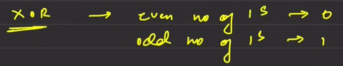

## SHIFT

**Right Shift** : Remove n bits from the right side and add more zeroes to the left


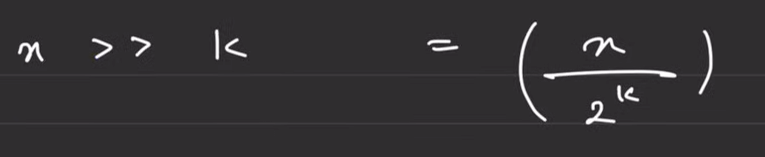

**Left Shift** : Remove n bits from the left side and add more zeroes to the right


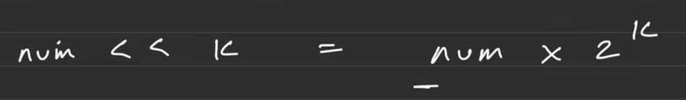

- Note that doing shifts such as left shift can cause integer overflow for example if you try to left shift INT_MAX it would overflow as first bit from left is reserved for sign.
## NOT

- For a positive number

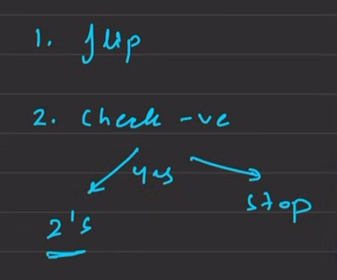

- For a negative number 
- First take the two’s complement
- Then follow the steps above

---

# Swap Two Numbers (using XOR operator)


- a ^ a = 0 (even number of ones = 0)

```javascript
a = a ^ b;
b = a ^ b;
a = a ^ b;
```


---

# Check if the ith bit is Set or not


- set bit = 1
- Bits are always counted from right to left (LSB to MSB) from 0 to n - 1
Using left shift


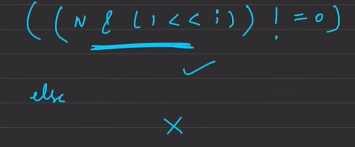


```javascript
if( (n & ( 1 << i)) != 0) 
	//set bit
else
	//unset bit
```

Using right shift


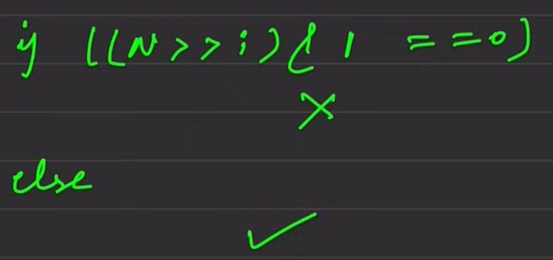


```javascript
if( (n >> i) & 1 ) != 0 )
	//set bit
else
	//unset bit
```

CRUX : Either bring one using left shift towards the ith bit or bring the ith bit to the extreme right using right shift


---

# Set the ith bit


```javascript
n | (1 << i)
```


---

# Clear the ith bit


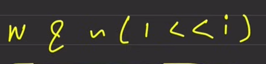


```javascript
n & ~(1 << i)
```


---

# Toggle the ith bit


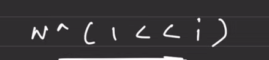


```javascript
n ^ (1 << i)
```


---

# Remove the last set bit (rightmost)


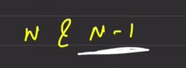


```javascript
n & n - 1
```

***Reason:***

There is a relation between n, n - 1 and the rightmost set bit

The bits to the left of the last set bits are same in n and n -1

The corresponding bit to last set bit is always zero in n - 1

The bits to the right are flipped in n - 1 as compared to n


---

# Check if a number is a power of 2 or not


OBSERVATION : It should have only one set bit


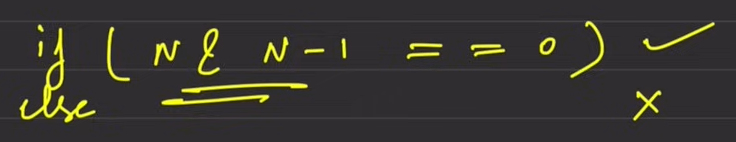


```javascript
if ( n & n - 1 == 0 )
	//power of 2
else
	//not a power of two
```


---

# Count the number of set bits


**Method 1**


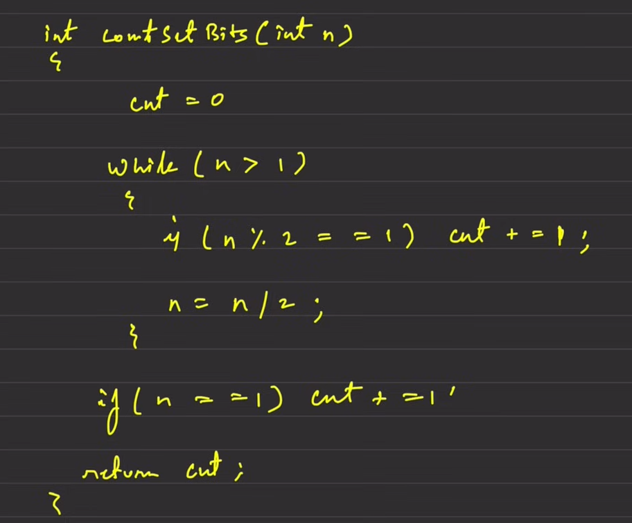


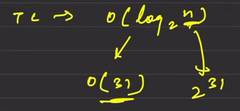

**Method 2 (Brian Kernighan’s Algorithm)**


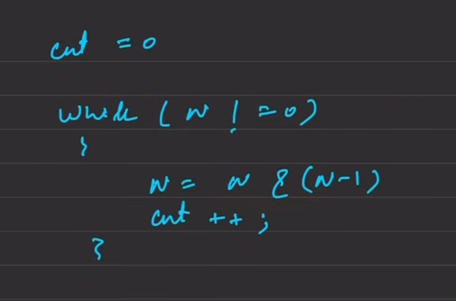


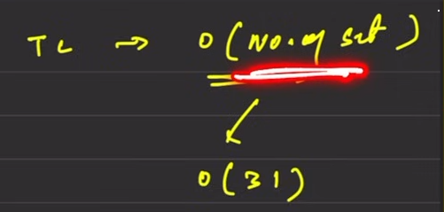

**Method 3**

`__builtin_popcount(n)`→ Built in STL lib which gives number of set bits in the number

# Checking number is odd


**n & 1**** (This is same as n % 2 == 1)**

***Reason ***: The last bit of an odd number will always be set

# Dividing a number by 2


**n >> 1 ****(This is same as n / 2)**

- `bool isNegative = (dividend < 0) ^ (divisor < 0);`
- Can be used to check whether the sign of two numbers in opposite or not 
# **Binary Exponential-style subtraction**


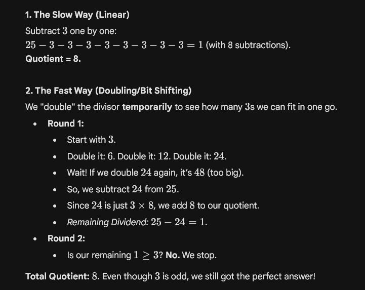

# Techniques


- `n & 1 `: To extract rightmost bit of a number
