# Length of Longest Increasing Subsequence using Binary Search


📎 Attachment: ../../assets/37a0eb7a-3bc3-8036-8d16-e388863686b5

## Intuition

- The intuition for this question is important to visualize, so watch the video while revising for better grasp.
- Let’s try to go through every element and form a subsequence
- We keep overwriting the same subsequence as we do not need the subsequence, we only need the length.

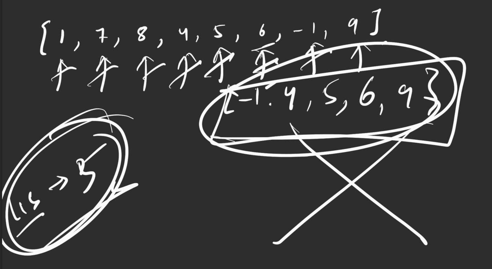

## Code


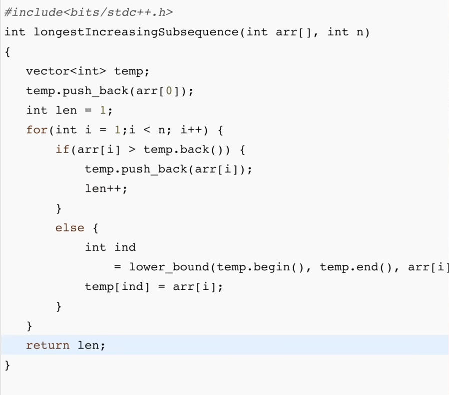

## Complexity


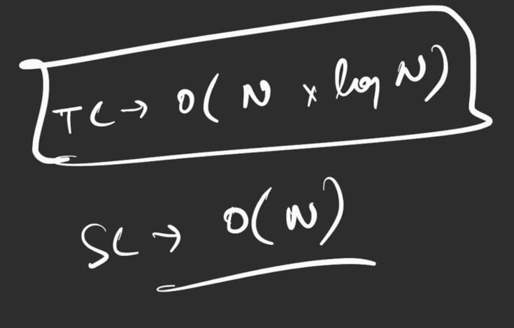

- Remember the temp array is not the LIS, we are just using it to store the subsequence so that we do not require new arrays everytime.

---

# Length of Longest Increasing Subsequence using Memoization


## Parameters

`f(index, prev)`

f(3, 0) → Length of LIS starting from 3rd index, whose prevIndex is 0.


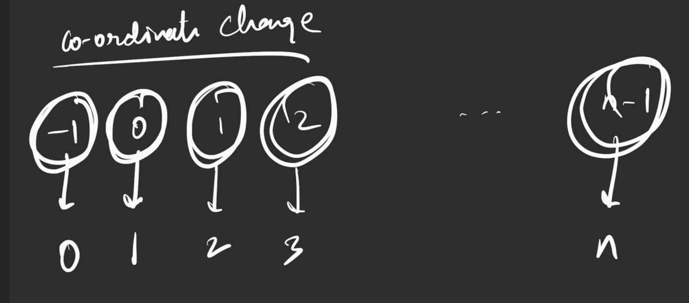


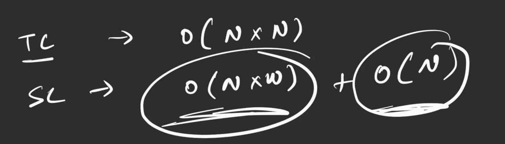

## Code


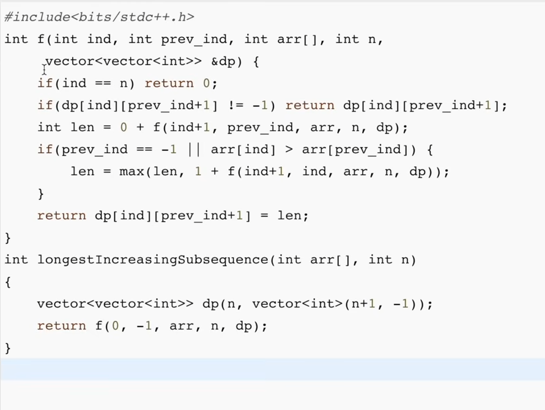


---

# Length of Longest Increasing Subsequence using Tabulation


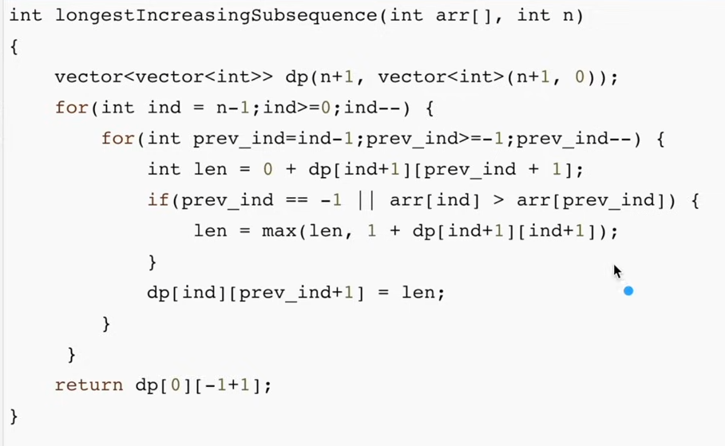

# Length of Longest Increasing Subsequence using Space Optimization in Tabulation


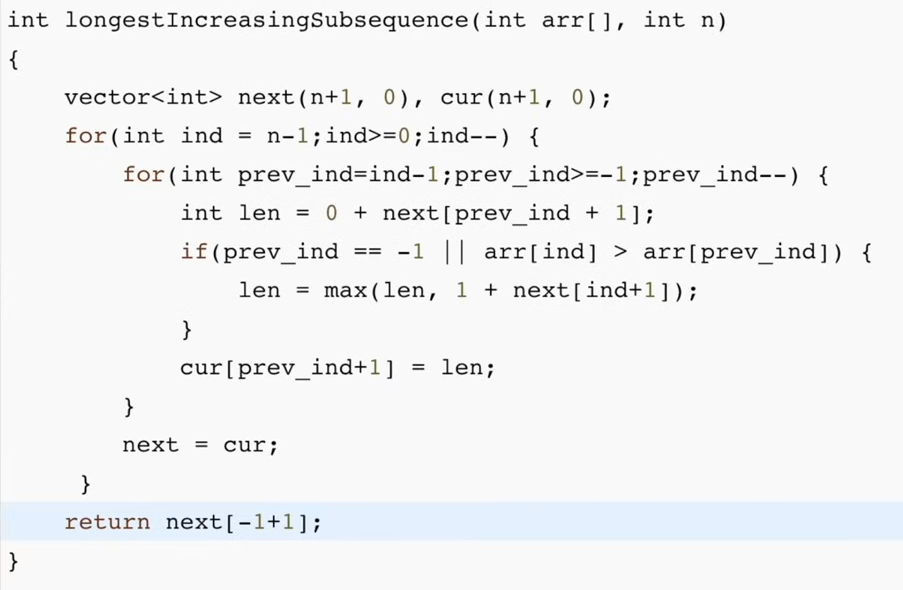


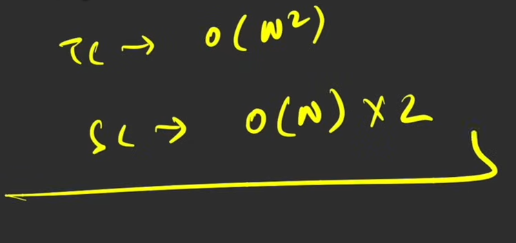


---

# Most optimal way for LIS (Different type of LIS) - LEARN THIS 


`dp[i]` → Signifies the longest increasing subsequence ending at index i

LIS → max of `dp[i]` where `i → 0 to n - 1`

## Code → `O(N^2), O(N)`


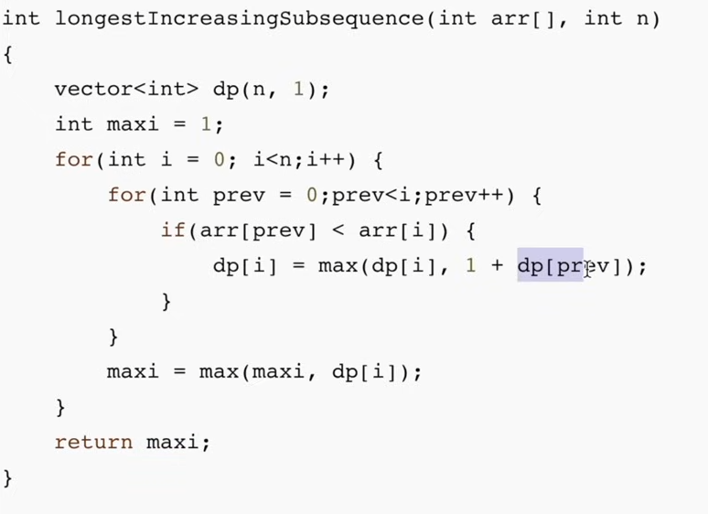

- This solution is important if you want to trace back the LIS
# Printing the LIS `(Backtrack)`


We will use an additional array to track what was the previous index of the current index.


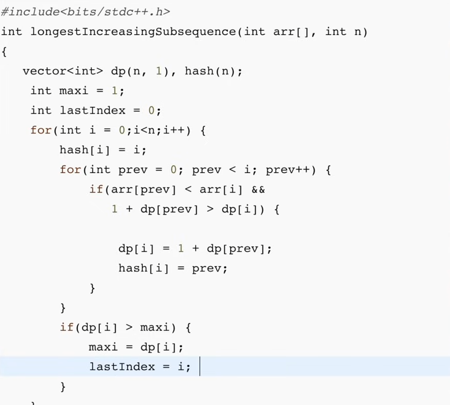


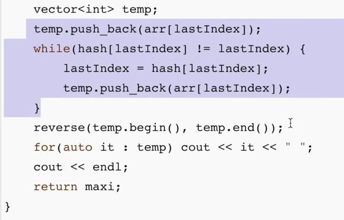

- Sort the input array in ascending order to transform the problem into finding the longest divisible chain.
- Initialize two arrays: `dp[i]` to store the length of the longest divisible subset ending at index `i` (initially set to 1), and `parent[i]` to store the previous element in the optimal subset (initially set to `i`).
- For each element, check all previous elements. If the current element is divisible by a previous element and forms a longer subset, update `dp[i]` and `parent[i]`.
- While filling the DP table, keep track of the maximum length and its ending index (`lastIndex`).
- Backtrack from `lastIndex` using the `parent` array until reaching an element whose parent is itself.
- The backtracked elements form the longest divisible subset in correct order, which can be returned as the result.

---

# Longest Bitonic Subsequence


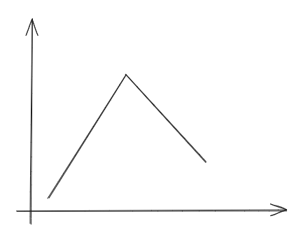

**OR
**

**An entirely strictly increasing subsequence**

**OR**

**An entirely strictly decreasing subsequence
**

previously `dp[i]` signified Longest increasing Subsequence till index `i`

## Intuition


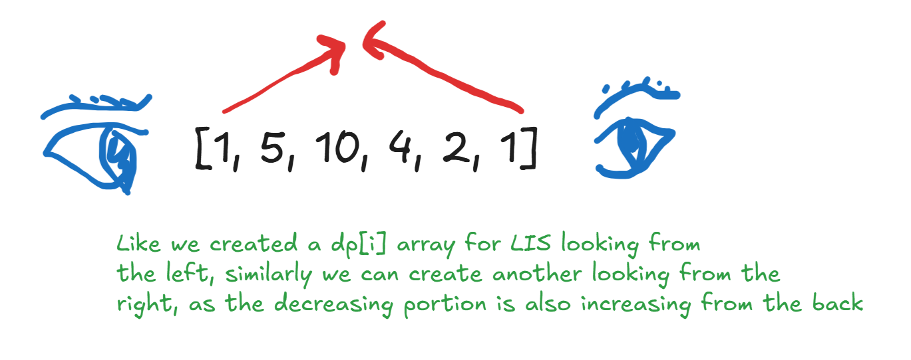


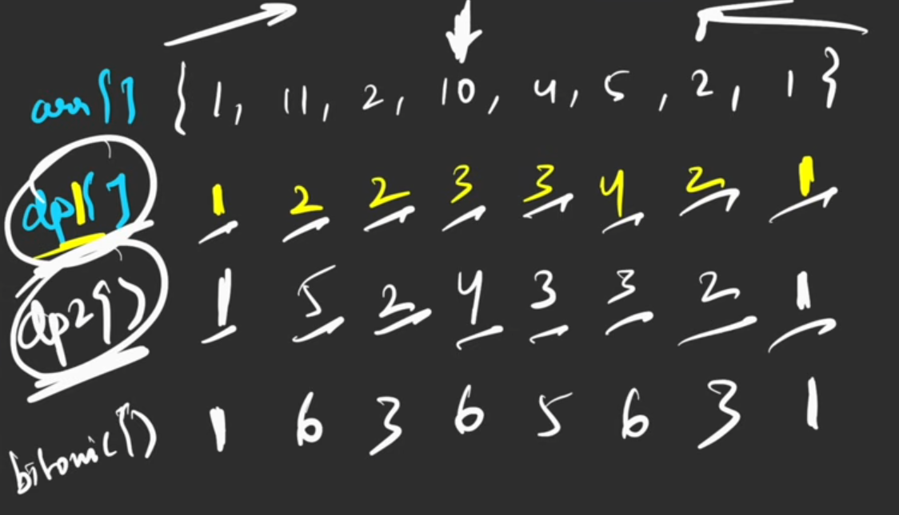


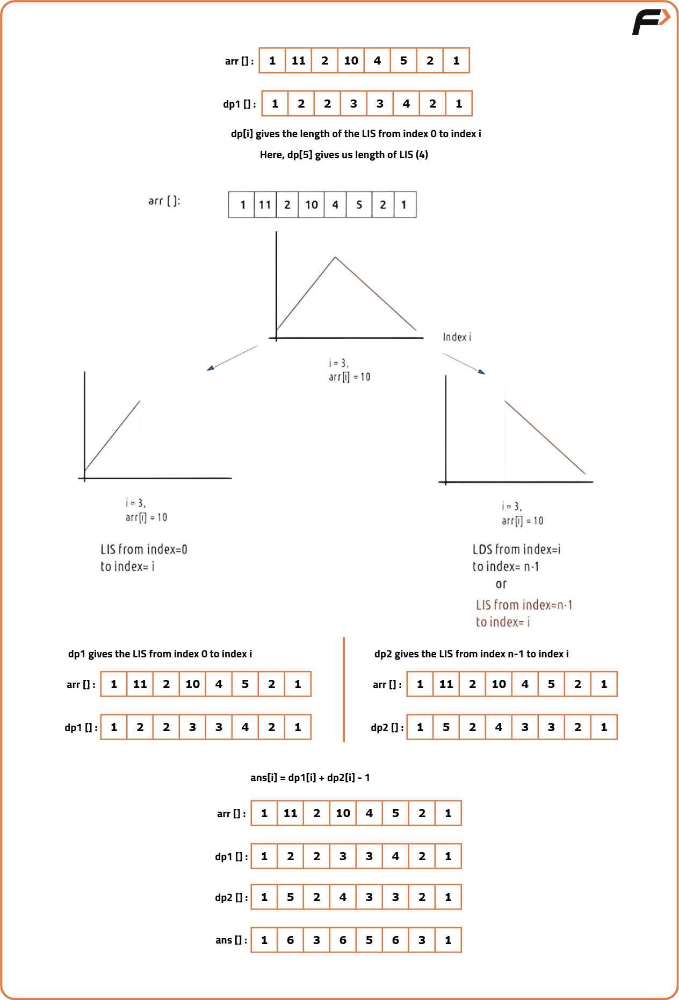

## Code


```c++

class Solution {
public:
    // Function to return the length of the longest bitonic sequence
    int LongestBitonicSequence(vector<int>& arr) {
        int n = arr.size(); // Size of the array 
        
        // LIS_dp[i] stores the length of LIS ending at index i
        vector<int> LIS_dp(n, 1);  

        // To store the length of longest bitonic sequence
        int maxLen = 0;

        // Computing the LIS DP array 
        for(int i = 0; i < n; i++) {

            // For each previous index
            for(int prev = 0; prev < i; prev++) {
                
                /* If the element at index i can be
                 included in the LIS ending at prev index */
                if(arr[prev] < arr[i] && LIS_dp[i] < LIS_dp[prev] + 1) {
                    LIS_dp[i] = LIS_dp[prev] + 1; // Update the DP value
                }
            }
        }
    
        // LDS_dp[i] stores the length of LDS starting from index i
        vector<int> LDS_dp(n, 1);  
        
        // Computing the LDS DP array 
        for(int i = n-1; i >= 0; i--) {

            // For each previous index
            for(int prev = n-1; prev > i; prev--) {
                
                /* If the element at index i can be
                 included in the LIS ending at prev index */
                if(arr[prev] < arr[i] && LDS_dp[i] < LDS_dp[prev] + 1) {
                    LDS_dp[i] = LDS_dp[prev] + 1; // Update the DP value
                }
            }
            
            // Update the maximum possible length of Longest Bitonic Sequence
            maxLen = max(maxLen, LIS_dp[i] + LDS_dp[i] - 1);
        }
        
        return maxLen;
    }
};
```

