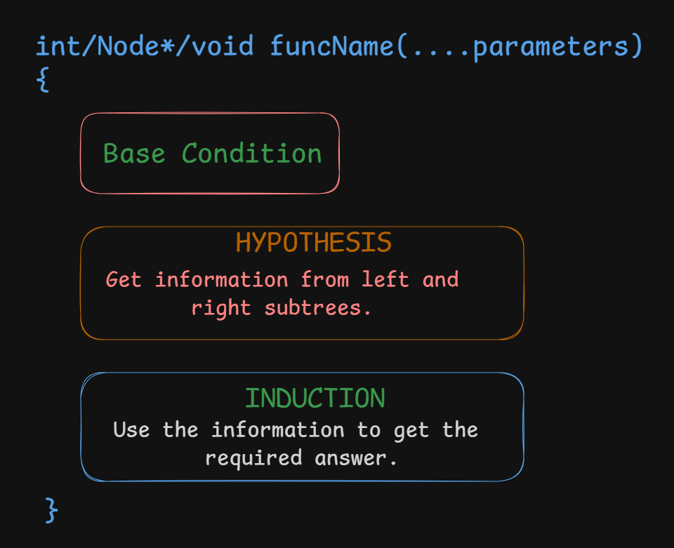

Although many tree problems solved with DFS already involve computing and returning values from subtrees, DP on Trees focuses on designing and combining **states** for each node rather than just traversing the tree. In simple DFS problems, the returned value is usually straightforward (height, depth, subtree size, etc.), whereas Tree DP often requires maintaining one or more states per node and deriving them from the states of its children. The core idea remains the same: solve subproblems in the children and use their answers to compute the answer for the current node.

In Tree DP, an explicit DP table is not always required. For simple problems such as height, subtree size, or diameter, the value returned by the DFS function itself acts as the DP state. A DP table is usually introduced when each node must maintain multiple states, when answers need to be reused across multiple traversals, or when the state depends on additional parameters. As a rule of thumb, if each node only needs to return a single value to its parent, recursion alone is often sufficient; if multiple choices or conditions must be tracked per node, an explicit DP table becomes useful.

# Template

