# **Dynamic Programming : Frog Jump**


**Problem Statement: **Given a number of stairs and a frog, the frog wants to climb from the 0th stair to the (N-1)th stair. At a time the frog can climb either one or two steps. A height[N] array is also given. Whenever the frog jumps from a stair i to stair j, the energy consumed in the jump is abs(height[i]- height[j]), where abs() means the absolute difference. We need to return the minimum energy that can be used by the frog to jump from stair 0 to stair N-1..


## Why a greedy solution won’t work ?

- As there can be a positive tradeoff between number of steps and energy.


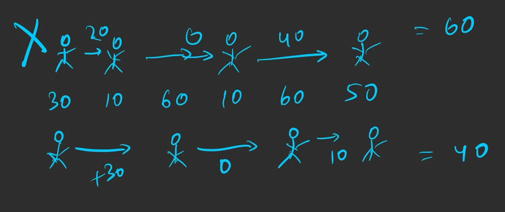

### Memoization


```c++
int calEnergy(int n, vector <int> &height, vector <int> &dp)
{
	if(n == 0)
		return n;
		
	if(dp[n] != -1)
		return dp[n];
		
	int jumpOne = calEnergy(n - 1, height, dp) + abs(height[n] - height[n - 1]);
	int jumpTwo = INT_MAX;
	
	if(n > 1)
		jumpTwo = calEnergy(n - 2, height, dp) + abs(height[n] - height[n - 2]);
		
	return dp[n] = min(jumpOne, jumpTwo);
}

int frogJump(int n, vector <int> &heights)
{
	vector <int> dp(n + 1, -1);
	
	return frogJump(n - 1, heights, dp);
}
```

### ***Tabulation***


```c++
int frogJump(int n, vector <int> &heights)
{
	vector <int> dp(n + 1, -1);
	dp[0] = 0;
	
	for(int i = 1; i < n; i++)
	{
		int jumpOne = dp[i - 1] + abs(height[i] - height[i - 1]);
		
		if(i > 1)
			int jumpTwo = dp[i - 2] + abs(height[i] - height[i - 2]);
			
		dp[i] = min(jumpOne, jumpTwo);
	}	
	
	return dp[n];
}
```

### ***Space Optimization***


```c++
int frogJump(int n, vector <int> &heights)
{
	//vector <int> dp(n + 1, -1);
	//dp[0] = 0;
	int prev1 = 0;
	int prev2 = 0;
	for(int i = 1; i < n; i++)
	{
		int jumpOne = prev1 + abs(height[i] - height[i - 1]);
		
		if(i > 1)
			int jumpTwo = prev2 + abs(height[i] - height[i - 2]);
			
		int curr = min(jumpOne, jumpTwo);
		prev1 = prev2;
		prev2 = curr;
	}	
	
	return prev2;
}
```


---

# **Dynamic Programming: Frog Jump with k Distances **


A frog wants to climb a staircase with n steps. Given an integer array heights, where heights[i] contains the height of the ith step, and an integer k. To jump from the ith step to the jth step, the frog requires abs(heights[i] - heights[j]) energy, where abs() denotes the absolute difference. The frog can jump from the ith step to any step in the range [i + 1, i + k], provided it exists. Return the minimum amount of energy required by the frog to go from the 0th step to the (n-1)th step.

### Memoization


```c++
int Energy(int n, ,vector <int> height, int k)
{
		if(n == 0)
			return n;
		
		if(dp[n] != -1)
			return dp[n];
			
		int res= INT_MAX;
		int jump = INT_MAX;
		
		for(int i = 1; i <= k; i++)
		{
			if(n >= i)
				int jump = Energy(n - i, height, k) + abs(height[n - i] - height[n]); 
			res = min(res, jump);
		}
		
		return dp[n] = res;
}

int frogJump(int n, vector <int> heights, int k) 
{
	vector <int> dp(n, -1);
	return Energy(n - 1, heights, k, dp);
}
```

### **Tabulation**


```c++
int solveUtil(int n, vector<int>& height, vector<int>& dp, int k) {
    // Base case: cost to reach the first stone is 0
    dp[0] = 0;

    // Iterate over each stone
    for (int i = 1; i < n; i++) {
        // Initialize the minimum cost for this stone as large value
        int mmSteps = INT_MAX;

        // Try all possible jump lengths from 1 to k
        for (int j = 1; j <= k; j++) {
            // Ensure jump doesn't go out of bounds
            if (i - j >= 0) {
                // Cost of jumping from (i - j) to i
                int jump = dp[i - j] + abs(height[i] - height[i - j]);
                // Keep track of the minimum cost
                mmSteps = min(mmSteps, jump);
            }
        }

        // Store the computed minimum cost for this stone
        dp[i] = mmSteps;
    }

    // The last element of dp stores the answer
    return dp[n - 1];
}
```

### Space Optimization


```plain text
Use a dp array of size k inside the inner loop to slightly optimize space, as whenever 
we are standing at an index, we only need its previous k indexes' energies not all.
```


---

# Count Subsets with Sum K


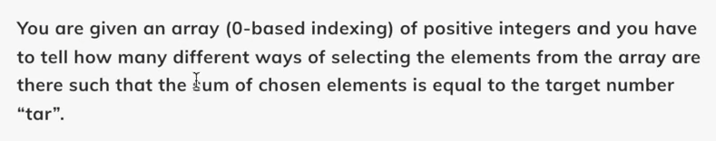


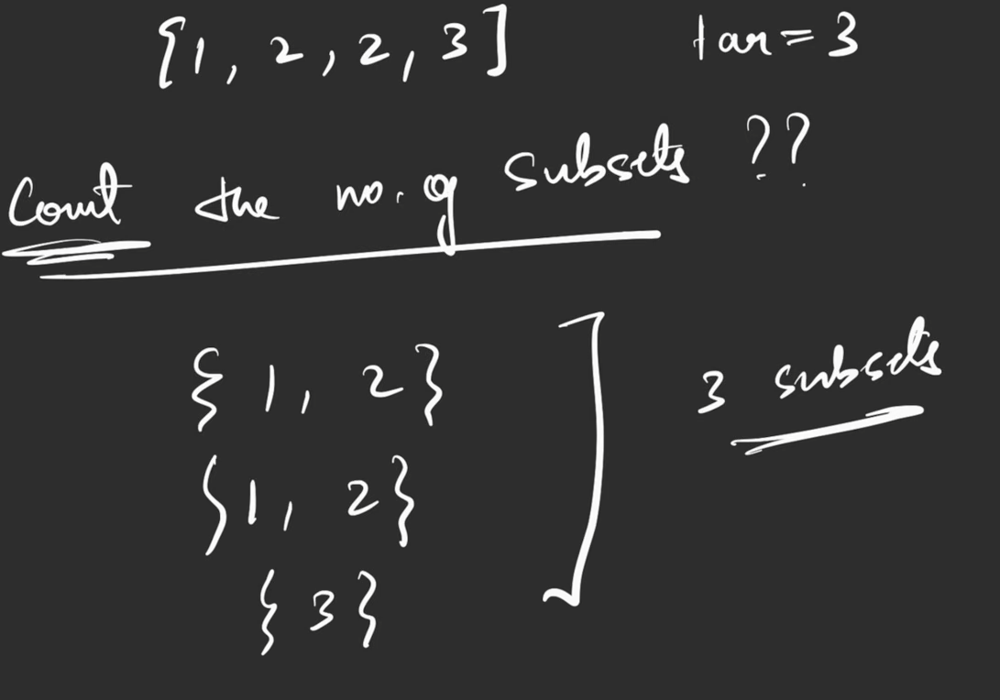

And if there are multiple function calls, then the addition of all of those will give the output


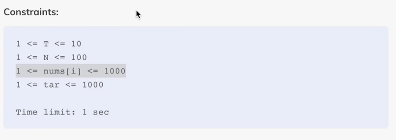

## Memoization


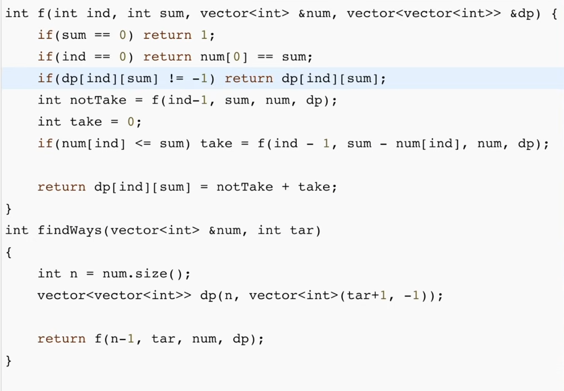

## Tabulation


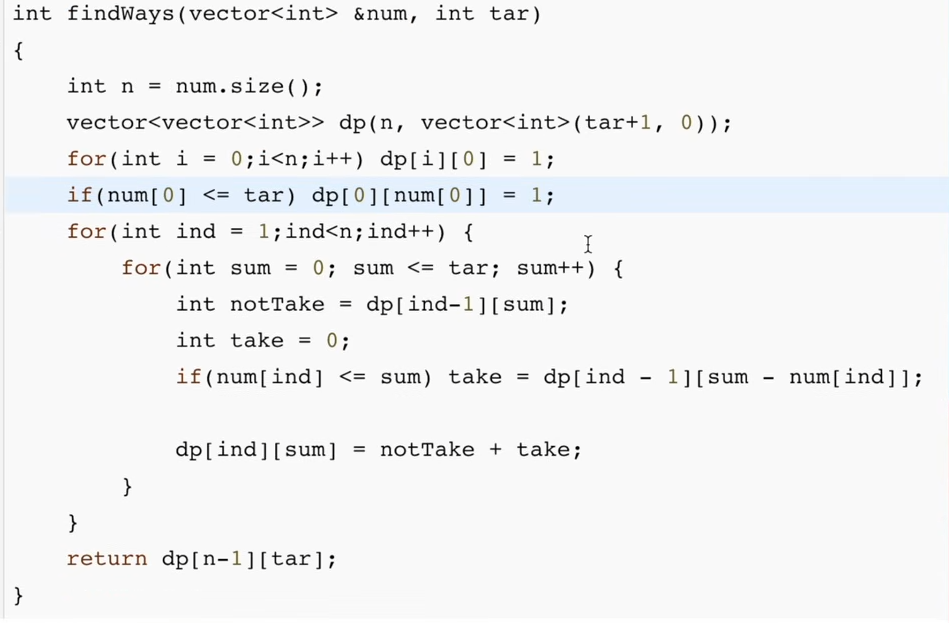

## Space Optimization


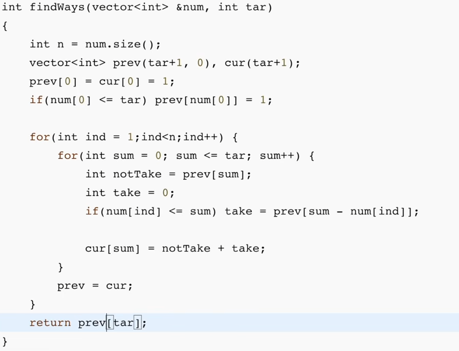

NOTE : If the nums has 0s too in the array, then we have to modify our base case slightly


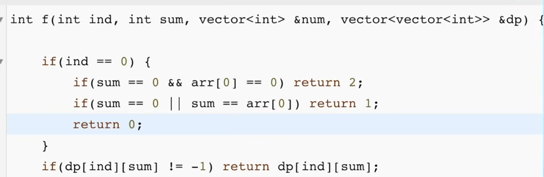

# **Count Partitions with Given Difference (DP - 18)**


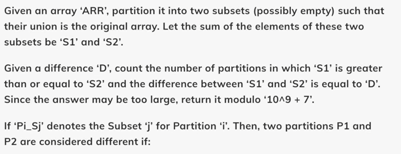

- First thing we can do is replace S2 with `(total sum - S1)` 
- S1 - S2 = D
- Total - S2 - S2 = D
- Total - D = 2 X S2
- S2 = (Total - D) / 2 
So basically the question boils down to finding the number of subsets whose sum is 

`(Total - D) / 2`  && `Total - D ≥ 0` && `Total - D is even`


---

# **Print Longest Common Subsequence | (DP - 26)**


Given two strings str1 and str2, print the longest common subsequence of the two strings.

A subsequence of a string is a list of characters of the string where zero or more characters are deleted and they should be in the same order in the subsequence as in the original string.

- Once the DP table is completely filled, start from the bottom-right corner (n,m) of the table, where n and m are the lengths of the two strings.
- Compare the characters of the two strings at positions i-1 and j-1:
- If they match, this character is part of the LCS. Add this character to the LCS string (building it backwards) and move diagonally up-left i-1, j-1) in the DP table.
- If they do not match, move in the direction of the larger DP value between dp[i-1][j] and dp[i][j-1]. This step helps trace the path of the optimal solution:
- If dp[i-1][j] is greater than dp[i][j-1], move up to (i-1, j). Otherwise, move left to i, j-1.
- Continue this process until you reach the top row or leftmost column (i == 0 or j==0).
- Reverse the collected characters since the reconstruction starts from the end.
- The reversed string is the actual LCS between the two strings.
## Tabulation

- Add this code after computing the dp array

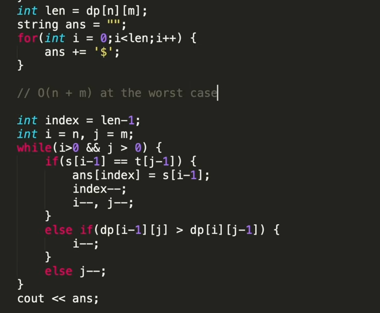


---

# **Longest Common Substring | (DP - 27)**


**Problem Statement: Given two strings str1 and str2, find the length of their longest common substring.

A substring is a ****contiguous ****sequence of characters within a string.Examples

 **


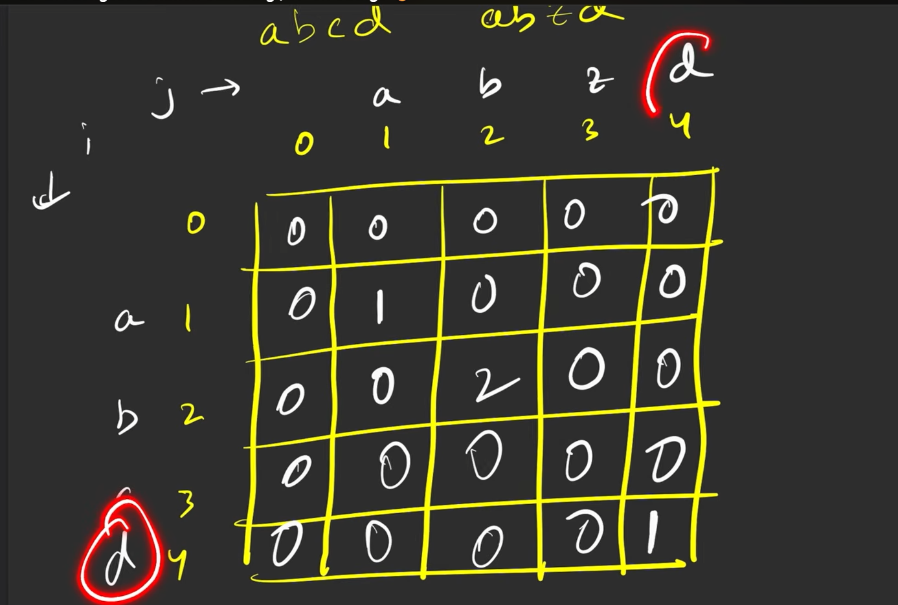

## Tabulation


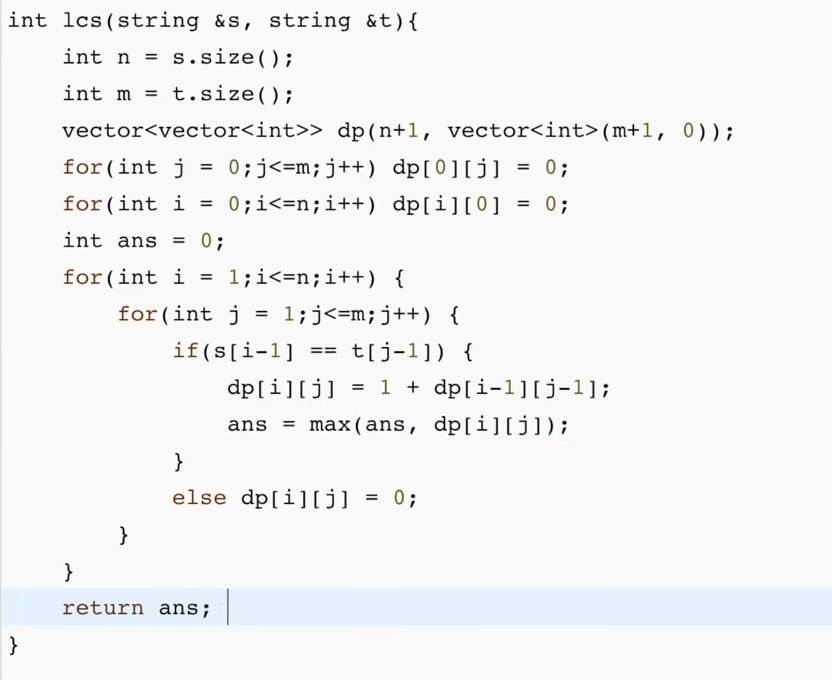

## Space Optimization


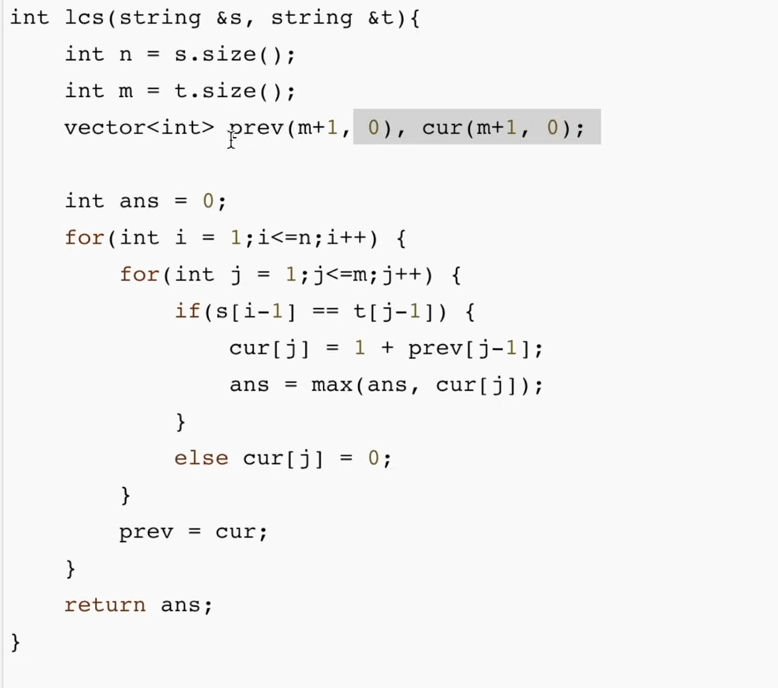

