| Problem says... | Algorithm |
| --- | --- |
| Shortest path, unweighted | BFS |
| Minimum moves | BFS |
| Shortest path, weighted | Dijkstra |
| Minimum effort | Dijkstra |
| Cheapest route | Dijkstra |
| Network delay | Dijkstra |
| Negative weights | Bellman-Ford |
| All-pairs shortest path | Floyd-Warshall |


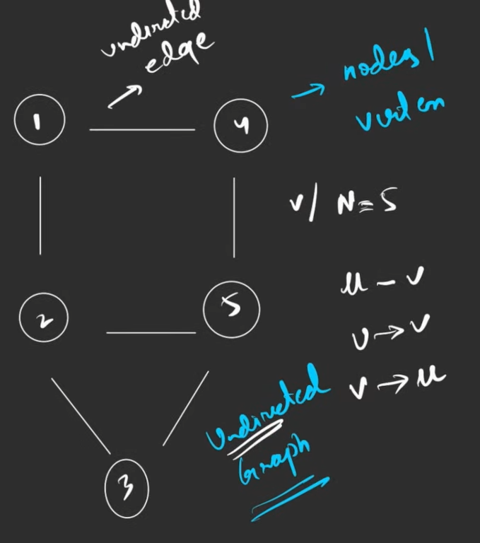


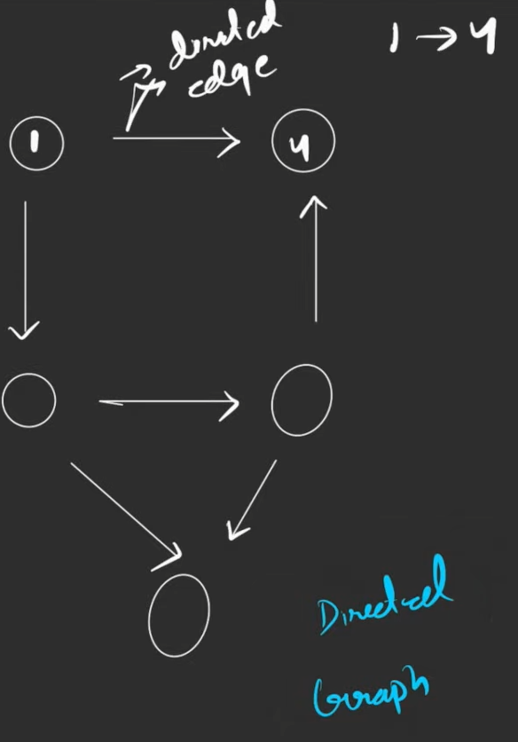

- The nodes are generally numbered in arbitrary order
- For ex  : `V or N = 5`
- We can have unidirectional , monodirectional or bidirectional edges.
- Binary Tree is also a graph
# Cycle 


If you start at a node and end at the same node, we call it a cycle.

A non cyclic graph is known as an acyclic graph.

# Path


- Can contain a lot of nodes and all of them are reachable.
- A node cannot appear twice in a path.
# Degrees in a Graph


## ***Undirected Graph***

The number of edges attached to a  node.

### Property of Degree

The total degree of a graph is equal to twice the number of edges in it.

*Reason** : Every edge is associated with two nodes*

## *Directed Graph*

### Indegree

Number of edges going inside of a node

### Outdegree

The number of edges coming out of a node

# Edge Weights


- Generally, the question will itself assign weights to each edge.
- If not given, always assume unit weights.

---

# Representation of Graph in C++


*What is given in question ?*

- n → nodes, m → edges
- directed/ undirected
- If not given what is what, assume first value to be nodes, second to be edges
- Also m lines of pair of numbers will be given representing the nodes having an edge between them (both ways in an undirected graph) 
- n will be constant, but m can be anything

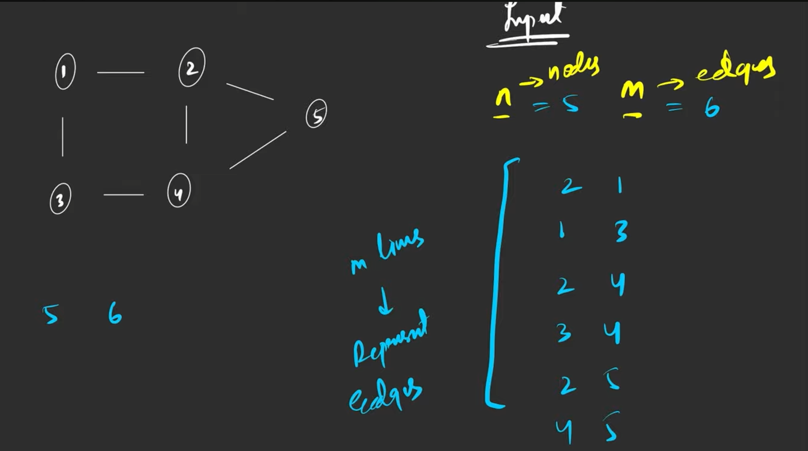

So basically for this graph


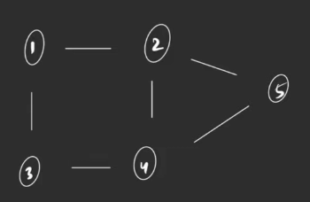

Input will be given like this


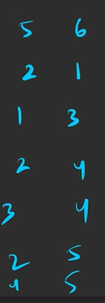


---

# Now how to store (For undirected graph with 1-Based Indexing) ? 


## *1. Matrix Way*

- First we need to check whether indexing is zero based or one based.
- Now, place 1 at all positions where edge is there between the numbers for example (both a-b, b-a)                                     
- All others can be left as it is, or can be filled with zeroes                                                   

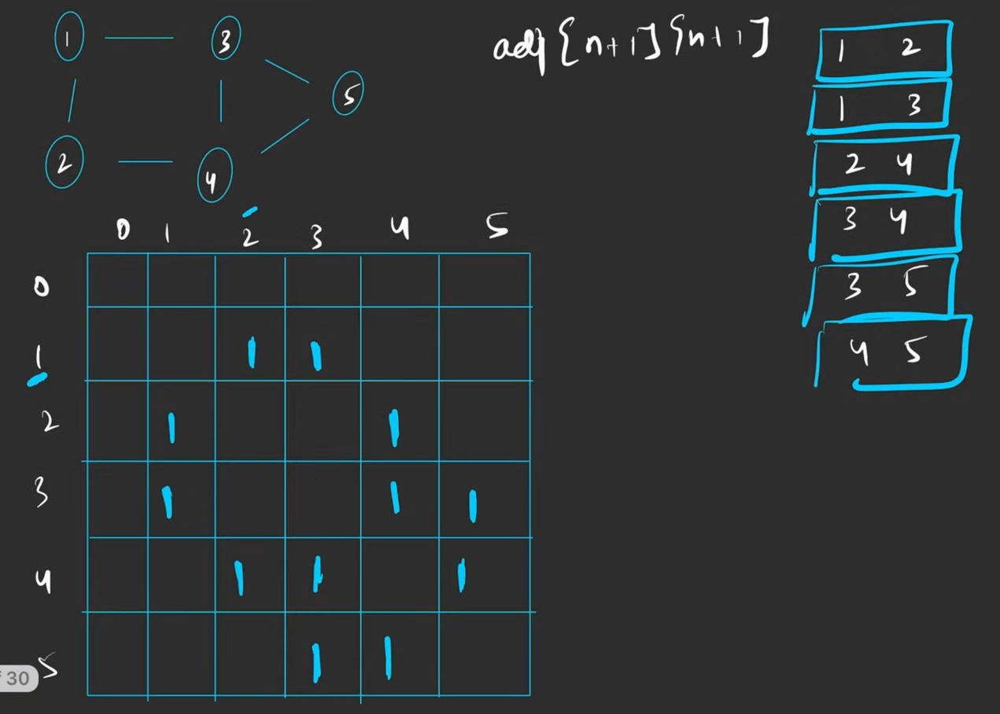

- Space Complexity - O(N X N), which is quite costly 

```javascript
	int n, m;
  cin >> n >> m;

  int adj[n + 1][n + 1];

  for (int i = 0; i < m; i++)
  {
      int u, v;
      cin >> u >> v;
      
      //If graph is undirected
      adj[u][v] = 1;
      adj[v][u] = 1;
  }
```

## *2. List Way*

- We create a list of adjacency `vector <int> adj[n + 1]` (for 1-based indexing)

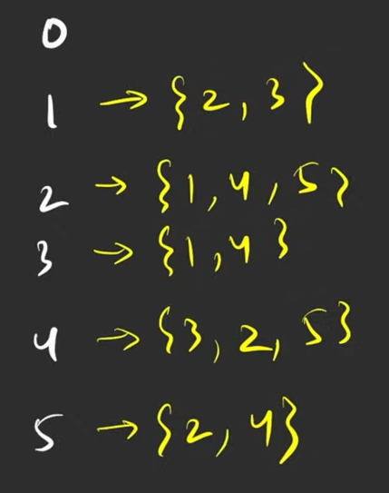

- Space taken O(2 *  number of edges) or O(degree), which is much much better than O(N * N)

```javascript
  int n, m;
  cin >> n >> m;

  vector<int> adj[n + 1];

  for (int i = 0; i < m; i++)
  {
      int u, v;
      cin >> u >> v;
      
      //For undirected graph
      adj[u].push_back(v);
      adj[v].push_back(u);
  }
```


---

# Storing a Weighted Graph ?


## ***Matrix Way***

Similar to above, just a slight change, now in place of one everywhere, we will  write the edge weight for that particular pair in the adjacency matrix.

Basically, now `adj[u][v] = weight` and `adj[v][u] = weight`  now. 

## ***List Way***

Now, instead of just the neighbors, we still store the weight also, by using `pair` , we will insert a pair containing the ` { neighbour, wt .of that edge}`  i.e. `vector<pair<int, int>> adj[n + 1]`


---

# CONNECTED COMPONENTS


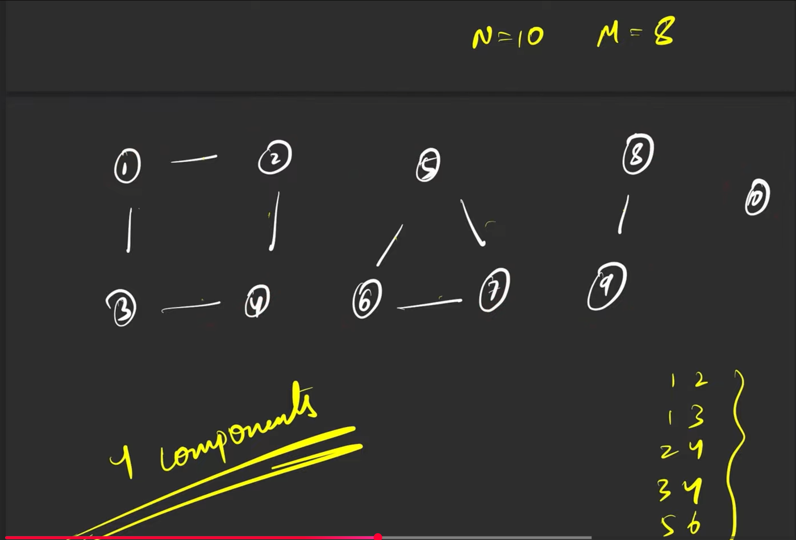

- Because of this case of connected components, whenever we use any traversal method, we have to use something called `visited array` of size `n + 1` 

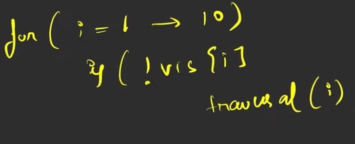

- If the node is not visited, we will call the traversal algorithm from that node
- Initially we will flag all as unvisited / false.
- The traversal algos are such designed that they will traverse the entire connected portions of that component of the graph.

---

# TRAVERSAL TECHNIQUES


BFS proceeds level by level.

### Key Property

In an unweighted graph, BFS always reaches a node for the **first time using the shortest possible distance**.

This property still holds when there are multiple sources.

The crucial fact is:


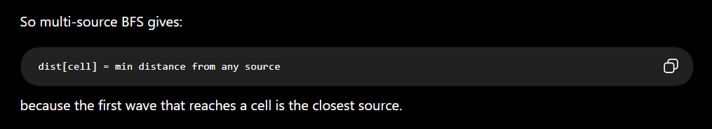

## *BFS(Breadth First Search) / Level Wise Traversal*

- Traversal level by level
- Traversal in one level can be in any order
- What if the starting node is somewhere in between
- Note than only one node can be at level zero
- Then we need to use the equivalent distance method 
### *Initial Configuration for BFS*

- Take a queue data structure and add the starting node to it.
- Create an array `visitedArray` of size n + 1, if graph is 1 indexed
- Whatever is the starting node, mark it as one in the visited array, all others will be marked as zero
***Next Steps***

- We know that the graph is stored in a adjacency list (we need to create this first)    
- Whatever is in the queue we start taking it out and print it until the queue is not empty
- Whenever we take out the front element from the queue, we ask *“who are your neighbors”*  which is known through the adjacency list ?
- Now, add all its neighbors one by one *only if they have not been visited yet*, also flagging them as 1 in the `visited array`
- Now follow the same steps as above for the newly added neighbourers.

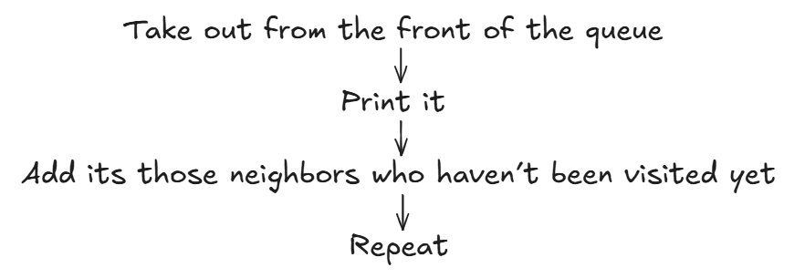

### BFS Code


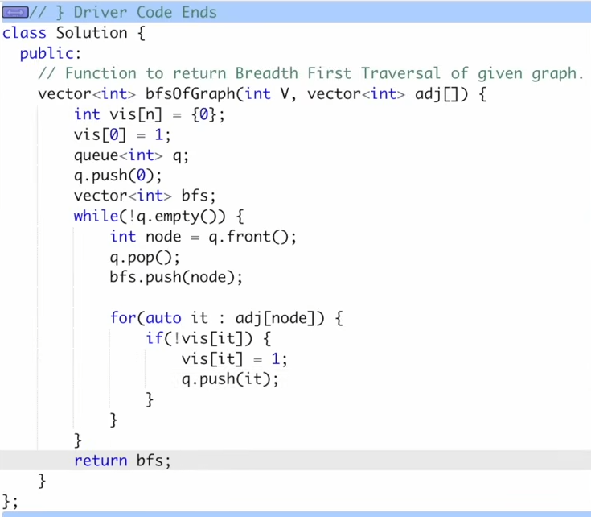

### Complexities

**TC **: O(N) + O(2 * Edges)

THOSE WHO ARE WORDERING WHY IT IS  O(N) + O(2E) NOT O(N*2E)

For each node, the while loop runs multiple times based on the number of edges connected to that node. Here's how it works:

In the first iteration, the loop runs for e1 edges, plus one extra operation for pushing and popping the node.
In the second iteration, it runs for e2 edges, plus one extra operation for pushing and popping, and so on.
Thus, the total time complexity is the sum of all iterations:

(e1 + e2 + ... + en) + (1 + 1 + ... n times).
The sum of all the edges connected to each node is equal to the total number of edges, which is 2E (since each edge is counted twice in an undirected graph). Adding the n push/pop operations gives the final complexity:

O(V + 2E) because e1 + e2 + ... + en = 2E.
So, the overall complexity is O(V + 2E), which simplifies to O(V + E).


---

## *DFS(Depth First Search)*


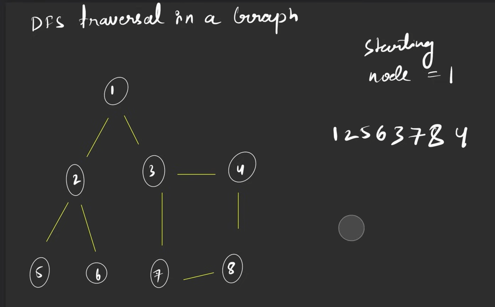


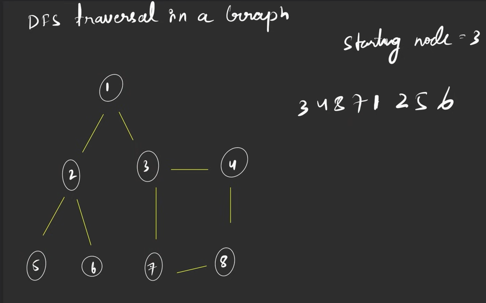


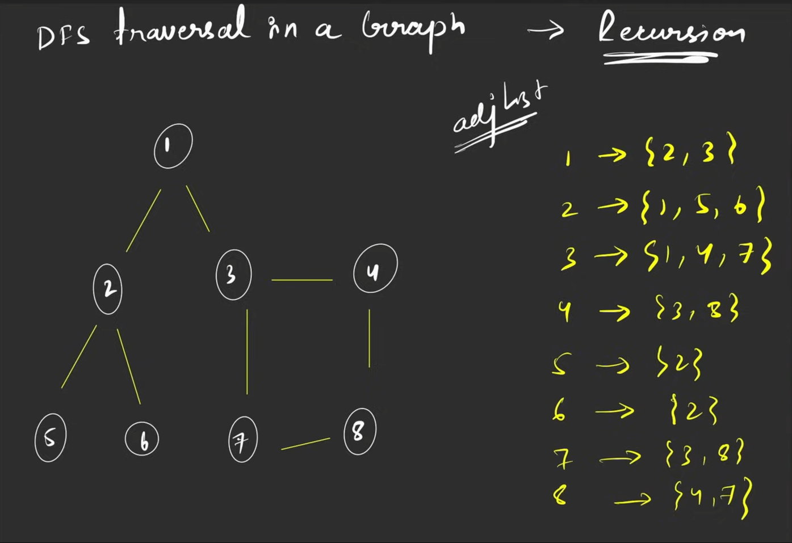

### *STEPS:*


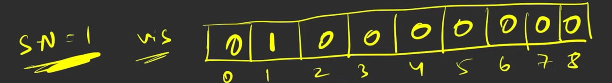

- Create a visited array and mark starting node as one in `visited array`
- Call the recursive function with the starting node `dfs(node)`
### Pseudocode for recursive function


```javascript
dfs(node)
{
	visited_array[node] = 1;
	list.add(node);
	
	for( auto it : adj[node])
	{
		if(!visited_array[it])
			dfs(it);	
	}
}
```

### DFS Code


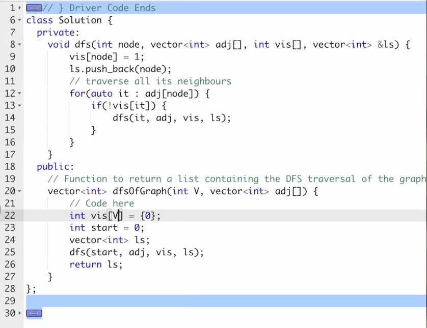

### Complexities

TC : O(N) + (2 * Edges)


---

# Topo Sort 


## DFS - O(N + 2E) + O(E)

- Linear Ordering of vertices such that if there is an edge between u and v, u appears before v in that ordering.
- Only applicable on ***DAG (Directed Acyclic Graph) ***
- Uses stack for implementation

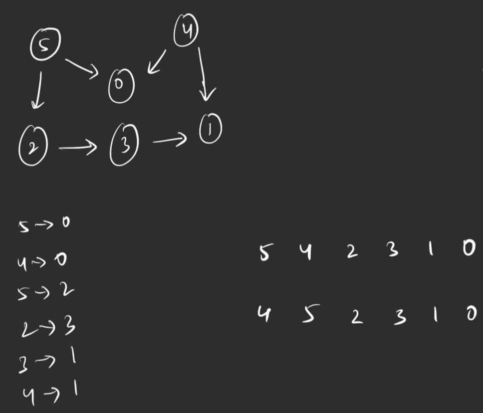


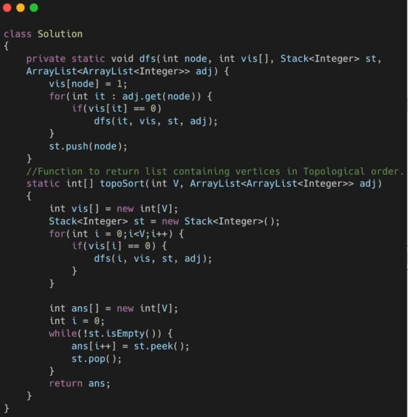

### Algorithm

- Take a visited array and mark all nodes as unvisited
- Loop through all the nodes ( 0 to n - 1) and call the DFS function if the node is unvisited
- **DFS function **
- Mark the current node as visited
- Loop through its neighbors through the adjacency list
- If the neighbor is not visited, call the DFS function again
- Before exiting through the DFS function, add the node into the stack
- After looping through all the nodes, the stack will get filled
- Loop through the stack and pop out all the elements from the stack, this gives us the TOPO SORT ordering of the graph
## BFS / Kahn’s Algorithm

- This is the most intuitive approach.
-  It uses a Queue and tracks "in-degrees" (number of incoming edges to a node).
- Uses an indegree array
- Note that there will be minimum one node whose indegree is zero (since the graph is acyclic).
### Algorithm

1. Find indegree of all nodes and mark it in the indegree array.
1. Insert all nodes with indegree `zero` in the queue.
1. Now traverse though the queue until its empty.
1. Pop a node, add it to your final answer, and "delete" its outgoing edges to its neighbors. By deletion we mean reducing its indegree by one is the indegree array. 
1. If any neighbor’s indegree now drops to `0` , push it into the queue.
1. Repeat until the queue is empty.

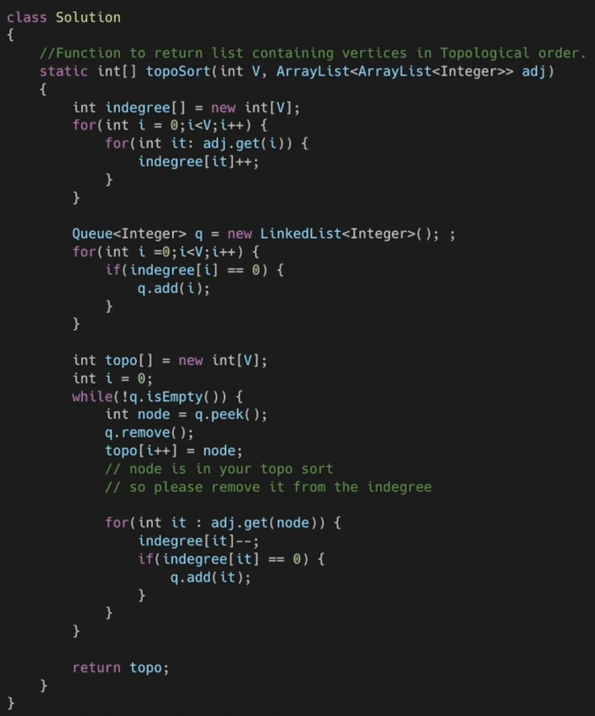

Here is a concise summary detailing how BFS and DFS behave differently when executing a Topological Sort, specifically regarding how they handle cycles.

### **BFS (Kahn's Algorithm) vs. DFS for Topological Sort**

The fundamental difference lies in **how the two algorithms respond to cycles** in a directed graph. A valid Topological Sort is only possible on a Directed Acyclic Graph (DAG). If a cycle exists, the two approaches handle it completely differently:

### **1. BFS Approach (Kahn's Algorithm)**

- **Mechanism:** Relies on tracking the **in-degree** (number of incoming edges) for every node. It dynamically removes nodes with an in-degree of `0` and updates their neighbors.
- **Cycle Behavior:** Nodes inside a cycle depend on each other, meaning their in-degrees can never drop to `0`. Consequently, the algorithm physically gets **stuck** and leaves those nodes behind in the queue.
- **Cycle Detection:** **Built-in automatically.** You do not need any extra data structures. You simply keep a counter of how many nodes were popped from the queue. If `processed_courses != total_courses`, a cycle exists.
### **2. DFS Approach**

- **Mechanism:** Dives as deep as possible along a path. When it hits a dead end (a node with no outgoing unvisited edges), it backtracks and pushes that node onto a stack (post-order traversal).
- **Cycle Behavior:** Standard DFS **does not get stuck** on a cycle. It will traverse the loop, see that a node has already been visited, skip it, and continue pushing nodes onto the stack anyway. It will finish execution normally and return a completely invalid, corrupted linear ordering without realizing it.
- **Cycle Detection:** **Requires an explicit extra state.** Because a standard `visited` array cannot distinguish between a node visited in a completely separate path versus a node visited in the *current active loop*, you must maintain a second tracker: a `pathVisited` (or `inStack`) array.
- A cycle is only confirmed if you encounter a neighbor that is both `visited == true` **and** `pathVisited == true`.
### **Summary Table**


| Feature | BFS (Kahn's) | DFS |
| --- | --- | --- |
| Core Tracker | In-degree array + Queue | Recursion Stack |
| Processing Order | From sources (0 prerequisites) outward | From sinks (dead ends) backward |
| Cycle Handling | Naturally gets blocked by cycles | Blindsides cycles and processes them anyway |
| Cycle Detection Memory | $O(1)$ extra logic (just a counter variable) | $O(V)$ extra space (pathVisited array) |


# Bipartite Graph


- A **bipartite graph** is **a network of nodes (vertices) that can be divided into two disjoint sets, where every edge connects a node in one set to a node in the other**. Edges never connect nodes within the same set

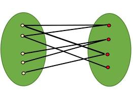


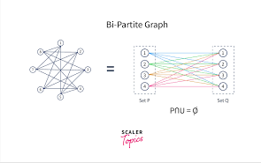

## Solved using Graph Coloring Algorithm

### Intuition

### The "Two Rooms" Metaphor

Imagine you are a teacher trying to divide a group of students into exactly **two different classrooms** (Room 0 and Room 1).

- Some students are rivals and absolutely hate each other.
- A line (an edge) between two students means they are rivals and **cannot** be placed in the same room.
The question "Is this graph Bipartite?" simply means: **Is it possible to assign every student to a room without putting any rivals together?**

### The Intuition Behind the BFS Algorithm

If you want to solve this seating arrangement in real life, you would naturally use the BFS strategy:

1. **Pick a random student** and throw them in Room 0.
1. Look at all of their **rivals** (neighbors). Since they can't be in Room 0, you throw them all into Room 1.
1. Now look at all the **rivals of those rivals** (neighbors' neighbors). You throw them back into Room 0.
1. You keep alternating rooms like a ripple effect.
**When does it fail?**
It only fails if you are looking at a student in Room 0, and you go to place their rival in Room 1, but you see that the rival is *already sitting in Room 0*. You have a conflict. The seating arrangement is impossible, meaning the graph is **not bipartite**.

### **The Mathematical Rule: "Odd Cycles"**

**In graph theory, the only thing that makes a graph "Not Bipartite" is the presence of an Odd-Length Cycle (a loop of 3, 5, 7, etc., nodes).**

Imagine a triangle of three rivals: A hates B, B hates C, and C hates A.

- A goes to Room 0.
- B must go to Room 1.
- C hates B, so C goes to Room 0.
- *Conflict!* C also hates A, but they are now both in Room 0.
Because you only have two rooms, any odd-numbered loop will mathematically force the last person to sit with someone they hate. Our BFS algorithm is essentially just a highly efficient "Odd Cycle Detector."

# Why BFS always guarantees shortest path ?


 

The absolute best way to understand why Breadth-First Search (BFS) guarantees the shortest path in an unweighted graph (like a grid matrix) is to think of it as **dropping a stone into a perfectly still pond.**

When the stone hits the water, a ripple expands outward in a perfect circle.

- At 1 second, the ripple hits everything exactly 1 meter away.
- At 2 seconds, it hits everything exactly 2 meters away.
Because the ripple expands uniformly, the **absolute first time** the water touches a leaf floating in the pond, you know with 100% mathematical certainty that the ripple took the shortest possible path to get there. If a shorter path existed, the water would have hit it sooner.

Here is exactly how BFS mimics this physics rule in your code.

### 1. The Queue (Strict Timekeeping)

BFS uses a First-In, First-Out (FIFO) queue. This acts as a strict timekeeper.

If you push all your starting points (Distance 0) into the queue, the queue forces the computer to process **every single node at Distance 1** before it is legally allowed to look at a node at Distance 2. It is impossible for BFS to "skip ahead."

### 2. The Multi-Source Advantage (01 Matrix)

In the 01 Matrix problem, you want the distance from *any* `0` to a `1`.

Instead of dropping one stone, you drop stones at every single `0` in the matrix at the exact same time. This is called **Multi-Source BFS**.

1. You put every single `0` into the queue at Distance 0.
1. The queue processes all `0`s, and finds all `1`s that are immediately next to them. These become Distance 1.
1. The queue then processes all those Distance 1 cells to find the Distance 2 cells.
The ripples from all the `0`s are expanding simultaneously.

### 3. The "First Come, First Served" Rule (Visited Matrix)

This is the nail in the coffin that guarantees the shortest path.

When a cell is reached, you mark it as "visited" (or update its distance in the result matrix). If another, slower path reaches that same cell later, the algorithm ignores it because it's already marked.

If Path A reaches a cell at step 3, and Path B reaches that same cell at step 5, Path A claims it. The first one to arrive is always the shortest.

Here is an interactive visualization of the 01 Matrix problem. Step through it to watch the Multi-Source BFS ripple effect in action, and notice how the first time a cell is touched, its shortest path is permanently locked in.

# Important Points for Revision


- Revise DFS version for detecting a cycle in a graph (uses modified topological sorting) - Used an extra array `pathVis` in addition to the visited array.
https://leetcode.com/problems/course-schedule/


---

🔗 **References**
- https://leetcode.com/problems/course-schedule/ → https://leetcode.com/problems/course-schedule/

