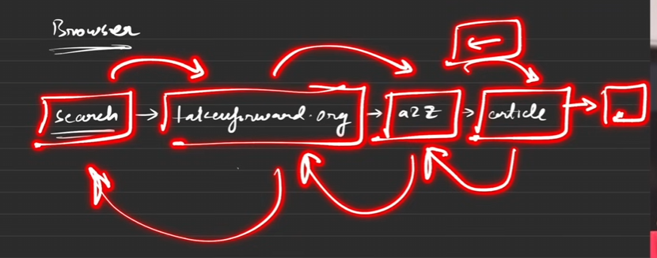
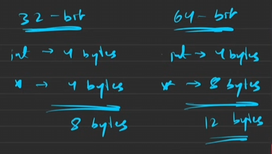
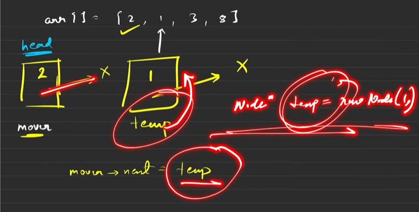
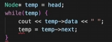
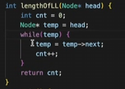
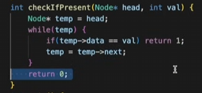
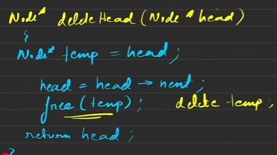
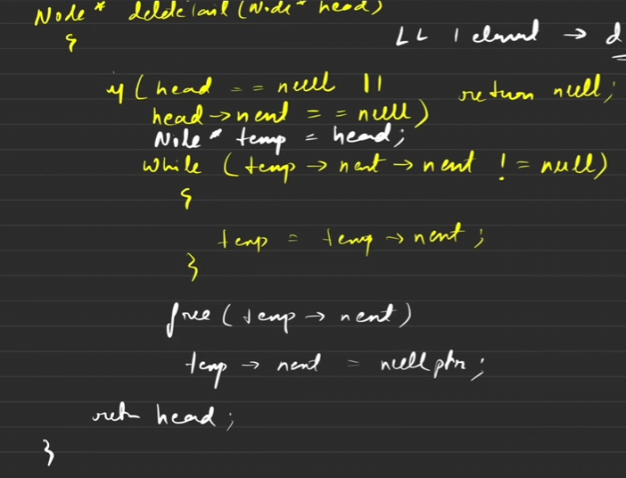
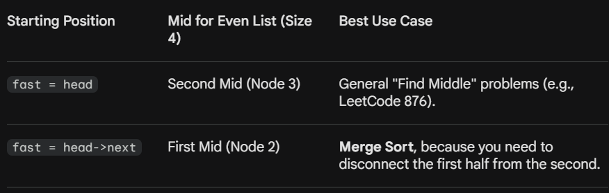
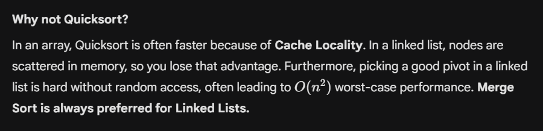

1. **Inserting at the Tail (**35:16**–**39:50**)**
- **Concept:** Add a new node as the last node.
- **Logic:**
- **If the list is empty (**`head == null`**):** Create a new node with the `value` and set its `next` to `null`. This node becomes the head (37:11–37:30).
- **If the list is not empty:**
- Traverse the list using a `temp` pointer until temp.next is `null`. This positions `temp` at the current last node (37:51).
- Create a `new_node` with the given `value` and set `new_`node.next to `null` (38:12–38:19).
- Set temp.next to `new_node` to link it to the end (38:21).
- **Return Value:** The head of the list.
1. **Inserting at the Head (**32:21**–**35:10**)**
- **Concept:** Add a new node as the first node.
- **Logic:**
- Create a `new_node` with the given `value`.
- Set `new_`node.next to the current `head` (33:02, 34:00).
- The `new_node` becomes the new `head`.
- **Time Complexity:** O(1) (35:05).
- **Return Value:** The new head of the list.
1. **Deleting the Kth Element (**15:46**–**29:56**)**
- **Concept:** Delete a node at position `K` (1-indexed). This combines head, tail, and middle deletion.
- **Logic:**
- **If K=1:** This is head deletion (16:09). Use the logic from "Deleting the Head."
- **For K > 1:**
- Initialize `count` to 0, `temp` to `head`, and `previous` to `null` (21:36–22:00, 27:16).
- Traverse the list: In each iteration, increment `count`, update `previous` to `temp`, and move `temp` to temp.next (28:11).
- Stop when `count` equals `K`. Now `temp` is at the Kth node and `previous` is at the (K-1)th node.
- Set previous.next to temp.next to bypass the Kth node (25:28, 27:52).
- **Memory Management (C++ vs Java):**
- **C++:** `free` or `delete` `temp` (the Kth node) (25:50, 28:00).
- **Java:** No manual freeing required.
- **Edge Cases:**
- If the list is empty (`head == null`), return `null` (17:43).
- If `K` exceeds the list's length, no deletion occurs (21:05–21:20). The loop finishes and the original head is returned.
- **Time Complexity:** O(K)—you traverse up to the Kth element (29:58).
- **Return Value:** The head of the modified list.
1. **Deleting the Tail (**6:17**–**15:45**)**
- **Concept:** Remove the last node. The second-to-last node's `next` pointer should point to `null`.
- **Logic:**
- Traverse the list using a `temp` pointer until temp.next.next is `null`. This positions `temp` at the second-to-last node (9:07–11:28).
- **Memory Management (C++ vs Java):**
- **C++:** `free` or `delete` temp.next (the tail node) (11:49).
- **Java:** No manual freeing needed (12:02).
- Set temp.next to `null` to detach the last node (12:09).
- **Edge Cases:**
- If the list is empty (`head == null`), return `null` (8:08).
- If the list has only one element (head.next` == null`), deleting the tail makes the list empty. Return `null` (8:22–8:49).
- **Return Value:** The head of the modified list.
1. **Deleting the Head (**0:30**–**6:16**)**
- **Concept:** Remove the first node. The second node becomes the new head.
- **Logic:**
- Store the current head in a temporary variable (`temp`).
- Move the `head` pointer to the next node (`head = `head.next).
- **Memory Management (C++ vs Java):**
- **C++:** Manually `free` or `delete` the `temp` node to prevent memory leaks (2:49, 3:00).
- **Java:** No manual freeing required—automatic garbage collection handles it (3:06–3:48). The `temp` node will be collected when no references remain.
- **Edge Case:** If the list is empty (`head == null`), return `null` since there's nothing to delete (4:11).
- **Return Value:** The new head of the list.

📎 Attachment: ../assets/2d60eb7a-3bc3-8040-9111-c9d86ff8ec2f

# **1. Introduction to Linked Lists **(0:58)


- **Arrays vs. Linked Lists:**
- **Arrays:** Have a fixed size (1:30) and store elements in contiguous memory locations (1:47), making them easy to traverse by index (2:25). However, you cannot easily increase or decrease their size (2:30).
- **Linked Lists:** Are dynamic in size, allowing easy growth or shrinkage ((2:36), (4:46)). They do not store elements in contiguous memory locations (3:21). Instead, elements (called "nodes") can be anywhere in heap memory (3:40).
- **How Linked Lists Store Elements (Nodes):**
- Each element in a linked list is a **node** (5:35).
- A node consists of two parts:
1. **Data:** The actual value being stored (e.g., integer, double, string) ((5:37), (4:35)).
1. **Next:** A pointer (or reference in Java) to the memory location of the *next* node in the sequence (5:40).
- This "next" pointer creates an invisible link between non-contiguous memory locations (7:33).
- **Head and Tail:**
- **Head:** The starting point of the linked list. It stores the memory location of the first node (6:49). Never modify the head (38:04).
- **Tail:** The last node in the linked list. Its "next" pointer points to `null` (in Java) or `nullptr` (in C++) (8:44).
- **Advantages of Linked Lists over Arrays:**
- **Dynamic Size:** Can easily grow or shrink ((4:46), (10:04)).
- **Efficient Insertions/Deletions:** Adding or removing elements is simpler-you only need to update pointers, not shift elements as in arrays (9:07).
# **2. Real-Life Applications of Linked Lists **(10:33)


- **Data Structures:**
- **Stacks:** Linked lists are commonly used to implement stacks because stacks have no fixed size (10:51).
- **Queues:** Queues also benefit from the flexible size of linked lists (10:58).
- **Browser Navigation (Doubly Linked List):**
- Browser history is a common example (11:19). When you navigate forward and backward, it behaves like a linked list.
- A "1D Linked List" (11:21) only remembers the "next" pointer. For browser navigation, a "Doubly Linked List" is used as it remembers both "next" and "previous" pages (12:44).



# **3. Self-Defined Data Types (Node Structure) **(13:19)


- To store both `data` (which can be of any standard data type) and the `next` pointer, you need a custom data type. Standard data types (like `int`, `double`) only store one value ((16:01), (17:00)).
- This custom data type is called a **Node**.

```c++
C++ Implementation (using struct or class) (17:09):

struct Node { // or class Node
int data;
Node* next; // Pointer to the next Node object

Node(int data1, Node* next1) {// Constructor to initialize data and next
data = data1;
next = next1;
}
// Overloaded constructor for convenience
Node(int data1) {
data = data1;
next = nullptr; // Automatically sets next to null pointer
}

};

int main() {
	Node y = Node(2, nullptr);    //Creates a new node object 
	cout<<y;        //Throws error
	cout<< y.data;   // 2
	cout<< y.next;   // 0x0
	
	Node* y = new Node(2, nullptr);//Creates a node and stores its address in y
	cout<< y;        //Prints address of the node
	cout<< y.data;   // error (for pointer we use arrow notation ) 
	cout<< y->data   // 2

//new variable syntax for creation of node is preferred
```

The above implementation can be done using a class (preferred)  just by replacing the keyword `struct `by `class`

- `struct`** vs. **`class`**:** Both can define the Node. `class` is generally `preferred `in industry as it supports Object-Oriented Programming (OOP) concepts like abstraction, encapsulation, and inheritance ((23:03), (23:45)).
- **Pointers:** In C++, `Node\*` stores the memory address of the next node (19:37).
- `new`** keyword:** Allocates memory for a new node on the heap and returns a pointer to that memory location ((20:18), (29:55)).
- **Accessing members:** Use `-\>` (arrow operator) for pointers (e.g., `y-\>data`) (22:04).

```java
Java Implementation (using class) (24:14):

class Node {
int data;
Node next; // Reference to the next Node object (no explicit pointers)// Constructor
public Node(int data1, Node next1) {
this.data = data1;
this.next = next1;
}
// Overloaded constructor for convenience
public Node(int data1) {
this.data = data1;
this.next = null; // Automatically sets next to null
}
}
```

- **No Pointers:** Java uses references instead of explicit pointers (24:16). Simply declare `Node next;`.
- `new`** keyword:** Works similarly to C++ to create a new object (25:13).
- `null`**:** Equivalent to `nullptr` in C++ (24:51).
- **Accessing members:** Use `.` (dot operator) (e.g., y.data) (25:59).
- **Memory Space****:** The memory a node consumes depends on the system architecture (32-bit or 64-bit) and the size of the data it stores (26:31).



# **4. Converting an Array to a Linked List **(28:04)




This process creates a linked list from array elements.

1. **Initialize Head:** Create the first node using the first array element. This becomes the `head` (28:46).
1. **Initialize Mover:** Create a `mover` pointer, initially pointing to the `head` (29:40). The `mover` will traverse the linked list during construction.
1. **Iterate and Link:** Loop through the remaining array elements (from the second element onwards):
- For each element, create a `temporary` new node (30:05).
- Set the `next` pointer of the `mover` to this `temporary` node (`mover->next = temp)` (30:51), creating the link.
- Move the `mover` to the `temporary` node (i.e., `mover = temp`) to prepare for linking the next element (31:37).
1. **Return Head:** After iterating through all elements, return the `head` (33:04).
- **Time Complexity:** O(N), where N is the number of array elements, as each element is visited once (37:12).
# **5. Traversal in Linked List **(37:21)




To access elements in a linked list, traverse from the `head` to the `tail`.

1. **Initialize Temporary Pointer:** Create a `temporary` pointer and initialize it with the `head` (`Node* temp = head;` or `Node temp = head;`) (38:17). This avoids modifying the original `head`.
1. **Loop until Null:** Use a `while` loop that continues as long as `temp` is not `null` (or `nullptr`) (39:11).
1. **Access Data:** Inside the loop, access the current node's data using `temp->data` (C++) or temp.data (Java) (39:19).
1. **Move to Next:** Update `temp` to point to the next node (`temp = temp->next;` or `temp = `temp.next`;`) (39:23).
- **Time Complexity:** O(N), as it visits each node once.
# **6. Length of a Linked List **(40:14)




To find the number of nodes in a linked list:

1. **Initialize Counter:** Create an integer variable `count` and initialize it to 0 (40:34).
1. **Traverse:** Use the same traversal logic as above (40:36).
1. **Increment Counter:** Inside the traversal loop, increment `count` for each node (`count++`) (40:41).
1. **Return Count:** After the traversal completes (when `temp` becomes `null`), return `count` (40:43).
- **Time Complexity:** O(N), as it requires traversing the entire list (41:59).
# **7. Searching for an Element in a Linked List **(42:03)




To check if a specific element exists in a linked list:

1. **Initialize Temporary Pointer:** Create a `temporary` pointer initialized with the `head` (42:33).
1. **Traverse and Compare:** Use a `while` loop to traverse the list. Inside the loop, compare the current node's `data` (`temp-\>data` or temp.data) with the search `value` (42:40).
1. **Return True/False:**
- If a match is found (`temp-\>data == val`), immediately return `true` (or 1) (42:44).
- If the loop completes without finding the element (`temp` becomes `null`), return `false` (or 0) (42:49).
- **Time Complexity:**
- **Worst Case:** O(N), if the element is at the end or not present (44:20).
- **Best Case:** O(1), if the element is the head (44:25).
- **Average Case:** O(N/2) (44:31).

📎 Attachment: ../assets/2d60eb7a-3bc3-80f6-abe1-de0daab4f624

# **8 . Deleting a Node in a Linked List**


*Take care of edge cases in deletion (very important)*

## **Deleting the Head (**0:30**-**6:16**)**




- **Concept:** Remove the first node. The second node becomes the new head.
- **Logic:**
- Store the current head in a temporary variable (`temp`).
- Move the `head` pointer to the next node (`head = `head.next).
- **Memory Management (C++ vs Java):**
- **C++:** Manually `free` or `delete` the `temp` node to prevent memory leaks (2:49, 3:00).
- **Java:** No manual freeing required—automatic garbage collection handles it (3:06-3:48). The `temp` node will be collected when no references remain.
- **Edge Case:** If the list is empty (`head == null`), return `null` since there's nothing to delete (4:11).
- **Return Value:** The new head of the list.
## **Deleting the Tail (**6:17**-**15:45**)**




- **Concept:** Remove the last node. The second-to-last node's `next` pointer should point to `null`.
- **Logic:**
- Traverse the list using a `temp` pointer until temp.next.next is `null`. This positions `temp` at the second-to-last node (9:07-11:28).
- **Memory Management (C++ vs Java):**
- **C++:** `free` or `delete` temp.next (the tail node) (11:49).
- **Java:** No manual freeing needed (12:02).
- Set temp.next to `null` to detach the last node (12:09).
- **Edge Cases:**
- If the list is empty (`head == null`), return `null` (8:08).
- If the list has only one element (head.next` == null`), deleting the tail makes the list empty. Return `null` (8:22-8:49).
- **Return Value:** The head of the modified list.
## **Deleting the Kth Element (**15:46**-**29:56**)**

- **Concept:** Delete a node at position `K` (1-indexed). This combines head, tail, and middle deletion.
- **Logic:**
- **If K=1:** This is head deletion (16:09). Use the logic from "Deleting the Head."
- **For K > 1:**
- Initialize `count` to 0, `temp` to `head`, and `previous` to `null` (21:36-22:00, 27:16).
- Traverse the list: In each iteration, increment `count`, update `previous` to `temp`, and move `temp` to temp.next (28:11).
- Stop when `count` equals `K`. Now `temp` is at the Kth node and `previous` is at the (K-1)th node.
- Set previous.next to temp.next to bypass the Kth node (25:28, 27:52).
- **Memory Management (C++ vs Java):**
- **C++:** `free` or `delete` `temp` (the Kth node) (25:50, 28:00).
- **Java:** No manual freeing required.
- **Edge Cases:**
- If the list is empty (`head == null`), return `null` (17:43).
- If `K` exceeds the list's length, no deletion occurs (21:05-21:20). The loop finishes and the original head is returned.
- **Time Complexity:** O(K)—you traverse up to the Kth element (29:58).
- **Return Value:** The head of the modified list.
## **Deleting by Value (First Occurrence) (**30:18**-**32:12**)**

- **Concept:** Delete the *first* node matching a given `element` value. This is a variation of "Deleting the Kth Element."
- **Logic:**
- **If the head matches:** If head.data equals the `element`, use head deletion logic (31:09).
- **For other nodes:**
- Initialize `temp` to `head` and `previous` to `null` (similar to Kth deletion).
- Traverse the list. Instead of checking `count == K`, check temp.data` == element` (31:39).
- If a match is found:
- Set previous.next to temp.next.
- **Memory Management (C++ vs Java):** `free`/`delete` `temp` in C++; no action in Java.
- `break` the loop—only the first occurrence is removed.
- If no match, continue: `previous = temp`, `temp = `temp.next.
- **Edge Cases:**
- Empty list.
- Value not found in the list.
- **Return Value:** The head of the modified list.
# **9. Inserting a Node in a Linked List**


## EDGE CASES : 


---

## Singly Linked List – Insertion Edge Cases

Assume:

- `head` → pointer to first node
- Each node has `data` and `next`

---

## 1️⃣ Insertion at **Head**

*NO EDGE CASE *

Same logic for all

### Core Operation


```plain text
newNode->next = head
head = newNode

```

### Edge Cases to Handle

1. **Empty list (**`head == NULL`**)**
- New node becomes the **only node**
- `newNode->next = NULL`
- `head = newNode`
1. **Non-empty list (1 or more nodes)**
- Same logic works for **1 node, 2 nodes, or more**
- No special handling needed beyond pointer update
✅ **Conclusion:**

Insertion at head has **only one real edge case** → empty list.


---

## 2️⃣ Insertion at **Tail**

### Core Operation

- Traverse to last node (`temp->next == NULL`)
- `temp->next = newNode`
- `newNode->next = NULL`
### Edge Cases to Handle

1. **Empty list**
- Tail doesn’t exist
- New node becomes **head**
- `head = newNode`
1. **List with 1 node**
- Head is also the tail
- Attach new node after head
1. **List with 2 or more nodes**
- Normal traversal and insertion
⚠️ If you maintain a `tail` pointer:

- Empty list → update both `head` and `tail`
- Otherwise → `tail->next = newNode`, `tail = newNode`

---

## 3️⃣ Insertion **Between / At a Given Position**

(Position is usually **1-based** in problems)

### General Step

- Traverse to node **just before** the position
- Adjust pointers:

```plain text
newNode->next = prev->next
prev->next = newNode

```

### Edge Cases to Handle

1. **Empty list**
- Only valid insertion is at position `1`
- Otherwise → invalid position
1. **Insertion at position 1**
- Same as **insertion at head**
1. **Insertion after last node**
- Equivalent to **insertion at tail**
1. **List with 1 node**
- Position 1 → head insertion
- Position 2 → tail insertion
- Anything else → invalid
1. **Invalid position**
- Position ≤ 0
- Position > length + 1
- Must be checked to avoid `NULL` access

---

## 🔑 One-Line Crux (Great for Notes)


---

## 🧠 Mental Checklist Before Coding

✔ Is `head == NULL`?

✔ Is insertion at position 1?

✔ Am I inserting after the last node?

✔ Am I checking for invalid positions?

If you want, next we can:

- Write **one generic insert function** that handles all cases
- Or list **common mistakes that cause runtime errors** in LL insertions
## **Inserting at the Head (**32:21**-**35:10**)**

- **Concept:** Add a new node as the first node.
- **Logic:**
- Create a `new_node` with the given `value`.
- Set `new_`node.next to the current `head` (33:02, 34:00).
- The `new_node` becomes the new `head`.
- **Time Complexity:** O(1) (35:05).
- **Return Value:** The new head of the list.
1. **Inserting at the Tail (**35:16**-**39:50**)s**
- **Concept:** Add a new node as the last node.
- **Logic:**
- **If the list is empty (**`head == null`**):** Create a new node with the `value` and set its `next` to `null`. This node becomes the head (37:11-37:30).
- **If the list is not empty:**
- Traverse the list using a `temp` pointer until temp.next is `null`. This positions `temp` at the current last node (37:51).
- Create a `new_node` with the given `value` and set `new_`node.next to `null` (38:12-38:19).
- Set temp.next to `new_node` to link it to the end (38:21).
- **Return Value:** The head of the list.
## Inserting at the Tail

## **Inserting at the Kth Position (**39:51**–**49:50**)**

- **Concept:** Insert a new node at position `K` (1-indexed). `K` can range from 1 to N+1, where N is the current list length.
- **Logic:**
- **Edge Case: Empty List (**`head == null`**):**
- If `K` is 1, create a new node and return it as the head (41:00–41:26).
- If `K` is greater than 1, insertion is not possible—return `null` or indicate an error (41:30–41:41).
- **Edge Case: K=1:** This is head insertion. Use that logic (42:01–42:35).
- **For K > 1:**
- Initialize `count` to 0 and `temp` to `head` (43:54).
- Traverse the list: In each iteration, increment `count` and move `temp` to temp.next.
- Stop when `count` equals `K-1`. Now `temp` is at the node *before* the insertion point (44:56).
- Create a `new_node` with the `element` value (46:00).
- Set `new_`node.next to temp.next (connects new node to the rest of the list) (46:59).
- Set temp.next to `new_node` (connects previous node to new node) (47:29).
- **Return Value:** The head of the modified list.
# Sorting a Linked List




This is also done to handle two node lists





---

🔗 **References**
- 35:16 → https://youtu.be/VaECK03Dz-g?t=2116
- 39:50 → https://youtu.be/VaECK03Dz-g?t=2390
- 37:11 → https://youtu.be/VaECK03Dz-g?t=2231
- 37:30 → https://youtu.be/VaECK03Dz-g?t=2250
- temp.next → http://temp.next/
- 37:51 → https://youtu.be/VaECK03Dz-g?t=2271
- node.next → http://node.next/
- 38:12 → https://youtu.be/VaECK03Dz-g?t=2292
- 38:19 → https://youtu.be/VaECK03Dz-g?t=2299
- temp.next → http://temp.next/
- 38:21 → https://youtu.be/VaECK03Dz-g?t=2301
- 32:21 → https://youtu.be/VaECK03Dz-g?t=1941
- 35:10 → https://youtu.be/VaECK03Dz-g?t=2110
- node.next → http://node.next/
- 33:02 → https://youtu.be/VaECK03Dz-g?t=1982
- 34:00 → https://youtu.be/VaECK03Dz-g?t=2040
- 35:05 → https://youtu.be/VaECK03Dz-g?t=2105
- 15:46 → https://youtu.be/VaECK03Dz-g?t=946
- 29:56 → https://youtu.be/VaECK03Dz-g?t=1796
- 16:09 → https://youtu.be/VaECK03Dz-g?t=969
- 21:36 → https://youtu.be/VaECK03Dz-g?t=1296
- 22:00 → https://youtu.be/VaECK03Dz-g?t=1320
- 27:16 → https://youtu.be/VaECK03Dz-g?t=1636
- temp.next → http://temp.next/
- 28:11 → https://youtu.be/VaECK03Dz-g?t=1691
- previous.next → http://previous.next/
- temp.next → http://temp.next/
- 25:28 → https://youtu.be/VaECK03Dz-g?t=1528
- 27:52 → https://youtu.be/VaECK03Dz-g?t=1672
- 25:50 → https://youtu.be/VaECK03Dz-g?t=1550
- 28:00 → https://youtu.be/VaECK03Dz-g?t=1680
- 17:43 → https://youtu.be/VaECK03Dz-g?t=1063
- 21:05 → https://youtu.be/VaECK03Dz-g?t=1265
- 21:20 → https://youtu.be/VaECK03Dz-g?t=1280
- 29:58 → https://youtu.be/VaECK03Dz-g?t=1798
- 6:17 → https://youtu.be/VaECK03Dz-g?t=377
- 15:45 → https://youtu.be/VaECK03Dz-g?t=945
- temp.next.next → http://temp.next.next/
- 9:07 → https://youtu.be/VaECK03Dz-g?t=547
- 11:28 → https://youtu.be/VaECK03Dz-g?t=688
- temp.next → http://temp.next/
- 11:49 → https://youtu.be/VaECK03Dz-g?t=709
- 12:02 → https://youtu.be/VaECK03Dz-g?t=722
- temp.next → http://temp.next/
- 12:09 → https://youtu.be/VaECK03Dz-g?t=729
- 8:08 → https://youtu.be/VaECK03Dz-g?t=488
- head.next → http://head.next/
- 8:22 → https://youtu.be/VaECK03Dz-g?t=502
- 8:49 → https://youtu.be/VaECK03Dz-g?t=529
- 0:30 → https://youtu.be/VaECK03Dz-g?t=30
- 6:16 → https://youtu.be/VaECK03Dz-g?t=376
- head.next → http://head.next/
- 2:49 → https://youtu.be/VaECK03Dz-g?t=169
- 3:00 → https://youtu.be/VaECK03Dz-g?t=180
- 3:06 → https://youtu.be/VaECK03Dz-g?t=186
- 3:48 → https://youtu.be/VaECK03Dz-g?t=228
- 4:11 → https://youtu.be/VaECK03Dz-g?t=251
- (0:58) → https://www.youtube.com/watch?v=Nq7ok-OyEpg&t=58s
- (1:30) → https://www.youtube.com/watch?v=Nq7ok-OyEpg&t=90s
- (1:47) → https://www.youtube.com/watch?v=Nq7ok-OyEpg&t=107s
- (2:25) → https://www.youtube.com/watch?v=Nq7ok-OyEpg&t=145s
- (2:30) → https://www.youtube.com/watch?v=Nq7ok-OyEpg&t=150s
- (2:36) → https://www.youtube.com/watch?v=Nq7ok-OyEpg&t=156s
- (4:46) → https://www.youtube.com/watch?v=Nq7ok-OyEpg&t=286s
- (3:21) → https://www.youtube.com/watch?v=Nq7ok-OyEpg&t=201s
- (3:40) → https://www.youtube.com/watch?v=Nq7ok-OyEpg&t=220s
- (5:35) → https://www.youtube.com/watch?v=Nq7ok-OyEpg&t=335s
- (5:37) → https://www.youtube.com/watch?v=Nq7ok-OyEpg&t=337s
- (4:35) → https://www.youtube.com/watch?v=Nq7ok-OyEpg&t=275s
- (5:40) → https://www.youtube.com/watch?v=Nq7ok-OyEpg&t=340s
- (7:33) → https://www.youtube.com/watch?v=Nq7ok-OyEpg&t=453s
- (6:49) → https://www.youtube.com/watch?v=Nq7ok-OyEpg&t=409s
- (38:04) → https://www.youtube.com/watch?v=Nq7ok-OyEpg&t=2284s
- (8:44) → https://www.youtube.com/watch?v=Nq7ok-OyEpg&t=524s
- (4:46) → https://www.youtube.com/watch?v=Nq7ok-OyEpg&t=286s
- (10:04) → https://www.youtube.com/watch?v=Nq7ok-OyEpg&t=604s
- (9:07) → https://www.youtube.com/watch?v=Nq7ok-OyEpg&t=547s
- (10:33) → https://www.youtube.com/watch?v=Nq7ok-OyEpg&t=633s
- (10:51) → https://www.youtube.com/watch?v=Nq7ok-OyEpg&t=651s
- (10:58) → https://www.youtube.com/watch?v=Nq7ok-OyEpg&t=658s
- (11:19) → https://www.youtube.com/watch?v=Nq7ok-OyEpg&t=679s
- (11:21) → https://www.youtube.com/watch?v=Nq7ok-OyEpg&t=681s
- (12:44) → https://www.youtube.com/watch?v=Nq7ok-OyEpg&t=764s
- (13:19) → https://www.youtube.com/watch?v=Nq7ok-OyEpg&t=799s
- (16:01) → https://www.youtube.com/watch?v=Nq7ok-OyEpg&t=961s
- (17:00) → https://www.youtube.com/watch?v=Nq7ok-OyEpg&t=1020s
- (23:03) → https://www.youtube.com/watch?v=Nq7ok-OyEpg&t=1383s
- (23:45) → https://www.youtube.com/watch?v=Nq7ok-OyEpg&t=1425s
- (19:37) → https://www.youtube.com/watch?v=Nq7ok-OyEpg&t=1177s
- (20:18) → https://www.youtube.com/watch?v=Nq7ok-OyEpg&t=1218s
- (29:55) → https://www.youtube.com/watch?v=Nq7ok-OyEpg&t=1795s
- (22:04) → https://www.youtube.com/watch?v=Nq7ok-OyEpg&t=1324s
- (24:16) → https://www.youtube.com/watch?v=Nq7ok-OyEpg&t=1456s
- (25:13) → https://www.youtube.com/watch?v=Nq7ok-OyEpg&t=1513s
- (24:51) → https://www.youtube.com/watch?v=Nq7ok-OyEpg&t=1491s
- y.data → http://y.data/
- (25:59) → https://www.youtube.com/watch?v=Nq7ok-OyEpg&t=1559s
- (26:31) → https://www.youtube.com/watch?v=Nq7ok-OyEpg&t=1591s
- (28:04) → https://www.youtube.com/watch?v=Nq7ok-OyEpg&t=1684s
- (28:46) → https://www.youtube.com/watch?v=Nq7ok-OyEpg&t=1726s
- (29:40) → https://www.youtube.com/watch?v=Nq7ok-OyEpg&t=1780s
- (30:05) → https://www.youtube.com/watch?v=Nq7ok-OyEpg&t=1805s
- (30:51) → https://www.youtube.com/watch?v=Nq7ok-OyEpg&t=1851s
- (31:37) → https://www.youtube.com/watch?v=Nq7ok-OyEpg&t=1897s
- (33:04) → https://www.youtube.com/watch?v=Nq7ok-OyEpg&t=1984s
- (37:12) → https://www.youtube.com/watch?v=Nq7ok-OyEpg&t=2232s
- (37:21) → https://www.youtube.com/watch?v=Nq7ok-OyEpg&t=2241s
- (38:17) → https://www.youtube.com/watch?v=Nq7ok-OyEpg&t=2297s
- (39:11) → https://www.youtube.com/watch?v=Nq7ok-OyEpg&t=2351s
- temp.data → http://temp.data/
- (39:19) → https://www.youtube.com/watch?v=Nq7ok-OyEpg&t=2359s
- temp.next → http://temp.next/
- (39:23) → https://www.youtube.com/watch?v=Nq7ok-OyEpg&t=2363s
- (40:14) → https://www.youtube.com/watch?v=Nq7ok-OyEpg&t=2414s
- (40:34) → https://www.youtube.com/watch?v=Nq7ok-OyEpg&t=2434s
- (40:36) → https://www.youtube.com/watch?v=Nq7ok-OyEpg&t=2436s
- (40:41) → https://www.youtube.com/watch?v=Nq7ok-OyEpg&t=2441s
- (40:43) → https://www.youtube.com/watch?v=Nq7ok-OyEpg&t=2443s
- (41:59) → https://www.youtube.com/watch?v=Nq7ok-OyEpg&t=2519s
- (42:03) → https://www.youtube.com/watch?v=Nq7ok-OyEpg&t=2523s
- (42:33) → https://www.youtube.com/watch?v=Nq7ok-OyEpg&t=2553s
- temp.data → http://temp.data/
- (42:40) → https://www.youtube.com/watch?v=Nq7ok-OyEpg&t=2560s
- (42:44) → https://www.youtube.com/watch?v=Nq7ok-OyEpg&t=2564s
- (42:49) → https://www.youtube.com/watch?v=Nq7ok-OyEpg&t=2569s
- (44:20) → https://www.youtube.com/watch?v=Nq7ok-OyEpg&t=2660s
- (44:25) → https://www.youtube.com/watch?v=Nq7ok-OyEpg&t=2665s
- (44:31) → https://www.youtube.com/watch?v=Nq7ok-OyEpg&t=2671s
- 0:30 → 149
- 6:16 → 150
- head.next → http://head.next/
- 2:49 → 151
- 3:00 → 152
- 3:06 → 153
- 3:48 → 154
- 4:11 → 155
- 6:17 → 156
- 15:45 → 157
- temp.next.next → http://temp.next.next/
- 9:07 → 158
- 11:28 → 159
- temp.next → http://temp.next/
- 11:49 → 160
- 12:02 → 161
- temp.next → http://temp.next/
- 12:09 → 162
- 8:08 → 163
- head.next → http://head.next/
- 8:22 → 164
- 8:49 → 165
- 15:46 → 166
- 29:56 → 167
- 16:09 → 168
- 21:36 → 169
- 22:00 → 170
- 27:16 → 171
- temp.next → http://temp.next/
- 28:11 → 172
- previous.next → http://previous.next/
- temp.next → http://temp.next/
- 25:28 → 173
- 27:52 → 174
- 25:50 → 175
- 28:00 → 176
- 17:43 → 177
- 21:05 → 178
- 21:20 → 179
- 29:58 → 180
- 30:18 → 181
- 32:12 → 182
- head.data → http://head.data/
- 31:09 → 183
- temp.data → http://temp.data/
- 31:39 → 184
- previous.next → http://previous.next/
- temp.next → http://temp.next/
- temp.next → http://temp.next/
- 32:21 → 185
- 35:10 → 186
- node.next → http://node.next/
- 33:02 → 187
- 34:00 → 188
- 35:05 → 189
- 35:16 → 190
- 39:50 → 191
- 37:11 → 192
- 37:30 → 193
- temp.next → http://temp.next/
- 37:51 → 194
- node.next → http://node.next/
- 38:12 → 195
- 38:19 → 196
- temp.next → http://temp.next/
- 38:21 → 197
- 39:51 → https://youtu.be/VaECK03Dz-g?t=2391
- 49:50 → https://youtu.be/VaECK03Dz-g?t=2990
- 41:00 → https://youtu.be/VaECK03Dz-g?t=2460
- 41:26 → https://youtu.be/VaECK03Dz-g?t=2486
- 41:30 → https://youtu.be/VaECK03Dz-g?t=2490
- 41:41 → https://youtu.be/VaECK03Dz-g?t=2501
- 42:01 → https://youtu.be/VaECK03Dz-g?t=2521
- 42:35 → https://youtu.be/VaECK03Dz-g?t=2555
- 43:54 → https://youtu.be/VaECK03Dz-g?t=2634
- temp.next → http://temp.next/
- 44:56 → https://youtu.be/VaECK03Dz-g?t=2696
- 46:00 → https://youtu.be/VaECK03Dz-g?t=2760
- node.next → http://node.next/
- temp.next → http://temp.next/
- 46:59 → https://youtu.be/VaECK03Dz-g?t=2819
- temp.next → http://temp.next/
- 47:29 → https://youtu.be/VaECK03Dz-g?t=2849

