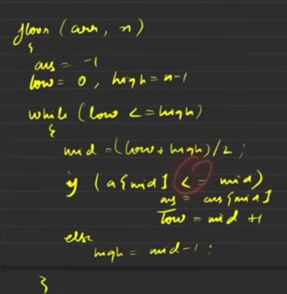

## Return index :

### Lower Bound: `arr[mid] ≥ x`

### Upper Bound: `arr[mid] > x`

## Return element:

### Floor: `arr[mid] ≤ x`

### Ceil : `same as lower bound`

### Lower Bound: 

Smallest index such that element at that index is greater than or equal to given target

### Upper Bound:

‘’’’’’’’’’’’’’’’’’’’’’’’’’’’’’’’’’’’’’’’’’’’’’’’’’’’’’’’’’’’’’’’’’’’’’’’’’’’’’’’’’’’’’’’’’’’’strictly greater than given target

### Floor:

**Largest element** *less than or equal* to target 

### Ceil:

**Smallest element** *greater than or equal* to target.

