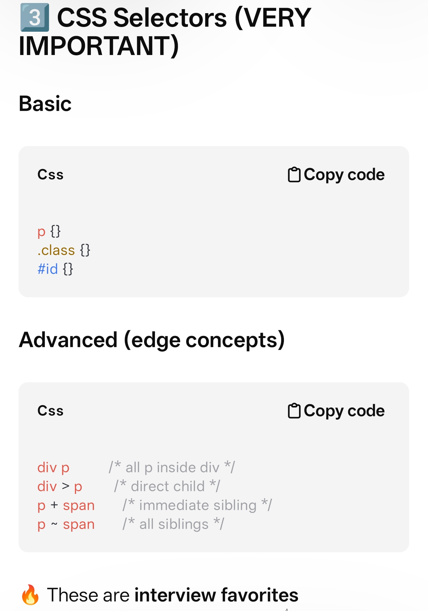
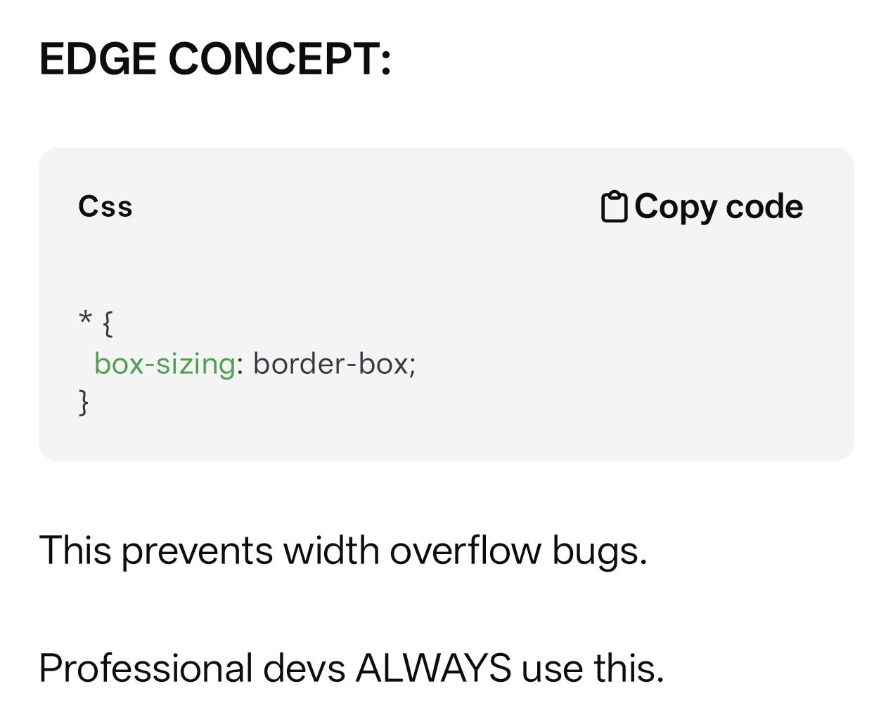
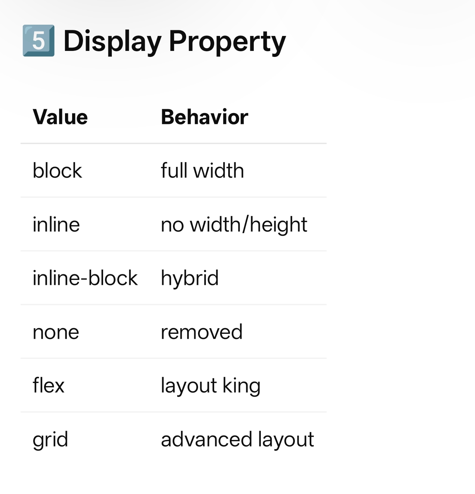
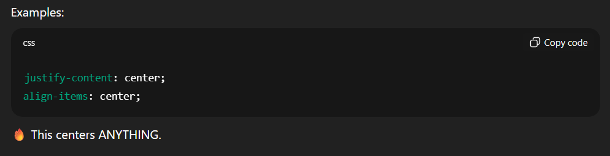

# Main Layout


| Line | Why it matters |
| --- | --- |
| <!DOCTYPE html> | Tells browser → use modern HTML5 |
| <html lang="en"> | Accessibility + SEO |
| <meta charset="UTF-8"> | Prevents text breaking |
| viewport | Makes mobile responsive |
| title | Browser tab + SEO |


# `<html lang="en">`


| Benefit | Impact |
| --- | --- |
| Accessibility | Correct pronunciation for screen readers. |
| SEO | Helps search engines index content by language. |
| User Experience | Triggers browser translation tools when needed. |
| Development | Allows for language-specific CSS selectors. |


# Block vs Inline Elements


| Feature | Block-Level | Inline |
| --- | --- | --- |
| New Line | Always starts on a new line | Stays on the same line |
| Width | Full width of parent | Only as wide as content |
| Height/Width | Can be set manually | Cannot be set manually |
| Margins/Padding | All sides work perfectly | Vertical margins/padding don't affect layout |
| Purpose | Structural layout | Styling specific text/content |


Sometimes you want the best of both worlds. By using the CSS property `display: inline-block;`, an element will:

1. Sit on the same line as other elements (like **inline**).
1. Allow you to set a specific width, height, and vertical margins (like **block**).
### Rules:

- ❌ Never skip order (`h1 → h3`)
- ❌ Only ONE `<h1>` per page
- Google uses headings to understand content hierarchy
### 🔥 EDGE CONCEPT:

✅ `strong` better than `b`

✅ `em` better than `i`

Why?

Screen readers understand them.


```c++
<a href="https://google.com" target="_blank" rel="noopener noreferrer">
Google
</a>
```

`rel `is used for security

# Images


`<imgsrc="image.jpg"alt="description">`

### VERY IMPORTANT:

`alt` is mandatory.

Why?

- Accessibility
- SEO
- Image loading fallback
❌ Missing alt = bad developer habit

# LISTS


| Feature | Unordered List (<ul>) | Ordered List (<ol>) |
| --- | --- | --- |
| Meaning | A collection of items where order doesn't matter. | A collection of items where order does matter. |
| Default Marker | Solid black dots (bullets). | Incremental numbers (1, 2, 3...). |
| Common Use Cases | Shopping lists, navigation menus, feature lists. | Recipes, "Top 10" lists, step-by-step instructions. |
| Primary Tag | <ul> | <ol> |
| Item Tag | <li> (List Item) | <li> (List Item) |


---

## Visual Differences and Attributes

### Unordered Lists

By default, these use bullets. You can change the appearance using the CSS `list-style-type` property (e.g., `circle`, `square`, or `none`).

### Ordered Lists

These are more flexible because they handle sequencing logic. You can use the `type` attribute to change the numbering style:

- `type="1"`: Default numbers.
- `type="A"`: Uppercase letters.
- `type="i"`: Lowercase Roman numerals.
Additionally, ordered lists support the `start` attribute (to begin numbering at a specific digit) and the `reversed` attribute (to count downwards).


---

## Nested Lists

Both types can be nested inside one another. For example, a "Step 1" (Ordered) might contain a sub-list of "Required Tools" (Unordered).

Would you like to see the CSS code required to replace these standard bullets with custom icons or emojis?

*Label improves accessibility and clickable area.*


```c++
<header>
  <nav></nav>
</header>

<main>
  <section>
    <article></article>
  </section>
</main>

<footer></footer>

```

Simple Webpage


```javascript
<!DOCTYPE html>
<html>
<head>
    <meta charset="UTF-8">
    <title>My Practice Page</title>
</head>
<body>

    <nav>
        <a href="#home">Home</a> | <a href="#contact">Contact</a>
    </nav>

    <main>
        <header>
            <h1>Welcome to My Webpage</h1>
            <p>This is a <strong>strong</strong> introduction with <em>emphasized</em> text.</p>
        </header>

        <hr>

        <section id="contact">
            <h2>Contact Us</h2>
            <form>
                <div>
                    <label for="username">Name:</label>
                    <input type="text" id="username" placeholder="Enter your name" required>
                </div>
                
                <div>
                    <label for="email">Email:</label>
                    <input type="email" id="email" placeholder="email@example.com">
                </div>

                <button type="submit">Submit Info</button>
            </form>
        </section>

        <aside>
            <h3>Quick Links</h3>
            <ul>
                <li><a href="https://google.com" target="_blank">Search Google</a></li>
                <li>Check out our images below</li>
            </ul>
        </aside>
    </main>

    <footer>
        <p>&copy; 2026 My HTML Tutorial</p>
    </footer>

</body>
</html>

```













## Positioning (EDGE CONCEPT)


| Position | Meaning |
| --- | --- |
| static | default |
| relative | base reference |
| absolute | relative to nearest positioned parent |
| fixed | viewport |
| sticky | hybrid |


### Interview concept:

### 6. Centering (classic dev question)


```css
display: flex;
justify-content: center;
align-items: center;
```

This is gold.


| Link Type | Attribute | Destination |
| --- | --- | --- |
| External | href="https://google.com" | A different website |
| Internal | href="about.html" | A different file in your folder |
| Anchor | href="#contact" | A specific spot on the current page |


When you wrap content in an `<aside>`, you are telling the browser, search engines, and screen readers: *"This information is related to what's nearby, but it isn't the main point."*
• 

Think of it like a Russian nesting doll: `nav` is the outer box, `a` is the item inside, and `hover` is a special effect that happens only when you touch it.


In CSS, when you see two values listed for a property like `margin` or `padding`, it is a shorthand way of setting the spacing for all four sides of an element at once.

The line `margin: 0 15px;` breaks down like this:

- `0`** (The first value):** Sets the **Top and Bottom** margins.
- `15px`** (The second value):** Sets the **Left and Right** margins.
# FLEXBOX


**Flexbox** (short for Flexible Box Module) is a layout system in CSS designed to help you arrange items in rows or columns easily. Before Flexbox, developers had to use difficult hacks (like `floats` or `display: inline-block`) to put boxes next to each other.

The "magic" of Flexbox is that it allows items to expand to fill extra space or shrink to fit into small spaces.2


---

### 1. The Two Key Players

To use Flexbox, you must have a **Parent** (Container) and **Children** (Items).3

- **Flex Container:** The parent element where you write `display: flex;`.
- **Flex Items:** The direct children inside that parent that automatically become "flexible."

---

### 2. The Main Properties

Once you turn on `display: flex;`, you use these properties on the **Parent** to control the children:

### **A. justify-content (Horizontal Alignment)**

This defines how items are distributed along the main row.

- `flex-start`: Items align to the left (default).
- `center`: Items move to the middle.
- `space-between`: Items spread out with equal space between them (the first and last hit the edges).
### **B. align-items (Vertical Alignment)**

This defines how items sit vertically within the container.

- `stretch`: Items stretch to fill the container height (default).
- `center`: Items are perfectly centered vertically.
### **C. flex-direction**

You can decide if the items should be a row (left-to-right) or a column (top-to-bottom).9

- `row` (default)
- `column`

---

### 3. The Most Useful Flexbox Trick

The hardest thing to do in old CSS was centering a box perfectly inside another box. With Flexbox, it only takes three lines on the **Parent**:

CSS

# 


`.container {
    display: flex;
    justify-content: center; /* Center horizontally */
    align-items: center;     /* Center vertically */
    height: 100vh;           /* Give it some height to see the effect */
}`


---

### 4. Why did we use `flex: 3` and `flex: 1` earlier?

This is a property you apply to the **Children**. It tells the items how much of the available space they should take up relative to each other.12

- If Child A has `flex: 3` and Child B has `flex: 1`, the container is divided into **4 parts**.
- Child A takes up **3 parts** (75%).
- Child B takes up **1 part** (25%).
This is how we created the "Main Content + Sidebar" look in your previous request!

**Would you like to try a small "Flexbox Challenge" where you try to align three boxes in a specific way?**


📎 Attachment: ../assets/2ee0eb7a-3bc3-802d-b8df-c5baeaa3a575


📎 Attachment: ../assets/2ee0eb7a-3bc3-803b-b810-de0d663f7cb9

The only HTML/CSS you’ll learn later will be:

- While building React components
- While fixing layouts
- While reading others’ code
That learning is *context-driven*, not tutorial-driven.

