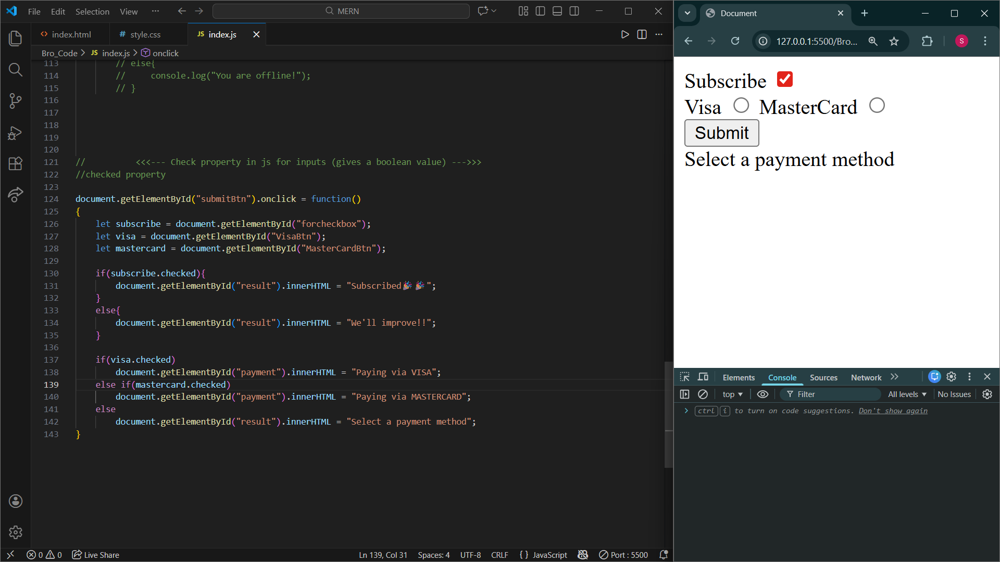

- We link CSS file in `<head>` tag while we link js file in `<body>` tag.
- JS executes **top to bottom**, but *can pause and resume* intelligently.


- Operator pręcędence
1. parenthesis
1. exponents
1. multiplication & division
1. addition & subtraction
When we accept user input from a window prompt , it is of a string data type

- An empty string represents the false boolean value in js
- This is be quite useful when dealing with user input to  determine false and empty inputs.
# Important Method of Taking inputs and performing operations on them and returning the modified HTML


```javascript
document.getElementById("SubmitButton").onclick = function()
{
    let a = document.getElementById("SideA").value;
    a = Number(a);

    
    let b = document.getElementById("SideB").value;
    b = Number(b);

    let c = Math.sqrt(Math.pow(a, 2) + Math.pow(b, 2));

    document.getElementById("LabelC").innerHTML = "Side C : " + c;
}
```

`document.getElementById("SubmitButton").onclick = function()`

This line is used to perform a function on clicking the button with the mentioned button id

`document.getElementById(``element_id_)`

Used a select an element from the html file




- `let` = variables are limited to block scope {}
- `var` = variables are limited to a function(){}
- `global variable` = is declared outside any function
(if global, var will CHANGE browser's window properties)

### To generate a random number between 1 to n

`const num = Math.floor(Math.random()*n + 1)`

## 

## Grouping radio buttons : 

To **group radio buttons in HTML**, all radio inputs in the same group must have **the same **`name`** attribute**.

That’s the only rule.

Browser logic: **only one radio button with the same name can be selected at a time.**

- `indexOf` returns -1 if element is not present in the array 
### *for up* statement


```c++
for(let price in prices){
    console.log(price)
   }
```

## DOM

**DOM (Document Object Model)** is a **programming interface** that represents an HTML page as a **tree of objects**, so that **JavaScript can read, change, add, or delete elements dynamically**.

In simple words:

- *array*.forEach() is not exactly clear
