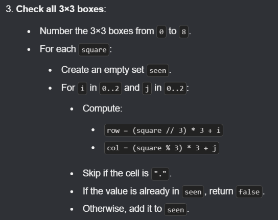

## 229. Majority Element II

If an element appears more than `1/3rd` of the time, you'll quickly realize that there can be **at most two** such elements.

***How is this different from Majority Element I ?
***For this problem, the threshold is > `[n/3]`
• Instead of maintaining **one** candidate and its count, you need to maintain **two distinct candidates** and their respective counts.
• In the standard algorithm, a conflict happens when a new element doesn't match your single candidate (they both cancel out).
• Here, a conflict that forces a markdown of counts *only* happens when the current element is **different from both** of your active candidates. Imagine it as three distinct parties fighting—when all three are different, they all lose one vote.

Because the voting algorithm only guarantees that the two remaining candidates are the *most likely* choices, they aren't guaranteed to meet the threshold.
• The array could be filled with completely unique elements, leaving you with two arbitrary candidates at the end whose actual frequencies are just 1.
• Once you finish the single-pass voting loop to find your two potential candidates, you **must run a second explicit pass** through the array to manually count their frequencies and verify if they strictly exceed `floor n/3`

 


```c++
class Solution {
public:
    vector<int> majorityElement(vector<int>& nums) {
        // Extended Boyer-Moore Voting Algorithm
        // FIXED: Initialized candidates to 0 to avoid Undefined Behavior
        int candidate1 = 0, candidate2 = 0;
        int count1 = 0, count2 = 0;

        // First pass: Identify the two most frequent potential candidates
        for (int num : nums) {
            if (num == candidate1) {
                count1++;
            } else if (num == candidate2) {
                count2++;
            } else if (count1 == 0) {
                candidate1 = num;
                count1 = 1;
            } else if (count2 == 0) {
                candidate2 = num;
                count2 = 1;
            } else {
                count1--;
                count2--;
            }
        }   

        // Second pass: Manually verify actual frequencies
        count1 = 0;
        count2 = 0;
        for (int num : nums) {
            if (num == candidate1) {
                count1++;
            } else if (num == candidate2) {
                count2++;
            }
        }

        vector<int> res;
        // FIXED: Removed floor() since integer division automatically truncates down
        int threshold = nums.size() / 3;

        if (count1 > threshold) {
            res.push_back(candidate1);
        }
        if (count2 > threshold) {
            res.push_back(candidate2);
        }

        return res;
    }
};
```


---

## 56. Merge Intervals

***Brute Force***


```c++
class Solution {
public:
    vector<vector<int>> merge(vector<vector<int>>& intervals) {

        // Sort intervals based on start time
        sort(intervals.begin(), intervals.end());

        // Result array to store merged intervals
        vector<vector<int>> ans;

        // Loop through each interval
        int n = intervals.size();
        for (int i = 0; i < n;) {

            // Start of current merged interval
            int start = intervals[i][0];
            int end = intervals[i][1];

            // Merge with all overlapping intervals
            int j = i + 1;
            while (j < n && intervals[j][0] <= end) {
                // Update end to the maximum of current end and overlapping
                // interval's end
                end = max(end, intervals[j][1]);
                j++;
            }

            // Add the merged interval to result
            ans.push_back({start, end});

            // Move to the next non-overlapping interval
            i = j;
        }

        return ans;
    }
};
```

***Optimal ***


```c++
class Solution {
public:
    vector<vector<int>> merge(vector<vector<int>>& intervals) {

        // Sort intervals based on starting time
        sort(intervals.begin(), intervals.end());

        // Vector to store final merged intervals
        vector<vector<int>> merged;

        // Traverse each interval
        for (auto interval : intervals) {
            // If merged is empty or current interval does not overlap
            if (merged.empty() || merged.back()[1] < interval[0]) {
                // Add current interval as a new non-overlapping block
                merged.push_back(interval);
            } else {
                // Overlapping: merge by extending the end time
                merged.back()[1] = max(merged.back()[1], interval[1]);
            }
        }

        return merged;
    }
};
```


---

## 493. Reverse Pairs

Uses ***Merge Sort  - ******O(N log N)***

**1. Why We Don't Double-Count (The Boundary Rule)**
In Reverse Pairs, a valid pair (i, j) requires i < j$
When Merge Sort breaks down the array recursively, it divides it at a specific middle index `mid`.
• The **Left Half** contains elements from indices `[low...mid]`.
• The **Right Half** contains elements from indices `[mid+1...high]`.
When we run our counting logic during a merge step, we **only** count pairs where:
1. The index i is strictly in the **Left Half**.
2. The index j$is strictly in the **Right Half**.
Once this merge step finishes, those two distinct halves are combined into a single, larger sorted block. In any *subsequent* or higher-level merge step, **both i and j will now reside together inside the exact same half** (either both on the left, or both on the right of a new, larger boundary).
Because our counting logic only looks *across* the boundary (one element on the left, one on the right), it is impossible to count that specific pair (i, j) ever again. A pair is counted **exactly once**—at the unique moment when the recursion tree splits them into separate left and right blocks.


```c++
class Solution {
private:
    void merge(vector <int> &nums, int low, int mid, int high)
    {
        vector <int> temp;
        int left = low; 
        int right = mid + 1;

        while(left <= mid && right <= high)
        {
            if(nums[left] < nums[right])
            {
                temp.push_back(nums[left]);
                left++;
            }
            else
            {
                temp.push_back(nums[right]);
                right++;
            }
        }

        while(left <= mid)
        {
            temp.push_back(nums[left]);
            left++;
        }

        while(right <= high)
        {
            temp.push_back(nums[right]);
            right++;
        }

        for(int i = low; i <= high; i++)
            nums[i] = temp[i - low];
    }
    int countPairs(vector <int> &nums, int low, int mid, int high)
    {
        int right = mid + 1;
        int cnt = 0;

        for(int i = low; i <= mid; i++)
        {
            while(right <= high && nums[i] > 2LL * nums[right])
                right++;
            cnt += (right - (mid + 1));
        }
        return cnt;
    }
    int mergeSort(vector <int> &nums, int low, int high)
    {
        int cnt = 0;

        if(low >= high)
            return cnt;

        int mid = low + (high - low)/2;

        cnt += mergeSort(nums, low, mid);
        cnt += mergeSort(nums, mid + 1, high);

        cnt += countPairs(nums, low, mid, high);

        merge(nums, low, mid, high);

        return cnt;
    }
public:
    int reversePairs(vector<int>& nums) {

    // nums[i] > 2 * nums[j]    -> (i, j) is a reverse pair

    return mergeSort(nums, 0, nums.size() - 1);
    }
};
```


---

## **2161. Partition Array According to Given Pivot**

### Brute Force


```c++
class Solution {
public:
    vector<int> pivotArray(vector<int>& nums, int pivot) {

    //Let;s start with the brue force method
    //Let's take two new arrays to rearrange the elements and then merge them
    //for elements equal to pivot we can count their frequency

    vector <int> less;
    vector <int> greater;
    int freq = 0;

    for(auto num : nums)
    {
        if(num < pivot)   
            less.push_back(num);
        else if(num > pivot)
            greater.push_back(num);
        else
            freq++;
    }   

    int index = 0;
    for(auto num : less)
    {
        nums[index++] = num;
    }

    for(int i = 0; i < freq; i++)
        nums[index++] = pivot;

    for(auto num : greater)
    {
        nums[index++] = num;
    }
    
    return nums;

    }   
};
```

Optimal


```c++
class Solution {
public:
    vector<int> pivotArray(vector<int>& nums, int pivot) {
        vector<int>ans ;
        for(auto x : nums)
        {
            if(x < pivot)
            ans.push_back(x);
        }
        for(auto x : nums)
        {
            if(x == pivot)
            ans.push_back(x);
        }
        for(auto x : nums)
        {
            if(x >pivot)
            ans.push_back(x);
        }
        return ans;
    }
};
```


---

## **171. Excel Sheet Column Number**


```c++
class Solution {
public:
    int titleToNumber(string columnTitle) {

        //This problem is essentially about converting a number 
        //representation from Base 26 into our standard 
        //decimal system (Base 10), using uppercase letters as the digits.

    int num = 0;
    for(int i = 0; i < columnTitle.size(); i++)
    {
        num = (num * 26) + (columnTitle[i] - 'A' + 1);
    }    

    return num;    
    }
};
```


---

## 258. Add digits

### Brute Force


```c++
class Solution {
public:
    int addDigits(int num) 
    {
        while (num > 9) 
        {
            int current_sum = 0;
            while (num > 0) 
            {
                current_sum += num % 10;
                num /= 10;
            }
            num = current_sum;
        }
        return num;
    }
};
```

### Optimal

**How it works:** This problem follows a mathematical property known as the **Digital Root**. The digital root of any non-zero number is simply its remainder when divided by 9 (with a remainder of 0 mapping to 9).


```c++
class Solution {
public:
    int addDigits(int num) {
        if (num == 0) return 0;
        return (num % 9 == 0) ? 9 : (num % 9);
        
        // Or even shorter using the formula:
        // return 1 + (num - 1) % 9;
    }
};
```


---

## **3689. Maximum Total Subarray Value I**

**Intuition Note:** Since the problem allows choosing the same subarray multiple times, the optimal strategy is to first find the maximum possible value of a single subarray and then take it `k` times. A subarray's value is `max(subarray) - min(subarray)`, which can never exceed `globalMax - globalMin` of the entire array. This maximum difference is always achievable by a subarray containing both the global minimum and global maximum, so the best single-subarray value is `globalMax - globalMin`. Therefore, the answer is simply `k × (globalMax - globalMin)`.


```c++
class Solution {
public:
    long long maxTotalValue(vector<int>& nums, int k) {
        long long mn = nums[0];
        long long mx = nums[0];

        for (int x : nums) {
            mn = min(mn, (long long)x);
            mx = max(mx, (long long)x);
        }

        return (mx - mn) * 1LL * k;
    }
};
```


---

## 84. Largest Rectangle in Histogram

### Brute Force


```c++
class Solution {
public:
    int largestRectangleArea(vector<int>& heights) {
        int n = heights.size();

        vector<int> pse(n), nse(n);
        stack<int> st;

        // PSE
        for (int i = 0; i < n; i++) {
            while (!st.empty() && heights[st.top()] >= heights[i])
                st.pop();

            pse[i] = st.empty() ? -1 : st.top();
            st.push(i);
        }

        while (!st.empty()) st.pop();

        // NSE
        for (int i = n - 1; i >= 0; i--) {
            while (!st.empty() && heights[st.top()] >= heights[i])
                st.pop();

            nse[i] = st.empty() ? n : st.top();
            st.push(i);
        }

        long long ans = 0;

        for (int i = 0; i < n; i++) {
            long long width = nse[i] - pse[i] - 1;
            ans = max(ans, width * heights[i]);
        }

        return ans;
    }
};
```

### Better Approach

Compute `pse` and `nse` on the go while traversing, calculate the area while popping an element from the stack.


---

## 168. Excel Sheet Column Title


```c++
class Solution {
public:
    string convertToTitle(int columnNumber) {
        string ans = "";
        long long num = columnNumber; 
        
        while (num > 0) {
            // Excel is 1-indexed (A=1, B=2), so we shift 
            // the system down by 1 to align with 0-indexed math
            num--; 
            
            ans += ('A' + (num % 26));
            num = num / 26;
        }
        
        reverse(ans.begin(), ans.end());
        
        return ans;
    }
};
```


---

## **228. Summary Ranges**


```c++
class Solution {
public:
    vector<string> summaryRanges(vector<int>& nums) {
        vector<string> ans;
        int n = nums.size();
        
        if (n == 0) return ans;

        for (int i = 0; i < n; i++) {
            int start = nums[i]; // Store the start of the current range
            
            // Keep moving forward as long as numbers are consecutive
            // Use long long or casting to prevent 1 + nums[i] integer overflow
            while (i + 1 < n && nums[i + 1] == (long long)nums[i] + 1) {
                i++;
            }
            
            // If i didn't move, it's a single number. Otherwise, it's a range.
            if (start == nums[i]) {
                ans.push_back(to_string(start));
            } else {
                ans.push_back(to_string(start) + "->" + to_string(nums[i]));
            }
        }
        
        return ans;
    }
};
```


---

## **3612. Process String with Special Operations I**


```c++
class Solution {
public:
    string processStr(string s) {
        
    string res = "";

    for(char ch : s)
    {
        if('a' <= ch && ch <= 'z')
        {
            res += ch;
        }

        else if(ch == '*' && !res.empty())
            res.pop_back();

        else if(ch == '#' && !res.empty())
            res += res;

        else
            reverse(res.begin(), res.end());
    }

    return res;
    }
};
```


---

## **152. Maximum Product Subarray**

### Brute Force


```c++
class Solution {
public:
    int maxProduct(vector<int>& nums) {

    int ans = INT_MIN;
    int n = nums.size();

    for(int i = 0; i < n; i++)
    {
        int curr_prod = 1;

        for(int j = i; j < n; j++)
        {   
            curr_prod *= nums[j];
            ans = max(ans, curr_prod);
        }
    }   

    return ans;
    }
};
```

### Optimal - I

- Traverse the array from left to right (prefix) to build cumulative product.
- Traverse the array from right to left (suffix) to catch subarrays ending at the back (helpful when max product is at the end or due to even negatives).
- Reset the product to 1 whenever a zero is found, as it breaks the subarray continuity.
- By comparing products in both directions at each step, we ensure we don’t miss any possible maximum.
### Comprehensive Mechanics: How Middle Subarrays are Isolated

To understand why the prefix-suffix approach works for *any* arbitrary middle subarray, we must look at the mathematical properties of array products.

If we have an array with no zeros, the total product of the entire array will either be positive or negative.

- **Case 1: The total product is positive.** This happens if there is an even number of negative numbers. In this scenario, the maximum product is simply the product of the entire array. Both `pre` (at the very last element) and `suff` (at the very first element) will capture this maximum value.
- **Case 2: The total product is negative.** This happens if there is an odd number of negative numbers. To get a positive maximum product, we must drop exactly one negative number. To maximize the remaining product, we should drop either the prefix ending at the *first* negative number, or the suffix starting at the *last* negative number.
By running `pre` from left-to-right and `suff` from right-to-left simultaneously, the algorithm ensures that one of the two pointers will always stop right before or right after these negative-sign boundaries. This naturally isolates the optimal positive middle chunk without explicitly tracking its indices.

### Comprehensive Case Analysis with Zeros

When an array contains a `0`, it acts as a hard boundary because any number multiplied by zero becomes zero. The presence of a `0` breaks the array into independent sub-problems.

Let's trace how the code handles your exact example, `[-1, 2, 3, 2, 0, -4, 8]`. The zero splits this array into two distinct valid zones:

1. **Zone A:** `[-1, 2, 3, 2]` (Contains 1 negative number—an odd count)
1. **Zone B:** `[-4, 8]` (Contains 1 negative number—an odd count)
Here is the exact step-by-step state of every variable during the loop execution:


| Index (i) | Left Element | Prefix (pre) | Right Element | Suffix (suff) | Global Max (ans) | Operational Note |
| --- | --- | --- | --- | --- | --- | --- |
| Start | — | 1 | — | 1 | INT_MIN | Initialization state. |
| 0 | -1 | -1 | 8 | 8 | 8 | ans updates to 8 via suff. |
| 1 | 2 | -2 | -4 | -32 | 8 | pre carries the negative sign from index 0. |
| 2 | 3 | -6 | 0 | 0 | 8 | suff hits 0 at index 4 (from right). |
| 3 | 2 | -12 | 2 | 2 | 8 | suff was 0, resets to 1 before multiplying by 2. |
| 4 | 0 | 0 | 3 | 6 | 8 | pre hits 0; suff continues accumulating Zone A from the right. |
| 5 | -4 | -4 | 2 | 12 | 12 | pre was 0, resets to 1. suff hits 12 ($2 \times 3 \times 2$) and updates ans. |
| 6 | 8 | -32 | -1 | -12 | 12 | Final iteration completes. |


### Complete Complexity and Constraints Review

- **Time Complexity:** $\mathcal{O}(n)$. The algorithm uses a single pass loop running exactly $n$ times. Inside the loop, all operations (multiplication, structural resets, and assignments) execute in $\mathcal{O}(1)$ time.
- **Space Complexity:** $\mathcal{O}(1)$. The algorithm operates completely in-place. It only initializes 3 scalar tracking variables (`pre`, `suff`, `ans`), demanding no scaling memory relative to input size.
- **Overflow Handling:** In professional production environments or strict competitive programming platforms, multiplying values sequentially can quickly overflow a standard 32-bit signed integer (`INT_MAX`). Utilizing `long long` for product accumulators ensures stability across larger input elements.

```c++
class Solution {
public:
    int maxProductSubArray(vector<int>& arr) {
        int n = arr.size();
        int pre = 1, suff = 1;
        int ans = INT_MIN;

        for (int i = 0; i < n; i++) {
            // 1. Handle Zero Boundaries
            if (pre == 0) pre = 1;
            if (suff == 0) suff = 1;

            // 2. Accumulate Products
            pre *= arr[i];           // Left-to-right
            suff *= arr[n - i - 1];   // Right-to-left

            // 3. Track Global Maximum
            ans = max(ans, max(pre, suff));
        }
        return ans;
    }
};
```

### Optimal - II

Imagine you are playing a game where your goal is to get the **highest possible score** by multiplying consecutive numbers from a list.

This code uses a clever strategy that tracks both your **best current score** and your **worst current score** at the same time. It sounds strange to track your worst score when you want to win, but in math, a negative number multiplied by another negative number turns into a giant positive number. Your worst nightmare can instantly become your biggest victory!

Here is how the strategy works in plain English.

### The Big Idea: The Rollercoaster of Multiplication

If you are multiplying numbers one by one, three things can happen depending on the next number you encounter:

1. **A Positive Number:** This keeps things predictable. It makes a big positive number even bigger, and a negative number even worse.
1. **A Zero:** This completely wipes everything out. Any score multiplied by $0$ resets back to $0$.
1. **A Negative Number:** This flips the entire game upside down. Your highest positive score suddenly becomes a terrible negative score. But crucially, **your worst negative score suddenly flips into a massive positive score.**
Because of that third rule, the code keeps track of three variables as it walks through the list:

- `res`: Your all-time highest score achieved so far (the trophy case).
- `maxProd`: The best positive score you can make ending at your current step.
- `minProd`: The absolute worst, lowest negative score you can make ending at your current step.
### Step-by-Step Game Plan

The code looks at the very first number, sets all three variables to it, and then steps through the rest of the numbers one by one. For every new number (`curr`), it follows these three steps:

### Step 1: The Panic Button (The Swap)

Before doing any math, the code checks: *"Is the current number negative?"* If it is, the code instantly **swaps** `maxProd` and `minProd`.

Why? Because it knows a negative number is about to flip the signs. Your previous best score is about to become your worst, and your previous worst score (hopefully a deep negative) is about to become your new best score. Swapping them ahead of time prepares them for the flip.

### Step 2: Calculate the New Scores

Now, the code updates your scores at the current position. It makes a choice for both the maximum and minimum:

- **To find the new **`maxProd`**:** It compares the `curr` number by itself against the `curr` number multiplied by your previous `maxProd`. It picks whichever is higher.
- **To find the new **`minProd`**:** It does the same but picks whichever is lower.
*(Note: Comparing against the *`curr`* number by itself is how the code handles zeros or bad streaks. If multiplying makes things worse than just starting over with the current number, it abandons the past and "restarts" the streak from this element.)*

### Step 3: Update the Trophy Case

Finally, it compares the newly calculated `maxProd` with your all-time high score (`res`). If it's higher, it updates the trophy case.

### Let's Play: A Quick Example

Imagine your list is: `[2, 3, -2, -4]`

1. **Start at **`2`**:** `maxProd = 2`, `minProd = 2`, All-Time High `res = 2`.
1. **Move to **`3`**:** It's positive, so no swap.
- New `maxProd` = max(3, 2 × 3) = **6**
- New `minProd` = min(3, 2 × 3) = **3**
- All-Time High `res` becomes **6**.
1. **Move to **`2`**:** It's **negative**! **SWAP** `maxProd` and `minProd` first. (So `maxProd` becomes 3, `minProd` becomes 6).
- New `maxProd` = max(-2, 3 × -2) = **2**
- New `minProd` = min(-2, 6 × -2) = **12** *(See how bad this got?)*
- All-Time High `res` stays **6**.
1. **Move to **`4`**:** It's **negative** again! **SWAP** `maxProd` and `minProd` first. (So `maxProd` becomes -12, `minProd` becomes -2).
- New `maxProd` = max(-4, -12 × -4) = max(-4, **48**) = **48** *(The double negative paid off!)*
- New `minProd` = min(-4, -2 × -4) = min(-4, 8) = **4**
- All-Time High `res` updates to **48**.
By tracking the absolute worst-case scenario (`-12`), the code was perfectly primed to strike gold when it hit the next negative number (`-4`), successfully finding that $2 \times 3 \times -2 \times -4 = 48$.


```c++

```


---

## **1344. Angle Between Hands of a Clock**


```c++
class Solution {
public:
    double angleClock(int hour, int minutes) {
        // 1. Minute hand moves 6 degrees per minute (360 / 60)
        double minuteAngle = minutes * 6.0;
        
        // 2. Hour hand moves 30 degrees per hour (360 / 12) 
        //    plus an extra 0.5 degrees per minute passed (30 / 60)
        double hourAngle = ((hour % 12) * 30.0) + (minutes * 0.5);
        
        // 3. Absolute difference between both positions
        double diff = abs(hourAngle - minuteAngle);
        
        // 4. Return the smaller of the two complementary angles
        return min(diff, 360.0 - diff);
    }
};
```


---

## 18. Four Sum

### Brute Force (gets TLE)

- Four nested loop
- Hashset to prevent duplicate values
- Sort the four numbers before inserting in the hash set to maintain uniformity in checking duplicates

```c++
class Solution {
public:
    vector<vector<int>> fourSum(vector<int>& nums, int target) {

    //Brute Force 
    //Using four nested loops
    
    int n = nums.size();
    set <vector <int>> hash;

    for(int i = 0; i < n; i++)
    {
        for(int j = i + 1; j < n; j++)
        {
            for(int k = j + 1; k < n; k++)
            {
                for(int l = k + 1; l < n; l++)
                {
                    long long sum =(long long) (nums[i] + nums[j] + nums[k] + nums[l]);
                    if(sum == target)
                    {
                        vector <int> arr = {nums[i], nums[j], nums[k], nums[l]};
                        sort(arr.begin(), arr.end());
                        hash.insert(arr);
                    }
                }
            }
        }
    }    

    return vector<vector<int>> (hash.begin(), hash.end());
    }
};
```

### Better Approach

- Use a set to store unique quadruplets.
- Fix the first two numbers using two nested loops.
- For each pair `(i, j)`, use a HashSet to track numbers seen while choosing the third number.
- For every third number, compute the required fourth number:
`fourth = target - (first + second + third)`

- If the fourth number already exists in the HashSet, a valid quadruplet is found.
- Sort the quadruplet and add it to the set to avoid duplicates.
- Add the current third number to the HashSet and continue.
- Convert the set to a list and return the result.
**Time Complexity:** `O(n³)`

**Space Complexity:** `O(n)` (excluding output)


```c++
class Solution {
public:
    vector<vector<int>> fourSum(vector<int>& arr, int target) {
        int n = arr.size();
        set<vector<int>> st;  

        for (int i = 0; i < n; i++) 
        {
            for (int j = i + 1; j < n; j++) 
            {
               
                // HashSet to store numbers between j and k
                unordered_set<long long> seen;

                // Third loop - pick third number
                for (int k = j + 1; k < n; k++) 
                {
                    // Find required fourth number
                    long long required = (long long)target - arr[i] - arr[j] - arr[k];

                    // If required number is already in set, we found a quadruplet
                    if (seen.count(required)) 
                    {
                        vector<int> temp = {arr[i], arr[j], arr[k], (int)required};
                        sort(temp.begin(), temp.end());
                        st.insert(temp);
                    }

                    // Add current third number into set
                    seen.insert(arr[k]);
                }
            }
        }

        return vector<vector<int>>(st.begin(), st.end());
    }
};
```

### Optimal Approach

- Sort the array first.
- Use the first loop to pick the first number. Skip it if it is the same as the previous one to avoid duplicates.
- Inside it, use the second loop to pick the second number. Also skip it if it repeats the previous one.
- Set two pointers: one just after the second number (left pointer) and one at the end of the array (right pointer).
- While the left pointer is before the right pointer, calculate the total of the four chosen numbers.
- If the total equals the target, save the quadruplet, then move both pointers while skipping duplicate numbers.
- If the total is less than the target, move the left pointer one step forward to increase the total.
- If the total is greater than the target, move the right pointer one step backward to reduce the total.
- After all loops finish, return the list of unique groups of four numbers.

```c++
class Solution {
public:
    vector<vector<int>> fourSum(vector<int>& arr, int target) {
        int n = arr.size();
        vector<vector<int>> ans;

        sort(arr.begin(), arr.end());

        for (int i = 0; i < n; i++) 
        {
            // Skip duplicates for first number
            if (i > 0 && arr[i] == arr[i - 1]) continue;

            for (int j = i + 1; j < n; j++) 
            {
                // Skip duplicates for second number
                if (j > i + 1 && arr[j] == arr[j - 1]) continue;

                // Step 4: Two pointers for remaining two numbers
                int left = j + 1, right = n - 1;
                while (left < right) 
                {
                    long long sum = (long long)arr[i] + arr[j] +
                                    arr[left] + arr[right];

                    if (sum == target) 
                    {
                        ans.push_back({arr[i], arr[j],
                                       arr[left], arr[right]});

                        // Move left pointer skipping duplicates
                        while (left < right && arr[left] == arr[left + 1])
                            left++;
                        // Move right pointer skipping duplicates
                        while (left < right && arr[right] == arr[right - 1])
                            right--;

                        left++;
                        right--;
                    }
                    else if (sum < target) left++;
                    else right--;
                }
            }
        }
        return ans;
    }
};
```


---

## **1833. Maximum Ice Cream Bars**

### Sub-Optimal


```c++
class Solution {
private:
    void count_sort(vector<int> &costs)
    {
        if (costs.empty()) return;

        int n = costs.size();
        int max_ele = *max_element(costs.begin(), costs.end());

        vector<int> count(max_ele + 1, 0);

        for(int i = 0; i < n; i++) {
            count[costs[i]]++;
        }

        // 4. Prefix Sum Frequencies
        for(int i = 1; i <= max_ele; i++) {
            count[i] += count[i - 1];
        }

        vector<int> output(n);
        
        // Iterate backwards through the original array to keep the sort stable
        for(int i = n - 1; i >= 0; i--) {
            output[count[costs[i]] - 1] = costs[i];
            count[costs[i]]--; 
        }

        costs = output;
    }
public:
    int maxIceCream(vector<int>& costs, int coins) {
        
        //Sort the array using count sort
        count_sort(costs);

        int res = 0;
        for(auto coin : costs) 
            if(coin <= coins)
            {
                res++;
                coins -= coin;
            }
            else
                break;

        return res;   
    }
}; 
```

### Optimal


```c++
class Solution {
public:
    int maxIceCream(vector<int>& costs, int coins) {
        int max_ele = *max_element(costs.begin(), costs.end());
        
        // Frequency array to count occurrences of each price
        vector<int> frequency(max_ele + 1, 0);
        for (int cost : costs) {
            frequency[cost]++;
        }
        
        int iceCreamCount = 0;
        
        // Iterate through all possible prices
        for (int price = 1; price <= max_ele; price++) {
            if (frequency[price] == 0) continue;
            
            // If we can't even afford one ice cream at this price, we are done
            if (coins < price) break;
            
            // Calculate how many we want to buy vs how many we can afford
            int countToBuy = min(frequency[price], coins / price);
            
            iceCreamCount += countToBuy;
            coins -= countToBuy * price;
        }
        
        return iceCreamCount;
    }
};
```


---

## **3963. Create Grid With Exactly One Path**


```c++
class Solution {
public:
    vector<string> createGrid(int m, int n) {
    //Since we have to return any path, we can just return a path from the left top to bottom left and then to right bottom, like we keep moving down, then keep moving right

    //m -> rows
    //n -> columns;

    vector <string> ans;

        string s1 = "." + string(n - 1, '#');
        string s2 = string(n, '.');
        
    for(int i = 0; i < m - 1; i++) {
        ans.push_back(s1);
    }

    ans.push_back(s2);

    return ans;
        
    }
};
```


---

## **3968. Maximum Manhattan Distance After All Moves**


```c++
class Solution {
public:
    int maxDistance(string moves) {
        int x = 0, y = 0;
        int wildcards = 0;

        for (char ch : moves) {
            if (ch == 'U') y += 1;
            else if (ch == 'D') y -= 1;
            else if (ch == 'L') x -= 1;
            else if (ch == 'R') x += 1;
            else if (ch == '_') wildcards += 1;
        }

        // The wildcards can always expand our distance along the dominant axis
        return abs(x) + abs(y) + wildcards;
    }
};
```


---

## **3443. Maximum Manhattan Distance After K Changes**

This question is different from the previous one as it introduces a major constraint that completely changes the strategy: **you can change at most **`k`** moves. **You have to change the existing characters which can change the final output.

If you read the problem description carefully, it asks for the maximum Manhattan distance that can be achieved **at any point during the journey**, not just after *all* moves have been performed.
Because of this, a greedy approach that only looks at the total counts at the very end of the string will fail. You have to evaluate the potential maximum distance at every single step i from 0 to n-1.


1. Count how many total `U`, `D`, `L`, and `R` moves you have made so far.
2. Determine which directions are your "dominant" directions (e.g., if you've gone Up 5 times and Down 2 times, Up is dominant; the 2 Down moves are "wasting" your distance).
3. The moves going in the opposite/wrong directions are your candidates to be changed. If you have enough $k$ available, you can flip those "bad" moves into "good" moves.
4. Each flip doesn't just add $1$ to your distance; **it adds $2$** (because you stop moving 1 unit backward and instead move 1 unit forward!).


```c++
class Solution {
public:
    int maxDistance(string s, int k) {
        int x = 0, y = 0;
        int res = 0;
        int steps_taken = 0;

        for (char ch : s) {
            steps_taken++;
            
            // 1. Track the actual current coordinates without any changes
            if (ch == 'N') y += 1;
            else if (ch == 'S') y -= 1;
            else if (ch == 'E') x += 1;
            else if (ch == 'W') x -= 1;

            // 2. Calculate current Manhattan distance without changes
            int current_dist = abs(x) + abs(y);

            // 3. Calculate how many moves worked "against" us so far
            // Every 'bad' move reduces our total potential distance by 2 units 
            // (e.g., taking 5 steps total but only reaching a distance of 3 means 1 move was 'bad')
            int bad_moves = (steps_taken - current_dist) / 2;

            // 4. Correct up to 'k' bad moves. Each correction adds 2 to the distance.
            int corrections = min(bad_moves, k);
            int corrected_dist = current_dist + 2 * corrections;

            // 5. Update our maximum seen distance
            res = max(res, corrected_dist);
        }    
        return res;
    }
};
```


---

## **3969. Valid Subarrays With Matching Sum Digits I**

### Brute Force


```c++
class Solution {
private:
    // Pure mathematical check: returns true if first and last digit of 'num' are both 'x'
    inline bool isValid(long long num, int x) {
              
        // 1. Check the last digit
        if (num % 10 != x) return false;
        
        // 2. Find the first digit
        while (num >= 10) {
            num /= 10;
        }
        
        return num == x;
    }

public:
    int countValidSubarrays(vector<int>& nums, int x) {
        int n = nums.size();
        int count = 0;
        
        for (int i = 0; i < n; i++) {
            long long sum = 0;
            for (int j = i; j < n; j++) {
                sum += nums[j];

                // Fast math check instead of string conversion
                if (isValid(sum, x)) {
                    count++;
                }
            }
        }

        return count;
    }
};
```


---

## **347. Top K Frequent Elements**

### Brute Force

Sort the frequencies → `O(N log N) , O(N)`


```c++
class Solution {
public:
    vector<int> topKFrequent(vector<int>& nums, int k) {
        unordered_map<int, int> count;
        for (int num : nums) {
            count[num]++;
        }

        vector<pair<int, int>> arr;
        for (const auto& p : count) {
            arr.push_back({p.second, p.first});
        }

        sort(arr.rbegin(), arr.rend());     //Sort in decreasing order 

        vector<int> res;
        for (int i = 0; i < k; ++i) {
            res.push_back(arr[i].second);
        }
        return res;
    }
};
```

### Better

**After counting how often each number appears, we want to efficiently keep track of only the **`k`** most frequent elements.**

**A **`min-heap`** is perfect for this because it always keeps the smallest element at the top.**

**By pushing **`(frequency, value)`** pairs into the heap and removing the smallest whenever the heap grows beyond size **`k`**, we ensure that the heap always contains the top **`k`** most frequent elements.**

**In the end, the heap holds exactly the **`k`** values with the highest frequencies.**

`O``(``n``log``k``), O(n + k)`


```c++
class Solution {
public:
    vector<int> topKFrequent(vector<int>& nums, int k) {
        
        unordered_map<int, int> count;
        for (int num : nums) {
            count[num]++;
        }

        priority_queue <pair<int, int>, vector <pair<int, int>>, greater <pair<int, int>>> heap;

        for(auto &p : count)
        {
            heap.push({p.second, p.first});

            if(heap.size() > k)
                heap.pop();
        }        

        vector <int> res;
        for(int i = 0; i < k; i++)
        {
            res.push_back(heap.top().second);
            heap.pop();
        }
        return res;
    }
};
```

### ***BUCKET SORT Approach → ***`O(N), O(N)`

Each number in the array appears a certain number of times, and the maximum possible frequency is the length of the array.

We can use this idea by creating a list where the index represents a frequency, and at each index we store all numbers that appear exactly that many times.

For example:

All numbers that appear `1` time go into group `freq[1]`.All numbers that appear `2` times go into group `freq[2]`.And so on.

- All numbers that appear `1` time go into group `freq[1]`.
- All numbers that appear `2` times go into group `freq[2]`.
- And so on.
After we build these groups, we look from the highest possible frequency down to the lowest and collect numbers from these groups until we have `k` of them.

This way, we directly jump to the most frequent numbers without sorting all the elements by frequency.


```c++
class Solution {
public:
    vector<int> topKFrequent(vector<int>& nums, int k) {
        unordered_map<int, int> count;
        vector<vector<int>> freq(nums.size() + 1);

        for (int n : nums) {
            count[n] = 1 + count[n];
        }
        for (const auto& entry : count) {
            freq[entry.second].push_back(entry.first);
        }

        vector<int> res;
        for (int i = freq.size() - 1; i > 0; --i) {
            for (int n : freq[i]) {
                res.push_back(n);
                if (res.size() == k) {
                    return res;
                }
            }
        }
        return res;
    }
};
```


---

## **36. Valid Sudoku**

### Brute Force

We can find the index of each square by the equation `(row / 3) * 3 + (col / 3)`. Then we use hash set for `O(1)` lookups while inserting the number into its row, column and square it belongs to. We use separate hash maps for rows, columns, and squares.





```c++
class Solution {
public:
    bool isValidSudoku(vector<vector<char>>& board) {
        //Check for rows
        for (int row = 0; row < 9; row++) {
            unordered_set<char> seen;
            for (int i = 0; i < 9; i++) {
                if (board[row][i] == '.') continue;
                if (seen.count(board[row][i])) return false;
                seen.insert(board[row][i]);
            }
        }

        //Check for columns
        for (int col = 0; col < 9; col++) {
            unordered_set<char> seen;
            for (int i = 0; i < 9; i++) {
                if (board[i][col] == '.') continue;
                if (seen.count(board[i][col])) return false;
                seen.insert(board[i][col]);
            }
        }

        //Check for squares
        for (int square = 0; square < 9; square++) {
            unordered_set<char> seen;
            for (int i = 0; i < 3; i++) {
                for (int j = 0; j < 3; j++) {
                    int row = (square / 3) * 3 + i;
                    int col = (square % 3) * 3 + j;
                    if (board[row][col] == '.') continue;
                    if (seen.count(board[row][col])) return false;
                    seen.insert(board[row][col]);
                }
            }
        }

        return true;
    }
};
```

### Better

**O(n2)**

**O(n2)**

Since Sudoku is 9×9, each 3×3 square covers 3 rows and 3 columns.

- rows `0,1,2` belong to square-row `0`
- rows `3,4,5` belong to square-row `1`
- rows `6,7,8` belong to square-row `2`
This is exactly what integer division by 3 does:


```plain text
r/3
```

- cols `0,1,2` belong to square-col `0`
- cols `3,4,5` belong to square-col `1`
- cols `6,7,8` belong to square-col `2`
This is:


```plain text
c/3
```


---

(square row,square col)(\text{square row}, \text{square col})

(square row,square col)

That uniquely tells us which 3×3 box we are in.


```c++
class Solution {
public:
    bool isValidSudoku(vector<vector<char>>& board) {
        unordered_map<int, unordered_set<char>> rows, cols;
        map<pair<int, int>, unordered_set<char>> squares;

        for (int r = 0; r < 9; r++) {
            for (int c = 0; c < 9; c++) {
                if (board[r][c] == '.') continue;

                pair<int, int> squareKey = {r / 3, c / 3};

                if (rows[r].count(board[r][c]) || cols[c].count(board[r][c]) || squares[squareKey].count(board[r][c])) {
                    return false;
                }

                rows[r].insert(board[r][c]);
                cols[c].insert(board[r][c]);
                squares[squareKey].insert(board[r][c]);
            }
        }
        return true;
    }
};
```

### Optimal Solution

Using Bitmasking


```c++
class Solution {
public:
    bool isValidSudoku(vector<vector<char>>& board) {
        int rows[9] = {0};
        int cols[9] = {0};
        int squares[9] = {0};

        for (int r = 0; r < 9; ++r) {
            for (int c = 0; c < 9; ++c) {
                if (board[r][c] == '.') continue;

                int val = board[r][c] - '1';

                if ((rows[r] & (1 << val)) || (cols[c] & (1 << val)) ||
                    (squares[(r / 3) * 3 + (c / 3)] & (1 << val))) {
                    return false;
                }

                rows[r] |= (1 << val);
                cols[c] |= (1 << val);
                squares[(r / 3) * 3 + (c / 3)] |= (1 << val);
            }
        }
        return true;
    }
};
```


---

## **167. Two Sum II - Input Array Is Sorted**


```c++
class Solution {
public:
    vector<int> twoSum(vector<int>& numbers, int target) {

    //Lets use the two pointer approach
    int l = 0, r = numbers.size() -1;

    while(l < r)
    {
        int sum = numbers[l] + numbers[r];

        if(sum == target)
            break;
        else if(sum < target)
            l++;
        else
            r--;
    }    

    return {l + 1, r + 1};
    }
};
```


---

## **3737. Count Subarrays With Majority Element I**

### Brute Force


```c++
class Solution {
public:
    int countMajoritySubarrays(vector<int>& nums, int target) {

    //Let's try brute force approach

    int n = nums.size();
    int res = 0;

    for(int i = 0; i < n; i++)
        if(nums[i] == target)
            nums[i] = 1;
        else
            nums[i] = -1;
    
    for(int i = 1; i < n; i++)
        nums[i] +=
    for(int i = 0; i < n; i++)
    {
        int count = 0;

        for(int j = i; j < n; j++)
        {
            if(nums[j] == target)
                count++;
            
            if(2 * count > j - i + 1)
                res++;
        }        
    }   
    return res;
    }
};
```


---

## **1846. Maximum Element After Decreasing and Rearranging**

Sorting approach to group closely clustered elements together


```c++
class Solution {
public:
    int maximumElementAfterDecrementingAndRearranging(vector<int>& arr) {

    //Lets sort the array, so that if 1 is present, it comes to the front, otherwise we start the operations, the best rearranging option is to sort as it brings closely clustered elements together

    sort(arr.begin(), arr.end());

    int n = arr.size();

    //Change first element to one
    arr[0] = 1;

    for(int i = 1; i < n; i++)
    {
        if(arr[i] > arr[i - 1] + 1)
            arr[i] = arr[i - 1] + 1;    
            //We want to decrement it, but keep it closer to the nect element hence we only decrease it to 1
    }
    
    return arr[n - 1];
    }
};
```


---

## **3974. Maximum Total Sum of K Selected Elements**


```c++
class Solution {
public:
    long long maxSum(vector<int>& nums, int k, int mul) {

    //Since we need to maximize sum, obviously we should choose the highest k elements by sorting the array first
    //Then we start from the highest element and check
    //now we always choose the multiply option until mul becomes zero, then we add the remaining highest k elements

    sort(nums.begin(), nums.end());
    int n = nums.size();

    long long sum = 0;
    int i = n - 1;

    while(k--)
    {
        if(mul > 0)
            sum += nums[i] * 1LL * mul;

        else
            sum += nums[i];

        i--;
        mul--;
    }

    return sum;
    }
};
```


---

## **3979. Maximum Valid Pair Sum**


```c++
class Solution {
public:
    int maxValidPairSum(vector<int>& nums, int k) {

    int n = nums.size();
    int max_ele = nums[0];
    int maxi = INT_MIN;

         
    for(int j = k; j < n; j++) {

        //kitna macimum mila hai abhi tak left mein uska track rkhne ke liye
        max_ele = max(max_ele, nums[j - k]);
        
        maxi = max(maxi, max_ele + nums[j]);
        
        }
    return maxi;
    }
};
```


---

## **350. Intersection of Two Arrays II**

### Brute Force


```c++
class Solution {
public:
    vector<int> intersect(vector<int>& nums1, vector<int>& nums2) {
        
        if (nums1.size() > nums2.size()) {
            return intersect(nums2, nums1);
        }
        
        unordered_map<int, int> counts;
        for (int num : nums1) {
            counts[num]++;
        }
        
        vector<int> result;
        for (int num : nums2) {
            if (counts[num] > 0) {
                result.push_back(num);
                counts[num]--;
            }
        }
        
        return result;
    }
};
```

### Optimal


```c++
class Solution {
public:
    vector<int> intersect(vector<int>& nums1, vector<int>& nums2) {
        int i=0, j=0;
        sort(nums1.begin(), nums1.end());
        sort(nums2.begin(), nums2.end());
        int m=nums1.size(), n=nums2.size();
        vector<int>ans;
        while(i<m && j<n){
            if(nums1[i]==nums2[j]){
                ans.push_back(nums1[i]);
                i++;
                j++;
            }else if(nums1[i]<nums2[j]) i++;
            else j++;
        }
        return ans;
    }
};
```


---

## **523. Continuous Subarray Sum**

prefix[i] = \sum_{t=0}^{i} nums[t]

subarraySum = prefix[i] - prefix[j]

(prefix[i] - prefix[j]) \bmod k = 0

(a - b) \bmod k = 0 \iff a \bmod k = b \bmod k

(prefix[i] - prefix[j]) \bmod k = 0 \iff prefix[i] \bmod k = prefix[j] \bmod k

remainder = prefix[i] \bmod k

prefix[j] \bmod k = prefix[i] \bmod k

HashMap:\ remainder \rightarrow \text{first index where it occurred}

currentIndex - firstOccurrence \ge 2

**Interpretation:**


```c++
class Solution {
public:
    bool checkSubarraySum(vector<int>& nums, int k) {

        unordered_map<int, int> rem;

        rem[0] = -1;

        int prefix = 0;

        for (int i = 0; i < nums.size(); i++) {
            prefix += nums[i];

            int remain = prefix % k;

            if (rem.find(remain) != rem.end()) {
                if (i - rem[remain] >= 2)
                    return true;
            } else {
                rem[remain] = i;
            }
        }
        return false;
    }
};
```


---

## **974. Subarray Sums Divisible by K**


```c++
class Solution {
public:
    int subarraysDivByK(vector<int>& nums, int k) {
        unordered_map<int, int> freq;

        // Empty prefix has remainder 0
        freq[0] = 1;

        int prefix = 0;
        int count = 0;

        for (int num : nums) {
            prefix += num;

            // Normalize remainder for negative prefix sums
            int rem = ((prefix % k) + k) % k;

            count += freq[rem];
            freq[rem]++;
        }

        return count;
    }
};
```


---

## **525. Contiguous Array**

### Why does this work?

Treat:

- `0` as **1**
- `1` as **+1**
Then, if the prefix sum repeats, the subarray between those two indices has a net sum of **0**, meaning it contains an equal number of `0`s and `1`s.

Just like in **523**, we store the **first occurrence** of each prefix sum because we want the **maximum length**.


```c++
class Solution {
public:
    int findMaxLength(vector<int>& nums) {
        unordered_map<int, int> firstIndex;

        firstIndex[0] = -1;

        int prefix = 0;
        int maxLen = 0;

        for (int i = 0; i < nums.size(); i++) {
            if (nums[i] == 0)
                prefix--;
            else
                prefix++;

            if (firstIndex.find(prefix) != firstIndex.end()) {
                maxLen = max(maxLen, i - firstIndex[prefix]);
            } else {
                firstIndex[prefix] = i;
            }
        }

        return maxLen;
    }
};
```


| Problem | HashMap stores | Why? |
| --- | --- | --- |
| 560. Subarray Sum Equals K | prefixSum → frequency | Count subarrays |
| 523. Continuous Subarray Sum | remainder → first index | Check existence |
| 974. Subarrays Divisible by K | remainder → frequency | Count subarrays |
| 525. Contiguous Array | prefixSum → first index | Maximum length |


---

## **3994. Minimum Adjacent Swaps to Partition Array**

- Iterate from right to left, Shift all > b’s to the right side, and alongside also calculate how many times < a come in between
- Then iterate from left to right, and count swaps for pushing all a’s to the left
- Answer is totalSwaps\ - overlapping\ a's 

```c++
class Solution {
    const int MOD = 1e9 + 7;
public:
    int minAdjacentSwaps(vector<int>& nums, int a, int b) {
    // lets store the indices of a and b, start swapping b's while counting a's which come in between as they will get closer to the start

    int n = nums.size();

    int b_index = n - 1;

    long long swaps = 0;
    int a_count = 0;
    long long redo = 0;
        
    for(int i = n - 1; i >= 0; i--) {
        if(nums[i] < a)
            a_count++;
        if(nums[i] > b)
        {
            redo = (redo + a_count) % MOD;
            
            if(b_index - i != 0)
                swaps = (swaps + b_index - i) % MOD;;
                b_index--;

        }
        
    }

    int curr_a = 0;
    for(int j = 0; j < n; j++) {
        if(nums[j] < a)
        {
            if(j - curr_a != 0)
                swaps = (swaps + j - curr_a) % MOD;
                curr_a++;

        }
    }
    return (swaps - redo + MOD) % MOD;
        
    }
};
```


---

## **4006. Count Valid Prefixes**


```c++
class Solution {
public:
    int countValidPrefixes(string s) {

        int n = s.length();
        vector <int> zero(n + 1, 0);
        vector <int> one(n + 1, 0);

        for(int i = 1; i <= n; i++) {
            char ch = s[i - 1];
            if(ch == '0') {
                zero[i] = zero[i - 1] + 1;
                one[i] = one[i - 1];
            }
            else {
                one[i] = one[i - 1] + 1;
                zero[i] = zero[i - 1];
            }
        }

        int cnt = 0;
        for(int i = 2; i <= n; i++) {
            if(abs(zero[i] - one[i]) <= 1)
                cnt++;
        }
            
         return cnt + 1;   
    }
};
```


---

## **4011. Count Subarrays With Even Odd Ratio I**


```c++
class Solution {
public:
    int countRatioSubarrays(vector<int>& nums, int a, int b) {

    // Make odd even prefix sums
    int n = nums.size();
    vector <int> even(n + 1, 0);
    vector <int> odd(n + 1, 0);

    for(int i = 1; i <=n; i++) {
        int ele = nums[i - 1];

        if(ele % 2 == 0) {
            even[i] = even[i - 1] + 1;
            odd[i] = odd[i - 1];
        }
        else {
            even[i] = even[i - 1];
            odd[i] = odd[i - 1] + 1;
        }
    }

    int cnt = 0;

    for(int i = 1; i <= n; i++) {
        for(int j = i; j <= n; j++) {
            double x = even[j] - even[i - 1];
            double y = odd[j] - odd[i - 1];
            
            double r = INT_MAX;
            if(y > 0)
                r = x / y;

            if(r <= (double)a/(double)b)
                cnt++;
        }
    }
    return cnt;
    }
};
```


---

🔗 **References**
- Reverse Pairs → https://leetcode.com/problems/reverse-pairs/

