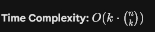

## 77. Combinations





```javascript
class Solution {
private:
    void backtrack(vector <vector<int>> &ans, vector <int> &curr,
                                      int start, int n, int k) 
    {
        if(curr.size() == k)
        {
            ans.push_back(curr);
            return;
        }

        for(int i = start; i <= n; i++)
        {
            
            curr.push_back(i);

            backtrack(ans, curr, i + 1,  n, k);

            //Undo the current choice and explore current paths
            curr.pop_back();
        }

    }
public:
    vector<vector<int>> combine(int n, int k) {

    vector <vector<int>> ans;
    vector <int> curr;
    int start = 1;
    backtrack(ans, curr, start, n, k);

    return ans;
    }
};
```

***Pruning Optimization***


```javascript
class Solution {
private:
    void backtrack(vector<vector<int>>& ans, vector<int>& curr, int start, int n, int k) {
        // Base case: Combination is complete
        if (curr.size() == k) {
            ans.push_back(curr);
            return;
        }

        // Optimization: Pruning
        // Only loop while there are enough numbers left to reach size k
        // The condition "i <= n - (k - curr.size()) + 1" ensures we don't 
        // start a path that can't possibly finish.
        for (int i = start; i <= n - (k - curr.size()) + 1; i++) {
            curr.push_back(i);
            
            // Move to the next number
            backtrack(ans, curr, i + 1, n, k);
            
            // Backtrack: Remove the last element to try the next 'i'
            curr.pop_back();
        }
    }

public:
    vector<vector<int>> combine(int n, int k) {
        vector<vector<int>> ans;
        vector<int> curr;
        
        // Pre-allocate memory if k is large to avoid multiple reallocations
        // (Optional, but good for performance)
        curr.reserve(k); 
        
        backtrack(ans, curr, 1, n, k);
        return ans;
    }
};
```


---

## **78. Subsets**


```javascript
class Solution {
private:
void backtrack(vector<int>& nums, int start, vector<int>& curr, vector<vector<int>>& res) {
    
    res.push_back(curr); // Add the subset formed so far
    
    for (int i = start; i < nums.size(); i++) {
        curr.push_back(nums[i]);           // "Choose" the number
        backtrack(nums, i + 1, curr, res); // "Explore" (move to next index)
        curr.pop_back();                   // "Un-choose" (Backtrack)
    }
}
public:
    vector<vector<int>> subsets(vector<int>& nums) {

    //Let's use backtracking to check for next possible number
    //We can use bit manipulation for calculating power of two, for cardinality of the set
    vector <vector<int>> res;
    vector <int> curr;

    backtrack(nums, 0, curr, res);   

    return res;
    }    
};
```


---

## **401. Binary Watch**

The key observation is that a binary watch has only **12 × 60 = 720 possible times**.

- Hours are represented by **4 LEDs** (`0–11`).
- Minutes are represented by **6 LEDs** (`0–59`).
Instead of generating all LED combinations using backtracking, we can simply check every valid time and count the number of set bits (1s). If the total number of set bits equals `turnedOn`, that time is part of the answer.

This is both simple and optimal because the search space is fixed.

### Algorithm

1. Iterate through every hour from `0` to `11`.
1. Iterate through every minute from `0` to `59`.
1. Count the number of set bits in the hour and minute.
1. If the total equals `turnedOn`, format the time and add it to the answer.

```c++
class Solution {
public:
    vector<string> readBinaryWatch(int turnedOn) {
        vector<string> ans;

        for (int h = 0; h < 12; h++) {
            for (int m = 0; m < 60; m++) {
                if (__builtin_popcount(h) + __builtin_popcount(m) == turnedOn) {
                    ans.push_back(to_string(h) + ":" +
                                  (m < 10 ? "0" : "") + to_string(m));
                }
            }
        }

        return ans;
    }
};
```


---

## 47. Permutations II


```c++
class Solution {
private:
    void backtrack(vector<int>& nums, vector<bool>& used, vector<int>& current, vector<vector<int>>& result) {
        // Base case: if the current permutation is complete
        if (current.size() == nums.size()) {
            result.push_back(current);
            return;
        }

        for (int i = 0; i < nums.size(); ++i) {
            // If the element is already used in this path, skip it
            if (used[i]) continue;

            // CRITICAL SKIP CONDITION:
            // If this element is a duplicate of the previous one, and the 
            // previous one was NOT used in this step, skip it to avoid duplicates.
            if (i > 0 && nums[i] == nums[i - 1] && !used[i - 1]) continue;

            // Make choice
            used[i] = true;
            current.push_back(nums[i]);

            // Explore
            backtrack(nums, used, current, result);

            // Undo choice (backtrack)
            current.pop_back();
            used[i] = false;
        }
    }

public:
    vector<vector<int>> permuteUnique(vector<int>& nums) {
        vector<vector<int>> result;
        vector<int> current;
        vector<bool> used(nums.size(), false);

        // Step 1: Sort the array to group duplicates together
        sort(nums.begin(), nums.end());

        // Step 2: Start backtracking
        backtrack(nums, used, current, result);

        return result;
    }
};
```


---

## 113. Path Sum II


```c++
class Solution {
private:
    void dfs(TreeNode* root, int targetSum, vector<int>& currentPath, vector<vector<int>>& result) {
        if (!root) return;

        currentPath.push_back(root->val);

        if (!root->left && !root->right && targetSum == root->val) {
            result.push_back(currentPath);
        }
        else {
            dfs(root->left, targetSum - root->val, currentPath, result);
            dfs(root->right, targetSum - root->val, currentPath, result);
        }

        currentPath.pop_back();
        return;
    }

public:
    vector<vector<int>> pathSum(TreeNode* root, int targetSum) {
        vector<vector<int>> result;
        vector<int> currentPath;
        dfs(root, targetSum, currentPath, result);
        return result;
    }
};
```


---

🔗 **References**
- 77. Combinations → https://leetcode.com/problems/combinations/submissions/1957828681/

