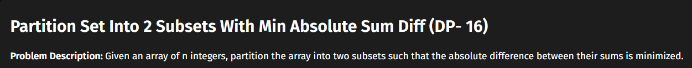
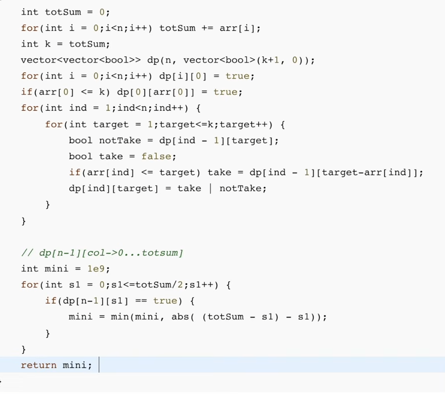
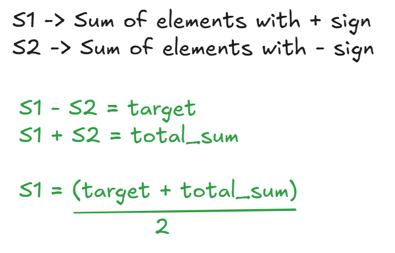
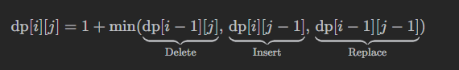
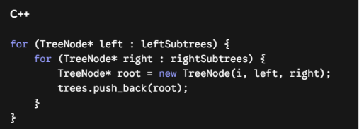
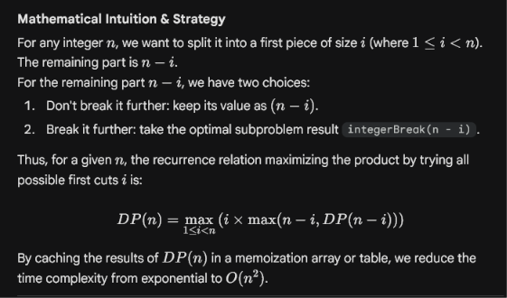

## 70. Climbing Stairs

***Memoization***


```c++
class Solution {
private:
    int climb(int n, vector <int> &dp)
    {
        // Base cases:
        // 1 stair  -> 1 way (1)
        // 2 stairs -> 2 ways (1+1, 2)
        if (n <= 2) {
            return n;
        }

        if(dp[n] != -1)
            return dp[n];

        // Pure recursive relation:
        // The ways to get to step 'n' is exactly the ways to get to 'n-1' plus 'n-2'
        return dp[n] = climb(n - 1, dp) + climb(n - 2, dp);
    }
public:
    int climbStairs(int n) {

        vector <int> dp(n + 1, -1);
        return climb(n, dp);
    }
};
```

***Tabulation***


```c++
class Solution {
public:
    int climbStairs(int n) {
        
        if(n <= 2)
            return n;
            
        vector <int> dp(n + 1, -1);

        dp[1] = 1;
        dp[2] = 2;

        for(int i = 3; i <= n; i++)
            dp[i] = dp[i - 1] + dp[i - 2];

        return dp[n]; 
    }
};
```

***Space Optimized Tabulation***


```c++
class Solution {
public:
    int climbStairs(int n) {
        
        if(n <= 2)
            return n;

        int prev = 1;
        int prev1 = 2;

        for(int i = 3; i <= n; i++)
        {
            int curr = prev + prev1;
            prev = prev1;
            prev1 = curr;
        }

        return prev1;
    }
};
```


---

## 198. House Robber

### Memoization


```c++
class Solution {
    int houseRob(int n, vector <int> &nums, vector <int> &dp)
    {
        if(n < 0)
            return 0;

        if(n == 0)
            return nums[0];

        if(dp[n] != -1)
            return dp[n];

        //Pick this
        int pick = nums[n] + houseRob(n - 2, nums, dp);

        int notPick = houseRob(n - 1, nums, dp);

        return dp[n] = max(pick, notPick);
    }
public:
    int rob(vector<int>& nums) {
        
        int n = nums.size() - 1;

        vector <int> dp(n + 1, -1);

        return houseRob(n, nums, dp);
    }
};
```

### Tabulation


```c++
class Solution {
public:
    int rob(vector<int>& nums) {
        int n = nums.size();
        
        // Base case to prevent out-of-bounds on size 1
        if (n == 0) return 0;
        if (n == 1) return nums[0];

        // dp array of size n
        vector<int> dp(n, -1);

        // Start our base case
        dp[0] = nums[0];

        // Loop up to the true size of the array
        for(int i = 1; i < n; i++)
        {
            // If we pick this house, we get its value. 
            int pick = nums[i]; 
            
            // If there is a valid house 2 steps back, add its loot
            if(i >= 2) {
                pick += dp[i - 2];
            }
            
            // If we don't pick, take the max loot up to the previous house
            int notPick = dp[i - 1];

            dp[i] = max(pick, notPick);
        }

        // Return the max loot calculated up to the very last house
        return dp[n - 1];
    }
};
```

### Space Optimization


```c++
class Solution {
public:
    int rob(vector<int>& nums) {
        int n = nums.size();
        
        // Base case to prevent out-of-bounds on size 1
        if (n == 0) return 0;
        if (n == 1) return nums[0];

        // Start our base case
        int prev1 = nums[0];
        int prev2 = 0;

        // Loop up to the true size of the array
        for(int i = 1; i < n; i++)
        {
            // If we pick this house, we get its value. 
            int pick = nums[i]; 
            
            // If there is a valid house 2 steps back, add its loot
            if(i >= 2) {
                pick += prev2;
            }
            
            // If we don't pick, take the max loot up to the previous house
            int notPick = prev1;

            int curr = max(pick, notPick);
            prev2 = prev1;
            prev1 = curr;
        }

        // Return the max loot calculated up to the very last house
        return prev1;
    }
};
```


---

## 213. House Robber II

### **Memoization **


```c++
class Solution {
    int houseRob(int idx, vector<int>& nums, vector<int>& dp) {
        if (idx < 0)
            return 0;

        if (idx == 0)
            return nums[0];

        if (dp[idx] != -1)
            return dp[idx];

        // Pick this house and skip the adjacent one
        int pick = nums[idx] + houseRob(idx - 2, nums, dp);

        // Skip this house
        int notPick = houseRob(idx - 1, nums, dp);

        return dp[idx] = max(pick, notPick);
    }

public:
    int rob(vector<int>& nums) {
        int n = nums.size();

        // Base case: If there is only one house, you can only rob that one.
        if (n == 1) 
            return nums[0];

        vector<int> arr1, arr2;
        for (int i = 0; i < n; i++) {
            if (i != 0) 
                arr1.push_back(nums[i]);     // Exclude the first house
            if (i != n - 1) 
                arr2.push_back(nums[i]);     // Exclude the last house
        }

        // Create TWO separate DP arrays
        vector<int> dp1(arr1.size(), -1);
        vector<int> dp2(arr2.size(), -1);

        // Pass the last valid index of each array (size - 1)
        return max(houseRob(arr1.size() - 1, arr1, dp1), 
                   houseRob(arr2.size() - 1, arr2, dp2));
    }
};
```

### Tabulation


```c++
class Solution {
    int robLinear(vector<int>& nums, int start, int end) {
        if (start == end) return nums[start];
        
        int n = nums.size();
        vector<int> dp(n, 0);
        
        // Base cases for the current sequence
        dp[start] = nums[start];
        dp[start + 1] = max(nums[start], nums[start + 1]);
        
        // Build the table iteratively
        for (int i = start + 2; i <= end; i++) {
            // Pick current house + house two steps back, OR skip current house
            dp[i] = max(dp[i - 1], nums[i] + dp[i - 2]);
        }
        
        return dp[end];
    }

public:
    int rob(vector<int>& nums) {
        int n = nums.size();
        
        // Base cases
        if (n == 1) return nums[0];
        if (n == 2) return max(nums[0], nums[1]);
        
        // Compare robbing from House 1 to N-1 vs. House 2 to N
        return max(robLinear(nums, 0, n - 2), 
                   robLinear(nums, 1, n - 1));
    }
};
```

### Space Optimization


```c++
class Solution {
    int robLinear(vector<int>& nums, int start, int end) {
        int prev1 = 0; // Represents dp[i-1]
        int prev2 = 0; // Represents dp[i-2]
        
        for (int i = start; i <= end; i++) {
            // Calculate current max
            int current = max(prev1, nums[i] + prev2);
            
            // Shift values forward for the next iteration
            prev2 = prev1;
            prev1 = current;
        }
        
        // prev1 holds the final max at the end of the loop
        return prev1; 
    }

public:
    int rob(vector<int>& nums) {
        int n = nums.size();
        
        if (n == 1) return nums[0];
        
        return max(robLinear(nums, 0, n - 2), 
                   robLinear(nums, 1, n - 1));
    }
};
```


---

## 62. Unique Paths

### Memoization


```c++
class Solution {
    int paths(int row, int col, int m, int n, vector <vector<int>> &dp)
    {
        if(row == m && col == n)    
            return 1;

        if(row > m || col > n)
            return 0;
        
        if(dp[row][col] != -1)
            return dp[row][col];

        //Move
        return dp[row][col] = paths(row + 1, col, m, n, dp) + paths(row, col + 1, m, n, dp);
    }
public:
    int uniquePaths(int m, int n) {

    vector <vector<int>> dp(m, vector <int>(n, -1));

    return paths(0, 0, m - 1, n - 1, dp);   
    }
};
```

### Tabulation


```c++
class Solution {
public:
    int uniquePaths(int m, int n) {
    vector<vector<int>> dp(m, vector<int>(n, 1)); // Initialize all with 1
    
    // Grid transitions: Fill row by row, column by column
    for (int i = 1; i < m; i++) {
        for (int j = 1; j < n; j++) {
            dp[i][j] = dp[i-1][j] + dp[i][j-1];
        }
    }
    return dp[m-1][n-1];
}
};
```

### Space Optimization


```c++
int uniquePaths(int m, int n) {
    vector<int> prev(n, 1); // Tracks the previous row
    
    for (int i = 1; i < m; i++) {
        vector<int> temp(n, 1);
        for (int j = 1; j < n; j++) {
            temp[j] = prev[j] + temp[j-1];
        }
        prev = temp; // Move current row to previous
    }
    return prev[n-1];
}
```

### Combinatorics

\text{Unique Paths} = \binom{m + n - 2}{m - 1} = \frac{(m + n - 2)!}{(m - 1)!(n - 1)!}


```c++
class Solution {
public:
    int uniquePaths(int m, int n) {
        // Total moves to make
        int N = m + n - 2;
        // Number of Down moves (we pick the smaller one to minimize the loop iterations)
        int r = min(m - 1, n - 1); 
        
        long long res = 1;
        
        // Compute N C r directly: (N * (N-1) * ... * (N-r+1)) / (1 * 2 * ... * r)
        for (int i = 1; i <= r; i++) {
            res = res * (N - r + i) / i;
        }
        
        return static_cast<int>(res);
    }
};
```


---

## 63. Unique Paths II

### Memoization


```c++
class Solution {
private:
    int pathWObs(vector<vector<int>> &obstacleGrid, int row, int col, vector<vector<int>> &dp)
    {
        // 1. Handle out-of-bounds first
        if(row < 0 || col < 0) return 0;
        
        // 2. Handle obstacles immediately (including at 0,0 or m-1,n-1)
        if(obstacleGrid[row][col] == 1) return 0;

        // 3. Base Case: Reached the origin safely
        if(row == 0 && col == 0) return 1;
        
        // 4. Memoization check
        if(dp[row][col] != -1) return dp[row][col];

        // 5. Look backward to the past
        return dp[row][col] = pathWObs(obstacleGrid, row - 1, col, dp) + 
                               pathWObs(obstacleGrid, row, col - 1, dp);
    }
public:
    int uniquePathsWithObstacles(vector<vector<int>>& obstacleGrid) {
        int m = obstacleGrid.size();
        int n = obstacleGrid[0].size();

        vector<vector<int>> dp(m, vector<int>(n, -1));
        return pathWObs(obstacleGrid, m - 1, n - 1, dp);  
    }
};
```

### Tabulation

In a grid where you can only move **Down** or **Right**, the cells in the very first row can *only* be reached by moving continuously from the left. Similarly, the cells in the first column can *only* be reached by moving continuously down.

If there is an obstacle anywhere in the first row, **every single cell after that obstacle becomes completely unreachable.**


```c++
class Solution {
public:
    int uniquePathsWithObstacles(vector<vector<int>>& obstacleGrid) {
        int m = obstacleGrid.size();
        int n = obstacleGrid[0].size();

        // 1. If the starting point or destination is blocked, 0 paths are possible.
        if (obstacleGrid[0][0] == 1 || obstacleGrid[m - 1][n - 1] == 1) {
            return 0;
        }

        // Initialize table with 0 instead of -1 since tabulation builds values up natively
        vector<vector<long long>> dp(m, vector<long long>(n, 0));

        // 2. Base case initialization
        dp[0][0] = 1; 

        // 3. Tabulation loops covering the whole grid
        for (int i = 0; i < m; i++) {
            for (int j = 0; j < n; j++) {
                // Skip the starting cell since it's already initialized
                if (i == 0 && j == 0) continue;

                // If current cell is an obstacle, it offers 0 paths
                if (obstacleGrid[i][j] == 1) {
                    dp[i][j] = 0;
                } 
                else {
                    long long pathsFromAbove = (i > 0) ? dp[i - 1][j] : 0;
                    long long pathsFromLeft  = (j > 0) ? dp[i][j - 1] : 0;
                    
                    dp[i][j] = pathsFromAbove + pathsFromLeft;
                }
            }
        }

        return static_cast<int>(dp[m - 1][n - 1]);
    }
};
```

### Space Optimization


```c++
class Solution {
public:
    int uniquePathsWithObstacles(vector<vector<int>>& obstacleGrid) {
        int m = obstacleGrid.size();
        int n = obstacleGrid[0].size();

        if (obstacleGrid[0][0] == 1 || obstacleGrid[m - 1][n - 1] == 1) {
            return 0;
        }

        //Space Optimization
        //Basically any any index, we need previous row and just left element 
        //Hence the task can be done using a 1D array, instead of a 2d array

        vector <int> dp(n, 0);
        dp[0] = 1;

        for (int i = 0; i < m; i++) {
            for (int j = 0; j < n; j++) {

                if (obstacleGrid[i][j] == 1) {
                    dp[j] = 0;;
                } 
                else if(j > 0){
                    dp[j] = dp[j] + dp[j - 1];
                }
            }
        }

        return dp[n - 1];
    }
};
```


---

## 64. Minimum Path Sum

### **Memoization**


```c++
class Solution {
private:
    int minSum(vector<vector<int>>& grid, int row, int col, vector <vector<int>> &dp)
    {
        if(row < 0 || col < 0)
            return INT_MAX;
        
        if(row == 0 && col == 0)
            return grid[0][0];

        if(dp[row][col] != -1)
            return dp[row][col];

        int left = minSum(grid, row - 1, col, dp);
        int up  = minSum(grid, row, col - 1, dp);
        
        return dp[row][col] = grid[row][col] + min(left, up);

    }
public:
    int minPathSum(vector<vector<int>>& grid) {

    int m = grid.size();
    int n = grid[0].size();

    vector <vector<int>> dp(m, vector <int> (n, -1));
    return minSum(grid, m - 1, n - 1, dp);
    //Backward Recursion Memoization
    }
};
```

### Tabulation


```c++
class Solution {
public:
    int minPathSum(vector<vector<int>>& grid) {
        int m = grid.size();
        int n = grid[0].size();

        vector<vector<long long>> dp(m, vector<long long>(n, 0));

        dp[0][0] = grid[0][0];

        for(int i = 0; i < m; i++) {
            for(int j = 0; j < n; j++) {
                
                // CRITICAL FIX: Skip the origin cell so we don't overwrite our base case
                if (i == 0 && j == 0) continue;

                long long up   = (i > 0) ? dp[i - 1][j] : INT_MAX;
                long long left = (j > 0) ? dp[i][j - 1] : INT_MAX;

                dp[i][j] = grid[i][j] + min(up, left);
            }
        }
        return static_cast<int>(dp[m - 1][n - 1]);
    }
};
```

### Space Optimization


```c++
class Solution {
public:
    int minPathSum(vector<vector<int>>& grid) {
        int m = grid.size();
        int n = grid[0].size();

        vector<long long> dp(n, INT_MAX);

        dp[0] = grid[0][0];

        for(int i = 0; i < m; i++) {
            for(int j = 0; j < n; j++) {
                
                if (i == 0 && j == 0) continue;

                long long up   = dp[j];                  // Value from the row above
                long long left = (j > 0) ? dp[j - 1] : INT_MAX; // Value from column to the left

                dp[j] = grid[i][j] + min(up, left);
            }
        }

        return static_cast<int>(dp[n - 1]);
    }
};
```


---

## 120. Triangle

### The Takeaway

You don't have to abandon your backward recursion mindset for everything, but remember this rule of thumb for interviews: **Always start your recursion at the side of the grid that has a single, fixed point, and move toward the side that has multiple options.** For triangles, that means starting at the top and moving forward!

### Memoization 


```c++
class Solution {
private:
    int pathSum(vector<vector<int>>& triangle, int row, int col, vector <vector<int>> &dp)
    {
        if (row == triangle.size() - 1) {
            return triangle[row][col];
        }
        if(dp[row][col] != -1)
            return dp[row][col];

        int down      = pathSum(triangle, row + 1, col, dp);
        int downRight = pathSum(triangle, row + 1, col + 1, dp);

        return dp[row][col] = triangle[row][col] + min(down, downRight);        
    }
public:
    int minimumTotal(vector<vector<int>>& triangle) {
        //Lets say we created the dp array
        int n = triangle.size();

        vector <vector <int>> dp(n, vector<int> (n, -1));
        return pathSum(triangle, 0, 0, dp);
    }
};
```

### Tabulation


```c++
class Solution {
public:
    int minimumTotal(vector<vector<int>>& triangle) {
        int n = triangle.size();
        
        // 1. Handle single-row edge case immediately
        if (n == 1) return triangle[0][0];

        // Create a square DP table initialized with a large number 
        // so unvisited cells are safely ignored by min()
        vector<vector<int>> dp(n, vector<int>(n, 1e9));

        // 2. Base Case Initialization
        dp[0][0] = triangle[0][0];

        // 3. Forward Tabulation Loop
        for (int i = 1; i < n; i++) {
            for (int j = 0; j < triangle[i].size(); j++) {
                
                // Look Up-Left: only valid if we aren't in the first column
                int upLeft = (j > 0) ? dp[i - 1][j - 1] : 1e9;
                
                // Look Straight-Up: only valid if we aren't at the last element of the row
                int up     = (j < triangle[i - 1].size()) ? dp[i - 1][j] : 1e9;

                // Accumulate the current cell value with the cheaper incoming choice
                dp[i][j] = triangle[i][j] + min(up, upLeft);
            }
        }

        // 4. Find the absolute minimum path sum along the entire bottom row
        int res = INT_MAX;
        for (int j = 0; j < n; j++) {
            res = min(res, dp[n - 1][j]);
        }

        return res;
    }
};
```

### Space Optimization / Direct Modification


```c++
class Solution {
public:
    int minimumTotal(vector<vector<int>>& triangle) {
        // Ultimate Optimization: In-place modification (O(1) auxiliary space)
        for (int i = triangle.size() - 2; i >= 0; i--) {
            for (int j = 0; j <= i; j++) {
                triangle[i][j] += min(triangle[i + 1][j], triangle[i + 1][j + 1]);
            }
        }
        return triangle[0][0];
    }
};
```


---

## 416. Partition Equal Subset Sum

**We need to find a subset in array which has sum equal to half of the sum of all the elements of the array. This is because, if any subset has half the sum of the array, then the remaining elements will also have the rest half of the sum of array, making the sum of both the subsets equal.**

### Memoization


```c++
class Solution {
    bool partition(vector <int> &nums, int ind, int target, vector <vector<int>> &dp)
    {
        if(target == 0)
            return true;

        if(ind == 0)
            return nums[0] == target;

        if(dp[ind][target] != -1)
            return dp[ind][target];

        bool notTake = partition(nums, ind - 1, target, dp);

        bool take = false;

        if(target >= nums[ind])
            take = partition(nums, ind - 1, target - nums[ind], dp);
        
        return dp[ind][target] = (take || notTake);
    }
public:
    bool canPartition(vector<int>& nums) {

    int n = nums.size();
    int sum = 0;

    for(auto num : nums)
        sum += num;

    if(sum % 2 != 0)
        return false;

    vector <vector<int>> dp(n, vector <int> ((sum / 2) + 1, -1));

    return partition(nums, n - 1, sum / 2, dp);
    }
};
```

### Tabulation


```c++
class Solution {
public:
    bool canPartition(vector<int>& nums) {
        int n = nums.size();
        int sum = 0;

        for(auto num : nums)
            sum += num;

        if(sum % 2 != 0)
            return false;

        int target = sum / 2;

        vector<vector<bool>> dp(n, vector<bool>(target + 1, false));

        for(int i = 0; i < n; i++)  
            dp[i][0] = true;
            
        //For the first element, only set it if it doesn't exceed the target
        if(nums[0] <= target) {
            dp[0][nums[0]] = true;
        }

        for(int i = 1; i < n; i++)
        {
            for(int k = 1; k <= target; k++)
            {
                bool notTake = dp[i - 1][k];

                bool take = false;
                if(k >= nums[i])
                   take = dp[i - 1][k - nums[i]];
            
                dp[i][k] = (take || notTake);
            }
        }

        return dp[n-1][target];
    }
};
```

### Space Optimization


```c++
	 class Solution {
public:
    bool canPartition(vector<int>& nums) {
        int n = nums.size();
        int sum = 0;
        for(auto num : nums) sum += num;

        if(sum % 2 != 0) return false;
        
        int target = sum / 2;

        // Space Optimization: We only need the previous row's data
        vector<bool> prev(target + 1, false);

        prev[0] = true;

        if(nums[0] <= target) {
            prev[nums[0]] = true;
        }

        for(int i = 1; i < n; i++) {
            vector<bool> curr(target + 1, false);
            curr[0] = true; 

            for(int k = 1; k <= target; k++) {
                bool notTake = prev[k];
                bool take = false;

                if(k >= nums[i]) {
                    take = prev[k - nums[i]];
                }

                curr[k] = (take || notTake);
            }
            prev = curr;
        }

        return prev[target];
    }
};
```


---

## **2035. Partition Array Into Two Arrays to Minimize Sum Difference**

**In this problem, we want to divide the array into two subsets and return the smallest possible absolute difference between their sums. But instead of tracking both sums separately, we can simplify the process. If we know the total sum of the array and the sum of any one subset, then sum of other subset can be calculated by taking difference of total sum and subset sum. This means we only need to keep track of sum of one subset.**

The last row of the dp array can be used to check whether a subset with a sum ≤ target exists in the array or not as it represents the last index hence covers the entire array.

If you have solved the similar problem *Partition a Set into Two Subsets with Minimum Absolute Sum Difference* (using standard 0/1 Knapsack DP), you might be tempted to use standard Memoization or Tabulation.
In a standard subset-sum DP approach:
1. The states tracking the solution would be `(index, count_of_elements, current_sum)`.
2. Because the array elements can be negative and can reach up to $10^7$, the `current_sum` could range anywhere from $-3 \times 10^8$ to $3 \times 10^8$.
Trying to create a DP table of size $30 \times 15 \times 600,000,000$ will result in a prompt **Memory Limit Exceeded (MLE)** or **Time Limit Exceeded (TLE)**. Standard dynamic programming (Memoization, Tabulation, and Space Optimization) **does not exist as a viable/optimal solution** for this specific problem due to the huge, negative coordinate space of the sums.
Instead, the **optimal approach** relies on a technique called **Meet-in-the-Middle**

**The Optimal Approach: Meet-in-the-Middle**
Since $2n \le 30$, an $O(2^{30})$ brute-force subset generation is too slow ($2^{30} \approx 10^9$ operations). However, if we split the array into two equal halves of size $n$, each half will have at most $2^{15} = 32,768$ combinations—which is incredibly small and fast to process!**
Strategy**
1. **Split**: Divide `nums` into two halves: Left half (`size n`) and Right half (`size n`).
2. **Generate Subsets**: For each half, generate all possible subset sums. Group these sums by the *number of elements* chosen to form them.  
3. **Binary Search Match**: If we pick $k$ elements from the left half, we must pick exactly $n - k$ elements from the right half to ensure the total elements in our partition equals $n$.
4. For a given left-sum (`lSum`), we want to find a right-sum (`rSum`) such that their total combined sum is as close to $\frac{\text{Total Sum}}{2}$ as possible. We use **Binary Search (lower_bound)** to find the ideal match instantly.  

### Memoization


```c++

```


---

## Partition Question







## 455. Assign Cookies

### Memoization


```c++
#include <vector>
#include <algorithm>

class Solution {
private:
    // 2D vector for memoization: dp[i][j]
    std::vector<std::vector<int>> dp;

    int solve(int i, int j, std::vector<int>& g, std::vector<int>& s) {
        // Base Case: If we run out of children or run out of cookies
        if (i == g.size() || j == s.size()) {
            return 0;
        }

        // Return the answer if it's already computed
        if (dp[i][j] != -1) {
            return dp[i][j];
        }

        // Choice 1: Skip the current cookie
        int skip_cookie = solve(i, j + 1, g, s);

        // Choice 2: Take the current cookie (only if it satisfies the child)
        int take_cookie = 0;
        if (s[j] >= g[i]) {
            take_cookie = 1 + solve(i + 1, j + 1, g, s);
        }

        // Store and return the best outcome
        return dp[i][j] = std::max(skip_cookie, take_cookie);
    }

public:
    int findContentChildren(std::vector<int>& g, std::vector<int>& s) {
        // Sorting is strictly required to make the subproblems optimal
        std::sort(g.begin(), g.end());
        std::sort(s.begin(), s.end());

        // Initialize the DP table with -1
        // Size: (g.size() + 1) x (s.size() + 1)
        dp.assign(g.size(), std::vector<int>(s.size(), -1));

        return solve(0, 0, g, s);
    }
};
```

### Tabulation


```c++
class Solution {
public:
    int findContentChildren(vector<int>& g, vector<int>& s) {
        int n = g.size();
        int m = s.size();

        // 1. Sort both arrays so the subproblems have a structural order
        sort(g.begin(), g.end());
        sort(s.begin(), s.end());

        // 2. Create a 2D DP table initialized to 0
        // Size is (n + 1) x (m + 1) to seamlessly handle base cases
        vector<vector<int>> dp(n + 1, vector<int>(m + 1, 0));

        // 3. Fill the table bottom-up (backward)
        for (int i = n - 1; i >= 0; --i) {
            for (int j = m - 1; j >= 0; --j) {
                
                // Choice 1: Skip the current cookie
                int skip_cookie = dp[i][j + 1];

                // Choice 2: Take the current cookie (if it satisfies the child)
                int take_cookie = 0;
                if (s[j] >= g[i]) {
                    take_cookie = 1 + dp[i + 1][j + 1];
                }

                // Store the maximum of both choices
                dp[i][j] = max(skip_cookie, take_cookie);
            }
        }

        // The answer to the full problem is at our starting state
        return dp[0][0];
    }
};
```

### Space Optimization


```c++
class Solution {
public:
    int findContentChildren(vector<int>& g, vector<int>& s) {
        int n = g.size();
        int m = s.size();

        // 1. Sort both arrays
        sort(g.begin(), g.end());
        sort(s.begin(), s.end());

        // 2. We only need two rows of size (m + 1)
        vector<int> next_row(m + 1, 0);
        vector<int> curr_row(m + 1, 0);

        // 3. Fill the states bottom-up
        for (int i = n - 1; i >= 0; --i) {
            for (int j = m - 1; j >= 0; --j) {
                
                // Choice 1: Skip the current cookie (looks right in the same row)
                int skip_cookie = curr_row[j + 1];
                
                // Choice 2: Take the current cookie (looks right in the next row)
                int take_cookie = 0;
                if (s[j] >= g[i]) {
                    take_cookie = 1 + next_row[j + 1];
                }

                // Store the maximum result for this state
                curr_row[j] = max(skip_cookie, take_cookie);
            }
            // Row shift: The current row becomes the 'next_row' for the upcoming iteration
            next_row = curr_row;
        }

        // The answer for the starting state resides in next_row[0] after loops finish
        return next_row[0];
    }
};
```


---

## 322. Coin Change

### Memoization


```c++
class Solution {
private:
    int coin(vector<int>& coins, int ind, int amount, vector <vector<int>>&dp)
    {
        if(amount == 0)
            return 0;

        if(ind == 0)  
        {
            if(coins[0] <= amount && amount % coins[0] == 0)
                return amount / coins[0];
            return 1e9;   
        }    

        if(dp[ind][amount] != -1)
            return dp[ind][amount];

        // pick or not pick
        int pick = 1e9;
        
        if(coins[ind] <= amount) {
            pick = 1 + coin(coins, ind, amount - coins[ind], dp);
            }
        
        int notPick = coin(coins, ind - 1, amount, dp);

        return dp[ind][amount] = min(pick, notPick);
    }
public:
    int coinChange(vector<int>& coins, int amount) {

        int n = coins.size();
        vector <vector<int>> dp(n, vector<int> (amount + 1, -1));

        int res = coin(coins, n - 1, amount, dp);  

        return (res >= 1e9) ? -1 : res;
    }
};
```

### Tabulation


```c++
class Solution {
public:
    int coinChange(vector<int>& coins, int amount) {

        int n = coins.size();
        vector<vector<int>> dp(n, vector<int>(amount + 1, 1e9));

        for (int i = 0; i < n; i++)
            dp[i][0] = 0;

        for (int i = 0; i <= amount; i++) {
            if (coins[0] <= i && i % coins[0] == 0)
                dp[0][i] = i / coins[0];
        }

        for (int i = 1; i < n; i++) {
            for (int j = 1; j <= amount; j++) {

                int pick = 1e9;

                if (coins[i] <= j) {
                    pick = 1 + dp[i][j - coins[i]];
                }

                int notPick = dp[i - 1][j];

               dp[i][j] = min(pick, notPick);
            }
        }

        int res = dp[n - 1][amount];
        return (res >= 1e9) ? -1 : res;
    }
};
```

### Space Optimization


```c++
class Solution {
public:
    int coinChange(vector<int>& coins, int amount) {
        int n = coins.size();
        
        // Two rows are enough to transition states
        vector<int> prev(amount + 1, 1e9), curr(amount + 1, 1e9);

        // Base Case: Populate the first row for coin index 0
        for (int i = 0; i <= amount; i++) {
            if (i % coins[0] == 0) {
                prev[i] = i / coins[0];
            }
        }

        // Fill the DP states dynamically
        for (int i = 1; i < n; i++) {
            curr[0] = 0; // Crucial fix: Base condition for making amount 0 with current coin
            for (int j = 1; j <= amount; j++) {
                int pick = 1e9;

                if (coins[i] <= j) {
                    pick = 1 + curr[j - coins[i]]; // Looks back at the updated current row
                }

                int notPick = prev[j]; // Looks back at the previous row

                curr[j] = min(pick, notPick);
            }
            prev = curr; // Slide the window forward
        }

        int res = prev[amount];
        return (res >= 1e9) ? -1 : res;
    }
};
```

### Further Optimization


```c++
class Solution {
public:
    int coinChange(vector<int>& coins, int amount) {
        // Initialize a single 1D array with 1e9
        vector<int> dp(amount + 1, 1e9);

        // Base Case: 0 coins are needed to make an amount of 0
        dp[0] = 0;

        // Base Case for the first coin (index 0)
        for (int j = 0; j <= amount; j++) {
            if (j % coins[0] == 0) {
                dp[j] = j / coins[0];
            }
        }

        // Process the rest of the coins in-place
        for (int i = 1; i < coins.size(); i++) {
            for (int j = 1; j <= amount; j++) {
                int pick = 1e9;
                
                if (coins[i] <= j) {
                    // dp[j - coins[i]] already holds the updated value for the current coin
                    pick = 1 + dp[j - coins[i]]; 
                }
                
                int notPick = dp[j]; // Holds the value from the previous coin layer

                dp[j] = min(pick, notPick);
            }
        }

        return (dp[amount] >= 1e9) ? -1 : dp[amount];
    }
};
```


---

## 494. Target Sum




- This converts this question into the standard subset sum problem
- Since the problem might contain zeroes, hence we need to handle it differently in the base case.
### Memoization


```c++
class Solution {
private:
    int countSubsets(vector<int>& nums, int index, int target, vector<vector<int>>& dp) {
        if (index == 0) {

            if(nums[index] == 0 && target == 0)    return 2;                    //either pick or not pick
            if(nums[index] == target || target == 0)   return 1;               //do not pick

            return 0;   //subset formation not possible
        }

        if (dp[index][target] != -1) {
            return dp[index][target];
        }

        int notPick = countSubsets(nums, index - 1, target, dp);

        int pick = 0;
        if (nums[index] <= target) {
            pick = countSubsets(nums, index - 1, target - nums[index], dp);
        }

        return dp[index][target] = pick + notPick;
    }

public:
    int findTargetSumWays(vector<int>& nums, int target) {
        int totalSum = 0;
        for (int num : nums) {
            totalSum += num;
        }

        if (abs(target) > totalSum || (target + totalSum) % 2 != 0) {
            return 0;
        }

        int subsetTarget = (target + totalSum) / 2;
        int n = nums.size();

        vector<vector<int>> dp(n, vector<int>(subsetTarget + 1, -1));

        return countSubsets(nums, n - 1, subsetTarget, dp);
    }
};
```

### Tabulation


```c++
class Solution {
public:
    int findTargetSumWays(vector<int>& nums, int target) {
        int n = nums.size();

        // Calculate the total sum of all numbers
        int totalSum = 0;
        for (int num : nums) {
            totalSum += num;
        }

        // Checking mathematical boundaries:
        // 1. target cannot exceed total possible sum
        // 2. (totalSum + target) must be even to split into subsets cleanly
        if (abs(target) > totalSum || (totalSum + target) % 2 != 0) {
            return 0;
        }

        // We transform this into counting subsets that sum exactly to newTarget
        int newTarget = (totalSum + target) / 2;

        // dp[i][j] stores the number of ways to make sum j using the first i numbers
        vector<vector<int>> dp(n + 1, vector<int>(newTarget + 1, 0));

        // Base case: There is exactly 1 way to form a sum of 0 (by choosing an empty subset)
        dp[0][0] = 1;

        // Fill the DP table iteratively
        for (int i = 1; i <= n; i++) {
            for (int j = 0; j <= newTarget; j++) {
                // Choice 1: Exclude the current element
                int notPick = dp[i - 1][j];

                // Choice 2: Include the current element (if it fits within the current capacity j)
                int pick = 0;
                if (nums[i - 1] <= j) {
                    pick = dp[i - 1][j - nums[i - 1]];
                }

                dp[i][j] = notPick + pick;
            }
        }

        return dp[n][newTarget];
    }
};
```

### Space Optimization


```c++
class Solution {
public:
    // Function to count number of ways to assign signs to reach the target
    int findTargetSumWays(vector<int>& nums, int target) {
        // Step 1: calculate total sum of array
        int total = accumulate(nums.begin(), nums.end(), 0);

        // Step 2: check feasibility
        if ((total + target) % 2 != 0 || abs(target) > total) return 0;

        // Step 3: new target for subset sum problem
        int newTarget = (total + target) / 2;

        // Step 4: initialize dp array of size newTarget + 1 with 0
        vector<int> dp(newTarget + 1, 0);

        // Step 5: base case: one way to form sum 0 (by choosing nothing)
        dp[0] = 1;

        // Step 6: iterate over each number
        for (int num : nums) {
            // Step 7: update dp array from right to left
            for (int j = newTarget; j >= num; j--) {
                dp[j] += dp[j - num];
            }
        }

        // Step 8: final answer
        return dp[newTarget];
    }
};
```


---

## 518.  Coin Change II

### Memoization


```c++
class Solution {
    int subsets(vector <int> &coins, int index, int amount, vector <vector<int>> &dp)
    {
        if(amount == 0)
            return 1;

        if(index == 0)
        {
            if(coins[index] <= amount && amount % coins[index] == 0)
                return 1;
            return 0;
        }
        
        if(dp[index][amount] != -1)
            return dp[index][amount];

        int notPick = subsets(coins, index - 1, amount, dp);

        int pick = 0;
        if(coins[index] <= amount)
            pick = subsets(coins, index, amount - coins[index], dp);

        return dp[index][amount] = (pick + notPick);        
    }
public:
    int change(int amount, vector<int>& coins) {

    int n = coins.size();
    vector <vector<int>> dp(n, vector <int> (amount + 1, -1));

    return subsets(coins, n - 1, amount, dp);   
    }
};
```

### Tabulation


```c++
class Solution {
public:
    int change(int amount, vector<int>& coins) {
        int n = coins.size();
        
        // dp[i][j] represents the number of combinations to make amount 'j' 
        // using a subset of coins from index 0 to 'i'.
        vector<vector<unsigned int>> dp(n, vector<unsigned int>(amount + 1, 0));
        
        // Base Case 1: If amount is 0, there is always 1 way (by choosing no coins)
        for (int i = 0; i < n; i++) {
            dp[i][0] = 1;
        }
        
        // Base Case 2: For the first coin (index 0), we can only make amounts 
        // that are perfectly divisible by coins[0]
        for (int am = 1; am <= amount; am++) {
            if (am % coins[0] == 0) {
                dp[0][am] = 1;
            } else {
                dp[0][am] = 0;
            }
        }
        
        // Fill the DP table iteratively for the remaining coins
        for (int index = 1; index < n; index++) {
            for (int am = 1; am <= amount; am++) {
                
                // Exclude the current coin
                unsigned int notPick = dp[index - 1][am];
                
                // Include the current coin (only if its value is <= current amount)
                unsigned int pick = 0;
                if (coins[index] <= am) {
                    pick = dp[index][am - coins[index]];
                }
                
                dp[index][am] = pick + notPick;
            }
        }
        
        // The answer for using all 'n' coins to make the target 'amount'
        return dp[n - 1][amount];
    }
};
```

### Space Optimization


```c++
class Solution {
public:
    int change(int amount, vector<int>& coins) {
        int n = coins.size();
        
        vector<unsigned int> dp(amount + 1, 0);
        
        // There is always 1 way to make an amount of 0 (using no coins)
        dp[0] = 1;
        
        for (int index = 0; index < n; index++) {
            for (int am = coins[index]; am <= amount; am++) {
                dp[am] = dp[am] + dp[am - coins[index]];
            }
        }
        
        return dp[amount];
    }
};
```


---

## **516. Longest Palindromic Subsequence**

### Memoization


```c++
class Solution {
private:
    int count(string s1, string s2, int i1, int i2, vector <vector<int>> &dp)
    {
        if(i1 == 0 || i2 == 0)
            return 0;

        if(dp[i1][i2] != -1)
            return dp[i1][i2];

        //Match found
        if(s1[i1 - 1] == s2[i2 - 1])
            return dp[i1][i2] = 1 + count(s1, s2, i1 - 1, i2 - 1, dp);

        return dp[i1][i2] = max(count(s1, s2, i1 - 1, i2, dp), count(s1, s2, i1, i2 - 1, dp)); 
    }
public:
    int longestPalindromeSubseq(string s) {

        string s1 = s;
        
        reverse(s.begin(), s.end());

        string s2 = s;
        int n = s.length();

        vector <vector<int>> dp(n + 1, vector(n + 1, -1));

        return count(s1, s2, n, n, dp);    
}
};
```

### Tabulation


```c++
class Solution {
public:
    int longestPalindromeSubseq(string s) {

        string s1 = s;
        
        reverse(s.begin(), s.end());

        string s2 = s;
        int n = s.length();

        vector <vector<int>> dp(n + 1, vector(n + 1, 0));

        for(int i1 = 1; i1 <= n; i1++)
        {
            for(int i2 = 1; i2 <= n; i2++)
            {
                if(s1[i1 - 1] == s2[i2 - 1])
                    dp[i1][i2] = 1 + dp[i1 - 1][i2 - 1];
                else
                    dp[i1][i2] = max(dp[i1 - 1][i2], dp[i1][i2 - 1]); 
            }
        }
        return dp[n][n];    
}
};
```

### Space Optimization


```c++
class Solution {
public:
    int longestPalindromeSubseq(string s) {

        string s1 = s;
        
        reverse(s.begin(), s.end());

        string s2 = s;
        int n = s.length();

        vector <int> prev(n + 1, 0), curr(n + 1, 0);

        for(int i1 = 1; i1 <= n; i1++)
        {
            for(int i2 = 1; i2 <= n; i2++)
            {
                if(s1[i1 - 1] == s2[i2 - 1])
                    curr[i2] = 1 + prev[i2 - 1];
                else
                    curr[i2] = max(prev[i2], curr[i2 - 1]); 
            }
            prev = curr;
        }
        return prev[n];    
}
};
```


---

## **1312. Minimum Insertion Steps to Make a String Palindrome**

**Minimum Insertion required = n(length of the string) - length of longest palindromic subsequence.**

**Intuition Note: Minimum Insertion Steps to Make a String Palindrome (LeetCode 1312)**

To turn any string into a palindrome with the fewest insertions, find the Longest Palindromic Subsequence (LPS) already hiding inside it and leave it untouched; the final answer is simply the total string length minus the length of this LPS (Insertions = n - LPS). This works because the LPS forms the largest possible perfectly symmetrical core skeleton, leaving exactly n - LPS "lonely" characters that lack a matching partner on the opposite side. Instead of deleting or rearranging anything, we simply insert a duplicate copy of each lonely character on its mirror-opposite side to force symmetry. You can solve this instantly using standard Longest Common Subsequence (LCS) by finding the LCS between the original string and its reversed copy (LPS = LCS(s, reverse(s))), meaning the problem completely reduces to n - LCS(s, s_rev).

### Memoization


```c++
class Solution {
private:
    int count(string s1, string s2, int i1, int i2, vector <vector<int>> &dp)
    {
        if(i1 == 0 || i2 == 0)
            return 0;

        if(dp[i1][i2] != -1)
            return dp[i1][i2];

        //Match found
        if(s1[i1 - 1] == s2[i2 - 1])
            return dp[i1][i2] = 1 + count(s1, s2, i1 - 1, i2 - 1, dp);

        return dp[i1][i2] = max(count(s1, s2, i1 - 1, i2, dp), count(s1, s2, i1, i2 - 1, dp)); 
    }
public:
    int minInsertions(string s) {

        string s1 = s;
        
        reverse(s.begin(), s.end());

        string s2 = s;
        int n = s.length();

        vector <vector<int>> dp(n + 1, vector(n + 1, -1));

        int len =  count(s1, s2, n, n, dp);    

        return n - len;
}
};
```

### Tabulation


```c++
class Solution {
public:
    int minInsertions(string s) {

        string s1 = s;
        
        reverse(s.begin(), s.end());

        string s2 = s;
        int n = s.length();

        vector <vector<int>> dp(n + 1, vector(n + 1, 0));

        for(int i1 = 1; i1 <= n; i1++)
        {
            for(int i2 = 1; i2 <= n; i2++)
            {
                if(s1[i1 - 1] == s2[i2 - 1])
                    dp[i1][i2] = 1 + dp[i1 - 1][i2 - 1];
                else
                    dp[i1][i2] = max(dp[i1 - 1][i2], dp[i1][i2 - 1]); 
            }
        }
        return n - dp[n][n];    
}
};
```

### Space Optimization


```c++
class Solution {
public:
    int minInsertions(string s) {

        string s1 = s;
        
        reverse(s.begin(), s.end());

        string s2 = s;
        int n = s.length();

        vector <int> prev(n + 1, 0), curr(n + 1, 0);

        for(int i1 = 1; i1 <= n; i1++)
        {
            for(int i2 = 1; i2 <= n; i2++)
            {
                if(s1[i1 - 1] == s2[i2 - 1])
                    curr[i2] = 1 + prev[i2 - 1];
                else
                    curr[i2] = max(prev[i2], curr[i2 - 1]); 
            }
            prev = curr;
        }
        return n - prev[n];    
}
};
```


---

## **583. Delete Operation for Two Strings**

### Memoization


```c++
class Solution {
private:
    int countLCS(string word1, string word2, int i1, int i2, vector <vector<int>> &dp)
    {
        if(i1 == 0 || i2 == 0)
            return 0;

        if(dp[i1][i2] != -1)
            return dp[i1][i2];

        if(word1[i1 - 1] == word2[i2 - 1])
            return dp[i1][i2] = 1 + countLCS(word1, word2, i1 - 1, i2 - 1, dp);

        return dp[i1][i2] = max(countLCS(word1, word2, i1 - 1, i2, dp), 
                                countLCS(word1, word2, i1, i2 - 1, dp));
    }
public:
    int minDistance(string word1, string word2) {
    
    int m = word1.length();
    int n = word2.length();

    vector <vector<int>> dp(m + 1, vector <int> (n + 1, -1));

    return m + n - (2 * countLCS(word1, word2, m, n, dp));
    }
};
```

### Tabulation


```c++
class Solution {
public:
    int minDistance(string word1, string word2) {
    
    int m = word1.length();
    int n = word2.length();

    vector <vector<int>> dp(m + 1, vector <int> (n + 1, 0));

    for(int i1 = 1; i1 <= m; i1++)
    {
        for(int i2 = 1; i2 <= n; i2++)
        {
            if(word1[i1 - 1] == word2[i2 - 1])
                dp[i1][i2] = 1 + dp[i1 - 1][i2 - 1];

            else
                dp[i1][i2] = max(dp[i1 - 1][i2], dp[i1][i2 - 1]);
        }
    }
    return m + n - (2 * dp[m][n]);
    }
};
```

### Space Optimization


```c++
class Solution {
public:
    int minDistance(string word1, string word2) {
    
    int m = word1.length();
    int n = word2.length();

    vector <int> prev(n + 1, 0), curr(n + 1, 0);

    for(int i1 = 1; i1 <= m; i1++)
    {
        for(int i2 = 1; i2 <= n; i2++)
        {
            if(word1[i1 - 1] == word2[i2 - 1])
                curr[i2] = 1 + prev[i2 - 1];

            else
                curr[i2] = max(prev[i2], curr[i2 - 1]);
        }
        prev = curr;
    }
    return m + n - (2 * prev[n]);
    }
};
```


---

## **1092. Shortest Common Supersequence **

**Intuition Note: Shortest Common Supersequence (LeetCode 1092)**

To find the shortest supersequence that contains two strings, s1 and s2, as subsequences, the goal is to minimize the total length by sharing as many characters as possible. The maximum number of characters they can completely share is their Longest Common Subsequence (LCS), which means the length of the shortest common supersequence is exactly the combined length of both strings minus the length of their LCS (SCS = len(s1) + len(s2) - LCS). To construct the actual string, you dynamically traverse the standard 2D LCS grid using a two-pointer approach starting from the base cases: if the characters match, you write that character once and move diagonally because both strings share it; if they mismatch, you must still write the character from the string that doesn't contribute to the optimal LCS path at that step and move the corresponding pointer. Once a pointer runs out of bounds, you simply append any leftover characters from the remaining string to the end of your result.

### Tabulation


```c++
class Solution {
public:
    string shortestCommonSupersequence(string str1, string str2) {
    
    int m = str1.length(), n = str2.length();

    vector <vector<int>> dp(m + 1, vector <int> (n + 1, 0));    

    //building the dp array
    for(int i1 = 1; i1 <= m; i1++)
    {
        for(int i2 = 1; i2 <= n; i2++)
        {
            if(str1[i1 - 1] == str2[i2 - 1])    dp[i1][i2] = 1 + dp[i1 -1][i2 -1];
            else    dp[i1][i2] = max(dp[i1 - 1][i2], dp[i1][i2 - 1]);
        }
    }

    int i = m, j = n;
    string ans = "";

    while(i > 0 && j > 0)
    {
        if(str1[i - 1] == str2[j - 1])
        {
            ans += str1[i - 1];
            i--;
            j--;
        }
        else
        {
            if(dp[i - 1][j] > dp[i][j - 1])
            {
                ans += str1[i - 1]; 
                i--;
            }  
            else
            {
                ans += str2[j - 1];
                j--;
            }
        }
    }

    while(i > 0)
    {
        ans += str1[i - 1];
        i--;
    }

    while(j > 0)
    {
        ans += str2[j - 1];
        j--;
    }

    reverse(ans.begin(), ans.end());

    return ans;
    }
};
```


---

## **115. Distinct Subsequences**

**Intuition Note: Distinct Subsequences (LeetCode 115)**

To find how many times a string t appears as a subsequence in a string s, you track matching characters dynamically using a 2D grid. At any state where characters match (s[i-1] == t[j-1]), you have two distinct choices: either accept the match and move both pointers backward to look for the rest of the pattern, or ignore the match in s to see if the same character in t can be formed by an earlier occurrence further left in s. The total ways for a matching state is the sum of both paths (dp[i][j] = dp[i-1][j-1] + dp[i-1][j]). If the characters do not match, your only choice is to skip the current character of s and look for the target pattern in the remaining prefix (dp[i][j] = dp[i-1][j]). The base cases dictate that there is exactly 1 way to form an empty target string t (dp[i][0] = 1) and 0 ways to form a valid target from an empty source string s.

### Memoization


```c++
class Solution {
private:
    int solve(int i, int j, string& s, string& t, vector<vector<int>>& dp) {
        //If target string t is fully matched
        if (j == 0) return 1;
        //If source string s is exhausted but target t isn't
        if (i == 0) return 0;

        if (dp[i][j] != -1) return dp[i][j];

        // If characters match, we sum both choices
        if (s[i - 1] == t[j - 1]) {
            int pick = solve(i - 1, j - 1, s, t, dp);
            int not_pick = solve(i - 1, j, s, t, dp);
            return dp[i][j] = pick + not_pick;
        } 
        // If characters mismatch, we can only skip the current character of s
        else {
            return dp[i][j] = solve(i - 1, j, s, t, dp);
        }
    }

public:
    int numDistinct(string s, string t) {
        int n = s.length();
        int m = t.length();

        vector<vector<int>> dp(n + 1, vector<int>(m + 1, -1));

        return solve(n, m, s, t, dp);
    }
};
```

### Tabulation


```c++
class Solution {
public:
    int numDistinct(string s, string t) {
        int n = s.length();
        int m = t.length();

        vector<vector<unsigned int>> dp(n + 1, vector<unsigned int>(m + 1, 0));

        for(int i = 0; i <= n; i++)     dp[i][0] = 1;       //target matched
        
        for(int i = 1; i <= n; i++)
        {
            for(int j = 1; j <= m; j++)
            {
                if (s[i - 1] == t[j - 1])
                    dp[i][j] = dp[i - 1][j - 1] + dp[i - 1][j];
                else 
                    dp[i][j] = dp[i - 1][j];    
            }
        }

        return (int)dp[n][m];
    }
};
```

### Space Optimization


```c++
class Solution {
public:
    int numDistinct(string s, string t) {
        int n = s.length();
        int m = t.length();

        // Track only the previous row's results
        vector<unsigned long long> prev(m + 1, 0);
        
        // Base case: 0-length target always has 1 match
        prev[0] = 1;

        for (int i = 1; i <= n; i++) {
            // Create a temporary current row, initializing the base case index 0 to 1
            vector<unsigned long long> curr(m + 1, 0);
            curr[0] = 1;

            for (int j = 1; j <= m; j++) {
                if (s[i - 1] == t[j - 1]) {
                    curr[j] = prev[j - 1] + prev[j];
                } else {
                    curr[j] = prev[j];
                }
            }
            // Update the previous row pointer
            prev = curr;
        }

        return (int)prev[m];
    }
};
```


---

## 72. Edit Distance

However, Edit Distance (LeetCode 72) introduces a third operation that completely breaks the LCS relationship: **Replace (Substitution)**.


---

## **The Flaw: Replace Counts as Two Operations in LCS**

The fundamental rule of Longest Common Subsequence is that characters must match exactly. If characters do not match, your only options are to skip them (which equates to an **Insertion** or a **Deletion**).

If you use the formula Length−LCS, you are forcing the algorithm to fix mismatches by **deleting** the old character and **inserting** a new one. That costs **2 operations**.

But Edit Distance allows you to **replace** a character in-place, which fixes a mismatch in only **1 operation**.


---

## **A Clear Counterexample**

Let's look at a simple example to see the math break down:

- `word1 = "cat"`
- `word2 = "cut"`
### **1. Using Edit Distance Rules (Correct)**

You look at the mismatch between `'a'` and `'u'`. You choose to **replace** `'a'` with `'u'`.

- **Total Operations = 1** (`"cat"` → `"cut"`)
### **2. Using the LCS Formula (Incorrect)**

- The LCS of `"cat"` and `"cut"` is `"ct"` (Length = 2).
- Total lengths = 3 (for `word1`) and 3 (for `word2`).
If we try to calculate operations using deletions and insertions based on what's missing from the LCS:

- Deletions needed from `word1` to get `"ct"` = 3−2=1 (delete `'a'`)
- Insertions needed into `"ct"` to get `word2` = 3−2=1 (insert `'u'`)
- **Total Operations = 2**
Because your formula doesn't understand that a deletion and an insertion at the exact same index can be merged into a single "Replace" operation, it overcharges you for the transformation.


---

## **Summary for Your Notes**

- **Delete/Insert Only:** If a problem *only* allows insertions and deletions, the answer is always tied directly to the LCS (len(*s*1)+len(*s*2)−2×LCS).
- **Edit Distance:** Because **Replace** exists, a mismatch can be solved in a single step diagonally on your DP grid. This is why Edit Distance requires its own distinct 3-way `min()` transition choice:



### Memoization


```c++
class Solution {
private:
    int operate(string &word1, string &word2, int i, int j, vector <vector<int>> &dp)
    {
        if(i == 0)    return j;
        if(j == 0)    return i;

        if(dp[i][j] != -1)
            return dp[i][j];
        if(word1[i - 1] == word2[j - 1])    return dp[i][j] = operate(word1, word2, i - 1, j - 1, dp);

        int del = operate(word1, word2, i - 1, j, dp);
        int insert = operate(word1, word2, i, j - 1, dp);
        int replace = operate(word1, word2, i - 1, j - 1, dp);

        return dp[i][j] = 1 + min({del, insert, replace});
    }
public:
    int minDistance(string word1, string word2) {

    //Let's explore all possibilties 

    int m = word1.length();
    int n = word2.size();

    vector <vector<int>> dp(m + 1, vector <int> (n + 1, -1));

    return operate(word1, word2, m, n, dp);   
    }
};
```

### Tabulation


```c++
class Solution {
public:
    int minDistance(string word1, string word2) {

    //Let's explore all possibilties 

    int m = word1.length();
    int n = word2.size();
    
    vector <vector<int>> dp(m + 1, vector <int> (n + 1, 0));

    for(int i = 0; i <= n; i++)     dp[0][i] = i;
    for(int j = 0; j <= m; j++)     dp[j][0] = j;

    for(int i = 1; i <= m; i++)
    {
        for(int j = 1; j <= n; j++)
        {
            if(word1[i - 1] == word2[j - 1])    dp[i][j] = dp[i - 1][j - 1];

            else {
                int del = dp[i - 1][j];
                int insert = dp[i][j - 1];
                int replace = dp[i - 1][j - 1];

            dp[i][j] = 1 + min({del, insert, replace});    
            }
            
        }
    }
    return dp[m][n];   
    }
};
```

### Space Optimization


```c++
class Solution {
public:
    int minDistance(string word1, string word2) {

    //Let's explore all possibilties 

    int m = word1.length();
    int n = word2.size();
    
    vector <int> prev(n + 1, 0), curr(n + 1, 0);

    for(int i = 0; i <= n; i++)     prev[i] = i;

    for(int i = 1; i <= m; i++)
    {
        curr[0] = i;
        for(int j = 1; j <= n; j++)
        {
            if(word1[i - 1] == word2[j - 1])    curr[j] = prev[j - 1];

            else {
                int del = prev[j];
                int insert = curr[j - 1];
                int replace = prev[j - 1];

            curr[j] = 1 + min({del, insert, replace});    
            }
        }
        prev = curr;
    }
    return prev[n];   
    }
};
```


---

## 44. Wildcard Matching

**Intuition Note: Wildcard Matching (LeetCode 44)**
To determine if a pattern with wildcards matches a source string, you compute boolean state transitions dynamically using a 2D index grid. When characters match cleanly or hit a single-character wildcard ('?'), no fork is required and you pass down the boolean state from the remaining prefixes diagonally (dp[i][j] = dp[i-1][j-1]). Encountering a sequence wildcard ('*') introduces a branching decision where the pattern successfully matches if either the asterisk acts as a zero-length empty sequence (dp[i][j-1]) or it consumes the current character of the string while remaining active for subsequent evaluations (dp[i-1][j]). The base cases dictate that an empty string matches an empty pattern, whereas an empty string evaluated against a remaining pattern requires every single trailing pattern character to be an asterisk to evaluate to true.

### Memoization


```c++
class Solution {
private:
    bool recursion(string &s, string &p, int i, int j, vector <vector<int>> &dp)
    {
        if(j == 0 && i == 0)    return true;
        if(j == 0)  return false;
        
        if (i == 0) {
            for (int k = 0; k < j; k++) {
                if (p[k] != '*') return false;
            }
            return true;
        }

        if(dp[i][j] != -1)
            return dp[i][j];

        bool match = false;
        if(s[i - 1] == p[j - 1] || p[j - 1] == '?')    
            match = recursion(s, p, i - 1, j - 1, dp);

        //not match
        bool ast = false;
        if(p[j - 1] == '*') ast = recursion(s, p, i - 1, j, dp) || recursion(s, p, i, j - 1, dp);

        return dp[i][j] = match || ast;
    }
public:
    bool isMatch(string s, string p) {

    int m = s.length();
    int n = p.length();

    vector <vector<int>> dp(m + 1, vector <int> (n + 1, -1));

    return recursion(s, p, m, n, dp);    
    }
};
```

### Tabulation


```c++
class Solution {
public:
    bool isMatch(string s, string p) {
        int m = s.length();
        int n = p.length();

        vector<vector<bool>> dp(m + 1, vector<bool>(n + 1, false));

        // Base Case 1: Empty string and empty pattern matches
        dp[0][0] = true;

        // Base Case 3: Empty string vs pattern filled with '*'
        for (int j = 1; j <= n; j++) {
            if (p[j - 1] == '*') {
                dp[0][j] = dp[0][j - 1];
            }
        }

        for (int i = 1; i <= m; i++) {
            for (int j = 1; j <= n; j++) {
                if (s[i - 1] == p[j - 1] || p[j - 1] == '?') {
                    dp[i][j] = dp[i - 1][j - 1];
                } 
                else if (p[j - 1] == '*') {
                    dp[i][j] = dp[i - 1][j] || dp[i][j - 1];
                }
            }
        }

        return dp[m][n];
    }
};
```

### Space Optimization


```c++
class Solution {
public:
    bool isMatch(string s, string p) {
        int m = s.length();
        int n = p.length();

        vector<bool> prev(n + 1, false);
        vector<bool> curr(n + 1, false);

        prev[0] = true;
        for (int j = 1; j <= n; j++) {
            if (p[j - 1] == '*') {
                prev[j] = prev[j - 1];
            }
        }

        for (int i = 1; i <= m; i++) {
            curr[0] = false; // String is not empty, pattern is empty -> false
            for (int j = 1; j <= n; j++) {
                if (s[i - 1] == p[j - 1] || p[j - 1] == '?') {
                    curr[j] = prev[j - 1];
                } 
                else if (p[j - 1] == '*') {
                    curr[j] = prev[j] || curr[j - 1];
                } else {
                    curr[j] = false; // Mismatch clear explicitly
                }
            }
            prev = curr;
        }

        return prev[n];
    }
};
```


---

## **121. Best Time to Buy and Sell Stock**


```c++
class Solution {
public:
    int maxProfit(vector<int>& prices) {

    int n = prices.size();

    int profit = 0, mini = prices[0];

    for(int i = 1; i < n; i++)
    {
        int cost = prices[i] - mini;
        profit = max(profit, cost);
        mini = min(mini, prices[i]);
    }    

    return profit;
    }
};
```


---

## 122. Best Time to Buy and Sell Stock II

### Memoization


```c++
class Solution {
    long buySell(vector <int> &prices, int ind, int buy, vector <vector<int>> &dp)
    {
        if(ind == prices.size())    return 0;

        if(dp[ind][buy] != -1)
            return dp[ind][buy];

        long profit = 0;
        if(buy)    //We are allowed to buy
        {
            profit = max(-prices[ind] + buySell(prices, ind + 1, 0, dp),
                         0 + buySell(prices, ind + 1, 1, dp));
        }
        else        //We are not allowed to buy -- we can sell
        {
            profit = max(prices[ind] + buySell(prices, ind + 1, 1, dp),
                            0 + buySell(prices, ind + 1, 0, dp));
        }

        return dp[ind][buy] = profit;
    }
public:
    int maxProfit(vector<int>& prices) {

    int n = prices.size();    

    vector <vector<int>> dp(n, vector<int> (2, -1));

    return (int)buySell(prices, 0, 1, dp);
    }
};
```

### Tabulation


```c++
class Solution {
    long buySell(vector <int> &prices, int ind, int buy, vector <vector<int>> &dp)
    {
        if(ind == prices.size())    return 0;

        if(dp[ind][buy] != -1)
            return dp[ind][buy];

        long profit = 0;
        if(buy)    //We are allowed to buy
        {
            profit = max(-prices[ind] + buySell(prices, ind + 1, 0, dp),
                         0 + buySell(prices, ind + 1, 1, dp));
        }
        else        //We are not allowed to buy -- we can sell
        {
            profit = max(prices[ind] + buySell(prices, ind + 1, 1, dp),
                            0 + buySell(prices, ind + 1, 0, dp));
        }

        return dp[ind][buy] = profit;
    }
public:
    int maxProfit(vector<int>& prices) {

    int n = prices.size();    

    vector <vector<int>> dp(n + 1, vector<int> (2, 0));

    dp[n][0] = dp[n][1] = 0;
    
    for(int ind = n - 1; ind >= 0; ind--)
    {
        for(int buy = 0; buy <= 1; buy++)
        {
            long profit = 0;
            if(buy)    //We are allowed to buy
            {
                profit = max(-prices[ind] + dp[ind + 1][0], dp[ind + 1][1]);
            }
            else        //We are not allowed to buy -- we can sell
            {
                profit = max(prices[ind] + dp[ind + 1][1], dp[ind + 1][0]);
            }

            dp[ind][buy] = profit;
        }
    }
    return dp[0][1];
    }
};
```

### Space Optimization


```c++
class Solution {
public:
    int maxProfit(vector<int>& prices) {

    int n = prices.size();    

    vector <int> ahead(2, 0), curr (2, 0);

    ahead[0] = ahead[1] =0;
    
    for(int ind = n - 1; ind >= 0; ind--)
    {
        for(int buy = 0; buy <= 1; buy++)
        {
            long profit = 0;
            if(buy)    //We are allowed to buy
            {
                profit = max(-prices[ind] + ahead[0], ahead[1]);
            }
            else        //We are not allowed to buy -- we can sell
            {
                profit = max(prices[ind] + ahead[1], ahead[0]);
            }

            curr[buy] = profit;
        }
        ahead = curr;
    }
    return ahead[1];
    }
};
```

### Greedy Algorithm


The greedy approach works here because **infinite transactions** eliminate any long-term opportunity cost, and **same-day trading** mathematically equates a single long-term transaction to the sum of consecutive daily price increases. Therefore, simply capturing every single positive daily tick guarantees the maximum global profit.


```c++
class Solution {
public:
    int maxProfit(vector<int>& prices) {

        int n = prices.size();
        int pro = 0;

        for(int i = 0; i < n-1; i++ ){
            if(prices[i]<prices[i+1]){
                pro += prices[i+1] - prices[i];
            }
        }   
        return pro;     
    }
};
```


---

## 123. Best Time to Buy and Sell Stock III

### Memoization


```c++
class Solution {
private:
    int buySell(vector <int> &prices, int ind, int buy, int transLeft, vector <vector<vector<int>>> &dp)
    {
        if(ind == prices.size() || transLeft == 0)
            return 0;

        if(dp[ind][buy][transLeft] != -1)
            return dp[ind][buy][transLeft];

        long profit = 0;
        if(buy)
        {
            profit = max(-prices[ind] + buySell(prices, ind + 1, 0, transLeft, dp), 
                            0 + buySell(prices, ind + 1, 1, transLeft, dp));
        }
        else
        {
            //1 transaction completed when we sell the stock
            profit = max(prices[ind] + buySell(prices, ind + 1, 1, transLeft - 1, dp),
                            0 + buySell(prices, ind + 1, 0, transLeft, dp));
        }

        return dp[ind][buy][transLeft] = profit;
    }
public:
    int maxProfit(vector<int>& prices) {

    //It seems we can use the same approach with some extra parameters such as buy count and sold count 

    int n = prices.size();

    vector <vector<vector<int>>> dp(n, vector <vector<int>> (2, vector <int> (3, -1)));

    return buySell(prices, 0, 1, 2, dp);   
    }
};
```

### Tabulation


```c++
class Solution {
public:
    int maxProfit(vector<int>& prices) {

    //It seems we can use the same approach with some extra parameters such as buy count and sold count 

    int n = prices.size();

    vector <vector<vector<int>>> dp(n + 1, vector <vector<int>> (2, vector <int> (3, 0)));

    for(int ind = n - 1; ind >= 0; ind--)
    {
        for(int buy = 0; buy <= 1; buy++)
        {
            for(int transLeft = 1; transLeft <= 2; transLeft++)
            {
            
            long profit = 0;

            if(buy)
                profit = max(-prices[ind] + dp[ind + 1][0][transLeft], dp[ind + 1][1][transLeft]);
            else
                //1 transaction completed when we sell the stock
                profit = max(prices[ind] + dp[ind + 1][1][transLeft - 1], dp[ind + 1][0][transLeft]);

            dp[ind][buy][transLeft] = profit;   
            }
        }
    }

    return dp[0][1][2];   
    }
};
```

### Space Optimization


```c++
class Solution {
public:
    int maxProfit(vector<int>& prices) {

    //It seems we can use the same approach with some extra parameters such as buy count and sold count 

    int n = prices.size();

    vector <vector<int>> ahead(2, vector<int> (3, 0)), curr(2, vector <int> (3, 0));

    for(int ind = n - 1; ind >= 0; ind--)
    {
        for(int buy = 0; buy <= 1; buy++)
        {
            for(int transLeft = 1; transLeft <= 2; transLeft++)
            {
            
            long profit = 0;

            if(buy)
                profit = max(-prices[ind] + ahead[0][transLeft], ahead[1][transLeft]);
            else
                //1 transaction completed when we sell the stock
                profit = max(prices[ind] + ahead[1][transLeft - 1], ahead[0][transLeft]);

            curr[buy][transLeft] = profit;   
            }
            ahead = curr;
        }
    }

    return ahead[1][2];   
    }
};
```

### Greedy Algorithm

### The Greedy Transition Logic

As you loop through the prices day by day, you greedily update each variable by comparing your previous optimal state against the choice of executing a new transaction today:

- `buy1 = max(buy1, -price)`
- *Choice:* Keep your old cheap buy, or buy today instead? (e.g., if a stock costs $3, wallet balance becomes `$3`).
- `sell1 = max(sell1, buy1 + price)`
- *Choice:* Keep your old first profit, or sell your first stock today?
- `buy2 = max(buy2, sell1 - price)`
- *The Greedy Core:* You buy the second stock using your `sell1` profits. If you made $5 on your first trade, and today's stock costs $3, your wallet effectively *still has $2 left in it* (`5 - 3 = 2`). You are greedily minimizing the effective price of your second investment.
- `sell2 = max(sell2, buy2 + price)`
- *Choice:* Keep your old final profit, or cash out your second stock today?

```c++
class Solution {
public:
    int maxProfit(vector<int>& prices) {
        int buy1 = INT_MIN, sell1 = 0;
        int buy2 = INT_MIN, sell2 = 0;

        for (int price : prices) {
            buy1 = max(buy1, -price);          // buy first stock
            sell1 = max(sell1, buy1 + price);  // sell first stock
            buy2 = max(buy2, sell1 - price);   // buy second stock
            sell2 = max(sell2, buy2 + price);  // sell second stock
        }

        return sell2; // max profit after at most 2 transactions
    }
};
```


---

## 188. Best Time to Buy and Sell Stock IV

### Memoization


```c++
class Solution {
private:
    int buySell(vector <int> &prices, int ind, int buy, int transLeft, vector <vector<vector<int>>> &dp)
    {
        if(ind == prices.size() || transLeft == 0)
            return 0;

        if(dp[ind][buy][transLeft] != -1)
            return dp[ind][buy][transLeft];

        long profit = 0;
        if(buy)
        {
            profit = max(-prices[ind] + buySell(prices, ind + 1, 0, transLeft, dp), 
                            0 + buySell(prices, ind + 1, 1, transLeft, dp));
        }
        else
        {
            //1 transaction completed when we sell the stock
            profit = max(prices[ind] + buySell(prices, ind + 1, 1, transLeft - 1, dp),
                            0 + buySell(prices, ind + 1, 0, transLeft, dp));
        }

        return dp[ind][buy][transLeft] = profit;
    }
public:
    int maxProfit(int k, vector<int>& prices)  {

    //It seems we can use the same approach with some extra parameters such as buy count and sold count 

    int n = prices.size();

    vector <vector<vector<int>>> dp(n, vector <vector<int>> (2, vector <int> (k + 1, -1)));

    return buySell(prices, 0, 1, k, dp);   
    }
};


```

### Tabulation


```c++
class Solution {
public:
    int maxProfit(int k, vector<int>& prices) {

    //It seems we can use the same approach with some extra parameters such as buy count and sold count 

    int n = prices.size();

    vector <vector<vector<int>>> dp(n + 1, vector <vector<int>> (2, vector <int> (k + 1, 0)));

    for(int ind = n - 1; ind >= 0; ind--)
    {
        for(int buy = 0; buy <= 1; buy++)
        {
            for(int transLeft = 1; transLeft <= k; transLeft++)
            {
            
            long profit = 0;

            if(buy)
                profit = max(-prices[ind] + dp[ind + 1][0][transLeft], dp[ind + 1][1][transLeft]);
            else
                //1 transaction completed when we sell the stock
                profit = max(prices[ind] + dp[ind + 1][1][transLeft - 1], dp[ind + 1][0][transLeft]);

            dp[ind][buy][transLeft] = profit;   
            }
        }
    }

    return dp[0][1][k];   
    }
};
```

### Space Optimization


```c++
class Solution {
public:
    int maxProfit(int k, vector<int>& prices) {

    //It seems we can use the same approach with some extra parameters such as buy count and sold count 

    int n = prices.size();

    vector <vector<int>> ahead(2, vector<int> (k + 1, 0)), curr(2, vector <int> (k + 1, 0));

    for(int ind = n - 1; ind >= 0; ind--)
    {
        for(int buy = 0; buy <= 1; buy++)
        {
            for(int transLeft = 1; transLeft <= k; transLeft++)
            {
            
            long profit = 0;

            if(buy)
                profit = max(-prices[ind] + ahead[0][transLeft], ahead[1][transLeft]);
            else
                //1 transaction completed when we sell the stock
                profit = max(prices[ind] + ahead[1][transLeft - 1], ahead[0][transLeft]);

            curr[buy][transLeft] = profit;   
            }
            ahead = curr;
        }
    }

    return ahead[1][k];   
    }
};
```

### Greedy Approach


```c++
class Solution {
public:
    int maxProfit(int k, vector<int>& prices) {
        int n = prices.size();
        if (n == 0 || k == 0) return 0;

        // If k is larger than n/2, you can make infinite transactions.
        // It completely defaults back to Stock II (Greedy Upslope Accumulation).
        if (k >= n / 2) {
            int max_profit = 0;
            for (int i = 1; i < n; i++) {
                if (prices[i] > prices[i - 1]) max_profit += prices[i] - prices[i - 1];
            }
            return max_profit;
        }

        // Track buy and sell balances for all 'k' transactions
        vector<int> buy(k + 1, INT_MIN);
        vector<int> sell(k + 1, 0);

        for (int price : prices) {
            for (int i = 1; i <= k; i++) {
                // Optimize cost for transaction 'i' using previous sale profits
                buy[i]  = max(buy[i],  sell[i - 1] - price);
                // Optimize profit for transaction 'i'
                sell[i] = max(sell[i], buy[i] + price);
            }
        }

        return sell[k];
    }
};
```


---

## **309. Best Time to Buy and Sell Stock with Cooldown**

### Memoization


```c++
class Solution {
    long buySell(vector <int> &prices, int ind, int buy, vector <vector<int>> &dp)
    {
        if(ind >= prices.size())    return 0;

        if(dp[ind][buy] != -1)
            return dp[ind][buy];

        long profit = 0;
        if(buy)    //We are allowed to buy
        {
            profit = max(-prices[ind] + buySell(prices, ind + 1, 0, dp),
                         0 + buySell(prices, ind + 1, 1, dp));
        }
        else        //We are not allowed to buy -- we can sell
        {
            profit = max(prices[ind] + buySell(prices, ind + 2, 1, dp),
                            0 + buySell(prices, ind + 1, 0, dp));
        }

        return dp[ind][buy] = profit;
    }
public:
    int maxProfit(vector<int>& prices) {

    int n = prices.size();    

    vector <vector<int>> dp(n, vector<int> (2, -1));

    return (int)buySell(prices, 0, 1, dp);
    }
};
```

### Tabulation


```c++
class Solution {
public:
    int maxProfit(vector<int>& prices) {

    int n = prices.size();    

    vector <vector<int>> dp(n + 2, vector<int> (2, 0));

    for(int ind = n - 1; ind >= 0; ind--)
    {
        for(int buy = 0; buy <= 1; buy++)
        {
            long profit = 0;
            if(buy)    //We are allowed to buy
                profit = max(-prices[ind] + dp[ind + 1][0], dp[ind + 1][1]);
            else        //We are not allowed to buy -- we can sell
                profit = max(prices[ind] + dp[ind + 2][1], dp[ind + 1][0]);

            dp[ind][buy] = profit;    
        }
    }
    return dp[0][1];
    }
};
```

### Space Optimization


```c++
class Solution {
public:
    int maxProfit(vector<int>& prices) {
        int n = prices.size();
        if (n <= 1) return 0;

        vector<int> ahead2(2, 0); // Represents day i + 2
        vector<int> ahead1(2, 0); // Represents day i + 1
        vector<int> curr(2, 0);   // Represents day i

        for (int i = n - 1; i >= 0; i--) {
            
            // If we are looking to buy today
            curr[1] = max(-prices[i] + ahead1[0], ahead1[1]);
            
            // If we are looking to sell today (triggers the ahead2 cooldown lookup)
            curr[0] = max(prices[i] + ahead2[1], ahead1[0]);

            // Cycle the time windows backward sequentially
            ahead2 = ahead1;
            ahead1 = curr;
        }

        return ahead1[1];
    }
};
```


---

## **714. Best Time to Buy and Sell Stock with Transaction Fee**

### Memoization


```c++
class Solution {
    long buySell(vector <int> &prices, int ind, int buy, vector <vector<int>> &dp, int fee)
    {
        if(ind == prices.size())    return 0;

        if(dp[ind][buy] != -1)
            return dp[ind][buy];

        long profit = 0;
        if(buy)    //We are allowed to buy
        {
            profit = max(-prices[ind] + buySell(prices, ind + 1, 0, dp, fee),
                         0 + buySell(prices, ind + 1, 1, dp, fee));
        }
        else        //We are not allowed to buy -- we can sell
        {
            profit = max(prices[ind] - fee + buySell(prices, ind + 1, 1, dp, fee),
                            0 + buySell(prices, ind + 1, 0, dp, fee));
        }

        return dp[ind][buy] = profit;
    }
public:
    int maxProfit(vector<int>& prices, int fee) {

    int n = prices.size();    

    vector <vector<int>> dp(n, vector<int> (2, -1));

    return (int)buySell(prices, 0, 1, dp, fee);
    }
};
```

### Tabulation


```c++
class Solution {
public:
    int maxProfit(vector<int>& prices, int fee) {

    int n = prices.size();    

    vector <vector<int>> dp(n + 1, vector<int> (2, 0));

    dp[n][0] = dp[n][1] = 0;
    
    for(int ind = n - 1; ind >= 0; ind--)
    {
        for(int buy = 0; buy <= 1; buy++)
        {
            long profit = 0;
            if(buy)    //We are allowed to buy
            {
                profit = max(-prices[ind] + dp[ind + 1][0], dp[ind + 1][1]);
            }
            else        //We are not allowed to buy -- we can sell
            {
                profit = max(prices[ind] - fee + dp[ind + 1][1], dp[ind + 1][0]);
            }

            dp[ind][buy] = profit;
        }
    }
    return dp[0][1];
    }
};
```

### Space Optimization


```c++
class Solution {
public:
    int maxProfit(vector<int>& prices, int fee) {

    int n = prices.size();    

    vector <int> ahead(2, 0), curr (2, 0);
    
    for(int ind = n - 1; ind >= 0; ind--)
    {
        for(int buy = 0; buy <= 1; buy++)
        {
            long profit = 0;
            if(buy)    //We are allowed to buy
            {
                profit = max(-prices[ind] + ahead[0], ahead[1]);
            }
            else        //We are not allowed to buy -- we can sell
            {
                profit = max(prices[ind] - fee + ahead[1], ahead[0]);
            }

            curr[buy] = profit;
        }
        ahead = curr;
    }
    return ahead[1];
    }
};
```

### Greedy Approach

To maximize profit across infinite transactions saddled with a fixed transaction fee, you execute a greedy single-pass simulation tracking two state variables: buy and sell. The core optimization trick involves deducting the transaction fee upfront during the purchase phase (buy = max(buy, sell - price - fee)), effectively raising the cost basis of your investment. Because the purchase state is penalized by the fee from the outset, the corresponding sales state (sell = max(sell, buy + price)) will automatically refuse to trigger a transaction loop on minor daily up-slopes unless the price increase safely exceeds the fee barrier. This interlinked state machine naturally consolidates consecutive micro-trends into single long-term optimal trades using a flat O(1) space complexity.

Conventionally, you pay the fee when you sell the stock. Mathematically, it doesn't matter if you pay the fee at the time of purchase or at the time of sale.

If we choose to pay the transaction fee **immediately when we buy**, our states transition like this:

- `buy = max(buy, sell - price - fee)`
- *Meaning:* Keep your old holding state, or buy a new stock today using your previous sales profit while subtracting today's price *and* the transaction fee up front.
- `sell = max(sell, buy + price)`
- *Meaning:* Keep your old cash balance, or sell your stock today to cash out at the current market price.
By deducting the fee during the `buy` state, the algorithm automatically avoids locking into minor fluctuations unless the net price increase is large enough to completely absorb the fee threshold.


```c++
class Solution {
public:
    int maxProfit(vector<int>& prices, int fee) {
        int buy = INT_MIN;
        int sell = 0;

        for (int price : prices) {
            buy = max(buy, sell - price);
            sell = max(sell, buy + price - fee);
        }

        return sell;
    }
};
```


---

## **368. Largest Divisible Subset**


```c++
class Solution {
public:
    vector<int> largestDivisibleSubset(vector<int>& nums) {

    //To create this subset we have to create a divisibility chain for which
    //we will first sort the array

    sort(nums.begin(), nums.end());

    int n = nums.size();
    int maxi = 1, lastIndex = 0;

    vector <int> dp(n, 1), parent(n);

    for(int i = 0; i < n; i++)
    {
        parent[i] = i;
        for(int prev = 0; prev < i; prev++)
        {
            if (nums[i] % nums[prev] == 0 && 1 + dp[prev] > dp[i]) 
            {
                    dp[i] = 1 + dp[prev];
                    parent[i] = prev;
            }
        }
        if(dp[i] > maxi)
        {
            maxi = dp[i];
            lastIndex = i;
        }
    }

    // Backtracking
    int i = lastIndex;
    vector <int> ans;
    // Until we reach an index which is its own parent
    while(parent[i] != i) {
        ans.push_back(nums[i]);
        i = parent[i]; 
    }
    ans.push_back(nums[i]); 

    return ans;
    }
};
```


---

## **1048. Longest String Chain**


```c++
class Solution {
private:
    // Made static so it can be passed to std::sort without a class instance
    static bool comp(const string &s1, const string &s2)
    {
        return s1.size() < s2.size();
    }

    bool compareString(const string &s1, const string &s2)
    {
        if(s1.size() != s2.size() + 1)
            return false;

        int ptr1 = 0, ptr2 = 0;

        while(ptr1 < s1.size() && ptr2 < s2.size())
        {
            if(s1[ptr1] == s2[ptr2])
            {
                ptr1++; ptr2++;
            }
            else
                ptr1++;
        }

        // If ptr2 reached the end, it means s2 is a valid predecessor of s1
        return ptr2 == s2.size();
    }

public:
    int longestStrChain(vector<string>& words) {
        int n = words.size();
        if (n == 0) return 0;

        // 1. Sort using the static comparison function
        sort(words.begin(), words.end(), comp);

        // 2. Initialize DP array with 1 (base case: each word is a chain of length 1)
        vector<int> dp(n, 1);
        int maxi = 1;

        // 3. LIS-style DP approach
        for(int index = 0; index < n; index++)
        {
            for(int prev = 0; prev < index; prev++)
            {
                // Fixed: Changed 'nums' to 'words'
                if(compareString(words[index], words[prev]))
                {
                    dp[index] = max(dp[index], 1 + dp[prev]);        
                }
            }
            maxi = max(maxi, dp[index]);
        }

        return maxi;
    }
};
```


---


---

## **673. Number of Longest Increasing Subsequence**


```c++
class Solution {
public:
    int findNumberOfLIS(vector<int>& nums) {
        int n = nums.size();
        if (n == 0) return 0;

        // dp[i] stores the length of LIS ending at index i
        vector<int> dp(n, 1);
        // count[i] stores the number of LIS of length dp[i] ending at index i
        vector<int> count(n, 1);

        int max_len = 1;

        for (int index = 0; index < n; index++) {
            for (int prev = 0; prev < index; prev++) {
                if (nums[index] > nums[prev]) {
                    
                    // Case 1: Found a longer increasing subsequence
                    if (1 + dp[prev] > dp[index]) {
                        dp[index] = 1 + dp[prev];
                        count[index] = count[prev]; // Reset count to the previous element's count
                    }
                    // Case 2: Found another subsequence of the same max length
                    else if (1 + dp[prev] == dp[index]) {
                        count[index] += count[prev]; // Accumulate the alternative paths
                    }
                }
            }
            max_len = max(max_len, dp[index]);
        }

        // Accumulate counts of all subsequences that match the overall max_len
        int total_lis_count = 0;
        for (int i = 0; i < n; i++) {
            if (dp[i] == max_len) {
                total_lis_count += count[i];
            }
        }

        return total_lis_count;
    }
};
```


---

## **1547. Minimum Cost to Cut a Stick**

Ideally, we would want to place the i, and j pointers at both ends of the cuts array and try to solve the problem recursively, which we will eventually do. But before that we need to `sort the cuts array`. By sorting the cuts array, we know that at whatever point we are making the cut, the information on the markings of the left portion will always be present on the left side of the cuts array partition. Similarly on the right side.

We cannot make a physical cut at `0` or at `n` (the ends of the stick).

We don't add them because we want to cut there. We add them to serve as **boundaries** so that the code can easily calculate the **length of the stick segment** currently being cut.

### Memoization


```c++
class Solution {
    int cost(int i, int j, vector <int> cuts, vector <vector<int>> &dp)
    {
        //Base Case
        if(i > j)   return 0;

        if(dp[i][j] != -1)
            return dp[i][j];

        int mini = 1e9;
        for(int ind = i; ind <= j; ind++)
        {
            // Cost of making the current cut plus
            // cost of cutting left and right sub-segments recursively
            int steps = cuts[j + 1] - cuts[i - 1] +
                      cost(i, ind - 1, cuts, dp) +
                      cost(ind + 1, j, cuts, dp);

            mini = min(mini, steps);
        }

        return dp[i][j] = mini;
    }
public:
    int minCost(int n, vector<int>& cuts) {

    int c = cuts.size();
    //Since we need to calculate length hence we add the boundary points into the cuts array
    cuts.insert(cuts.begin(), 0);
    cuts.push_back(n);

    sort(cuts.begin(), cuts.end());
    
    vector <vector<int>> dp(c + 2, vector <int> (c + 2, -1));

    return cost(1, c, cuts, dp);
    }
};
```

### Tabulation


```c++
class Solution {
    int cost(int i, int j, vector <int> cuts, vector <vector<int>> &dp)
    {
        //Base Case
        if(i > j)   return 0;

        if(dp[i][j] != -1)
            return dp[i][j];

        int mini = 1e9;
        for(int ind = i; ind <= j; ind++)
        {
            // Cost of making the current cut plus
            // cost of cutting left and right sub-segments recursively
            int steps = cuts[j + 1] - cuts[i - 1] +
                      cost(i, ind - 1, cuts, dp) +
                      cost(ind + 1, j, cuts, dp);

            mini = min(mini, steps);
        }

        return dp[i][j] = mini;
    }
public:
    int minCost(int n, vector<int>& cuts) {

    int c = cuts.size();
    //Since we need to calculate length hence we add the boundary points into the cuts array
    cuts.insert(cuts.begin(), 0);
    cuts.push_back(n);

    sort(cuts.begin(), cuts.end());
    
    vector <vector<int>> dp(c + 2, vector <int> (c + 2, 0));

    for (int i = c; i >= 1; i--) 
    {
        for (int j = i; j <= c; j++)
        {
                int mini = INT_MAX;

                for (int ind = i; ind <= j; ind++) 
                {
                    int ans = cuts[j + 1] - cuts[i - 1] + dp[i][ind - 1] + dp[ind + 1][j];

                    mini = min(mini, ans);
                }
                dp[i][j] = mini;
        }
    }

    return dp[1][c];
    }
};
```


---

# 312. Burst Balloons


### The Big Difference: Stick Cuts vs. Balloon Bursts

Let's look at what actually happens in the physical world for both problems.

### 1. Cutting a Stick (Top-Down / First Cut)

When you have a stick from `0` to `7` and you make a cut at `3`:

- You now have **two completely separate sticks**: one from `0 to 3`, and one from `3 to 7`.
- If you chop up the left stick, it has absolutely zero impact on the right stick.
- The boundary `3` stays fixed forever as a wall for both sides.
- **Conclusion:** Cutting the stick **creates** independent walls. Choosing the *first* cut works perfectly.
### 2. Bursting Balloons (The Problem with "First")

Imagine you have balloons: `[1]  [3]  [4]  [5]  [1]`

Let's say you decide to burst `[4]` **first** (index 2).

- According to your code, you get $3 \times 4 \times 5 = 60$ coins.
- Now, `[4]` is gone. Your remaining balloons are divided into a left group `[3]` and a right group `[5]`.
- Next, you go into the left sub-problem to burst `[3]`. What are `[3]`'s neighbors now? Because `[4]` is dead, `[3]`'s right neighbor is now `[5]`!
- **The Trap:** The left sub-problem now needs to know information about the right sub-problem (`[5]`) to calculate its coins. The two sides are **not independent**.
### How "Bursting Last" Solves It

To fix this, we change the definition of the loop. `ind` is no longer the first balloon to pop; it is the **last balloon left alive** in the range `[i...j]`.

Imagine the exact same range `[i...j]` where `i = 1` and `j = 3` (balloons `3, 4, 5`). We decide that `[4]` will be the **last** to burst.

Because `[4]` bursts **last**, this means:

1. Every other balloon between `i` and `j` (which are `[3]` and `[5]`) **must burst before **`[4]`** does**.
1. Because they burst first, the left sub-problem `coins(i, ind - 1)` and right sub-problem `coins(ind + 1, j)` can solve themselves completely independently. They don't need to look at each other, because `[4]` is standing like a giant brick wall between them!
1. Finally, when `[4]` is the only one left standing in that range, what are its neighbors? Since everything else from `i` to `j` is already dead, its neighbors are the original boundaries outside the range: `i - 1` and `j + 1`.
So the cost formula becomes:


```plain text
int cost = nums[i - 1] * nums[ind] * nums[j + 1] // Uses boundaries outside the range!
         + coins(i, ind - 1, nums)
         + coins(ind + 1, j, nums);
```

**Summary:** * In the stick problem, the first choice **creates** a boundary.

- In the balloon problem, the last choice **relies** on the boundaries.
### Memoization


```c++
class Solution {
private:
    int coins(int i, int j, vector <int> &nums, vector <vector<int>> &dp)
    {
        if(i > j)   return 0;

        if(dp[i][j] != -1)
            return dp[i][j];

        int maxCoins = INT_MIN;

        for(int ind = i; ind <= j; ind++)
        {
            int cost = nums[i - 1] * nums[ind] * nums[j + 1]; //Cost by burning the ind balloon at last
            
            int remCost = coins(i, ind - 1, nums, dp) + coins(ind + 1, j, nums, dp);

            maxCoins = max(maxCoins, cost + remCost);
        }    

        return dp[i][j] = maxCoins;
    }
public:
    int maxCoins(vector<int>& nums) {

    int n = nums.size();

    nums.insert(nums.begin(), 1);
    nums.push_back(1);

    vector <vector<int>> dp(n + 2, vector <int> (n + 2, -1));

    return coins(1, n, nums, dp);    
    }
};
```

### Tabulation


```c++
class Solution {
public:
    int maxCoins(vector<int>& nums) {

    int n = nums.size();

    nums.insert(nums.begin(), 1);
    nums.push_back(1);

    vector <vector<int>> dp(n + 2, vector <int> (n + 2, 0));

    for(int i = n; i >= 1; i--)
    {
        for(int j = i; j <= n; j++)
        {
            int maxCoins = INT_MIN;

            for(int ind = i; ind <= j; ind++)
            {
                int cost = nums[i - 1] * nums[ind] * nums[j + 1]; //Cost by burning the ind balloon at last
                
                int remCost = dp[i][ind - 1] + dp[ind + 1][j];

                maxCoins = max(maxCoins, cost + remCost);
            }    

            dp[i][j] = maxCoins;    
        }
    }
    return dp[1][n];    
    }
};
```


---

## 132. Palindrome Partitioning II

This type of problem is typically approached using the **front partition** technique. Starting from the first index of the given string, we check whether a partition can be made between the first and second indices. Next, we include the second index and check if a partition is possible between the second and third indices. This process continues sequentially until the last index of the string. A partition is considered valid only if the substring on the left side of the partition is a palindrome.

### Memoization


```c++
class Solution {
private:
   bool isPalindrome(const string& s, int start, int end) 
   {
        while (start < end) 
        {
            if (s[start] != s[end])
                return false;
            start++;
            end--;
        }
        return true;
    }

    int minCutsHelper(string &s, int start, vector<int>& dp) {
        
        int n = (int)s.size();

        // If reached end or substring is palindrome, no cut needed
        if (start == n || isPalindrome(s, start, n - 1))
            return 0;

        if (dp[start] != -1)
            return dp[start];

        int minCuts = INT_MAX;

        for (int end = start; end < n; end++) 
        {
            if (isPalindrome(s, start, end)) 
            {
                int cuts = 1 + minCutsHelper(s, end + 1, dp);
                minCuts = min(minCuts, cuts);
            }
        }

        return dp[start] = minCuts;
    }
public:
    int minCut(string s) {

    //If left is palindrome, cut allowed
    //As even if right side no palindrome is there, we can make multiple cuts to make single characters which
    //are always palindrome   

    vector <int> dp(s.length(), -1);

    return minCutsHelper(s, 0, dp); 
    }
};
```

### Tabulation


```c++
class Solution {
private:
    bool isPalindrome(const string& s, int start, int end) {
        while (start < end) {
            if (s[start] != s[end])
                return false;
            start++;
            end--;
        }
        return true;
    }

public:
    int minCut(string s) {
        int n = s.length();
        if (n <= 1) return 0;

        vector<int> dp(n + 1, 0);

        for (int start = n - 1; start >= 0; start--) {
            
            if (isPalindrome(s, start, n - 1)) {
                dp[start] = 0;
                continue;
            }

            int minCuts = INT_MAX;

            for (int end = start; end < n; end++) 
            {
                if (isPalindrome(s, start, end)) 
                {
                    int cuts = 1 + dp[end + 1];
                    minCuts = min(minCuts, cuts);
                }
            }
            dp[start] = minCuts;
        }

        return dp[0];
    }
};
```


---

## **1043. Partition Array for Maximum Sum**

This can be effectively done using dynamic programming by considering every possible sub-array ending at each index and choosing the best partition to maximize the sum so far.

### Memoization


```c++
class Solution {
private:
    int helper(const vector<int>& arr, int k, int start, vector<int>& dp) {
        int n = (int)arr.size();

        if (start == n) return 0;

        if (dp[start] != -1) return dp[start];

        int maxSum = 0;    
        int maxElem = 0;   

        for (int length = 1; length <= k && start + length <= n; length++) {
            maxElem = max(maxElem, arr[start + length - 1]);

            int currentSum = maxElem * length + helper(arr, k, start + length, dp);

            maxSum = max(maxSum, currentSum);
        }

        return dp[start] = maxSum;
    }

public:
    int maxSumAfterPartitioning(vector<int>& arr, int k) {
        
        int n = arr.size();

        vector<int> dp(n, -1);

        return helper(arr, k, 0, dp);
    }
};

```

### Tabulation


```c++
class Solution {
private:
    int helper(const vector<int>& arr, int k, int start, vector<int>& dp) {
        int n = (int)arr.size();

        if (start == n) return 0;

        if (dp[start] != -1) return dp[start];

        int maxSum = 0;    
        int maxElem = 0;   

        for (int length = 1; length <= k && start + length <= n; length++) {
            maxElem = max(maxElem, arr[start + length - 1]);

            int currentSum = maxElem * length + helper(arr, k, start + length, dp);

            maxSum = max(maxSum, currentSum);
        }

        return dp[start] = maxSum;
    }

public:
    int maxSumAfterPartitioning(vector<int>& arr, int k) {
        
        int n = arr.size();

        vector<int> dp(n + 1, 0);

        for(int start = n - 1; start >= 0; start--)
        {
            int maxSum = 0;    
            int maxElem = 0;   

            for (int length = 1; length <= k && start + length <= n; length++) {

                maxElem = max(maxElem, arr[start + length - 1]);

                int currentSum = maxElem * length + dp[start + length];

                maxSum = max(maxSum, currentSum);
            }

            dp[start] = maxSum;    
        }
        
        return dp[0];
    }
};


```


---

## **96. Unique Binary Search Trees**

### Memoization


```c++
class Solution {
private:
    int countTrees(int n, vector<int>& dp) {

        if (n <= 1) return 1;
        
        if (dp[n] != -1) return dp[n];
        
        int total = 0;

        for (int i = 1; i <= n; ++i) {

            // Left subtree has i-1 nodes, right subtree has n-i nodes
            total += countTrees(i - 1, dp) * countTrees(n - i, dp);
            //Multiply due to total combinations
        }
        
        return dp[n] = total;
    }

public:
    int numTrees(int n) {

        vector<int> dp(n + 1, -1);

        return countTrees(n, dp);
    }
};
```

### Tabulation


```c++
#include <vector>

class Solution {
public:
    int numTrees(int n) {
        // dp[i] will store the number of unique BSTs that can be formed using 'i' nodes
        std::vector<int> dp(n + 1, 0);
        
        // An empty tree (0 nodes) has 1 unique structure.
        // A tree with 1 node has 1 unique structure.
        dp[0] = 1;
        dp[1] = 1;
        
        // Fill the DP table sequentially from 2 up to n nodes
        for (int i = 2; i <= n; ++i) {
            // Consider each 'j' as the root of the tree with 'i' total nodes
            for (int j = 1; j <= i; ++j) {
                // dp[j-1]   is the number of unique left subtrees
                // dp[i-j]   is the number of unique right subtrees
                dp[i] += dp[j - 1] * dp[i - j];
            }
        }
        
        return dp[n];
    }
};
```


---

## **95. Unique Binary Search Trees II**

- Divide and Conquer 
This is the "Cartesian product" step. For a fixed root $i$, we take every possible left subtree and every possible right subtree and combine them. If there are $L$ ways to form the left and $R$ ways for the right, there are L * R unique trees with `i` as the root.





```c++

```


---

## **85. Maximal Rectangle**

**Prerequisite**

https://leetcode.com/problems/largest-rectangle-in-histogram/description/

For every row we can visualize the histogram and then use the largest area in histogram algorithm to solve the problem. You may watch strivers video for better explanation.


```c++
class Solution {
public:

    int largestRectangleArea(vector<int>& heights) {

        stack<int> st;

        int maxArea = 0;

        heights.push_back(0);

        for (int i = 0; i < heights.size(); i++) {

            while (!st.empty() && heights[i] < heights[st.top()]) {

                int height = heights[st.top()];
                st.pop();

                int width = st.empty() ? i : i - st.top() - 1;

                maxArea = max(maxArea, height * width);
            }
            st.push(i);
        }
        return maxArea;
    }

    int maximalRectangle(vector<vector<char>>& matrix) {

        if (matrix.empty()) return 0;

        int m = matrix[0].size();

        vector<int> height(m, 0);

        int maxArea = 0;

        for (auto& row : matrix) {

            // Update histogram based on current row
            for (int i = 0; i < m; i++) {
                if (row[i] == '1') height[i]++;
                else height[i] = 0;
            }

            maxArea = max(maxArea, largestRectangleArea(height));
        }

        return maxArea;
    }
};


```


---

## Count Square Submatrices with All Ones

This is one of the question where `dp` is not based on recursion, like we are not thinking about recursion while applying dp. Like we would directly think about the tabulation method.

- Try to create a similar size dp array.
- `dp[i][j]` - > How many squares end at index i, j or how many squares are there whose right bottom is a i, j
- Sum of dp table gives is the total number of squares

```c++
class Solution {
public:
    int countSquares(vector<vector<int>>& matrix) {
        // DP table to store size of largest square ending at (i,j)
        int n = matrix.size();
        int m = matrix[0].size();
        vector<vector<int>> dp(n, vector<int>(m, 0));

        // Initialize first row of DP table
        for (int j = 0; j < m; j++)
            dp[0][j] = matrix[0][j];

        // Initialize first column of DP table
        for (int i = 0; i < n; i++)
            dp[i][0] = matrix[i][0];

        for (int i = 1; i < n; i++) {
            for (int j = 1; j < m; j++) {
                // If current cell is 0, no square ends here
                if (matrix[i][j] == 0)
                    dp[i][j] = 0;
                else {
                    // Minimum of top, left, top-left + 1
                    dp[i][j] = 1 + min(dp[i - 1][j],
                                       min(dp[i - 1][j - 1], dp[i][j - 1]));
                }
            }
        }

        // Sum up all values in DP table
        int sum = 0;
        for (int i = 0; i < n; i++) {
            for (int j = 0; j < m; j++) {
                sum += dp[i][j];
            }
        }

        // Return total count of squares
        return sum;
    }
};
```


```c++
class Solution {
public:
    int countSquares(vector<vector<int>>& matrix) {
        
        int n = matrix.size() ;
        int m = matrix[0].size() ;

        vector<vector<int>> dp(matrix) ;

        int count = 0 ;
        for(int i=0 ; i<m ; i++)
        {
            if(dp[0][i] == 1)
            count++ ;
        }

        for(int i=1 ; i<n ; i++)
        {
            if(dp[i][0] == 1)
            count++ ;
        }

        for(int i=1 ; i<n ; i++)
        {
            for(int j=1 ; j<m ; j++)
            {
                if(dp[i][j] == 1)
                {
                    int mini = min(dp[i-1][j-1] , min(dp[i-1][j] , dp[i][j-1])) ;
                    dp[i][j] = mini + 1 ;

                    count += dp[i][j] ;
                }
            }
        }

        return count ;


    }
};
```


---

## 119. Pascal’s Triangle II


```c++
class Solution {
public:
    vector<int> getRow(int rowIndex) {
    
    vector <int> prev;
    int i, j;
    for(i = 0; i <= rowIndex; i++)
    {
        vector <int> curr_row(i + 1);

        for (j = 0; j <= i; j++)
        {
            if(j == 0 || j == i)
                curr_row[j] = 1;
            else
                curr_row[j] = prev[j - 1] + prev[j];
        }
        prev = curr_row;
    }
    return prev;   
    }
};
```


---

## 131. Palindrome Partitioning

### Optimal


```c++
class Solution {
private:
    bool isPalindrome(const string& s, int start, int end) {
        while (start < end) {
            if (s[start] != s[end]) {
                return false;
            }
            start++;
            end--;
        }
        return true;
    }

    void backtrack(int start, const string& s, vector<string>& currentPartition, vector<vector<string>>& result) {
            if (start == s.length()) {
            result.push_back(currentPartition);
            return;
        }

        
        for (int end = start; end < s.length(); ++end) {
            
            if (isPalindrome(s, start, end)) {
                
                currentPartition.push_back(s.substr(start, end - start + 1));
                
                // Recurse
                backtrack(end + 1, s, currentPartition, result);
                
                // Backtrack
                currentPartition.pop_back();
            }
        }
    }

public:
    vector<vector<string>> partition(string s) {
        vector<vector<string>> result;
        vector<string> currentPartition;
        
        
        backtrack(0, s, currentPartition, result);
        
        return result;
    }
};
```

### DP


```c++
class Solution {
private:
    vector<vector<string>> result;
    vector<string> currentPartition;
    int n;

    void backtrack(int start, const string& s, const vector<vector<bool>>& dp) {
        // Base Case: successfully matched all characters up to the end
        if (start == n) {
            result.push_back(currentPartition);
            return;
        }

        // Try every possible cut from 'start' to the end of the string
        for (int end = start; end < n; ++end) {
            // O(1) check using our precomputed DP table
            if (dp[start][end]) {
                // In C++, substr takes (start_index, length)
                currentPartition.push_back(s.substr(start, end - start + 1));
                
                // Move on to process the remaining characters
                backtrack(end + 1, s, dp);
                
                // Backtrack: remove the last choice and try a longer palindrome substring
                currentPartition.pop_back();
            }
        }
    }

public:
    vector<vector<string>> partition(string s) {
        n = s.length();
        result.clear();
        currentPartition.clear();

        // 2D vector initialized to false
        vector<vector<bool>> dp(n, vector<bool>(n, false));

        // Precompute all palindrome pairs bottom-up
        for (int i = n - 1; i >= 0; --i) {
            for (int j = i; j < n; ++j) {
                if (s[i] == s[j]) {
                    // True if length is <= 3 (j - i <= 2) or inner content is a palindrome
                    if (j - i <= 2 || dp[i + 1][j - 1]) {
                        dp[i][j] = true;
                    }
                }
            }
        }

        // Kickoff backtracking starting at index 0
        backtrack(0, s, dp);
        return result;
    }
};
```


---

## **139. Word Break**

### Memoization


```c++
class Solution {
private:
    bool solve(string &s, int i, int len, unordered_set <string> &hash, vector <int> &dp)
    {
        if(i == len)
            return true;
        
        if(dp[i] != -1)
            return dp[i];

        string curr = "";

        for(int index = i; index < len; index++)
        {
            curr += s[index];

            if(hash.find(curr) != hash.end())
            {
                if(solve(s, index + 1, len, hash, dp))
                    return dp[i] = true;
            }
        }
    
        return dp[i] = false;
    }
public:
    bool wordBreak(string s, vector<string>& wordDict) {

    //Lets use a unordered_hashset to store the dictionary words
    unordered_set <string> hash;

    vector <int> dp(s.length(), -1);

    for(string s : wordDict)
        hash.insert(s);

    return solve(s, 0, s.length(), hash, dp);

    }
};
```


---

## **343. Integer Break**




### Memoization


```c++
class Solution {
private:
    int solve(int n, vector<int>& dp) {
        if (n == 1) return 1;
        if (dp[n] != 0) return dp[n];
        
        int maxProduct = 0;
        for (int i = 1; i < n; i++) {
            int currentProduct = i * max(n - i, solve(n - i, dp));
            maxProduct = max(maxProduct, currentProduct);
        }
        
        return dp[n] = maxProduct;
    }

public:
    int integerBreak(int n) {
        vector<int> dp(n + 1, 0);
        return solve(n, dp);
    }
};
```

### Tabulation


```c++
class Solution {
public:
    int integerBreak(int n) {

        // dp[x] = maximum product obtainable after breaking integer x
        vector<int> dp(n + 1, 0);
        dp[1] = 1;

        for (int num = 2; num <= n; num++) {

            int maxProduct = 0;

            for (int i = 1; i < num; i++) {

                int currentProduct =
                    i * max(num - i, dp[num - i]);

                maxProduct = max(maxProduct, currentProduct);
            }

            dp[num] = maxProduct;
        }

        return dp[n];
    }
};
```


---

## **931. Minimum Falling Path Sum**


```c++
class Solution {
public:
    int minFallingPathSum(vector<vector<int>>& matrix) {

    //Lets directly jump into the tabulation approach
    int n = matrix.size();

    vector <vector<int>> dp(n, vector <int> (n, 0));

    //Base Case : Row 0
    for(int i = 0; i < n; i++)
        dp[0][i] = matrix[0][i];

    for(int i = 1; i < n; i++)
    {
        for(int j = 0; j < n; j++)
        {
            int up = dp[i - 1][j];
            int l_up = (j > 0) ? dp[i - 1][j - 1] : INT_MAX;
            int r_up = (j < n - 1) ? dp[i - 1][j + 1] : INT_MAX;

            dp[i][j] = matrix[i][j] + min({up, l_up, r_up});
        }
    }    

    int res = INT_MAX;
    for(int i = 0; i < n; i++)
        res = min(res, dp[n - 1][i]);

    return res;
    }
};
```

### Space Optimization


```c++
class Solution {
public:
    int minFallingPathSum(vector<vector<int>>& matrix) {

    //Lets directly jump into the tabulation approach
    int n = matrix.size();

    vector <int> prev(n), curr(n);

    //Base Case : Row 0
    for(int i = 0; i < n; i++)
    prev[i] = matrix[0][i];

    for(int i = 1; i < n; i++)
    {
        for(int j = 0; j < n; j++)
        {
            int up = prev[j];
            int l_up = (j > 0) ? prev[j - 1] : INT_MAX;
            int r_up = (j < n - 1) ? prev[j + 1] : INT_MAX;

            curr[j] = matrix[i][j] + min({up, l_up, r_up});
        }
        prev = curr;
    }    

    int res = INT_MAX;
    for(int i = 0; i < n; i++)
        res = min(res, prev[i]);

    return res;
    }
};
```


---

## **1289. Minimum Falling Path Sum II**

If you look at all columns from the previous row for every cell, your time complexity will jump to O(n^3) . Since you want the most optimal solution, you can achieve ** ****O(n^2)**** time complexity** by tracking just two values from the previous row:
1. **The absolute minimum value** (`min1`) and its column index.
2. **The second minimum value** (`min2`).
When you are computing the value for `dp[i][j]`:
• If `j` is the same column as `min1`, you must use `min2` (to avoid picking the same column).
• Otherwise, you safely use `min1`

Instead of using a dp array, we can modify the grid in place for a better time complexity


```c++
class Solution {
public:
    int minFallingPathSum(vector<vector<int>>& grid) {
        int n = grid.size();
        if (n == 1) return grid[0][0];
        
        // Trackers for previous row: 1st min, 2nd min, and 1st min's column
        int m1 = INT_MAX, m2 = INT_MAX, idx1 = -1;

        // Base Case: Scan Row 0 directly from the grid
        for(int j = 0; j < n; j++) {
            if (grid[0][j] < m1) {
                m2 = m1;
                m1 = grid[0][j];
                idx1 = j;
            } else if (grid[0][j] < m2) {
                m2 = grid[0][j];
            }
        }

        // Tabulation using O(1) auxiliary space by updating grid in-place
        for(int i = 1; i < n; i++) {
            int nm1 = INT_MAX, nm2 = INT_MAX, nidx1 = -1;

            for(int j = 0; j < n; j++) {
                int prev_min = (j == idx1) ? m2 : m1;
                grid[i][j] += prev_min; // In-place accumulation

                // Update running minimums for the next row
                if (grid[i][j] < nm1) {
                    nm2 = nm1;
                    nm1 = grid[i][j];
                    nidx1 = j;
                } else if (grid[i][j] < nm2) {
                    nm2 = grid[i][j];
                }
            }

            // Handoff state to the next row
            m1 = nm1;
            m2 = nm2;
            idx1 = nidx1;
        }

        return m1;
    }
};
```


---

## **233. Number of Digit One**

### DP State

We need four pieces of information:


```plain text
solve(pos,countOnes,tight,started)
```

Where:

- `pos` = current digit position
- `countOnes` = number of 1's chosen so far
- `tight` = are we still equal to the prefix of `n`?
- `started` = have we started the number (to ignore leading zeros)?
When we reach the end of the number, we return `countOnes`.


```c++
class Solution {
private:
    string digits;

    // dp[pos][countOnes][tight][started]
    long long dp[11][11][2][2];

    long long solve(int pos, int countOnes, bool tight, bool started)
    {
        // Entire number has been formed.
        // Return how many '1's this number contributed.
        if (pos == digits.size())
            return countOnes;

        if (dp[pos][countOnes][tight][started] != -1)
            return dp[pos][countOnes][tight][started];

        int limit = tight ? digits[pos] - '0' : 9;

        long long ans = 0;

        // Try every possible digit at this position.
        for (int d = 0; d <= limit; d++)
        {
            bool nextStarted = started || (d != 0);

            ans += solve(
                pos + 1,
                countOnes + (nextStarted && d == 1),
                tight && (d == limit),
                nextStarted
            );
        }

        return dp[pos][countOnes][tight][started] = ans;
    }

public:
    int countDigitOne(int n)
    {
        digits = to_string(n);

        memset(dp, -1, sizeof(dp));

        return solve(0, 0, true, false);
    }
};
```


---

## **1239. Maximum Length of a Concatenated String with Unique Characters**

In a classic DP problem (like *Longest Increasing Subsequence*), `dp[i]` stores a **single number**: the absolute best answer you can get using the first `i` elements.

But in this problem, because of the unique character constraint, **a shorter string right now might turn out to be the winning strategy later.** If we only kept the single longest string at each step, we would accidentally throw away the pieces needed to build the ultimate longest string.

`dp` is a *"collection of possibilities,"* it means `dp` is acting like a growing snowball of valid states.

Instead of saying *"The best answer using the first 3 strings is length 5"*, the `dp` vector says: *"Here are the 4 different unique character combinations we managed to make using the first 3 strings. We don't know which one will match perfectly with the next strings, so we are keeping all of them alive."*


```c++
class Solution {
public:
    int maxLength(vector<string>& arr) {
        // dp stores all valid unique character combinations represented as bitmasks
        // Initialize with 0 to represent an empty string combination
        vector<int> dp = {0};
        int max_len = 0;
        
        for (const string& s : arr) {
            int mask = 0;
            bool is_valid = true;
            
            // Step 1: Convert the current string into a bitmask
            for (char ch : s) {
                int bit = ch - 'a';
                // If the bit is already set, this string itself contains duplicate characters
                if ((mask & (1 << bit)) != 0) {
                    is_valid = false;
                    break;
                }
                mask |= (1 << bit);
            }
            
            // If the string itself is invalid, skip it entirely
            if (!is_valid) continue;
            
            // Step 2: Transition state by combining with existing valid masks
            int n = dp.size();
            for (int i = 0; i < n; ++i) {
                int existing_mask = dp[i];
                
                // If they share no common characters, they can be safely concatenated
                if ((mask & existing_mask) == 0) {
                    int new_mask = mask | existing_mask;
                    dp.push_back(new_mask);
                    
                    // __builtin_popcount efficiently counts the number of set bits (length of unique string)
                    max_len = max(max_len, __builtin_popcount(new_mask));
                }
            }
        }
        
        return max_len;
    }
};
```


---

## **241. Different Ways to Add Parentheses**

### Memoization


```c++
class Solution {
    unordered_map<string, vector<int>> dp;
public:
    vector<int> diffWaysToCompute(string expression) {

        if (dp.find(expression) != dp.end()) {
            return dp[expression];
        }
        
        vector<int> res;
        
        for (int i = 0; i < expression.length(); i++) {
            char c = expression[i];
            
            // If we hit an operator, split the expression
            if (c == '+' || c == '-' || c == '*') {
                vector<int> left = diffWaysToCompute(expression.substr(0, i));
                vector<int> right = diffWaysToCompute(expression.substr(i + 1));
                
                // Combine results from both sides
                for (int l : left) {
                    for (int r : right) {
                        if (c == '+') res.push_back(l + r);
                        else if (c == '-') res.push_back(l - r);
                        else if (c == '*') res.push_back(l * r);
                    }
                }
            }
        }
        
        if (res.empty()) {
            res.push_back(stoi(expression));
        }
        
        return dp[expression] = res;
    }
};
```


---

## **392. Is Subsequence**

### brute - memoization


```c++
class Solution {
private:
    int check(int i, int j, string &s, string &t, vector<vector<int>> &memo) {
        if (i == s.length()) return 1;
        if (j == t.length()) return 0;
        
        if (memo[i][j] != -1) return memo[i][j];
        
        int notPick = check(i, j + 1, s, t, memo);
        
        int pick = 0;
        if (s[i] == t[j]) {
            pick = check(i + 1, j + 1, s, t, memo);
        }
        
        return memo[i][j] = (pick || notPick);
    }

public:
    bool isSubsequence(string s, string t) {
        int n = s.length();
        int m = t.length();
        
        vector<vector<int>> memo(n, vector<int>(m, -1));
        
        return check(0, 0, s, t, memo);
    }
};
```

### optimal - two pointer


```c++
class Solution {
public:
    bool isSubsequence(string s, string t) {
        int s_ptr = 0, t_ptr = 0;
        
        while (s_ptr < s.length() && t_ptr < t.length()) {
            if (s[s_ptr] == t[t_ptr]) {
                s_ptr++; // Move s pointer if characters match
            }
            t_ptr++; // Always move t pointer
        }
        
        // If we matched all characters of s, s_ptr will equal s.length()
        return s_ptr == s.length();
    }
};
```


---


---

## **279. Perfect Squares**

### Memoization — Brute Force


```c++
class Solution {
private:
    int count(int n, int num, vector <vector <int>> &dp)
    {   
        if(n == 0)
            return 0;

        if(num < 1)
            return 1e9;

        if(dp[n][num] != -1)
            return dp[n][num];

        int sq = num * num;

        int pick = 1e9, notPick = 1e9;

        if(sq <= n)
            pick = 1 + count(n - sq, num, dp);

        notPick = count(n, num - 1, dp);
        
        return dp[n][num] = min(pick, notPick);
    }
public:
    int numSquares(int n) {
    
    //We'll pass num as root of n, as choices are limited to that

    //Recursion Requirements
    //-> Count
    //-> Minimum of Choices

    int root = (int)sqrt(n);
    vector <vector<int>> dp(n + 1, vector <int> (root + 1, -1));
    return count(n, root, dp);
    }
};
```

### Better Memoization


```c++
class Solution {
private:
    int count(int n, vector <int> &dp)
    {
        if(n == 0)
            return 0;

        if(dp[n] != -1)
            return dp[n];
        //If remaining sum is n, we try all numbers from 1 to square root of n, which can be added to get this sum and simultaneously get their count, then after the loop wwe store the minimum count obtained so far

        int req = 1e9;
        for(int i = 1; i * i <= n; i++)
            req = min(req, 1 + count(n - i * i, dp));

        return dp[n] = req;
    }
public:
    int numSquares(int n) {

        vector <int> dp(n + 1, -1);
        return count(n, dp);
    }
};
```

### Tabulation


```c++
class Solution {
public:
    int numSquares(int n) {

        vector <int> dp(n + 1, INT_MAX);
        dp[0] = 0;

        for(int i = 1; i <= n; i++)
        {
            for(int num = 1; num * num <= i; num++)
                dp[i] = min(dp[i], 1 + dp[i - num * num]);
        }
        return dp[n];
    }
};
```


---

## **2328. Number of Increasing Paths in a Grid**

### Incorrect WA Approach

Take a close look at the order in which you are iterating through the grid to calculate your `dp` values.

Because a strictly increasing path can move in any of the 4 directions (including up and left), a standard top-to-bottom, left-to-right nested loop might process a cell before its required dependencies are fully resolved. Ask yourself: when you evaluate `dp[row][col]` to add it to `dp[i][j]`, are you absolutely guaranteed that the neighbor at `(row, col)` already has its final, completely calculated value?

How might you restructure your approach to ensure that a cell's paths are only calculated *after* all of its valid, smaller neighbors have been fully processed?

The standard nested `for` loop you wrote for your dynamic programming table is brilliant for problems where you only move **right** and **down**. In those cases, you always know that the cells you depend on have already been calculated.

But in this grid, you can move in **all 4 directions**.

- Imagine you are at `grid[1][1]`.
- To know its paths, you might need the paths from `grid[0][1]` (the cell above it).
- But what if `grid[0][1]` depends on `grid[0][2]` (the cell to its right)?
- Because your loop hasn't reached `grid[0][2]` yet, `grid[0][1]` is incomplete, which makes `grid[1][1]` wrong.

```c++
class Solution {
public:
    int countPaths(vector<vector<int>>& grid) {

    //Lets implement tabulation DP
    //dp[i][j] -> Number of increasing paths ending on i, j
    const int MOD = 1e9 + 7;
    int m = grid.size();
    int n = grid[0].size();

    vector <vector<int>> dp(m, vector <int> (n, 1));

    int drow[] = {-1, 1, 0, 0};
    int dcol[] = {0, 0, -1, 1};
    
    int res = 0;

    for(int i = 0; i < m; i++)
    {
        for(int j = 0; j < n; j++)
        {
            for(int k = 0; k < 4; k++)
            {
                int row = i + drow[k];
                int col = j + dcol[k];

                if(row >= 0 && col >= 0 && row < m && col < n && 
                   grid[row][col] < grid[i][j])
                {
                    dp[i][j] += dp[row][col];
                } 
            }
            res = (res + dp[i][j]) % MOD;
        }
    }   
    
    return res;
    }
};
```

### Memoization + DFS


```c++
class Solution {
    int dfs(int r, int c, vector<vector<int>>& grid, vector<vector<int>>& dp) {
        if (dp[r][c] != -1) {
            return dp[r][c];
        }
        
        int m = grid.size();
        int n = grid[0].size();
        int MOD = 1e9 + 7;
        long long paths = 1;
        
        int drow[] = {-1, 1, 0, 0};
        int dcol[] = {0, 0, -1, 1};

        for (int k = 0; k < 4; ++k) {
            int nr = r + drow[k];
            int nc = c + dcol[k];
            
            if (nr >= 0 && nr < m && nc >= 0 && nc < n && grid[nr][nc] > grid[r][c]) {
                paths = (paths + dfs(nr, nc, grid, dp)) % MOD;
            }
        }
        
        return dp[r][c] = paths;
    }

public:
    int countPaths(vector<vector<int>>& grid) {
        int m = grid.size();
        int n = grid[0].size();
        int MOD = 1e9 + 7;
        
        vector<vector<int>> dp(m, vector<int>(n, -1));
        long long totalPaths = 0;
        
        for (int i = 0; i < m; ++i) {
            for (int j = 0; j < n; ++j) {
                totalPaths = (totalPaths + dfs(i, j, grid, dp)) % MOD;
            }
        }
        
        return totalPaths;
    }
};
```


---

# **97. Interleaving String**


### memoization


```c++
class Solution {
public:
    bool solve(int i, int j, string &s1, string &s2, string &s3,
               vector<vector<int>> &dp) {

        // dp[i][j] represents:
        // Can s3 starting from index (i + j) be formed by interleaving
        // s1 starting from index i and s2 starting from index j?
        //
        // -1 -> Not computed
        //  0 -> False
        //  1 -> True

        int k = i + j;

        if (k == s3.size())
            return true;

        if (dp[i][j] != -1)
            return dp[i][j];

        bool ans = false;

        // Take next character from s1
        if (i < s1.size() && s1[i] == s3[k])
            ans = ans || solve(i + 1, j, s1, s2, s3, dp);

        // Take next character from s2
        if (j < s2.size() && s2[j] == s3[k])
            ans = ans || solve(i, j + 1, s1, s2, s3, dp);

        return dp[i][j] = ans;
    }

    bool isInterleave(string s1, string s2, string s3) {

        if (s1.size() + s2.size() != s3.size())
            return false;

        vector<vector<int>> dp(s1.size() + 1, vector<int>(s2.size() + 1, -1));

        return solve(0, 0, s1, s2, s3, dp);
    }
};
```


---

## **396. Rotate Function**

### Brute Force


```c++
class Solution {
public:
    int maxRotateFunction(vector<int>& nums) {

    //Brute Force Approach

    int res = INT_MIN;
    int n = nums.size();

    for(int i = 0; i < n; i++)
    {
        int curr = 0;
        for(int j = 1; j < n; j++)
        {
            curr += j * nums[(j - i + n) % n];
        }

        res = max(res, curr);
    }

    return res;
    }
};
```

### Dp


```c++
class Solution {
public:
    int maxRotateFunction(vector<int>& nums) {
        long long sum = 0;
        long long F = 0;
        int n = nums.size();

        for (int i = 0; i < n; i++) {
            sum += nums[i];
            F += (long long)i * nums[i];
        }

        long long max_val = F;

        //Compute F(k) sequentially
        for (int k = 1; k < n; k++) {
            F = F + sum - (long long)n * nums[n - k];
            max_val = max(max_val, F);
        }

        return max_val;
    }
};
```


---

## **413. Arithmetic Slices**

### Tabulation

The number of arithmetic subarrays **ending at index **`i`.


```c++
class Solution {
public:
    int numberOfArithmeticSlices(vector<int>& nums) {

        int n = nums.size();

        if (n < 3)
            return 0;

        vector<int> dp(n, 0);
        int ans = 0;

        for (int i = 2; i < n; i++) {

            if (nums[i] - nums[i - 1] == nums[i - 1] - nums[i - 2]) {
                dp[i] = dp[i - 1] + 1;
            }

            ans += dp[i];
        }

        return ans;
    }
};
```

### Space Optimization


```c++
class Solution {
public:
    int numberOfArithmeticSlices(vector<int>& nums) {

        int n = nums.size();

        if (n < 3)
            return 0;

        int prev = 0;   // dp[i-1]
        int ans = 0;

        for (int i = 2; i < n; i++) {

            if (nums[i] - nums[i - 1] == nums[i - 1] - nums[i - 2]) {
                prev = prev + 1;
                ans += prev;
            }
            else {
                prev = 0;
            }
        }

        return ans;
    }
};
```


---

## **526. Beautiful Arrangement**

### Recursion using visited array


```c++
class Solution {
private:
    int count(int index, int n, vector <int> &vis)
    {
        if(index == n + 1)
            return 1;

        int res = 0;

        for(int i = 1; i <= n; i++)
        {
            if(!vis[i])
            {
                if((i != 0 && index % i == 0) || i % index == 0)
                {
                    vis[i] = 1;
                    res += count(index + 1, n, vis);
                    vis[i] = 0;
                }
            }
        }
        return res;
    }
public:
    int countArrangement(int n) {
        //Instead of using a visited array, we can use a bitmask to represent used numbers, since the numbers are given
        //Just a record submission
        vector <int> vis(n + 1, 0);
        return count(1, n, vis);
    }
};
```

### Recursion using bitmask


```c++
class Solution {
private:
    int count(int index, int n, int mask)
    {
        if(index == n + 1)
            return 1;

        int res = 0;

        for(int i = 1; i <= n; i++)
        {
            if(!((mask >> i) & 1))
            {
                if((i != 0 && index % i == 0) || i % index == 0)
                {
                    mask |= (1 << i);
                    res += count(index + 1, n, mask);
                    mask = mask & ~(1 << i);
                }
            }
        }
        return res;
    }
public:
    int countArrangement(int n) {
        //Instead of using a visited array, we can use a bitmask to represent used numbers, since the numbers are given
        
        int mask = 0;
        return count(1, n, mask);
    }
};
```

### Memoization using bitmask


```c++
    class Solution {
    private:
        int count(int index, int n, int mask, vector <vector<int>> &dp)
        {
            if(index == n + 1)
                return 1;

            int res = 0;

            if(dp[index][mask] != -1)
                return dp[index][mask];

            for(int i = 1; i <= n; i++)
            {
                if(!((mask >> i) & 1))
                {
                    if((i != 0 && index % i == 0) || i % index == 0)
                    {
                        mask |= (1 << i);
                        res += count(index + 1, n, mask, dp);
                        mask = mask & ~(1 << i);
                    }
                }
            }
            return dp[index][mask] = res;
        }
    public:
        int countArrangement(int n) {
            //Instead of using a visited array, we can use a bitmask to represent used numbers, since the numbers are given
            
            int mask = 0;
            vector <vector<int>> dp(n + 1, vector <int> (1e5, -1));
            return count(1, n, mask, dp);
        }
    };
```

### Most optimal correct solution


```c++
class Solution {
private:
    int count(int n, int mask, vector<int> &dp)
    {
        int index = __builtin_popcount(mask) + 1;

        if(index == n + 1)
            return 1;

        if(dp[mask] != -1)
            return dp[mask];

        int res = 0;

        for(int i = 1; i <= n; i++)
        {
            if(!((mask >> i) & 1))
            {
                if(index % i == 0 || i % index == 0)
                {
                    res += count(n, mask | (1 << i), dp);
                }
            }
        }

        return dp[mask] = res;
    }

public:
    int countArrangement(int n) {

        //We can eliminate need of index as the number of set bits in the mask already tell us how many bits have been processed
        vector<int> dp(1 << (n + 1), -1);

        return count(n, 0, dp);
    }
};
```


---


---

## **576. Out of Boundary Paths**

### Wrong Solution

**Mistake:** Memoization state is incomplete. The result depends on both `(row, col)`** and **`maxMove`, but the DP caches only `(row, col)`, causing results computed with different remaining moves to be incorrectly reused.


```c++
class Solution {
    int MOD = 1e9 + 7;
private:
    int paths(int row, int col, int m, int n, int maxMove, vector <vector<int>> &dp)
    {
        if(row >= m || col >= n || row < 0 || col < 0)
            return 1;
        
        if(maxMove == 0)
            return 0;

        if(dp[row][col] != -1)
            return dp[row][col];

        int count = 0;

        int drow[] = {-1, 1, 0, 0};
        int dcol[] = {0, 0, -1, 1};

        for(int i = 0; i < 4; i++)
        {
            count += paths(row + drow[i], col + dcol[i], m, n, maxMove - 1, dp) % MOD;
        }

        return dp[row][col] = count % MOD;
    }
public:
    int findPaths(int m, int n, int maxMove, int startRow, int startColumn) {
    
    vector <vector<int>> dp(m, vector <int> (n, -1));
    return paths(startRow, startColumn, m, n, maxMove, dp);    
    }
};
```

### Correct Solution


```c++
class Solution {
    int MOD = 1e9 + 7;
private:
    long long paths(int row, int col, int m, int n, int moves, vector <vector<vector <long long>>> &dp)
    {
        if(row >= m || col >= n || row < 0 || col < 0)
            return 1;
        
        if(moves == 0)
            return 0;

        if(dp[row][col][moves] != -1)
            return dp[row][col][moves];

        long long count = 0;

        int drow[] = {-1, 1, 0, 0};
        int dcol[] = {0, 0, -1, 1};

        for(int i = 0; i < 4; i++)
        {
            count += paths(row + drow[i], col + dcol[i], m, n, moves - 1, dp) % MOD;
        }

        return dp[row][col][moves] = count % MOD;
    }
public:
    int findPaths(int m, int n, int maxMove, int startRow, int startColumn) {
    
    vector<vector<vector<long long>>> dp(m, vector<vector<long long>>(n, vector<long long>(maxMove + 1, -1))); 
    return (int)paths(startRow, startColumn, m, n, maxMove, dp);    
    }
};
```


---

## **1463. Cherry Pickup II**

### Memoization


```c++
class Solution {
    int cherry(vector<vector<int>>& grid, int r, int c1, int c2, 
               int rows, int cols, vector <vector<vector<int>>> &dp)
    {

        if(r == 0 && c1 == 0 && c2 == cols - 1)
            return grid[r][c1] + grid[r][c2];

        else if(r == 0)
            return -1e9;

        if(dp[r][c1][c2] != -1)
            return dp[r][c1][c2];

        int cnt = 0, maxi = INT_MIN;

        //There are 9 total combinations for movement
        int currentCherries = (c1 == c2) ? grid[r][c1] : grid[r][c1] + grid[r][c2];

        //We have to store the maximum for all possible paths
        int dcol[] = {-1, 0, 1};
        for(int i = 0; i < 3; i++)
        {
            for(int j = 0; j < 3; j++)
            {
                int nr = r - 1;
                int nc1 = c1 + dcol[i];
                int nc2 = c2 + dcol[j];

                //Movement is possible only when both have valid movement chance
                if(nr >= 0 && nr < rows && nc1 >= 0 && nc1 < cols && nc2 >= 0 && nc2 < cols)
                {
                    cnt = currentCherries + cherry(grid, nr, nc1, nc2, rows, cols, dp);
                    maxi = max(maxi, cnt);
                }
            }
        }
        return dp[r][c1][c2] = maxi;
    }
public:
    int cherryPickup(vector<vector<int>>& grid) {

    //Pattern -> DFS
    //Intuition - Run a simultaneus dfs for the two robots
    //Continue until both reach last row
    //Answer would be maximum of dp table of last row
    //Since there is no obstacle hence it is gauranteed that both robots will definitely reach each cell of the last row at least once
    //Since both robots advance one row down everytime, hence they will reach a bottom cell simlutaneouly
    //So, we will do a dfs from each cell of the last row

    //Though forward recursion is more intuitive, yet we will go with backward

    int rows = grid.size();
    int cols = grid[0].size();
    vector <vector<vector<int>>> dp(rows, vector <vector<int>> (cols, vector<int> (cols, -1)));
    int res = INT_MIN;
    for(int i = 0; i < cols; i++)
    {
        for(int j = 0; j < cols; j++)
        {
            int cherries = cherry(grid, rows - 1, i, j, rows, cols, dp);
            res = max(res, cherries);
        }
    }

    return res;
    }
};
```


---

## 486. Predict the Winner

### Brute Force


```c++
class Solution {
private:
    bool play(vector<int>& nums, int i, int j, bool player1, int score1,
              int score2) 
    {
        if (i > j) 
        {
            return score1 >= score2;
        }

        if (player1) 
        {
            return play(nums, i + 1, j, false, score1 + nums[i], score2) ||
                   play(nums, i, j - 1, false, score1 + nums[j], score2);
        } 
        else 
        {
            return play(nums, i + 1, j, true, score1, score2 + nums[i]) &&
                   play(nums, i, j - 1, true, score1, score2 + nums[j]);
        }
    }

public:
    bool predictTheWinner(vector<int>& nums) {

        int n = nums.size();

        return play(nums, 0, n - 1, true, 0, 0);
    }
};
```

### Memoization

Let `solve(i, j)` represent:

If the current player picks the left element:


```plain text
takeLeft =nums[i]-solve(i+1,j);
```

Why subtract?

- You gain `nums[i]`.
- Then the opponent becomes the current player on the remaining subarray and can achieve a difference of `solve(i+1, j)` in their favor.
- So your final advantage is:

```plain text
nums[i] - opponent's advantage
```

Similarly,


```plain text
takeRight =nums[j]-solve(i,j-1);
```

The current player chooses the better option:


```plain text
returnmax(takeLeft,takeRight);
```

Finally,


```plain text
returnsolve(nums,0,n-1)>=0;
```

A non-negative score difference means Player 1 can end with at least as many points as Player 2 (ties count as a win in this problem).

### Complexity

- **Time:** `O(n²)` (there are `n²` interval states)
- **Space:** `O(n²)` for the DP table + `O(n)` recursion stack

```c++
class Solution {
private:
    vector<vector<int>> dp;

    int solve(vector<int>& nums, int i, int j) {
        if (i == j)
            return nums[i];

        if (dp[i][j] != INT_MIN)
            return dp[i][j];

        int takeLeft = nums[i] - solve(nums, i + 1, j);
        int takeRight = nums[j] - solve(nums, i, j - 1);

        return dp[i][j] = max(takeLeft, takeRight);
    }

public:
    bool predictTheWinner(vector<int>& nums) {
        int n = nums.size();
        dp.assign(n, vector<int>(n, INT_MIN));

        return solve(nums, 0, n - 1) >= 0;
    }
};
```


---

## **1143. Longest Common Subsequence**

### Memoization


```c++
class Solution {
private:
    int longest(string &text1, string &text2, int i, int j, vector <vector<int>> &dp)
    {
        if(i < 0 || j < 0) 
            return 0;

        if(dp[i][j] != -1)
            return dp[i][j];

        if(text1[i] == text2[j])
            return dp[i][j] = 1 + longest(text1, text2, i - 1, j - 1, dp);

        return dp[i][j] = max(longest(text1, text2, i - 1, j, dp), longest(text1, text2, i, j - 1, dp));
    }
public:
    int longestCommonSubsequence(string text1, string text2) {

    //Intuition : Obviously DP
    //We will try backward recursion
    //dp[i][j] -> Length of longest common subsequence uptil index i in text1 and uptil index j in text2

    //Standard Implementation of Longest Common Subsequence in DP
    int m = text1.length(), n = text2.length();
    vector <vector<int>> dp(m, vector <int> (n, -1));
    return longest(text1, text2, m - 1, n - 1, dp);
    }
};
```

### Memoization after shifting of indices


```c++
class Solution {
private:
    int longest(string &text1, string &text2, int i, int j, vector <vector<int>> &dp)
    {
        if(i == 0 || j == 0) 
            return 0;

        if(dp[i][j] != -1)
            return dp[i][j];

        if(text1[i - 1] == text2[j - 1])
            return dp[i][j] = 1 + longest(text1, text2, i - 1, j - 1, dp);

        return dp[i][j] = max(longest(text1, text2, i - 1, j, dp), longest(text1, text2, i, j - 1, dp));
    }
public:
    int longestCommonSubsequence(string text1, string text2) {

    //Intuition : Obviously DP
    //dp[i][j] -> Length of longest common subsequence uptil index i in text1 and uptil index j in text2
    //Standard Implementation of Longest Common Subsequence in DP
    //For tabulation approach we would have to do shifting if indices as we cannot store negative indices in vector
    //Basically we make our string one indexed
    int m = text1.length(), n = text2.length();
    vector <vector<int>> dp(m + 1, vector <int> (n + 1, -1));
    return longest(text1, text2, m, n, dp);
    }
};
```

### Tabulation


```c++
class Solution {
public:
    int longestCommonSubsequence(string text1, string text2) {

    //Intuition : Obviously DP
    //dp[i][j] -> Length of longest common subsequence uptil index i in text1 and uptil index j in text2
    //Standard Implementation of Longest Common Subsequence in DP
    //For tabulation approach we would have to do shifting if indices as we cannot store negative indices in vector
    //Basically we make our string one indexed 

    int m = text1.length(), n = text2.length();
    vector <vector<int>> dp(m + 1, vector <int> (n + 1, 0));

    //Base Case already initialized
    for(int i = 1; i <= m; i++)
    {
        for(int j = 1; j <= n; j++)
        {
            if(text1[i - 1] == text2[j - 1])
                dp[i][j] = 1 + dp[i - 1][j - 1];
            else
                dp[i][j] = max(dp[i - 1][j], dp[i][j - 1]);    
        }
    }

    return dp[m][n];
    }
};
```

### Space Optimization


```c++
class Solution {
public:
    int longestCommonSubsequence(string text1, string text2) {

    //Intuition : Obviously DP
    //dp[i][j] -> Length of longest common subsequence uptil index i in text1 and uptil index j in text2
    //Standard Implementation of Longest Common Subsequence in DP
    //For tabulation approach we would have to do shifting if indices as we cannot store negative indices in vector
    //Basically we make our string one indexed 

    int m = text1.length(), n = text2.length();
    vector <int> prev(n + 1, 0), curr(n + 1, 0);

    //Base Case already initialized
    for(int i = 1; i <= m; i++)
    {
        for(int j = 1; j <= n; j++)
        {
            if(text1[i - 1] == text2[j - 1])
                curr[j] = 1 + prev[j - 1];
            else
                curr[j] = max(prev[j], curr[j - 1]);    
        }
        prev = curr;
    }

    return curr[n];
    }
};
```


---

## **1140. Stone Game II**

### Memoization

Very important to understand why we used INT_MIN in this dp table


```c++

class Solution {
private:
    int maxDiff(const vector<int>& prefix, int i, int m, int n, vector<vector<int>>& dp) {
        if (i >= n) return 0;
        
        if (dp[i][m] != INT_MIN) return dp[i][m];

        int ans = INT_MIN;
        for (int x = 1; x <= 2 * m && i + x <= n; x++) {

            int current_stones = prefix[i + x] - prefix[i];
            int pick = current_stones - maxDiff(prefix, i + x, max(m, x), n, dp);
            ans = max(ans, pick);
        }

        return dp[i][m] = ans;
    }

public:
    int stoneGameII(vector<int>& piles) {

        //We will still apply the alternating maxDiff pattern of DP, but we are allowed to pick more than one pile this time to pick more stones, also we will maintain a prefix sum array to easily calculate the sum of stones
        int n = piles.size();
        
        vector<int> prefix(n + 1, 0);
        for (int i = 0; i < n; i++) {
            prefix[i + 1] = prefix[i] + piles[i];
        }

        vector<vector<int>> dp(n + 1, vector<int>(n + 1, INT_MIN));

        int total_sum = prefix[n];
        int max_difference = maxDiff(prefix, 0, 1, n, dp);

        // Since total_sum = Alice + Bob and max_difference = Alice - Bob:
        // Alice = (total_sum + max_difference) / 2
        return (total_sum + max_difference) / 2;
    }
};
```

### Tabulation


```c++

```


---

## 1406. Stone Game III

### Memoization

We need to initialize dp table with INT_MAX as here negative stone values are also allowed, so that diff can go very negative, and it may coincide with -1 eventually


```c++
class Solution {
private:
    int maxDiff(vector<int>& stoneValue, int i, int n, vector <int> &dp) 
    {
        if(i == n)
            return 0;

        if(dp[i] != INT_MAX) 
            return dp[i];

        int takeTwo = INT_MIN, takeThree = INT_MIN;
        int takeOne = stoneValue[i] - maxDiff(stoneValue, i + 1, n, dp);

        if(i < n - 1)
            takeTwo = stoneValue[i] + stoneValue[i + 1] - 
                          maxDiff(stoneValue, i + 2, n, dp);
        
        if(i < n - 2)
            takeThree = stoneValue[i] + stoneValue[i + 1] + stoneValue[i + 2] - 
                            maxDiff(stoneValue, i + 3, n, dp);

        return dp[i] = max({takeOne, takeTwo, takeThree});

    }
public:
    string stoneGameIII(vector<int>& stoneValue) {
        
        int n = stoneValue.size();
        vector <int> dp(n + 1, INT_MAX);
        
        int res = maxDiff(stoneValue, 0, n, dp);

        if(res > 0)
            return "Alice";
        else if (res < 0)
            return "Bob";
        
        return "Tie";
    }
};
```

## Tabulation


```c++
class Solution {
public:
    string stoneGameIII(vector<int>& stoneValue) {
        
        int n = stoneValue.size();
        vector <int> dp(n + 1, 0);
        
        //Tabulation Code

        for(int i = n - 1; i >= 0; i--)
        {
            int takeTwo = INT_MIN, takeThree = INT_MIN;
            int takeOne = stoneValue[i] - dp[i + 1];

            if(i < n - 1)
                takeTwo = stoneValue[i] + stoneValue[i + 1] - dp[i + 2];
            
            if(i < n - 2)
                takeThree = stoneValue[i] + stoneValue[i + 1] + stoneValue[i + 2] - 
                                dp[i + 3];

            dp[i] = max({takeOne, takeTwo, takeThree});            
        }

        int res = dp[0];

        if(res > 0)
            return "Alice";
        else if (res < 0)
            return "Bob";
        
        return "Tie";
    }
};
```


---

## **1510. Stone Game IV**

**"If I have **`n`** stones, is this a winning position or a losing position?"**

The key observation:

- If **there exists** a move that puts your opponent in a **losing** position, then your current position is **winning**.
- If **every** possible move puts your opponent in a **winning** position, then your current position is **losing**.

```c++
// simulate(n) -> returns true if the current player can force a win with n stones remaining.
```


```c++
// simulate(n - i*i) tells whether the opponent (the next player) can win after we remove i*i stones.
```

The distinction is important:

- `simulate(n)` → **current player**
- `simulate(n - i*i)` → **opponent**, because the turn has just changed.
dp[i] = whether the current player can force a win starting with i stones.

### Memoization


```c++
class Solution {
private:
    vector<int> dp;

    bool simulate(int n)
    {
        if (n == 0)
            return false;

        if (dp[n] != -1)
            return dp[n];

        for (int i = 1; i * i <= n; i++)
        {
            // If the opponent loses after this move,
            // then the current player wins.
            if (!simulate(n - i * i))
                return dp[n] = true;
        }

        return dp[n] = false;
    }

public:
    bool winnerSquareGame(int n) {

        //simulate(n) -> if next player can win from this position, since you have already removed the stones by passing the subtracted version
        dp.assign(n + 1, -1);
        return simulate(n);
    }
};
```

### Tabulation


```c++
class Solution {
public:
    bool winnerSquareGame(int n) {
        vector<bool> dp(n + 1, false);

        for (int i = 1; i <= n; i++)
        {
            for (int j = 1; j * j <= i; j++)
            {
                if (!dp[i - j * j])
                {
                    dp[i] = true;
                    break;
                }
            }
        }

        return dp[n];
    }
};
```


---

## **1563. Stone Game V**

### Memoization - O(n^3)


```c++
class Solution {
private:
    int maxScore(vector <int> &stoneValue, vector <long long> &prefix, int i, int j, 
                 vector <vector<int>> &dp)
    {
        if(i == j)
            return 0;
        
        if(dp[i][j] != -1)
            return dp[i][j];

        long long score = 0, score1 = 0, score2 = 0;
        for(int pivot = 0; pivot < (j - i); pivot++)
        {
            int idx = i + pivot;
            long long left = prefix[idx] - prefix[i - 1];
            long long right = prefix[j] - prefix[idx];

            if(left == right)
            {
                score = max({score, left + maxScore(stoneValue, prefix, i, idx, dp), right + maxScore(stoneValue, prefix, idx + 1, j, dp)});
            }
            else if(left < right)
                score = max(score, left + maxScore(stoneValue, prefix, i, idx, dp));
            else
                score = max(score, right + maxScore(stoneValue, prefix, idx + 1, j, dp));
        }

        return dp[i][j] = score;
    }
public:
    int stoneGameV(vector<int>& stoneValue) {

    // We need prefix sum array
    //We need two pointers as any row can be thrown away
    //We keep simulating the process until one stone is remaining, then this will be Alice's final score
    //DP state -> dp[]    

    int n = stoneValue.size();
    vector <long long> prefix(n + 1, 0);

    for(int i = 1; i <= n; i++)
        prefix[i] = prefix[i - 1] + 1LL * stoneValue[i - 1];

    vector <vector<int>> dp(n + 1, vector<int> (n + 1, -1));
    return maxScore(stoneValue, prefix, 1, n, dp);
    }
};
```


---

## **712. Minimum ASCII Delete Sum for Two Strings**

`dp[i][j]` = minimum ASCII deletion sum required to make the first `i` characters of `s1` and the first `j` characters of `s2` equal


```c++
if s1[i] == s2[j]:
    dp[i][j] = dp[i-1][j-1]

else:
    dp[i][j] = min(
        dp[i-1][j] + ASCII(s1[i]),
        dp[i][j-1] + ASCII(s2[j])
    )
```

Think of `dp[i][j]` as:

### Memoization


```c++
class Solution {
private:
    int sum(int i, int j, string &s1, string &s2, vector <vector<int>> &dp)
    {
        if(i < 0 || j < 0)
        {
            int rem = 0;

            while(i >= 0)
                rem += s1[i--];

            while(j >= 0)
                rem += s2[j--];

            return rem;
        }

        if(dp[i][j] != -1)
            return dp[i][j];

        if(s1[i] == s2[j])
            return dp[i][j] = sum(i - 1, j - 1, s1, s2, dp);

        return dp[i][j] = min(s1[i] + sum(i - 1, j, s1, s2, dp),
                   s2[j] + sum(i, j - 1, s1, s2, dp));
            
    }
public:
    int minimumDeleteSum(string s1, string s2) {
    // Cases -> When s1[i] != s2[j]
    // Delete s1[i] (i -- ,j) or Delete s2[j] (j--, i) 
    //Else
    // Do not delete, move both forward

    // dp[i][j] -> lowest ascii sum of deleted characters if strings till index i and j are equal, strings will be equal only if the index of the smaller string reaches 0 without the bigger string getting exhausted
    //Then we need to delete everything remaining
    // One string exhausted: delete everything remaining in the other.

    int m = s1.length();
    int n = s2.length();

    vector <vector<int>> dp(m, vector <int> (n, -1));
    return sum(m - 1, n - 1, s1, s2, dp);
    }
};
```

### Tabulation

For the tabulation approach, we would have to make the dp table of size `(m + 1) * (n + 1)`, so that we can handle the base cases more efficiently.


```c++
class Solution {
public:
    int minimumDeleteSum(string s1, string s2) {

    // Tabulation Approach

    int m = s1.length();
    int n = s2.length();

    vector <vector<int>> dp(m + 1, vector <int> (n + 1, 0));

    //Base Cases
    for(int i = 1; i <= m; i++)
    {
        dp[i][0] = dp[i - 1][0] + s1[i - 1];
    }

    for(int i = 1; i <= n; i++)
    {
        dp[0][i] = dp[0][i - 1] + s2[i - 1];
    }

    for(int i = 1; i <= m; i++)
    {
        for(int j = 1; j <= n; j++)
        {            
        if(s1[i - 1] == s2[j - 1])
            dp[i][j] = dp[i - 1][j - 1];
        else
            //We will use i - 1, j - 1, due to the 1 indexed dp table
            dp[i][j] = min(s1[i - 1] + dp[i - 1][j], s2[j - 1] + dp[i][j - 1]);
        }
    }

    return dp[m][n];
    }
};
```


---


---

🔗 **References**
- https://leetcode.com/problems/largest-rectangle-in-histogram/description/ → https://leetcode.com/problems/largest-rectangle-in-histogram/description/

