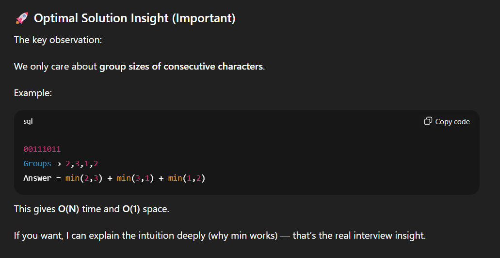

## 3379. Transformed Array


```c++
class Solution {
public:
    vector<int> constructTransformedArray(vector<int>& nums) {

    //We have to use the standard modulus arithmetic for circular data structures

    int n = nums.size();
    vector <int> res(n);

    for(int i = 0; i < n; i++)
        res[i] = nums[(i + (nums[i] % n) + n) % n];

    return res;
    }
};
```


---

## **15. Three Sum**

We essentially need to find three numbers x, y, and z such that they add up to the given value. If we fix one of the numbers say x, we are left with the two-sum problem at hand

Only skip duplicates **after you record a valid triplet**. NOT before. Why?

Because before finding a valid sum, duplicates might still lead to a different combination.


```javascript
#include <bits/stdc++.h>
using namespace std;

vector<vector<int>> threeSum(vector<int>& nums) {
    
    vector<vector<int>> result;
    
    // Step 1: Sort the array
    sort(nums.begin(), nums.end());
    
    int n = nums.size();
    
    // Step 2: Fix one element and use two-pointer for remaining
    for (int i = 0; i < n - 2; i++) {
        
        // Skip duplicate values for i
        if (i > 0 && nums[i] == nums[i - 1]) continue;
        
        int left = i + 1;
        int right = n - 1;
        
        while (left < right) {
            
            int sum = nums[i] + nums[left] + nums[right];
            
            if (sum == 0) {
                
                // Found a valid triplet
                result.push_back({nums[i], nums[left], nums[right]});
                
                // Move both pointers
                left++;
                right--;
                
                // Skip duplicates for left pointer
                while (left < right && nums[left] == nums[left - 1])
                    left++;
                
                // Skip duplicates for right pointer
                while (left < right && nums[right] == nums[right + 1])
                    right--;
            }
            else if (sum < 0) {
                left++;   // Need larger sum
            }
            else {
                right--;  // Need smaller sum
            }
        }
    }
    
    return result;
}

```

O(N^2)


---

## 696. Count Binary Substrings

**Brute Force**

O(N^2)


```javascript
class Solution {
public:
    int countBinarySubstrings(string s) {

    //Trying the O(N2) approach using two for loops for subarray counting

    int n = s.length(), ans = 0;

    for(int i = 0; i < n; i++)
    {
        int j = i;
        int c1 = 0, c2 = 0;
            
        while(j < n && s[j] == s[i])
        {
            c1++;
            j++;
        }

        while(j < n && s[j] != s[i])
        {
            c2++;
            j++;

            if(c1 == c2)
                ans++;
        }         
    }   

    return ans;
    }
};
```

**OPTIMAL SOLUTION**

Intuition:





```javascript
class Solution {
public:
    int countBinarySubstrings(string s) {
        
        int prev = 0;      // previous group size
        int curr = 1;      // current group size
        int ans = 0;
        
        for(int i = 1; i < s.size(); i++)
        {
            if(s[i] == s[i-1])
            {
                curr++;
            }
            else
            {
                ans += min(prev, curr);
                prev = curr;
                curr = 1;
            }
        }
        
        ans += min(prev, curr); // last pair
        
        return ans;
    }
};

```


---

## **3740.** **Minimum Distance Between Three Equal Elements I**

**O(N^3)**


```c++
class Solution {
public:
    int minimumDistance(vector<int>& nums) {
        int n = nums.size();
        int minDis = INT_MAX;
        bool found = false;

        for (int i = 0; i < n; ++i) {
            for (int j = i + 1; j < n; ++j) {
                if (nums[i] != nums[j]) continue;
                for (int k = j + 1; k < n; ++k) {
                    if (nums[i] == nums[k]) {
                        found = true;
                        // Simplified formula: 2 * (max_index - min_index)
                        // Since i < j < k, it's just 2 * (k - i)
                        int currentDist = 2 * (k - i);
                        minDis = min(minDis, currentDist);
                    }
                }
            }
        }

        return found ? minDis : -1;
    }
};
```

O(N)


```c++
class Solution {
public:
    int minimumDistance(vector<int>& nums) {
        // Map value to a list of its indices
        unordered_map<int, vector<int>> indexMap;
        int minDis = INT_MAX;
        bool found = false;

        for (int i = 0; i < nums.size(); ++i) {
            int val = nums[i];
            indexMap[val].push_back(i);
            
            int sz = indexMap[val].size();
            // If we have at least 3 occurrences of this number
            if (sz >= 3) {
                found = true;
                // 'i' is the current index (k), 
                // indexMap[val][sz-3] is the index from two occurrences ago (i)
                int currentDist = 2 * (i - indexMap[val][sz - 3]);
                minDis = min(minDis, currentDist);
            }
        }

        return found ? minDis : -1;
    }
};
```


---

## 3300. Minimum Element After Replacement With Digit Sum


```c++
class Solution {
    int sum(int number)
    {
        int res = 0;
        while(number)
        {
            res += number % 10;
            number = number / 10;
        }

        return res;
    }
public:
    int minElement(vector<int>& nums) {

    //Brute Force   
    int ans = INT_MAX;

    for(auto num : nums)
    {
        ans = min(ans, sum(num));
    }    

    return ans;
    }
};
```


---

## **628. Maximum Product of Three Numbers**


```c++
class Solution {
public:
    int maximumProduct(vector<int>& nums) {
        
        int max1 = INT_MIN, max2 = INT_MIN, max3 = INT_MIN;
        int min1 = INT_MAX, min2 = INT_MAX;

        for (int num : nums) {

            if (num > max1) {
                max3 = max2;
                max2 = max1;
                max1 = num;
            } else if (num > max2) {
                max3 = max2;
                max2 = num;
            } else if (num > max3) {
                max3 = num;
            }

            if (num < min1) {
                min2 = min1;
                min1 = num;
            } else if (num < min2) {
                min2 = num;
            }
        }

        return max(max1 * max2 * max3, min1 * min2 * max1);
    }
};
```


---

## **1464. Maximum Product of Two Elements in an Array**


```c++
class Solution {
public:
    int maxProduct(vector<int>& nums) {

    //Ans is max of two max elements or two min elements

    int max1 = INT_MIN, max2 = INT_MIN;

    for(auto num : nums)
    {
        if(num > max1)
        {
            max2 = max1;
            max1 = num;
        }
        else if(num > max2)
            max2 = num;
    }
        return (max1 - 1) * (max2 - 1);
    }    
};
```


---

## **3731. Find Missing Elements**


```c++
class Solution {
public:
    vector<int> findMissingElements(vector<int>& nums) {

    vector <int> freq(101, 0);   

    int maxi = INT_MIN, mini = INT_MAX;

    for(auto num : nums)
    {
        maxi = max(maxi, num);
        mini = min(mini, num);
        freq[num]++;
    }

    vector <int> res;
    for(int i = 1; i <= 100; i++)
    {
        if(i < mini)
            continue;
        if(i > maxi)
            break;
        if(!freq[i])
            res.push_back(i);
    }

    sort(res.begin(), res.end());
    return res;
    }
};
```


---

## **1128. Number of Equivalent Domino Pairs**


```c++
class Solution {
public:
    int numEquivDominoPairs(vector<vector<int>>& dominoes) {
        unordered_map<int, int> count;
        int pairs = 0;

        for (const auto& domino : dominoes) {
            int d1 = min(domino[0], domino[1]);
            int d2 = max(domino[0], domino[1]);

            //To avoid inserting pairs into the map, we can encode them into a single key
            int key = d1 * 10 + d2;

            // Add already seen matching dominoes, then increment frequency
            pairs += count[key];
            count[key]++;
        }

        return pairs;
    }
};
```


---

## **553. Optimal Division**


```c++
class Solution {
public:
    string optimalDivision(vector<int>& nums) {
        //     Just write any array down and see what is happening , continuous
        //     division of elements , which will always reduce the value.
        // so the idea is to just take the first element and divide it by the
        // remaining elements , because this will deal the max value as you have
        // minmized the denominator and numerator is at its peak which is the
        // first element

        string ans;
        if (!nums.size())
            return ans;
        ans = to_string(nums[0]);
        if (nums.size() == 1)
            return ans;
        if (nums.size() == 2)
            return ans + "/" + to_string(nums[1]);
        ans += "/(" + to_string(nums[1]);
        for (int i = 2; i < nums.size(); ++i)
            ans += "/" + to_string(nums[i]);
        ans += ")";
        return ans;
    }
};
```


---

## **3471. Find the Largest Almost Missing Integer**

### Brute Force


```c++
class Solution {
public:
    int largestInteger(vector<int>& nums, int k) {
    // Since the constraints are low, we can use nested loops

    vector <int> freq(51, 0);
    int n = nums.size();
    
    for(int i = 0; i <= n - k; i++)
    {
        unordered_set <int> elements;
        for(int j = i; j < i + k; j++)
        {
            if(elements.find(nums[j]) == elements.end())
            {
                elements.insert(nums[j]);
                freq[nums[j]]++;
            }
        }
    }

    for(int i = 50; i >= 0; i--)
    {
        if(freq[i] == 1)
            return i;
    }

    return -1;
    }
};
```

### Optimal

- **Case k = 1:** Every single element forms its own subarray of size 1. An element appears in exactly one subarray only if it appears **once in the entire array**. The answer is the **maximum unique element** (frequency = 1).
- **Case k = n:** There is only **one subarray** in total (the entire array). Every distinct element in the array is present in that single subarray. The answer is simply the **maximum element** in `nums`.
- **Case 1 < k < n:** Every interior element (indices 1 through n - 2) is covered by at least two overlapping sliding windows. Only the two boundary elements—`nums[0]` and `nums[n - 1]`—can ever appear in exactly one window, provided their **total frequency in the array is 1**. The answer is the **larger of the two boundary values that appears uniquely**, or `1` if neither qualifies.

```c++
class Solution {
public:
    int largestInteger(vector<int>& nums, int k) {
        int n = nums.size();

        vector<int> freq(51, 0);

        for (int x : nums) {
            freq[x]++;
        }
        if (k == n) {
            return *max_element(nums.begin(), nums.end());
        }
        if (k == 1) {
            int ans = -1;

            for (int x : nums) {
                if (freq[x] == 1) {
                    ans = max(ans, x);
                }
            }

            return ans;
        }

        int ans = -1;

        if (freq[nums[0]] == 1) {
            ans = max(ans, nums[0]);
        }

        if (freq[nums[n - 1]] == 1) {
            ans = max(ans, nums[n - 1]);
        }

        return ans;
    }
};
```


---

🔗 **References**
- 3379. Transformed Array → https://leetcode.com/problems/transformed-array/description/?envType=daily-question&envId=2026-02-05
- 696. Count Binary Substrings → https://leetcode.com/problems/count-binary-substrings/?envType=daily-question&envId=2026-02-19

