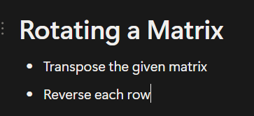
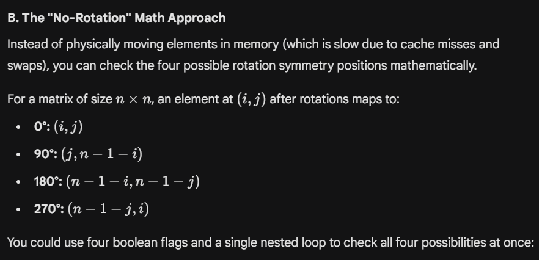

## 1886. Determine whether matrix can be obtained by rotation





```javascript
class Solution {
private:
    void rotateMatrix(vector <vector<int>> &matrix) {
        
    int i, j, rows = matrix.size(), cols = matrix[0].size();   

    //Transposing matrix
    for( i = 0; i < rows; i++)
    {
        for( j = i + 1; j < cols; j++)
            swap(matrix[i][j], matrix[j][i]);    }

    //Reversing each row

    for( i = 0; i < rows; i++)
        reverse(matrix[i].begin(), matrix[i].end());

    }

public:
    bool findRotation(vector<vector<int>>& mat, vector<vector<int>>& target) {    
    

    for(int i = 0; i < 4; i++)
    {
        if(mat == target)
            return true;
        rotateMatrix(mat);
    }

    return false;
    }
};
```





```javascript
bool findRotation(vector<vector<int>>& mat, vector<vector<int>>& target) {
    int n = mat.size();
    bool c[4] = {true, true, true, true}; 
    
    for (int i = 0; i < n; i++) {
        for (int j = 0; j < n; j++) {
            if (mat[i][j] != target[i][j]) c[0] = false;             // 0 degrees
            if (mat[i][j] != target[j][n - 1 - i]) c[1] = false;     // 90 degrees
            if (mat[i][j] != target[n - 1 - i][n - 1 - j]) c[2] = false; // 180 degrees
            if (mat[i][j] != target[n - 1 - j][i]) c[3] = false;     // 270 degrees
        }
    }
    return c[0] || c[1] || c[2] || c[3];
}
```


---

## **1260. Shift 2D Grid**

Instead of working in 2D, flatten the matrix to 1D and do the required

### Flattening a 2D matrix to 1D matrix

let\ n\ =\ no.\ of\ columns

then,\ index(1D)\ =\ (i\ *\ n) \ + j

### Recovering a 1D matrix to 2D

r\ = index_{1D}\ /\ n

c\ = index_{1D}\ (mod\ n)


```c++
class Solution {
public:
    vector<vector<int>> shiftGrid(vector<vector<int>>& grid, int k) {
    //Instead of thinking in 2D (rows and columns), imagine the 2D grid flattened into a single 1D array of size m * n.
    // When you shift a 1D array by k positions to the right, elements just move forward, and the ones at the end wrap around to the beginning. 

    int m = grid.size();
    int n = grid[0].size();
    int total = m * n;

    //Handle extra large k
    k = k % total; 

    vector <vector<int>> res(m, vector<int> (n, 0));

    for(int i = 0; i < m; i++)
    {
        for(int j = 0; j < n; j++)
        {
            //Flattening 2D to 1D index 
            int index = (i * n) + j;
            int newIndex = (index + k) % total;

            //Converting 1D indx to 2D
            int r = newIndex / n;
            int c = newIndex % n;

            res[r][c] = grid[i][j];
        }
    }

    return res;
    }
};
```


---

