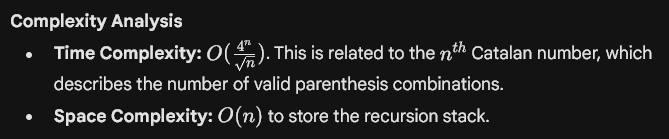
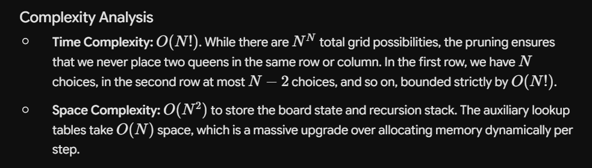

## 22. Generate Parentheses


```javascript
class Solution {
public:
    void backtrack(vector<string>& res, string current, int open, int close, int n) {
        // Base case: if the string length reaches 2*n, we found a valid combination
        if (current.length() == 2 * n) {
            res.push_back(current);
            return;
        }

        // If we can still add an opening bracket
        if (open < n) {
            backtrack(res, current + "(", open + 1, close, n);
        }

        // If we can add a closing bracket (must have an unmatched opening one)
        if (close < open) {
            backtrack(res, current + ")", open, close + 1, n);
        }
    }

    
    vector<string> generateParenthesis(int n) {
        vector<string> result;
        backtrack(result, "", 0, 0, n);
        return result;
    }
};
```





---

## **17. Letter Combinations of a Phone Number**


```javascript
class Solution {
private:
    void generate(vector <string> &ans, string curr, string digits, int index,
                  unordered_map <char, vector <char>> &hash)
    {
        if(curr.length() == digits.length())
        {
            ans.push_back(curr);
            return;
        }

        for(int i = 0; i < hash[digits[index]].size(); i++)
            generate(ans, curr + hash[digits[index]][i], digits, index + 1, hash);
    }
public:
    vector<string> letterCombinations(string digits) {
        
    vector <string> ans;
    unordered_map <char, vector <char>> hash = {
        {'2' , {'a','b','c'}} ,
        {'3' , {'d','e','f'}} ,
        {'4' , {'g','h','i'}} ,
        {'5' , {'j','k','l'}} ,
        {'6' , {'m','n','o'}} ,
        {'7' , {'p','q','r','s'}} ,
        {'8' , {'t','u','v'}} ,
        {'9' , {'w','x','y','z'}}

    };
    generate(ans, "", digits, 0, hash);

    return ans;
    }
};
```


---

## 46. Permutations


```javascript
	class Solution {
private:
    void permutations(vector<vector<int>>& ans, vector<int>& curr, vector<int>& nums, unordered_map<int, int>& hash) {
        if (curr.size() == nums.size()) {
            ans.push_back(curr);
            return;
        }

        for (int i = 0; i < nums.size(); i++) {
            if (hash.find(nums[i]) == hash.end()) {
                // 1. Choose
                curr.push_back(nums[i]);
                hash[nums[i]]++;

                // 2. Explore (Moved inside the IF)
                permutations(ans, curr, nums, hash);

                // 3. Un-choose (Backtrack)
                curr.pop_back();
                hash.erase(nums[i]);
            }
        }
    }

public:
    vector<vector<int>> permute(vector<int>& nums) {
        vector<vector<int>> ans;
        vector<int> curr;
        unordered_map<int, int> hash;
        permutations(ans, curr, nums, hash);
        return ans;
    }
};
```


```javascript
class Solution {
public:
    void backtrack(int index, vector<int>& nums, vector<vector<int>>& result) {
        // Base Case: If we've reached the end of the array, we found a permutation
        if (index == nums.size()) {
            result.push_back(nums);
            return;
        }

        for (int i = index; i < nums.size(); i++) {
            // 1. Swap the current index with the loop index
            swap(nums[index], nums[i]);

            // 2. Recursively generate permutations for the rest of the array
            backtrack(index + 1, nums, result);

            // 3. Backtrack: Swap back to restore the original array state
            swap(nums[index], nums[i]);
        }
    }

    vector<vector<int>> permute(vector<int>& nums) {
        vector<vector<int>> result;
        backtrack(0, nums, result);
        return result;
    }
};
```


---

## 39. Combinational Sum

### **Time Complexity Note: Combination Sum**

The time complexity is **$\mathcal{O}(2^t \cdot k)$**, where **$t$** is the maximum recursion depth ($\frac{\text{Target}}{\text{Minimum Element}}$) and **$k$** is the average length of a valid combination. The base of **$2$** arises from the binary choice made at each step (either "pick" the current element or "don't pick" it), creating a decision tree that doubles in size at each level. The exponent **$t$** represents the worst-case depth of this tree, which occurs when the algorithm repeatedly selects the smallest element to reach the target, resulting in up to $2^t$ total recursive operations. Finally, the linear multiplier **$k$** accounts for the time required to perform a deep copy of the tracking vector (`ans.push_back(curr)`) whenever a valid combination is found. Sorting the input array optimizes this by enabling early pruning via `candidates[index] > target`, cutting off entire dead-end subtrees and drastically reducing the average-case runtime.


```c++
class Solution {
private:
    void findCombination(vector <vector<int>> &ans, vector<int>& candidates, int target,
                          int index, vector <int> &curr)
    {
        //Let's go with the greedy approach, select current valid option (smaller number) 
        //without thinking whether it will fit in the future or not 
        if(target == 0)
        {
            ans.push_back(curr);
            return;
        }

        if(index == candidates.size() || candidates[index] > target)
            return;    
            //Not possible

        curr.push_back(candidates[index]);
        findCombination(ans, candidates, target - candidates[index], index, curr);

        //Backtrack
        curr.pop_back();
        findCombination(ans, candidates, target, index + 1, curr);

    }
public:
    vector<vector<int>> combinationSum(vector<int>& candidates, int target) {
        
    vector <vector<int>> ans;
    vector <int> curr;

    sort(candidates.begin(), candidates.end());
    findCombination(ans, candidates, target, 0, curr);

    return ans;
    }
};  
```


---

## 40. Combinational Sum II

To avoid duplicates, we cannot use the simple "pick / don't pick" recursive structure. Instead, we must use a **for-loop inside the recursive function** to dynamically decide which unique element to start a combination with. If a number is identical to the one right before it at the same recursive level, we skip it entirely.


```c++
class Solution {
private:
    void findCombinations(vector<vector<int>> &ans, vector<int> &candidates, int target, int index,
                          vector<int> &curr)
    {
        if(target == 0)
        {
            ans.push_back(curr);
            return;
        }

        // Iterate through all possible candidates for the current position in 'curr'
        for (int i = index; i < candidates.size(); i++) {
            // CRITICAL STEP: Skip duplicates at the same level of recursion
            if (i > index && candidates[i] == candidates[i - 1]) {
                continue; 
            }

            // Early pruning: since the array is sorted, if this element is too big, 
            // all subsequent elements will also be too big.
            if (candidates[i] > target) {
                break;
            }

            curr.push_back(candidates[i]);
            // Move to 'i + 1' because each element can only be used once
            findCombinations(ans, candidates, target - candidates[i], i + 1, curr);   
            curr.pop_back(); // Backtrack
        }
    }
public:
    vector<vector<int>> combinationSum2(vector<int>& candidates, int target) {
        sort(candidates.begin(), candidates.end());

        vector<int> curr;
        vector<vector<int>> ans;

        findCombinations(ans, candidates, target, 0, curr);

        return ans;    
    }
};
```


---

## 90. Subsets II

### Brute Force

Using a set to store the subsets so that no duplicates are there, afterwards we can copy them into a vector of vectors

### The Fix: Sort the array first

To fix your brute-force approach, you simply need to **sort **`nums` before doing anything else. Sorting ensures that duplicates are always grouped together, meaning any subset generated will have its elements in a strictly non-decreasing order.


```c++
class Solution {
private:
    void subsets(vector<int>& nums, vector <int> &curr, set <vector<int>> &ans, int index)
    {
        if(index == nums.size())
        {
            ans.insert(curr);
            return;
        }

        //Pick
        curr.push_back(nums[index]);
        subsets(nums, curr, ans, index + 1);

        //Unpick
        curr.pop_back();
        subsets(nums, curr, ans, index + 1);
    }
public:
    vector<vector<int>> subsetsWithDup(vector<int>& nums) {
        //Brute Force Approach of Using Set to avoid duplicates
    sort(nums.begin(), nums.end());
    
    set <vector<int>> ans;
    vector <int> curr;

    subsets(nums, curr, ans, 0);

    vector <vector<int>> res;

    for(auto sub : ans)
        res.push_back(sub);

    return res;
    }
};
```

### Optimal Approach

Instead of generating all subsets and then removing duplicates, we can avoid creating duplicates in the first place. This is done by sorting the input array first so that all duplicate numbers are adjacent. While generating subsets through backtracking, if we encounter a number that is the same as the previous one and it’s not the first in the current recursive call, we skip it. This pruning step ensures we only generate unique subsets without extra storage for duplicate removal.

- Use a recursive backtracking function that:
- Adds the current subset to the list of results.
- Iterates from the current index to the end of the array.
- If the current element is the same as the previous one and not at the starting index of this recursion, skip it.
- Include the current element in the subset and recurse for the next index.
- Backtrack by removing the last added element.

```c++
class Solution {
private:
    void subsets(vector<int>& nums, vector <int> &curr, vector <vector<int>> &ans, int index)
    {
        ans.push_back(curr);

        for(int i = index; i < nums.size(); i++)
        {
            if(i > index && nums[i] == nums[i - 1])
                continue;

            //Pick
            curr.push_back(nums[i]);
            subsets(nums, curr, ans, i + 1);

            //Unpick
            curr.pop_back();
        }
    }
public:
    vector<vector<int>> subsetsWithDup(vector<int>& nums) {
        //Optinal approach by sorting and optimization in the recursive step
    sort(nums.begin(), nums.end());
    
    vector <int> curr;
    vector <vector<int>> ans;

    subsets(nums, curr, ans, 0);

    return ans;
    }
};
```


---

## 216. Combination Sum III


```c++
class Solution {
private:
    void subsets(vector<vector<int>> &ans, vector<int> &curr, int target, int index, int k)
    {
        if (target == 0 && k == 0) {
            ans.push_back(curr);
            return;
        }

        if (index > 9 || target < 0 || k < 0) {
            return;
        }

        // Pick
        curr.push_back(index);
        subsets(ans, curr, target - index, index + 1, k - 1);
        curr.pop_back();

        // Don't Pick
        subsets(ans, curr, target, index + 1, k);
    }

public:
    vector<vector<int>> combinationSum3(int k, int n) {
        vector<vector<int>> ans;
        vector<int> curr;
        
        // Start exploring numbers from 1 to 9
        subsets(ans, curr, n, 1, k);
        
        return ans;
    }
};
```


---

## 79. Word Search


```c++
class Solution {
private:
    bool dfs(vector<vector<char>>& board, string& word, int i, int j, int idx) {
        
        if (idx == word.size()) return true;

        if (i < 0 || j < 0 || i >= board.size() || j >= board[0].size() || board[i][j] != word[idx]) {
            return false;
        }

        char temp = board[i][j];
        board[i][j] = '#';

        // Explore all four directions
        bool found = dfs(board, word, i + 1, j, idx + 1) ||
                     dfs(board, word, i - 1, j, idx + 1) ||
                     dfs(board, word, i, j + 1, idx + 1) ||
                     dfs(board, word, i, j - 1, idx + 1);

        // Restore the character (backtracking)
        board[i][j] = temp;

        return found;
    }

public:
    bool exist(vector<vector<char>>& board, string word) {
        int rows = board.size();
        int cols = board[0].size();

        for (int i = 0; i < rows; i++) {
            for (int j = 0; j < cols; j++) {
                // Start DFS if first letter matches
                if (dfs(board, word, i, j, 0)) {
                    return true;
                }
            }
        }
        return false;
    }
};


```


---

## 51. N Queens

### The Geometric Trick for Diagonals

When placing a queen at coordinates `(row, col)`:

- The **Column** is uniquely identified by `col`.
- The **Main Diagonal** (top-left to bottom-right) has a property where `row - col` is constant. To prevent negative indices, we offset it as `row - col + N`.
- The **Anti-Diagonal** (top-right to bottom-left) has a property where `row + col` is constant.
By tracking these three properties in boolean arrays, we can instantly tell if a square is under attack.





```c++
class Solution {
private:
    void solve(int row, int n, vector<string>& board, vector<vector<string>>& ans,
               vector<bool>& cols, vector<bool>& diag1, vector<bool>& diag2) {
        
        // Base Case: If all queens are safely placed, record the solution
        if (row == n) {
            ans.push_back(board);
            return;
        }

        for (int col = 0; col < n; col++) {
            // O(1) Check: If the column or diagonals are already attacked, skip
            if (cols[col] || diag1[row - col + n] || diag2[row + col]) {
                continue;
            }

            // Action: Place the queen
            board[row][col] = 'Q';
            cols[col] = diag1[row - col + n] = diag2[row + col] = true;

            // Recurse to the next row
            solve(row + 1, n, board, ans, cols, diag1, diag2);

            // Backtrack: Remove the queen for the next iteration
            board[row][col] = '.';
            cols[col] = diag1[row - col + n] = diag2[row + col] = false;
        }
    }

public:
    vector<vector<string>> solveNQueens(int n) {
        vector<vector<string>> ans;
        // Initialize an empty board filled with '.'
        vector<string> board(n, string(n, '.'));

        // Look-up tables to keep track of placed queens
        vector<bool> cols(n, false);
        vector<bool> diag1(2 * n, false); // For row - col + n
        vector<bool> diag2(2 * n, false); // For row + col

        solve(0, n, board, ans, cols, diag1, diag2);
        return ans;
    }
};
```


---

## **1863. Sum of All Subset XOR Totals**

### Brute Force


```c++
class Solution {
private:
    int solve(vector<int>& nums, int index, int curr_sum) {
        if (index == nums.size()) {
            return curr_sum;
        }

        int pick = solve(nums, index + 1, curr_sum ^ nums[index]);

        int notPick = solve(nums, index + 1, curr_sum);

        return pick + notPick;
    }

public:
    int subsetXORSum(vector<int>& nums) {
        return solve(nums, 0, 0);
    }
};
```

## Optimal Solution

This optimal approach relies on analyzing how often individual bit positions are activated across all $2^N$ possible subsets. If a specific bit is set to `1` in at least one element of the array, it will end up being set to `1` in exactly half of all possible subsets ($2^{N-1}$ subsets) due to the nature of the XOR operation, while the remaining half will have it as `0`. Therefore, instead of generating subsets, you can find every active bit across the entire array by combining all elements using a bitwise **OR** operator. Because any active bit at position $k$ contributes a value of $2^k$ to a subset, and appears exactly $2^{N-1}$ times, the total sum is calculated simply by taking that final bitwise OR result and multiplying it by $2^{N-1}$ (which is efficiently done using the bitwise left-shift operator `<< (N - 1)`).


```c++
class Solution {
public:
    int subsetXORSum(vector<int>& nums) {
        int bitwise_or = 0;
        
        // Step 1: Combine all numbers using the bitwise OR operator
        for (int num : nums) {
            bitwise_or |= num;
        }
        
        // Step 2: Multiply the result by 2^(N-1) using a left shift
        return bitwise_or << (nums.size() - 1);
    }
};
```


---

🔗 **References**
- 22. Generate Parentheses → https://leetcode.com/problems/generate-parentheses/

