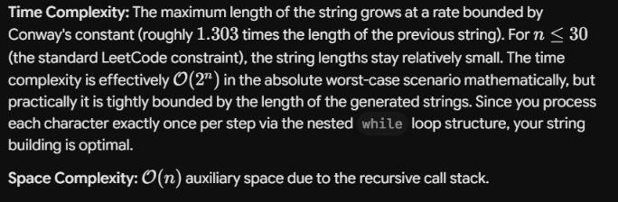
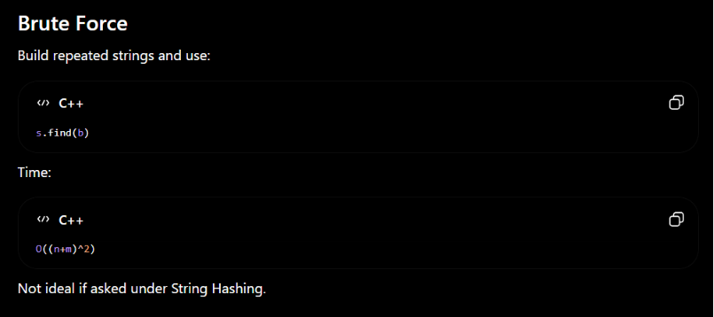
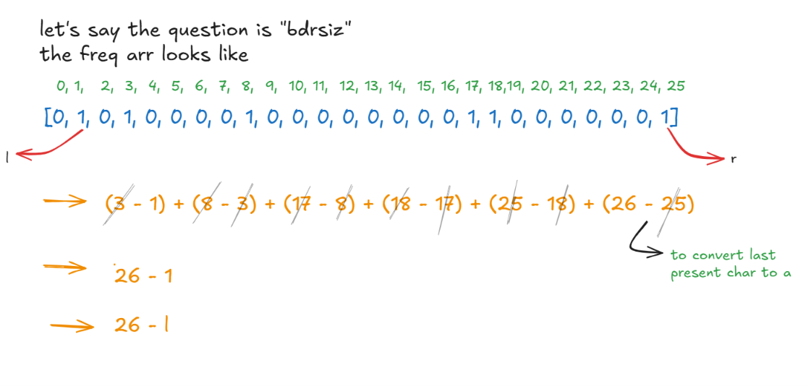

## 3121. Count the number of special characters II

- You must track the *last* index of the lowercase letters, but the **first** index of the uppercase letters.

```c++
class Solution {
public:
    int numberOfSpecialChars(string word) {
        // Flat arrays initialized to -1. 
        // This gives us instant hardware-level memory access instead of hashing overhead.
        int lastLower[26];
        int firstUpper[26];
        
        // Initialize arrays with -1
        for(int i = 0; i < 26; i++) {
            lastLower[i] = -1;
            firstUpper[i] = -1;
        }

        // 1. Single pass to log the indices
        for (int i = 0; i < word.size(); i++) {
            char c = word[i];
            
            if (c >= 'a' && c <= 'z') {
                // Continuously overwrite to lock in the LAST index
                lastLower[c - 'a'] = i;
            } 
            else if (c >= 'A' && c <= 'Z') {
                // Only write to the array if it is still -1 to lock in the FIRST index
                if (firstUpper[c - 'A'] == -1) {
                    firstUpper[c - 'A'] = i;
                }
            }
        }

        int count = 0;

        // 2. Instant lookup for all 26 letters
        for (int i = 0; i < 26; i++) {
            // If both versions exist AND the last lowercase is strictly before the first uppercase
            if (lastLower[i] != -1 && firstUpper[i] != -1 && lastLower[i] < firstUpper[i]) {
                count++;
            }
        }

        return count;
    }
};
```


---

***BRUTE FORCE***


```c++
class Solution {
public:
    int numberOfSpecialChars(string word) {

    vector <int> lowerCase(26, -1);   
    vector <int> upperCase(26, -1);   

    for(int i = 0; i < word.size(); i++)
    {
        char letter = word[i];

        if(letter >= 'a' && letter <= 'z')
            lowerCase[letter - 'a'] = i;
        
        if(letter >= 'A' && letter <= 'Z')
            upperCase[letter - 'A'] = i;
    }

    int count = 0;

    for(int i = 0; i < 26; i++)
    {
        if(lowerCase[i] != -1 && upperCase[i] != -1)
            count++;
    }

    return count;
    }
};
```

***BIT MANIPULATION***


```c++
class Solution {
public:
    int numberOfSpecialChars(string word) {
        int lowerMask = 0;
        int upperMask = 0;

        for (char c : word) {
            if (c >= 'a' && c <= 'z') {
                lowerMask |= (1 << (c - 'a')); // Turn on the specific bit
            } 
            else if (c >= 'A' && c <= 'Z') {
                upperMask |= (1 << (c - 'A')); // Turn on the specific bit
            }
        }

        // Bitwise AND leaves only the bits (letters) that are turned on in BOTH masks
        int commonBits = lowerMask & upperMask;

        // __builtin_popcount counts the number of 1s in the integer instantly
        return __builtin_popcount(commonBits);
    }
};
```


---

## 8. String to Integer (atoi)

### Iterative


```c++
class Solution {
public:
    int myAtoi(string s) {
        int ptr = 0;
        bool neg = false;
        int n = s.length();

        // 1. Skip leading whitespaces
        while (ptr < n && s[ptr] == ' ') {
            ptr++;
        }

        // Check if we've reached the end of the string after spaces
        if (ptr == n) return 0;

        // 2. Handle signs
        if (s[ptr] == '-') {
            neg = true;
            ptr++;
        } else if (s[ptr] == '+') {
            ptr++;
        }

        long long int res = 0;

        // 3. Convert digits and handle overflow dynamically
        while (ptr < n && isdigit(s[ptr])) {
            res = (res * 10) + (s[ptr] - '0');
            
            // Check overflow early to prevent long long from wrapping around
            if (!neg && res > INT_MAX) return INT_MAX;
            if (neg && -res < INT_MIN) return INT_MIN;
            
            ptr++;
        }

        // 4. Apply sign and return
        if (neg) {
            res = -res;
        }
        
        return static_cast<int>(res);
    }
};
```

### Recursive


```c++
class Solution {
private:
    // Helper function using long long to accumulate the result
    int myAtoiRecursive(const string& s, int index, long long res, bool neg) {
        // Base Case 1: End of string or non-digit character
        if (index >= s.length() || !isdigit(s[index])) {
            return neg ? -res : res;
        }

        // Accumulate the digit into the 64-bit integer
        res = (res * 10) + (s[index] - '0');

        // Dynamic Overflow Checking using long long boundaries
        if (!neg && res > INT_MAX) return INT_MAX;
        if (neg && -res < INT_MIN) return INT_MIN;

        // Tail-recurse to the next index
        return myAtoiRecursive(s, index + 1, res, neg);
    }

public:
    int myAtoi(string s) {
        int ptr = 0;
        int n = s.length();

        // 1. Skip leading whitespaces
        while (ptr < n && s[ptr] == ' ') {
            ptr++;
        }

        // 2. Handle sign
        bool neg = false;
        if (ptr < n && s[ptr] == '-') {
            neg = true;
            ptr++;
        } else if (ptr < n && s[ptr] == '+') {
            ptr++;
        }

        // 3. Kick off the recursion with an initial long long accumulation of 0
        return myAtoiRecursive(s, ptr, 0LL, neg);
    }
};
```


---

## **921. Minimum Add to Make Parentheses Valid**


```c++
class Solution {
public:
    int minAddToMakeValid(string s) {

    int close_req = 0;
    int open_req = 0;

    for(char ch : s)
    {
        if(close_req == 0 && ch == ')')
        {
            open_req++;
            continue;
        }

        if(ch == '(')
            close_req++;
        else
            close_req--;
    }   

    return close_req + open_req;
    }
};
```


---

## 38. Count and Say




### Recursive


```c++
class Solution {
public:
    string countAndSay(int n) {

    if(n == 1)
        return "1";

    string s = countAndSay(n - 1);    

    string new_rle = "";

    int i = 0;
    while(i < s.length())
    {
        int count = 0;
        char ch = s[i];

        while(s[i] == ch)
        {
            count++;
            i++;
        }

        new_rle += to_string(count);
        new_rle += ch;
    }

    return new_rle;
    }
};
```

## Iterative

This successfully drops the recursion stack overhead, minimizing memory usage.

### Why `result.back()` is Appended Outside the Loop

The inner loop uses a **look-back strategy** (`result[j] == result[j - 1]`). It only saves data to `current` inside the `else` block—which triggers **only when a character changes**.

Because the string ends, the final character group never experiences a "character change" to trigger the `else` block.

- **The Loop:** Processes and counts all characters, but leaves the final group's data trapped in the variables.
- **The Clean-up:** `current += to_string(count) + result.back();` explicitly flushes that final remaining count and character into the result after the loop finishes.

```c++
class Solution {
public:
    string countAndSay(int n) {
        string result = "1";

        for (int i = 1; i < n; ++i) {
            string current = "";
            int count = 1;

            for (int j = 1; j < result.size(); ++j) 
            {
                if (result[j] == result[j - 1]) 
                {
                    count++;
                } 
                else 
                {
                    current += to_string(count) + result[j - 1];
                    count = 1;
                }
            }
            current += to_string(count) + result.back();
            result = current;
        }
        return result;
    }
};
```


---

## **686. Repeated String Match**

***Explanation Here*** ⬇️⬇️⬇️

Untitled 




# Rabin-Karp Approach


**Instead of checking every substring character-by-character:**

## Algorithm

1. Build repeated string `s`.
1. Compute hash of `b`.
1. Compute hash of first window of size `m`.
1. Slide window using rolling hash.
1. If hashes match:
- Verify actual characters.
1. If found:
- Return repetitions count.
1. Append one more `a` and repeat.
1. Else return `1`.
## Complexity

Let:

- `n = length of repeated string`
- `m = length of b`
Building repeated string:


```plain text
O(n)
```

Rabin-Karp search:


```plain text
Average: O(n + m)
Worst (many collisions): O(n * m)
```

Space:


```plain text
O(1)
```


```c++

```

### Revision Note

For Repeated String Match:

1. Repeat `a` until length ≥ `b.length()`.
1. Use Rabin-Karp to search `b`.
1. If not found, append one more `a` and search again.
1. Need at most **one extra repetition** because a valid match can cross only one repetition boundary.
1. Complexity ≈ **O(n + m)** average.

---

## **1189. Maximum Number of Balloons**


```c++
class Solution {
public:
    int maxNumberOfBalloons(string text) {

    //Use frequency array and return min of frequencies of all characters
    int arr[26] = {0};

    for(char ch : text)
        arr[ch - 'a']++;

    return min( {arr['b' - 'a'], arr['a' - 'a'], arr['l' - 'a'] / 2 , arr['o' - 'a'] / 2 ,arr['n' - 'a'],} );    
    }
};
```


---

## **647. Palindromic Substrings**

## Intuition (Expand Around Center)

The key observation is:

For example:


```plain text
aba      -> center = b
racecar  -> center = e
abba     -> center = between the two b's
```

So instead of generating all substrings and checking whether they are palindromes, we start from every possible center and expand outward while the characters match. This counts all palindromic substrings in `O(n²)` time and `O(1)` space.


```c++
class Solution {
public:
    int expand(string& s, int left, int right) {

        int count = 0;

        while (left >= 0 &&
               right < s.size() &&
               s[left] == s[right]) {

            count++;

            left--;
            right++;
        }

        return count;
    }

    int countSubstrings(string s) {

        int ans = 0;

        for (int i = 0; i < s.size(); i++) {

            // Odd length
            ans += expand(s, i, i);

            // Even length
            ans += expand(s, i, i + 1);
        }

        return ans;
    }
};
```


---

## **3955. Valid Binary Strings With Cost Limit**

## Brute Force — Recursion


```c++
class Solution {
    vector <string> ans;
private:
    void build(int n, int k, int index, string curr, bool onePossible, int cost)
    {
        if(curr.length() == n)
        {
            ans.push_back(curr);
            return ;
        }

        for(int i = index; i < n; i++)
        {
            if(onePossible) {
                //If one is possible, pick one or zero
                if(cost + index <= k)
                    build(n, k, i + 1, curr + '1', false, cost + index);

                build(n, k, i + 1, curr + '0', onePossible, cost);
            }

            else
                build(n, k, i + 1, curr + '0', true, cost);
        }
    }
public:
    vector<string> generateValidStrings(int n, int k) {
    //Clearly this is a recursion pick non pick approach question

    build(n, k, 0, "", true, 0);
    return ans;
    }
};
```


---

## **179. Largest Number**

### **Custom String Concatenation**


Imagine you are comparing any two numbers, which we can treat as strings, A and B. There are only two ways to combine them:
1. Put A first, then B →(   + B)
2. Put B first, then A → (B + A)
The rule for our sorting algorithm becomes incredibly simple: 

**If **`A + B > B + A`**, then ****A should come before B**** in our final sorted order.**

Use standard `sort()` with a custom comparator


```c++
class Solution {
private:
    // Custom comparator function
    // Must be 'static'
    static bool customCompare(const string& a, const string& b) {
        return (a + b) > (b + a);
    }

public:
    string largestNumber(vector<int>& nums) {
       
        vector<string> strNums;
        for (int num : nums) {
            strNums.push_back(to_string(num));
        }

    
        sort(strNums.begin(), strNums.end(), customCompare);

        // Step 3: Handle the edge case trap [0, 0, 0, 0]
        // If the largest element after sorting is "0", the entire result is just "0"
        if (strNums[0] == "0") {
            return "0";
        }

        //Concatenate
        string largestNumStr = "";
        for (const string& s : strNums) {
            largestNumStr += s;
        }

        return largestNumStr;
    }
};
```


---

## **409. Longest Palindrome**


```c++
class Solution {
public:
    int longestPalindrome(string s) {

    //Lets use a frequency array
    int arr[256] = {0};

    for(char ch : s)
        arr[ch]++;

    //We will loop through the letters, and add it to our length if its frequency is greater than = 2
    //len += 2 * (freq[ch] / 2);     
    //and decrement its frequency
    //loop through again to check if any single letter exists, then ans would be (len + 1)

    int len = 0;
    bool single = false;

    for(int i = 65; i <= 90; i++)
    {
        if(arr[i] >= 2)
            len += 2 * (arr[i] / 2);

        if(arr[i] == 1 || arr[i] % 2 != 0)
            single = true;

    }

    for(int i = 97; i <= 122; i++)
    {
        if(arr[i] >= 2)
            len += 2 * (arr[i] / 2);
            
        if(arr[i] == 1 || arr[i] % 2 != 0)
            single = true;
    }

    return (single) ? len + 1 : len;
    }
};
```


---

## **1967. Number of Strings That Appear as Substrings in Word**


```c++
class Solution {
public:
    int numOfStrings(vector<string>& patterns, string word) {

    //Lets use the standard .find funtion
    int res = 0;

    for(string pattern : patterns)
    {
        if(word.find(pattern) != string::npos)
            res++;
    }    

    return res;
    }
};
```


---

## 43. Multiply Strings

### Multiplication + Addition


```c++
class Solution {
public:
    string multiply(string num1, string num2) {
        if (num1 == "0" || num2 == "0") return "0";

        if (num1.size() < num2.size()) {
            return multiply(num2, num1);
        }

        string res = "";
        int zero = 0;
        for (int i = num2.size() - 1; i >= 0; --i) {
            string cur = mul(num1, num2[i], zero);
            res = add(res, cur);
            zero++;
        }

        return res;
    }

    string mul(string s, char d, int zero) {
        int i = s.size() - 1, carry = 0;
        int digit = d - '0';
        string cur;

        while (i >= 0 || carry) {
            int n = (i >= 0) ? s[i] - '0' : 0;
            int prod = n * digit + carry;
            cur.push_back((prod % 10) + '0');
            carry = prod / 10;
            i--;
        }

        reverse(cur.begin(), cur.end());
        return cur + string(zero, '0');
    }

    string add(string num1, string num2) {
        int i = num1.size() - 1, j = num2.size() - 1, carry = 0;
        string res;

        while (i >= 0 || j >= 0 || carry) {
            int n1 = (i >= 0) ? num1[i] - '0' : 0;
            int n2 = (j >= 0) ? num2[j] - '0' : 0;
            int total = n1 + n2 + carry;
            res.push_back((total % 10) + '0');
            carry = total / 10;
            i--;
            j--;
        }

        reverse(res.begin(), res.end());
        return res;
    }
};
```

### Multiplication


```c++
class Solution {
public:
    string multiply(string num1, string num2) {
        if (num1 == "0" || num2 == "0") {
            return "0";
        }

        vector<int> res(num1.length() + num2.length(), 0);
        reverse(num1.begin(), num1.end());
        reverse(num2.begin(), num2.end());
        for (int i1 = 0; i1 < num1.length(); i1++) {
            for (int i2 = 0; i2 < num2.length(); i2++) {
                int digit = (num1[i1] - '0') * (num2[i2] - '0');
                res[i1 + i2] += digit;
                res[i1 + i2 + 1] += res[i1 + i2] / 10;
                res[i1 + i2] %= 10;
            }
        }

        stringstream result;
        int i = res.size() - 1;
        while (i >= 0 && res[i] == 0) {
            i--;
        }
        while (i >= 0) {
            result << res[i--];
        }
        return result.str();
    }
};
```


---

## 3675. **Minimum Operations to Transform String**





```c++
class Solution {
public:
    int minOperations(string s) {

    //Use a frequency array to keep track of distinct elements and the number moves required to change them to z, which can be then changed to a easily

    
    //But a greedy approach seems better, like we start from the lowest character and convert all its occurences to the next high character, and keep following this until the highest charcter, this way we can avoid overlapping counts.

    //If we do the math, it comes out that middle indices do not play a role as they cancel out, explanation attached above

    int arr[26] = {0};

    int res = 0;

    for(char ch : s)
    {
        arr[ch - 'a'] = 1;
    }    

    int l = 0;
    for(int i = 1; i < 26; i++)
    {
        if(arr[i] == 1)
        {
            l = i;
            break;
        }
    }

    return (26 - l) % 26;
    }
};
```


---

## **680. Valid Palindrome II**


```c++
class Solution {
private:
    bool checkPalin(string s, int l, int r)
    {
        while( l < r )
        {
            if(s[l] != s[r])
                return false;
            l++;   r--;
        }
        return true;
    }
public:
    bool validPalindrome(string s) {

    int delLeft = 0, delRight = 0;
    int l = 0, r = s.length() - 1;    

    while(l < r)
    {
        if(s[l] == s[r])
        {
            l++;    r--;
        }
        else
        {
            bool left = checkPalin(s, l + 1, r);    //delete left
            bool right = checkPalin(s, l, r - 1);    //delete right

            //Check whether deleting either character works
            return checkPalin(s, l + 1, r) || checkPalin(s, l, r - 1);
        }
    }

    return true;
    }
};
```


---

## **942. DI String Match**


```c++
class Solution {
public:
    vector<int> diStringMatch(string s) {

    int n = s.length();
    int dNum = n, iNum = 0;
    vector <int> res(n + 1);

    for(int i = 0; i < n + 1; i++)
    {
        if(s[i] == 'I')
            res[i] = iNum++;
        else
            res[i] = dNum--;

        if(i == n)
        {
            if(s[i - 1] == 'I')
                res[i] = res[i - 1] + 1;
            else
                res[i] = res[i - 1] - 1;
        }
    }   

    return res;
    }
};
```


---

## **3992. Rearrange String to Avoid Character Pair**


```c++
class Solution {
public:
    string rearrangeString(string s, char x, char y) {

    // lets simply count the ferquencies
    vector <int> freq(26, 0);

    string t = "";

    for(int i = 0; i < s.length(); i++)
        freq[s[i] - 'a']++;
        
    t += string(freq[y - 'a'], y);
    t += string(freq[x - 'a'], x);

    for(int i = 0; i < 26; i++){
        if(i == y - 'a' || i == x - 'a')
            continue;
        else
        {
            t += string(freq[i], i + 'a');
        }
    }
    return t;
    }
};
```


---

## **3517. Smallest Palindromic Rearrangement I**

### O(N), O(1) 


```c++
class Solution {
public:
    string smallestPalindrome(string s) {

    //Algo :
    // Store frequencies of all
    // Start from a and check if it has frequency >= 2, if so, add char ( freq / 2 times and store character if freq was odd, we will not update this as we want the smallest char in between) and decrement frequency to 0, after this reverse the string and append it to curr string

    int freq[26] = {0};

    for(char ch : s)
        freq[ch - 'a']++;

    bool oddPresent = false;
    int mid = -1;

    string res = "";
    for(int i = 0; i < 26; i++)
    {
        char ch = i + 97;

        if(freq[i] % 2 != 0 && oddPresent == false)
        {
            oddPresent = true;
            mid = ch - 'a';            
        }

        if(freq[i] >= 2)
        {
            res += string(freq[i] / 2, ch);
        }
    }

    string b = res;
    reverse(b.begin(), b.end());

    char m = mid + 'a';
    if(mid != -1)
        return res + string{m} + b;

    return res + b;
    }
};
```

### Sorting - O(N log N), O(1)


```c++

```


---

🔗 **References**
- Untitled → https://app.notion.com/p/3840eb7a3bc380018d57dbca53a66621

