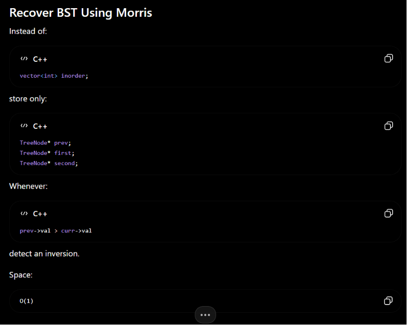
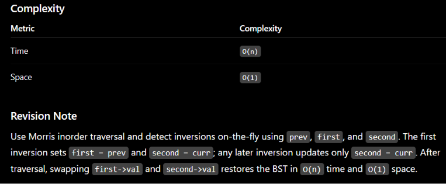
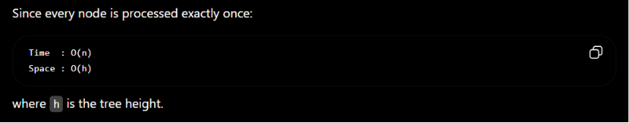

## 700. Search in a BST


```javascript
class Solution {
public:
    TreeNode* searchBST(TreeNode* root, int val) {
        while(root != nullptr && root->val != val)
        {
            root = val < root->val ? root->left : root->right;
        }

        return root;
    }
};
```


---

## 701. Insert in a BST

What if we didn't go to Null?

If we stopped early, we might end up with a structure that looks like a tree but fails a search. For example, if you inserted 7 as a middle child between 5 and 10 without going to the leaf, you might accidentally hide other nodes, making them unreachable during a standard search algorithm.By reaching NULL, we ensure that every insertion is a leaf insertion, which is the simplest way to maintain the tree's integrity without needing complex rotations (like those used in AVL or Red-Black trees).

### ***Iterative***


```javascript
Node* insert(Node* root, int val)
{
    Node* newNode = new Node(val);

    if(root == NULL)
        return newNode;

    Node* curr = root;

    while(true)
    {
        if(val < curr->data)
        {
            if(curr->left == NULL)
            {
                curr->left = newNode;
                break;
            }
            curr = curr->left;
        }
        else
        {
            if(curr->right == NULL)
            {
                curr->right = newNode;
                break;
            }
            curr = curr->right;
        }
    }

    return root;
}
```

### ***Recursive***


```javascript
TreeNode* insertIntoBST(TreeNode* root, int val) 
{
    if(root == nullptr)
        return new TreeNode(val);

    if(val < root->val)
        root->left = insertIntoBST(root->left, val);
    else
        root->right = insertIntoBST(root->right, val);

    return root;
}
```


---

## 98. Validate BST

***Wrong Intuition (Common Mistake)***

Many people check only:  `if(node->left<node && node->right>node)` this is **incorrect**.

***Correct Method: Range (Min-Max) Method***

Each node must lie in a **valid range**.


```javascript
class Solution {
public:
    bool check(TreeNode* root, long minVal, long maxVal)
    {
        if(root == nullptr)
            return true;

        if(root->val <= minVal || root->val >= maxVal)
            return false;

        return check(root->left, minVal, root->val) &&
               check(root->right, root->val, maxVal);

            
    }
    bool isValidBST(TreeNode* root) {
    
    //Range based logic using recursive (a common wrong intuition is checking only 
    //value of left and right children which is incorrect)

    return check(root, LONG_MIN, LONG_MAX);

    }
};
```


---

## 235. Lowest Common Ancestor of a Binary Search Tree

### ***Recursive***


```javascript
TreeNode* lowestCommonAncestor(TreeNode* root, TreeNode* p, TreeNode* q)
{
    if(root == nullptr)
        return nullptr;

    if(p->val < root->val && q->val < root->val)
        return lowestCommonAncestor(root->left, p, q);

    if(p->val > root->val && q->val > root->val)
        return lowestCommonAncestor(root->right, p, q);

    return root;
}
```

### ***Iterative***


```javascript
TreeNode* lowestCommonAncestor(TreeNode* root, TreeNode* p, TreeNode* q) 
{
    while(root != nullptr)
    {
        if(p->val < root->val && q->val < root->val)
            root = root->left;

        else if(p->val > root->val && q->val > root->val)
            root = root->right;

        else
            return root;
    }

    return nullptr;
}
```


---

## 450. Delete Node in BST


```javascript
1. Search for the node
2. If not found → return root
3. If found:
      Case 1: leaf → delete
      Case 2: one child → replace with child
      Case 3: two children → use inorder successor
      
| Method              | Replace with              |
| ------------------- | ------------------------- |
| Inorder successor   | smallest in right subtree |
| Inorder predecessor | largest in left subtree   |

Leaf → delete
1 child → connect parent to child
2 children → replace with successor and delete successor
```


```javascript
TreeNode* findMin(TreeNode* root)
{
    while(root->left)
        root = root->left;

    return root;
}

TreeNode* deleteNode(TreeNode* root, int key)
{
    if(root == nullptr)
        return nullptr;

    if(key < root->val)
        root->left = deleteNode(root->left, key);

    else if(key > root->val)
        root->right = deleteNode(root->right, key);

    else
    {
        // Case 1: No left child
        if(root->left == nullptr)
        {
            TreeNode* temp = root->right;
            delete root;
            return temp;
        }

        // Case 2: No right child
        else if(root->right == nullptr)
        {
            TreeNode* temp = root->left;
            delete root;
            return temp;
        }

        // Case 3: Two children
        TreeNode* successor = findMin(root->right);

        root->val = successor->val;

        root->right = deleteNode(root->right, successor->val);
    }

    return root;
}
```


---

## **109. Convert Sorted List to Binary Search Tree**

**O(NlogN)**


```c++
class Solution {
private:
    TreeNode* buildBST(ListNode* head) {
        if (head == nullptr) return nullptr;

        // Base case: only one node
        if (head->next == nullptr) {
            return new TreeNode(head->val);
        }

        ListNode* slow = head;
        ListNode* fast = head;
        ListNode* prev = nullptr;

        // Find middle node
        while (fast != nullptr && fast->next != nullptr) {
            prev = slow;
            slow = slow->next;
            fast = fast->next->next;
        }

        // slow = middle node
        // prev = node before middle

        // Disconnect left half
        if (prev != nullptr) {
            prev->next = nullptr;
        }

        TreeNode* root = new TreeNode(slow->val);

        // Left subtree from head to prev
        if (head != slow) {
            root->left = buildBST(head);
        }

        // Right subtree from slow->next onward
        root->right = buildBST(slow->next);

        return root;
    }

public:
    TreeNode* sortedListToBST(ListNode* head) {
        return buildBST(head);
    }
};
```

**O(N), O(N)**


```c++
class Solution {
private:
    TreeNode* buildBST(vector <int> &nums, int left, int right)
    {   
        if(left > right)
            return nullptr;

        int mid = left + (right - left)/2;
        TreeNode* root = new TreeNode(nums[mid]);

        root->left = buildBST(nums, left, mid - 1);
        root->right = buildBST(nums, mid + 1, right);

        return root;

    }
    
public:
    TreeNode* sortedListToBST(ListNode* head) {
    //We can convert the linked list to an array and then convert it to an array, then simply make BST from it

    if(head == nullptr)
        return nullptr;

    ListNode* temp = head;
    vector <int> nums;

    while(temp)
    {
        nums.push_back(temp->val);
        temp = temp->next;
    } 

    return buildBST(nums, 0, nums.size() - 1);
    }
};
```

**O(N)**


```c++
class Solution {
private:
    ListNode* current;

    TreeNode* buildBST(int left, int right) {
        if (left > right) return nullptr;

        int mid = left + (right - left) / 2;

        // Step 1: Build left subtree
        TreeNode* leftChild = buildBST(left, mid - 1);

        // Step 2: Root node
        TreeNode* root = new TreeNode(current->val);
        root->left = leftChild;

        // Move to next list node
        current = current->next;

        // Step 3: Build right subtree
        root->right = buildBST(mid + 1, right);

        return root;
    }

public:
    TreeNode* sortedListToBST(ListNode* head) {
        current = head;

        // Find length
        int n = 0;
        ListNode* temp = head;
        while (temp) {
            n++;
            temp = temp->next;
        }

        return buildBST(0, n - 1);
    }
};
```


---

## **1008. Construct Binary Search Tree from Preorder Traversal**

### Complexity

- **Time:** `O(n)`
- **Space:** `O(h)` recursion stack
- Balanced BST: `O(log n)`
- Skewed BST: `O(n)`

```c++
class Solution {
public:
    int idx = 0;

    TreeNode* build(vector<int>& preorder, int upperBound) {
        if (idx == preorder.size() || preorder[idx] > upperBound)
            return nullptr;

        TreeNode* root = new TreeNode(preorder[idx++]);

        root->left = build(preorder, root->val);
        root->right = build(preorder, upperBound);

        return root;
    }

    TreeNode* bstFromPreorder(vector<int>& preorder) {
        return build(preorder, INT_MAX);
    }
};
```


---

## **173. Binary Search Tree Iterator**

### Brute Force

O(N) Space Complexity due to storing full inorder array always


```c++
class BSTIterator {
private:
    vector<int> inorderArr;
    int ind = 0;

    void inorder(TreeNode* root) {
        if (!root) return;

        inorder(root->left);
        inorderArr.push_back(root->val);
        inorder(root->right);
    }

public:
    BSTIterator(TreeNode* root) {
        inorder(root);
    }

    int next() {
        return inorderArr[ind++];
    }

    bool hasNext() {
        return ind < inorderArr.size();
    }
};
```

### Optimal Solution

Using a `stack` to remove the space and get a O(1) solution

Instead of storing the entire inorder traversal, maintain a stack containing the path to the next smallest node. During initialization, push all left descendants from the root. For `next()`, pop the top node (the current smallest element) and, if it has a right child, push that child and all its left descendants onto the stack. This simulates inorder traversal lazily, ensuring each node is pushed and popped exactly once. As a result, `next()` runs in **amortized O(1)** time, `hasNext()` runs in **O(1)** time, and the extra space used is only **O(h)**, where `h` is the height of the BST.


```c++
class BSTIterator {
private:
    stack<TreeNode*> st;

    void pushLeft(TreeNode* node) {
        while (node) {
            st.push(node);
            node = node->left;
        }
    }

public:
    BSTIterator(TreeNode* root) {
        pushLeft(root);
    }

    int next() {
        TreeNode* node = st.top();
        st.pop();

        if (node->right) {
            pushLeft(node->right);
        }

        return node->val;
    }

    bool hasNext() {
        return !st.empty();
    }
};
```


---

## **99. Recover Binary Search Tree**

### Brute Force (Without Morris)

Rule:

- First wrong node = first element of the first inversion.
- Second wrong node = second element of the last inversion.
After finding them, simply swap their values.


```c++
class Solution {
public:
    vector<TreeNode*> inorderNodes;

    void inorder(TreeNode* root) {
        if (!root) return;

        inorder(root->left);
        inorderNodes.push_back(root);
        inorder(root->right);
    }

    void recoverTree(TreeNode* root) {

        inorder(root);

        TreeNode* first = nullptr;
        TreeNode* second = nullptr;

        for (int i = 0; i < inorderNodes.size() - 1; i++) {

            if (inorderNodes[i]->val > inorderNodes[i + 1]->val) {

                if (!first)
                    first = inorderNodes[i];

                second = inorderNodes[i + 1];
            }
        }

        swap(first->val, second->val);
    }
};
```

### Optimal Solution

This question uses a very important technique called the morris traversal whose theory and algo can be found in the below page ⬇️⬇️⬇️

Untitled 


```c++
Generate inorder one node at a time
↓
Immediately detect inversions
↓
Never store traversal
```








```c++
class Solution {
public:
    void recoverTree(TreeNode* root) {

        TreeNode *first = nullptr;
        TreeNode *second = nullptr;
        TreeNode *prev = nullptr;

        TreeNode *curr = root;

        while (curr) {

            if (curr->left == nullptr) {

                // Process current node
                if (prev && prev->val > curr->val) {

                    if (!first)
                        first = prev;

                    second = curr;
                }

                prev = curr;
                curr = curr->right;
            }
            else {

                TreeNode *pred = curr->left;

                while (pred->right && pred->right != curr)
                    pred = pred->right;

                if (pred->right == nullptr) {

                    // Create thread
                    pred->right = curr;
                    curr = curr->left;
                }
                else {

                    // Remove thread
                    pred->right = nullptr;

                    // Process current node
                    if (prev && prev->val > curr->val) {

                        if (!first)
                            first = prev;

                        second = curr;
                    }

                    prev = curr;
                    curr = curr->right;
                }
            }
        }

        swap(first->val, second->val);
    }
};
```


```c++

                    // Process current node
                    if (prev && prev->val > curr->val) {

                        if (!first)
                            first = prev;

                        second = curr;
                    }

                    prev = curr;
```


---

## **1373. Maximum Sum BST in Binary Tree**

‼️‼️‼️‼️‼️‼️‼️ Theory in ‼️‼️‼️‼️‼️‼️‼️‼️‼️‼️

Tree DP 

For every node, return 4 pieces of information:


```plain text
isBST
minValue
maxValue
sum
```

If left and right subtrees are BSTs and:


```plain text
left.maxVal<root->val<right.minVal
```

then current subtree is also a BST.

Compute:


```plain text
sum =left.sum+right.sum+root->val
```

and update the global answer.

This is a classic **bottom-up tree DP**.





Use postorder DFS where each node returns `{isBST, minVal, maxVal, sum}`. A subtree is a BST if both children are BSTs and `left.maxVal < root->val < right.minVal`. When valid, compute its sum and update the global maximum. This bottom-up DP processes each node once, giving `O(n)` time and `O(h)` space.


`minVal` and `maxVal` represent:

They are needed so that the parent can verify the BST property.


```c++
class Solution {
private:
    int ans = 0;

    struct NodeInfo {
        bool isBST;
        int minVal;
        int maxVal;
        int sum;
    };

    NodeInfo dfs(TreeNode* root) {

        if (!root) {
            return {true, INT_MAX, INT_MIN, 0};
        }

        NodeInfo left = dfs(root->left);
        NodeInfo right = dfs(root->right);

        if (left.isBST &&
            right.isBST &&
            left.maxVal < root->val &&
            root->val < right.minVal) {

            int currSum = left.sum + right.sum + root->val;

            ans = max(ans, currSum);

            return {
                true,
                min(root->val, left.minVal),
                max(root->val, right.maxVal),
                currSum
            };
        }

        return {false, INT_MIN, INT_MAX, 0};
    }

public:
    int maxSumBST(TreeNode* root) {

        dfs(root);

        return ans;
    }
};
```


---

🔗 **References**
- Untitled → https://app.notion.com/p/31a0eb7a3bc38041b9d9e00d21307f75
- Tree DP → https://app.notion.com/p/3850eb7a3bc38096a6dae6a647d096e1

