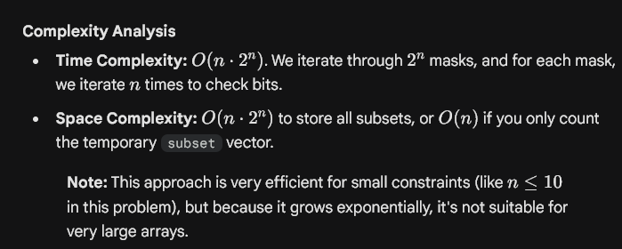
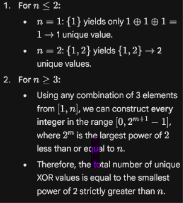

## **231. Power of Two**


```javascript
class Solution {
public:
    bool isPowerOfTwo(int n) {

        return n > 0 && (n & n - 1) == 0;
        //After clearing the rightmost set bit number should be zero
    }
};
```


---

## **29. Divide Two Integers**


```javascript
class Solution {
public:
    int divide(int dividend, int divisor) {
        // Handle overflow case: -2147483648 / -1
        if (dividend == INT_MIN && divisor == -1) {
            return INT_MAX;
        }

        // Determine the sign of the result
        // true if result is negative
        bool isNegative = (dividend < 0) ^ (divisor < 0);

        // Use long long to prevent overflow during absolute conversion
        long long absDividend = abs((long long)dividend);
        long long absDivisor = abs((long long)divisor);
        long long quotient = 0;

        while (absDividend >= absDivisor) {
            long long tempDivisor = absDivisor;
            long long multiple = 1;

            // Double the divisor until it's larger than the remaining dividend
            while (absDividend >= (tempDivisor << 1)) {
                tempDivisor <<= 1;
                multiple <<= 1;
            }

            absDividend -= tempDivisor;
            quotient += multiple;
        }

        return isNegative ? -quotient : quotient;
    }
};
```


---

## **2220. Minimum Bit Flips to Convert Number**


```javascript
class Solution {
public:
    int minBitFlips(int start, int goal) {

    //XOR logic, wherever bits are different XOR returns 1, then we count number of ones in the res

    int res = start ^ goal;

    //Counting number of set bits
    int cnt = 0;

    while(res != 0)
    {
        res = res & (res - 1);       //Removing last set bit
        cnt++;
    }

    return cnt;
    }
};

```


```javascript
class Solution {
public:
    int minBitFlips(int start, int goal) {

    return __builtin_popcount(start ^ goal);
    }
};
```


---

1. Subsets
For an array of size $n$, there are $2^n$ possible subsets (the power set). Each number from $0$ to $2^n - 1$ can be viewed as a "mask" where the $i^{th}$ bit tells you whether to include `nums[i]` in a specific subset.


| Mask (Binary) | Mask (Decimal) | Bit logic | Subset |
| --- | --- | --- | --- |
| 000 | 0 | No bits set | [] |
| 001 | 1 | 0th bit set | [1] |
| 010 | 2 | 1st bit set | [2] |
| 011 | 3 | 0th and 1st bits set | [1, 2] |
| ... | ... | ... | ... |
| 111 | 7 | All bits set | [1, 2, 3] |


---





```c++
class Solution {
public:
    vector<vector<int>> subsets(vector<int>& nums) {

        // Get the size of the input array
        int n = nums.size();

        // Calculate the total number of subsets (2^n) using bitwise shift
        int subsets = 1 << n;

        // Vector to store all subsets
        vector<vector<int>> ans;

        // Iterate through all numbers from 0 to 2^n - 1
        for (int num = 0; num < subsets; num++) {
            // Temporary vector to hold the current subset
            vector<int> subset;

            // Iterate through each bit of the number
            for (int i = 0; i < n; i++) {
                // If the ith bit is set, include nums[i] in the subset
                if (num & (1 << i)) {
                    subset.push_back(nums[i]);
                }
            }

            // Add the constructed subset into the result
            ans.push_back(subset);
        }

        // Return all subsets
        return ans;
    }
};
```


---

## **190. Reverse Bits**


```c++
class Solution {
public:
    int reverseBits(int n) {

    int res = 0;

    for(int i = 0; i < 32; i++)
    {
        res <<= 1;
        res |= (n & 1);

        n >>= 1;
    }   
    
    return res;
    }
};
```


---

## 461. Hamming Distance


```c++
class Solution {
public:
    int hammingDistance(int x, int y) {

    int ans = (x ^ y);

    return __builtin_popcount(ans);    
    }
};
```


---

## **3513. Number of Unique XOR Triplets I**





```c++
class Solution {
public:
    int uniqueXorTriplets(vector<int>& nums) {
        int n = nums.size();
        if (n <= 2) return n;
        
        //Using any combination of 3 elements from [1, n], we can construct every integer in the range 
//        [0, 2^{m+1} - 1], where 2^m is the largest power of 2 less than or equal to n.
        //smallest power of 2 strictly greater than n
        int p = 1;
        while (p <= n) {
            p <<= 1;
        }
        return p;
    }
};
```

