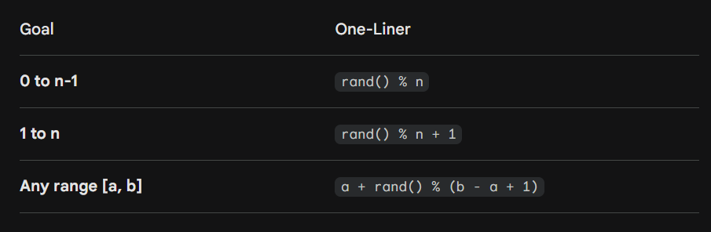
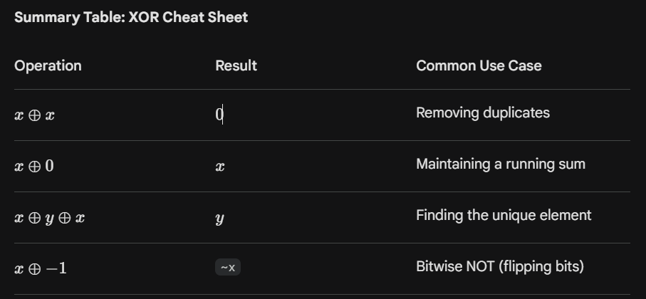
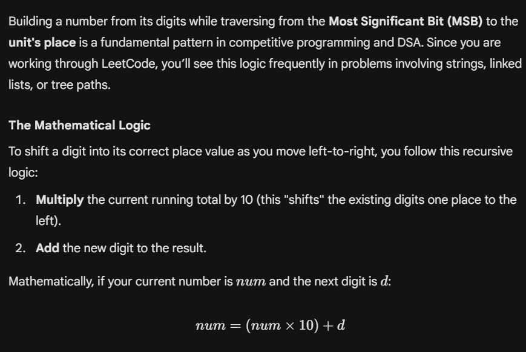
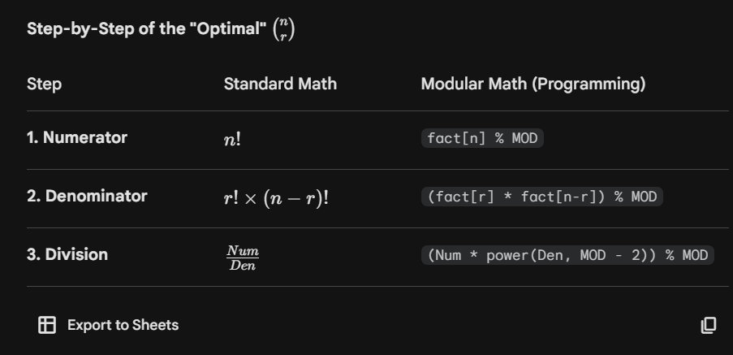
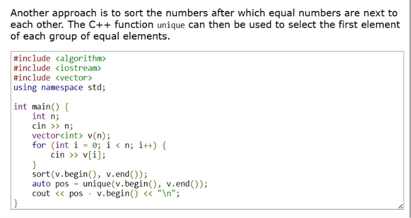
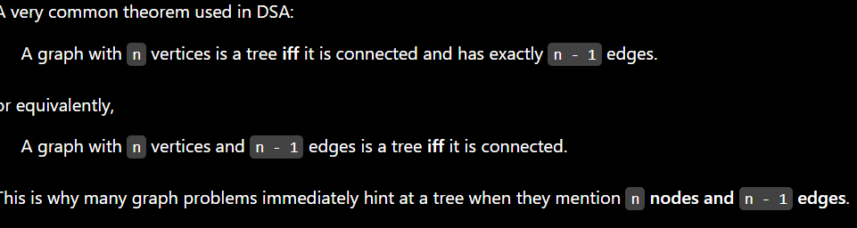

# General Notes for Questions 


# Traversal in Unordered Map


```javascript
vector<vector<string>> result;
for (auto& [key, group] : groups) {
    result.push_back(group);
}

vector<vector<string>> result;
        for (auto& pair : anagramMap) {
            result.push_back(pair.second);
        }

```

We cannot use a vector as a key in a map.

 In C++, `std::unordered_map` uses a **hash table** under the hood. For a type to be used as a key in an `unordered_map`, the compiler needs two things:
1. **A Hash Function:** A way to turn the key into a size_t integer.
2. **An Equality Operator:** A way to check if two keys are identical (`==`).
While `std::vector` has the equality operator, **C++ does not provide a default hash function for vectors.** ### Why isn't there a default hash for vectors?
Hashing a container like a vector is computationally expensive ($O(N)$), and since vectors are mutable (they can change size or content), hashing them can be risky if the user isn't careful. The C++ committee decided not to provide a "one-size-fits-all" hash for containers to avoid hidden performance traps.

- 






# Sum calculation


`int sum = accumulate(weights.begin(), weights.end(), 0);`

# Rotating a Matrix


- Transpose the given matrix
- Reverse each row
# NOTES


- For lower computation time, use `int count[26] = {0}` instead of `vector <int> count(26, 0)`
# How to build a number when digits are given ?




# Formula for 2^N - 1


- `(1 << leftHeight) - 1; // Formula: 2^height - 1`
# Calculation of nCr




- `abs(i - j) + abs(j - k) + abs(k - i) = 2 * (k - i)`
Assuming i, j, k are distinct indices


```c++
// Creates an m x n grid filled with -1
vector<vector<int>> dis(m, vector<int>(n, -1));
```

- Counting Inversions is a very important application of merge sort
- The total inversion count is the sum of:
- Inversions in the left half
- Inversions in the right half
- Inversions across the halves (counted during merge)
- The number of diagonals in a `N x N` grid is `2*N - 1` 
# Search Pruning


# Flattening a 2D matrix


To do this mapping, if there are `m` columns in the matrix and the index is `i`, then:

- **Row** = `i / m`
-  **Column** = `i % m`.
# **Bitwise XOR Partner Trick**


The formula `partner = x ^ 1` flips the least significant bit of a number. This operation maps **even numbers** (ending in `0`) to the next odd number ($x + 1$) and **odd numbers** (ending in `1`) to the previous even number ($x - 1$). It creates seamless $O(1)$ mutual pairs (`0↔1`, `2↔3`, `4↔5`), which is highly useful for instantly finding twin edges or sibling nodes in DSA.

# .find()


In C++, the `.find()` function is a member of the `std::string` class. Its primary job is to search for a substring or a character within a string. If it finds what you're looking for, it returns the index of the first occurrence. If it doesn't, it returns a special constant.

Here is everything you need to know to master it.

### ## The Basics: Syntax and Return Values

The basic syntax looks like this:

C++

# 


```plain text
size_t index = str.find(substring_or_char, start_position);
```

- `substring_or_char`: What you want to search for (can be another `std::string`, a C-style string `"like this"`, or a single character `'a'`).
- `start_position` *(Optional)*: The index where the search should begin. Defaults to `0` (the start of the string).
Because string sizes can be very large, `.find()` returns a type called `size_t` (an unsigned integer).

- **If found:** It returns the `0`indexed position of the match.
- **If NOT found:** It returns a special constant called `std::string::npos`. Since `size_t` is unsigned, `npos` represents the largest possible value for that type (usually `1` cast to an unsigned int, resulting in a huge number like `4294967295`).
### ## Code Example: How to Use It

Here is a clean, practical example showing how to search for a substring and how to handle the "not found" case.

C++

# 


```plain text
#include <iostream>
#include <string>

int main(){
    std::string text = "Coding in C++ is incredibly fun!";
    std::string target = "C++";

    // 1. Basic Search
    size_t foundPos = text.find(target);

    if (foundPos != std::string::npos) {
        std::cout << "'" << target << "' found at index: " << foundPos << "\n";
    } else {
        std::cout << "'" << target << "' was not found.\n";
    }

    // 2. Searching for a single character
    size_t charPos = text.find('i');
    std::cout << "First 'i' found at index: " << charPos << "\n";

    // 3. Searching with a starting offset
    // This skips the first 'i' (at index 3) and starts looking from index 4
    size_t nextCharPos = text.find('i', 4);
    std::cout << "Next 'i' found at index: " << nextCharPos << "\n";

    return 0;
}
```

**Output:**

Plaintext

# 


```plain text
'C++' found at index: 10
First 'i' found at index: 3
Next 'i' found at index: 7
```

### ## Variations of `.find()`

The `std::string` class also provides a few handy variations depending on exactly *how* or *what* you want to search:


| Function | What it does |
| --- | --- |
| str.rfind() | Searches backwards (from right to left). Finds the last occurrence. |
| str.find_first_of() | Finds the first character that matches any character in the given string. |
| str.find_last_of() | Finds the last character that matches any character in the given string. |
| str.find_first_not_of() | Finds the first character that does not match any character in the given string. |


If you want to find the first vowel in a sentence:

C++

# 


```plain text
std::string text = "Hello World";
size_t pos = text.find_first_of("aeiouAEIOU"); // Returns 1 (index of 'e')
```

# Important


Intuition of Backtracking → Most of the times when you are maintaining two vectors curr and ans in the recursive function, you have to backtrack (`.pop_back()`). This is because we pass the curr_vector by reference, and hence we need to clean the current choice so that new choices can be made for the current index, otherwise all recursion trees would use the same curr vector.

eg:


```c++
class Solution {
private:
    void dfs(TreeNode* root, int targetSum, vector<int>& currentPath, vector<vector<int>>& result) {
        if (!root) return;

        currentPath.push_back(root->val);

        if (!root->left && !root->right && targetSum == root->val) {
            result.push_back(currentPath);
        } else {
            dfs(root->left, targetSum - root->val, currentPath, result);
            dfs(root->right, targetSum - root->val, currentPath, result);
        }

        currentPath.pop_back();
    }

public:
    vector<vector<int>> pathSum(TreeNode* root, int targetSum) {
        vector<vector<int>> result;
        vector<int> currentPath;
        dfs(root, targetSum, currentPath, result);
        return result;
    }
};
```

- Note:
Whenever questions ask max of mins, or mins of max, then always binary search comes into picture.

# Code to learn something from


```c++
class Solution {
public:
    vector<int> findClosestElements(vector<int>& arr, int k, int x) {
        
        // lower_bound gives the first element >= x
        auto it = lower_bound(arr.begin(), arr.end(), x);
        int r = distance(arr.begin(), it);
        int l = r - 1;

        
        while (k > 0) {
            
            if (l < 0)                
                r++;
            else if (r >= arr.size())
                l--;
            else if (abs(arr[l] - x) <= abs(arr[r] - x))
               l--;
            else
                r++;
            
            k--;
        }

        // Step 3: Return the subarray bounded between l + 1 and r - 1
        return vector<int>(arr.begin() + l + 1, arr.begin() + r);
    }
};
```

# A revision-friendly rule


Whenever you're stuck converting memoization to tabulation, answer these four questions:

1. **What is my DP state?**
- (`solve(n)` → `dp[n]`, `solve(i,j)` → `dp[i][j]`)
1. **Which states does it depend on?**
- Smaller indices? Fill forward.
- Larger indices? Fill backward.
- Previous row/column? Fill in that order.
1. **What are the base cases?**
- Convert every recursive base case into an initialization in the DP table.
1. **Replace every **`solve(...)`** with **`dp[...]`** and wrap it inside loops** that ensure those dependent states are already computed.
# Finding number of distinct numbers




# Normalizing remainder for negative numberrs


# A mental checklist for subarray mini or maxi problems


When you see a problem involving the **sum of minima/maxima over all subarrays**, train yourself to go through these questions:

1. **Can I count contributions instead of enumerating subarrays?**
1. **For each element, what is the largest range where it remains the minimum (or maximum)?**
1. **What stops that range?** (Usually the previous/next smaller or greater element.)
1. **Can a monotonic stack find those boundaries in O(n)?**
1. **How should I handle duplicates?** (Choose one side to be strict and the other non-strict.)

---

## Flattening a 2D matrix to 1D matrix

let\ n\ =\ no.\ of\ columns

then,\ index(1D)\ =\ (i\ *\ n) \ + j

## Recovering a 1D matrix to 2D

r\ = index_{1D}\ /\ n

c\ = index_{1D}\ (mod\ n)


---


---

# Correct Way to think about DP problems


Instead of asking

Ask

Imagine you're writing a game save file.

The save file should contain just enough information to resume the game.

That save file is the DP state.

Not the recursion.

Not the transitions.

Just the minimum information needed to continue.


| DP Family | Typical State |
| --- | --- |
| Linear DP | i |
| Knapsack | i, capacity |
| Subsequences | i, prev |
| Grid DP | i, j |
| Interval DP | l, r |
| String DP | i, j |
| Tree DP | node, parent/state |
| Bitmask DP | mask, last |
| Digit DP | position, tight, started |


## A mental checklist for every new DP problem

Whenever you open a new DP question, resist writing recursion immediately. Instead, go through these questions in order:

1. **What is the objective?** (maximize, minimize, count, check existence)
1. **What changes as I make progress?** (index, position, day, interval, mask, etc.)
1. **If I paused here, what information would I need to resume optimally?** (this is the state)
1. **From this state, what valid moves are possible?** (these are the transitions)
1. **What are the base cases?**
1. **Can overlapping subproblems occur?** (if yes, memoize or tabulate)
# Relation between indices after rotating array


## Finding index of number in rotated array in the original array

Say, k = rotation in clockwise order, then

arr_k[i] = arr[(k - i + n)\  \%\ n

# Determining size of dp table in case of bitmask as one the parameter


```c++
vector<int> dp(1 << (n + 1), -1);

//1 << (n + 1) is the key here
```




https://leetcode.com/problems/minimum-ascii-delete-sum-for-two-strings/?envType=problem-list-v2&envId=dynamic-programming

When `s1[i] != s2[j]`, you can:

- Delete `s1[i]` → `dp[i-1][j] + ASCII(s1[i])`
- Delete `s2[j]` → `dp[i][j-1] + ASCII(s2[j])`
You **do not need a separate **`delete both`** transition**.

Why? Because deleting both is already covered by doing the two deletions sequentially:

(remember this for future such type of questions), though even if you do so , it will be covered in the dp state


---

🔗 **References**
- https://leetcode.com/problems/minimum-ascii-delete-sum-for-two-strings/?envType=problem-list-v2&envId=dynamic-programming → https://leetcode.com/problems/minimum-ascii-delete-sum-for-two-strings/?envType=problem-list-v2&envId=dynamic-programming

