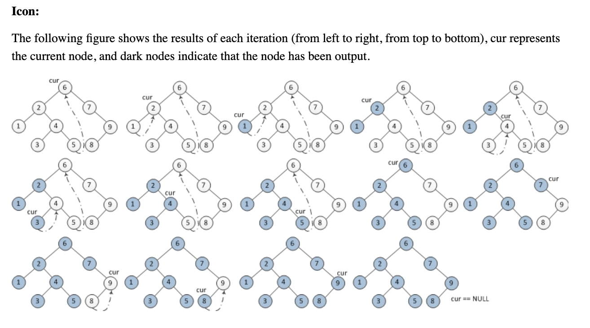
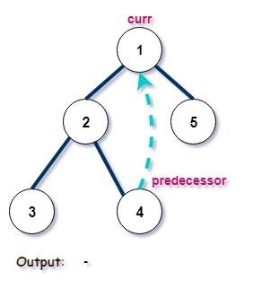
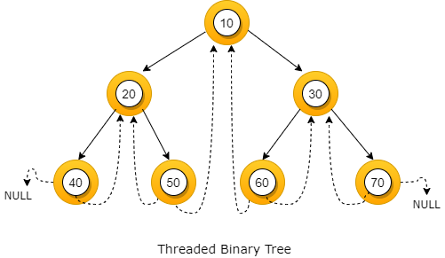
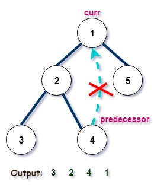

# Most condensed Algorithm (Inorder Morris Traversal)


- Start with the `root` as `curr` node and iterate until we reach `nullptr`
- If `curr` has `no left child` 
- ***Add**** the node to the *`inorder array`* *
- Move to the right child
- else
- Find **inorder predecessor** ( `pred` ) of `curr` node
- If thread not created yet from `pred` to `curr`  ( pred->right == nullptr )
- Create thread
- Move `curr` to left subtree
- If thread exists ( pred→right ≠ nullptr )
- Remove thread
- ***Add**** the node to the *`inorder array`* *
- Move `curr` to right subtree
## Morris Traversal (Binary Tree)**Morris Traversal** is a method to traverse a binary tree **without recursion and without using a stack**, while still keeping **O(n) time complexity** and **O(1) extra space**.













It works by **temporarily modifying the tree structure** (creating temporary links called *threads*) so that we can return to nodes after exploring their left subtree.

This technique is mainly used for **inorder traversal**, but it can also be adapted for **preorder traversal**.


---

# Core Idea


Normally, inorder traversal uses:

- recursion → uses call stack
- stack → explicitly stores nodes
**Morris traversal avoids both.**

Instead it:

1. Finds the **inorder predecessor** of a node.
1. Creates a **temporary link from the predecessor to the current node**.
1. Uses that link to come back later.
1. Removes the link after visiting.
So the tree is **restored to its original structure** at the end.


---

# Inorder Morris Traversal Algorithm


Let `curr = root`.

### Case 1: Left child does NOT exist

- Visit the node and add it to the ans.
- Move to the right child : `curr = curr->right`

---

### Case 2: Left child exists

Find the **inorder predecessor** (rightmost node in left subtree).

Two possibilities:

Create a thread back to current node.


```plain text
predecessor->right = curr
curr = curr->left
```


---

This means the left subtree is already processed.

So remove link and add the node.

So:


```plain text
predecessor->right = NULL
visit(curr)
curr = curr->right
```


---

# C++ Code (Inorder Morris Traversal)


```c++
vector<int> morrisInorder(TreeNode* root) {

    vector<int> ans;

    TreeNode* curr = root;

    while (curr != NULL) {

        // Case 1: If no left child
        if (curr->left == NULL) {

            // Visit the node
            ans.push_back(curr->val);

            // Move to right child
            curr = curr->right;
        }

        else {

            // Find inorder predecessor
            TreeNode* pred = curr->left;

            while (pred->right != NULL && pred->right != curr) {
                pred = pred->right;
            }

            // Case 1: Thread not created yet
            if (pred->right == NULL) {

                // Create temporary thread
                pred->right = curr;

                // Move to left subtree
                curr = curr->left;
            }

            // Case 2: Thread already exists
            else {

                // Remove the thread
                pred->right = NULL;

                // Visit node
                ans.push_back(curr->val);

                // Move to right subtree
                curr = curr->right;
            }
        }
    }

    return ans;
}
```


---

# Time and Space Complexity


| Metric | Complexity |
| --- | --- |
| Time | O(n) |
| Space | O(1) |
| Tree modification | Temporary |


Each edge is visited **at most twice**.


---

# Why Morris Traversal is Important


It is often asked in **top product company interviews** because it shows deep understanding of tree traversal.

Typical problems:

- **Inorder traversal without stack**
- **Kth smallest element in BST**
- **Recover BST**
- **BST validation**

---

# Quick Example


Tree:


```plain text
    4
   / \
  2   5
 / \
1   3
```

Inorder output:


```plain text
1 2 3 4 5
```

Morris traversal produces this **without recursion or stack**.


---

# Preorder Morris Traversal (Key Difference)


Only change:

When creating the thread, **visit the node immediately**.


```plain text
visit(curr)
pred->right = curr
curr = curr->left
```


---

✅ **One-line crux:**

Morris Traversal uses **temporary threaded links to inorder predecessors** so the tree can be traversed **in O(1) space without recursion or stack**.


---

# So the real question is how can we use Morris Traversal for O(1) space without storing the entire array ?


Morris Traversal is not an algorithm by itself; it is an inorder traversal technique that allows you to process nodes on-the-fly in O(1) extra space.

## Core Insight

The purpose of Morris Traversal is **not** to generate an inorder array.

The purpose is to visit nodes in inorder order while maintaining only a few variables.

Instead of: `vector<int>inorder`

do: `process(curr)`

when the node is visited.

This `process` is a code snippet/ function which depends on the question .

## Generic O(1) Morris Template


```c++
TreeNode* curr = root;

while(curr){

    if(curr->left == nullptr){

        process(curr);

        curr = curr->right;
    }
    else{

        TreeNode* pred = curr->left;

        while(pred->right && pred->right != curr)
            pred = pred->right;

        if(pred->right == nullptr){

            pred->right = curr;
            curr = curr->left;
        }
        else{

            pred->right = nullptr;

            process(curr);

            curr = curr->right;
        }
    }
}
```

