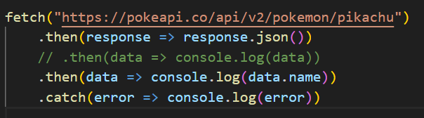

## 👉 What `response.json()` actually does

When you do:

`.then(response => response.json())`

**you are NOT getting JSON anymore.**

`response.json()` **parses (converts) the JSON text into a normal JavaScript object.**

So the sequence is:


| Stage | What the data is |
| --- | --- |
| Server response | Raw HTTP response |
| response.json() | JSON → JavaScript Object ✅ |
| data in next .then() | A plain JavaScript object |


---

## Why `data.name` works

After this line runs:


```javascript
.then(response => response.json())

```

Suppose the server sent this JSON:


```json
{
  "name": "pikachu",
  "height": 4
}

```

`response.json()` converts it internally to:


```javascript
{
  name: "pikachu",
  height: 4
}

```

Now this is **a JavaScript object**, so you *can* use the dot operator:


```javascript
data.name   // "pikachu"
data.height // 4

```

That’s why this works:


```javascript
.then(data => console.log(data.name))

```


---

## Important distinction (this is the core idea)


| Thing | Can you use . ? | Why |
| --- | --- | --- |
| JSON (string) ❌ | NO | It’s just text |
| Parsed JS Object ✅ | YES | It has properties |


Example:


```javascript
// ❌ This is JSON (string)
let jsonText = '{"name":"pikachu"}';
// jsonText.name  -> ❌ ERROR

// ✅ After parsing:
let obj = JSON.parse(jsonText);
console.log(obj.name); // ✅ works

```

`response.json()` is basically doing this internally.


---

## If you want to *see* this difference yourself

Try:


```javascript
fetch("https://pokeapi.co/api/v2/pokemon/pikachu")
  .then(res => res.text())   // 👈 keep it as JSON string
  .then(txt => console.log(txt.name)); // ❌ undefined

```

But:


```javascript
fetch("https://pokeapi.co/api/v2/pokemon/pikachu")
  .then(res => res.json())   // 👈 converts to object
  .then(obj => console.log(obj.name)); // ✅ "pikachu"

```


---

## One-line crux

If you want, I can draw a small visual diagram of this conversion.

