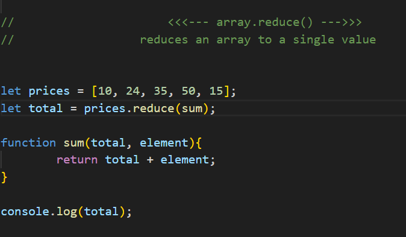

---




# 🔹 Why this works without initializing `total = 0`


### Code:


```javascript
let prices = [10, 24, 35, 50, 15];
let total = prices.reduce(sum);

function sum(total, element){
    return total + element;
}
```


---

## 🔥 Key rule of `reduce()` (this is the answer)

When you **do not provide an initial value**, JavaScript does this automatically:

That’s it.


---

# 🧠 Internally, JS rewrites your reduce like this


Since you didn’t pass an initial value:


```javascript
prices.reduce(sum);
```

JavaScript internally behaves as if:


```javascript
let accumulator = prices[0]; // 10
start loop from index 1
```

So the first call is NOT:


```javascript
sum(0, 10)
```

Instead it is:


```javascript
sum(10, 24)
```


---

# 🔁 Step-by-step execution


Array:


```plain text
[10, 24, 35, 50, 15]
```


---

### ✅ Step 1 (automatic)


```plain text
accumulator = 10
current element = 24
```

Call:


```javascript
sum(10, 24) → 34
```


---

### Step 2


```plain text
accumulator = 34
current element = 35
```

Call:


```javascript
sum(34, 35) → 69
```


---

### Step 3


```javascript
sum(69, 50) → 119
```


---

### Step 4


```javascript
sum(119, 15) → 134
```


---

### Final result:


```plain text
total = 134
```


---

# 🔹 So your main doubt answered directly


Because:


```plain text
total = first element of array
element = second element
```

There is **no undefined**, no zero, no garbage value.

JavaScript **chooses it deliberately**.


---

# 🔴 Important rule (very exam / interview relevant)


If you do NOT pass an initial value:


```javascript
array.reduce(callback)
```

Then:


| reduce parameter | value |
| --- | --- |
| accumulator | array[0] |
| currentValue | array[1] |


---

# ✅ If you DO pass initial value


```javascript
prices.reduce(sum, 0);
```

Then execution becomes:


| accumulator | current |
| --- | --- |
| 0 | 10 |
| 10 | 24 |
| 34 | 35 |
| 69 | 50 |
| 119 | 15 |


So now reduce starts from index 0.


---

# ⚠️ Why passing initial value is recommended


Because this fails:


```javascript
[].reduce(sum);
```

❌ TypeError: Reduce of empty array with no initial value

But this works:


```javascript
[].reduce(sum, 0);
```

✅ returns 0


---

# 🧠 Final mental model (remember this)


---

# ✅ One-line golden explanation


Once you understand this, `reduce()` becomes extremely intuitive.

If you want next, I can explain **why reduce is called reduce**, or **draw the accumulator flow diagram**, or **show real interview-style reduce questions**.

