# Why nodeJS ?


- You can run JS outside of the browser
- JS can talk to native machine due to c++
- You can create web servers in JS
# What is nodeJS ?


NodeJs is a runtime environment for JavaScript

NOTE: While creating nodeJS, all DOM manipulation elements were removed, like in nodeJS we don’t have window element or alert, etc.

# Basic Commands


```javascript
node file_name        //to run a program
npm init              //to initialize a node project
npm run script_name   //Can be used to run a script from package.json
//Note that we can also create our custom scripts in package.json and run them

const var_name = require("module_path (file_path)")
//This is used to import different functionalities on the top of a file

module.exports = "...."
//Used to export functions, anything else from a module/file so that it can be imported
//through require

//To export multiple functions we can use JS objects 
```

# File Handling


`const fs = require('fs')`

### Difference between sync and async file calls


```javascript
In synchronous file methods, it returns the result to a variable
, but in asynchronous it does not return the result to the variable.

In async calls we need a callback function as an argument in which we can handle the
result and errors 
```

# Architecture of NodeJS ?


- Client makes a request to out NodeJS server

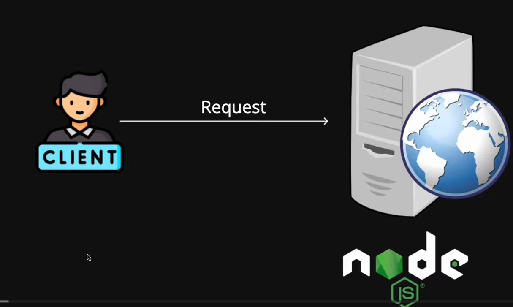

- Requests get added to a Event Queue

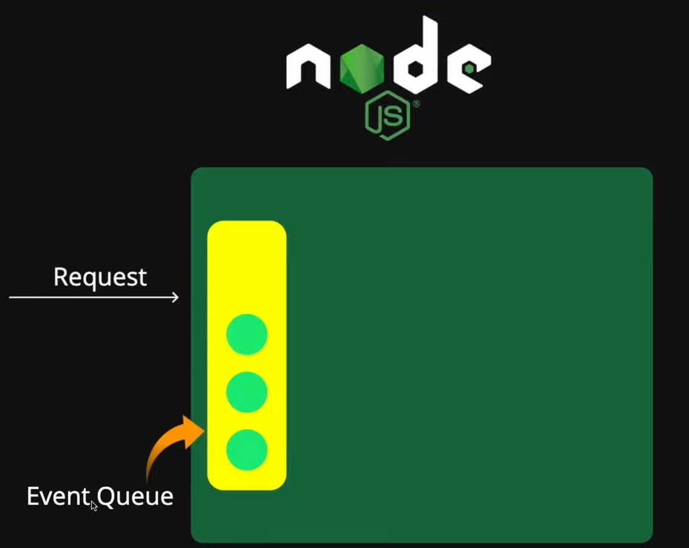

- Now these requests from the queue go into the Event Loop — keeps watching the event queue for any incoming request

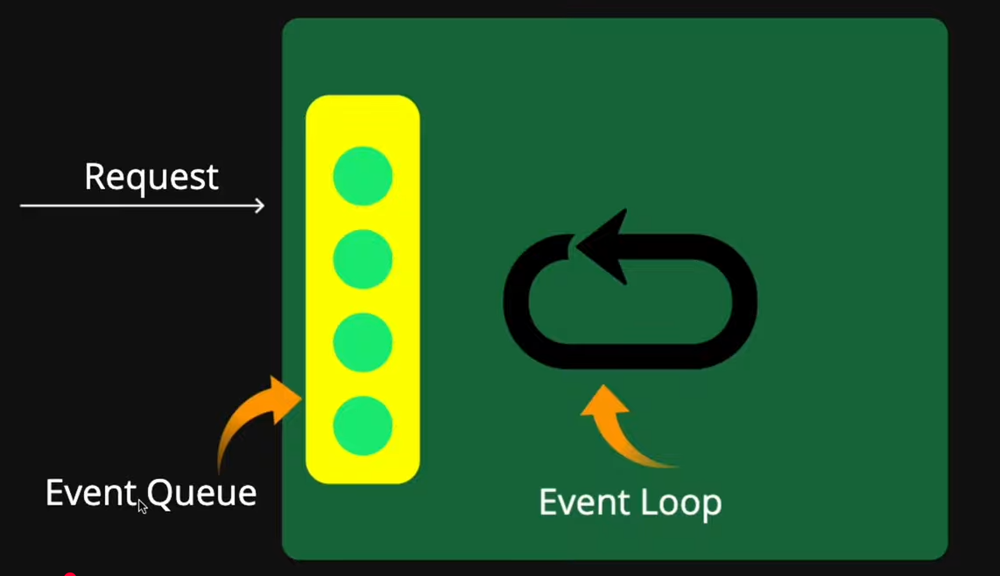

- These requests can be of two types :
- Blocking/Synchronous Operations/Request
- These requests block the thread, hence any further task cannot be executed until this is done
- Non - Blocking/Asynchronous Operations/Requests 
- If request is non-blocking, the event loop processes the request and returns the result to the client.
- For Blocking request, the below happens (generally 4 threads by default) and max threads are max cores in your machine/server

```c++
const os = require('os');
console.log(os.cpus().length)     //Print cores/max threads availabl
```


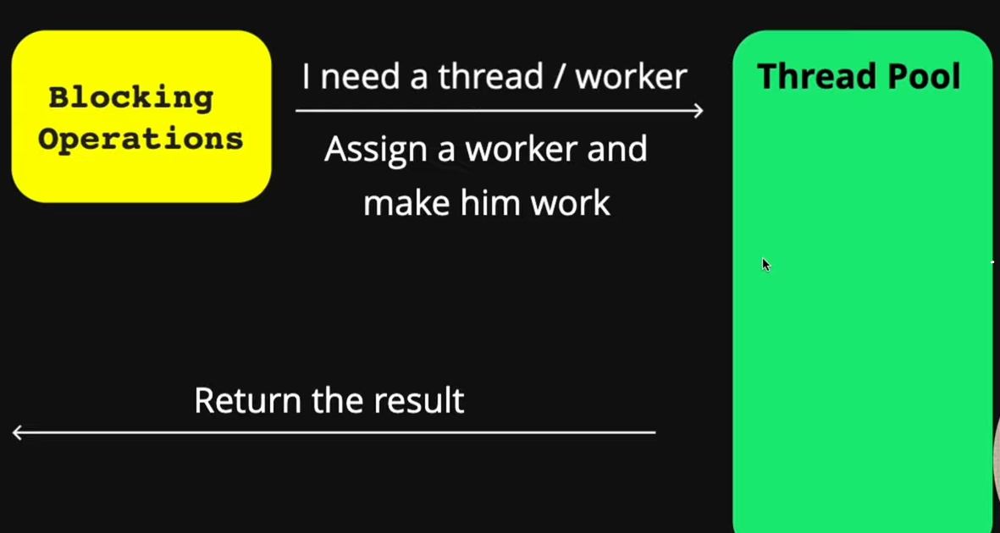


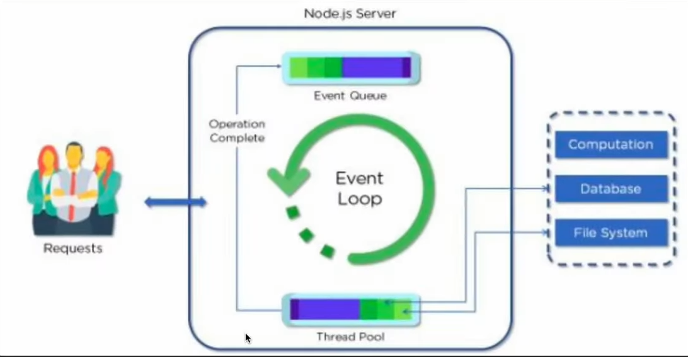

# Building HTTP server in NodeJS


Related Directory : `D:\MERN\Node-JS\server`

# URL’s


- Anything after space bar is part of Query Parameters
- You cannot have spaces in URL

---

# HTTP Methods


`index_v3.js`


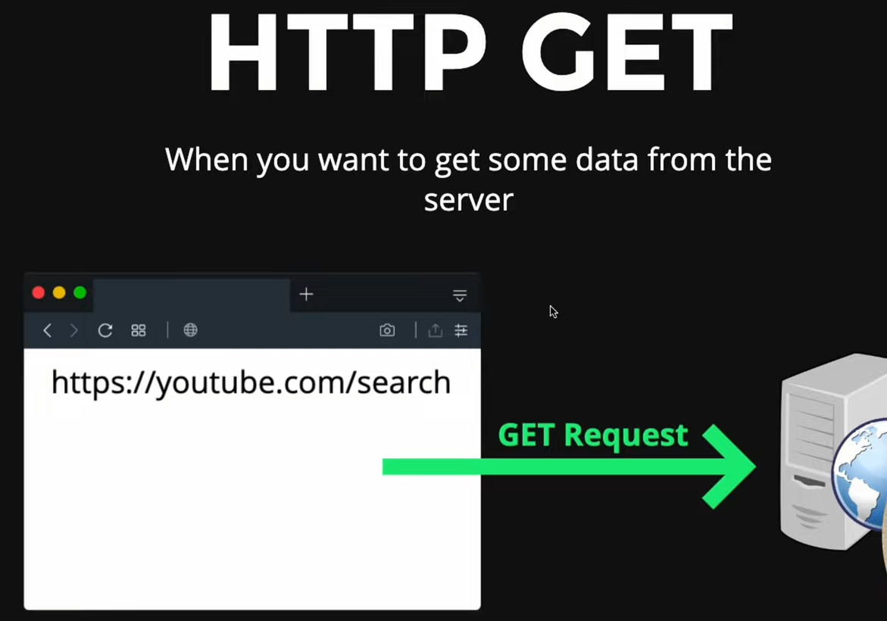


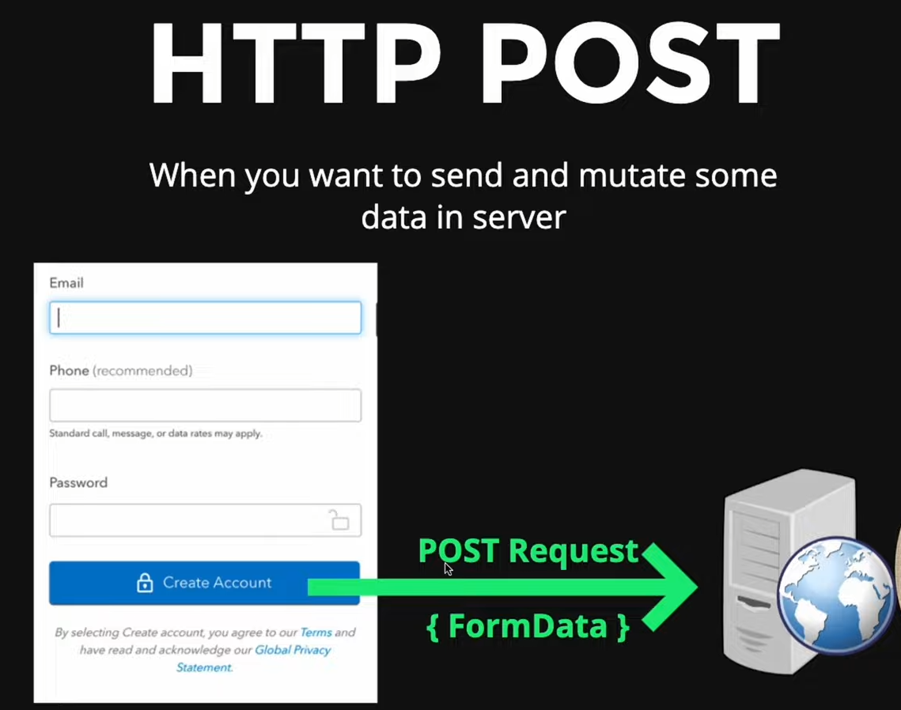

**POST **- Generally used in forms / login pages

**PUT - **For file uploads to the server/database

**PATCH** - For changing some already existing entry on the database.

DELETE - For deleting some already existing entry in the database.


---

# EXPRESS Framework


## What is need of Express when HTTP server can already be made through http module in nodeJS ?

- Code Structure gets very complex and confusing
- We have to create cases for every route, handle HTTP requests using if else cases for each route increasing code length and complexity
- We need many other modules apart from HTTP (like url, header, etc,) to add functionality to our server which is tedious
- Also in express all functionalities/modules are built in, no need for separate imports
- Hence, express cleans and modularizes our code. 
# EXPRESS Server Boilerplate


```c++
const express = require("express");

const app = express();
const PORT = 8000;

//ROUTES


app.listen(PORT, () => console.log("Server Started ! "));
```


---

# How versioning works in NodeJS ?


https://www.npmjs.com/


```c++
Version - ^4.18.2

1st Part - 4
2nd Part - 18
3rd Part - 2

3rd Part (Last Part) - Minor Fixes(Optional)

2nd Part - Recommmended Bug Fix (Security Fix)

1st Part (Major Release) - Major / Breaking Update
//Do not update to major release on an existing project as it will break your entire code

npm install library@x.x.x
//This installs a specific version of the library

EG:
express - ^4.18.2
//Significance of carrot symbol
^4.18.2 -> | 4.18.2 - <5.0.0 | //Safe versions for this project
Basically ^ locks that version, you can't change it
^ - Install all recommended and minor fixes automatically

```


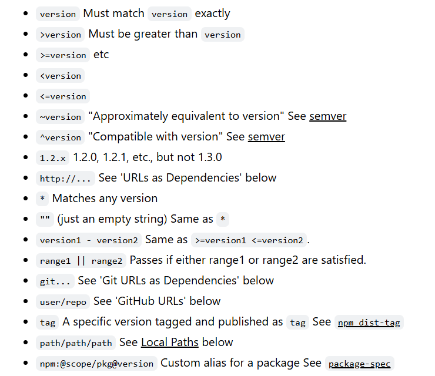

# REST API / Restfull API


These are some standards/good practices which we need to follow to do efficient communication between client and server.

- Server - Client architecture : 
- Server and Client are different entities and should not be dependent on each other.
- For this, sending data in a raw form (such as JSON) is preferred over HTML.
- ***SSR ***: When HTML sent as a response is rendered on the server and sent to client (faster)
- **CSR** : JSON data rendered by the client side ( two step, slower)
- When we know that our client would always be a browser, we can send HTML response, but if we don’t know our client’s machine, we should send the data in JSON, etc.
- Always respect all HTTP methods

---

# EXPRESS Middleware


`app.use()`

- Basically a function which can be used to do some processing on the incoming request from the client and then after processing, it can transfer it to the server if the request was valid, or it may return the request back to the client if the request was found invalid according to set rules 
- Runs on every request and response


- There can be multiple middlewares in a single code

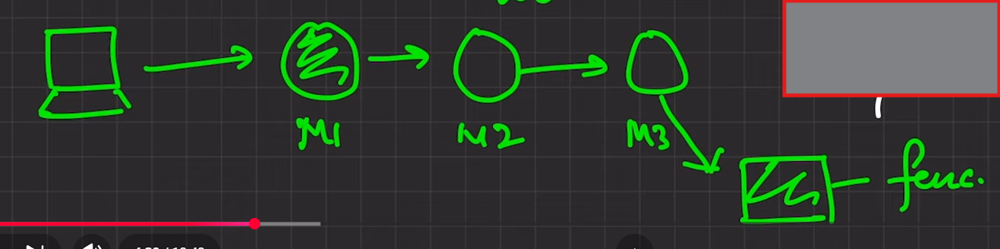

- Has access to request object, response object and next middleware function.

---

# HTTP Headers


- The data packets for each request (network packets), apart from the data inside them, contains some information about the request like from, where, amount of data, etc., this information is known as ***Headers.***

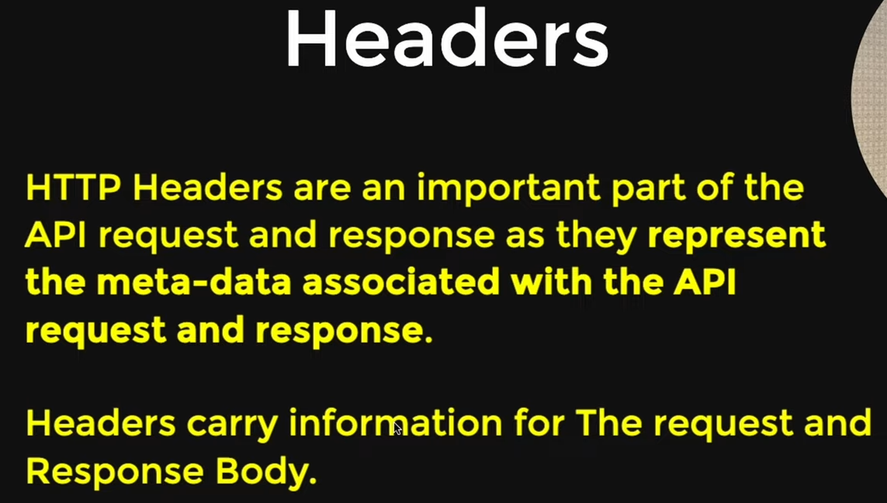


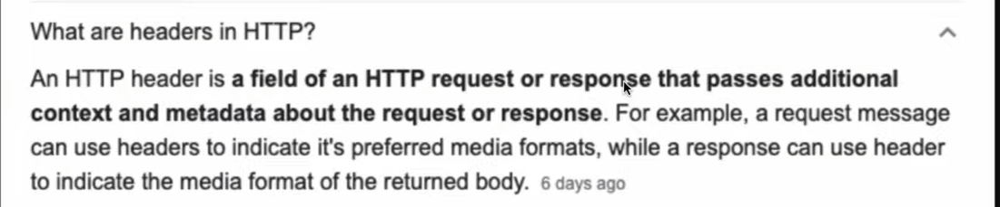

## Some Good Practices:

- Always add X prefix to custom headers

---

# HTTP Status Codes


---

# MongoDB


- Just like tables in mySQL, we have Collections in MongoDB, inside of collections each entry is known as Document

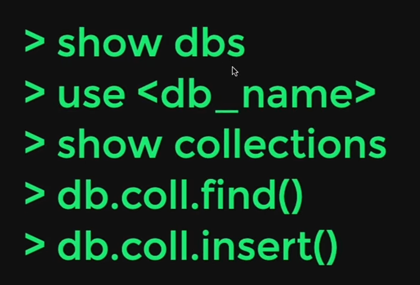


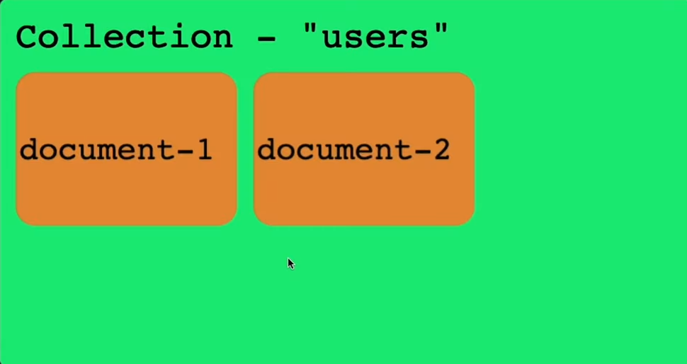

## Boilerplate


```c++

//Connection
mongoose
  .connect(" mongodb://127.0.0.1:27017/backend-tutorial")
  .then(() => console.log("MongoDB Connected"))
  .catch((err) => console.log("Mongo Error", err));
  
  
//Schema Definition
const userSchema = new mongoose.Schema({
  first_name: {
    type: String,
    required: true,
  },
  ................
  },
});

//Model Creation
const User = mongoose.model("user", userSchema);

//Creation of user through a post request
app.post(".....", async (req, res) => {

	const body = req.body;
	
	const result = await User.create({
    first_name: body.first_name,
    ......
    ......
  });
	return res.status(201).json({ msg: "success" });
})
```


---

# Model View Controller (MVC)


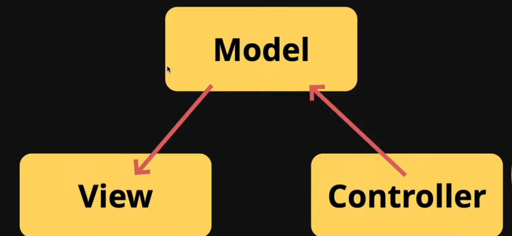

- Controller manipulates the model
- Model updates the view

---

# Server Side Rendering 


- When HTML is rendered through the server
**eg:**


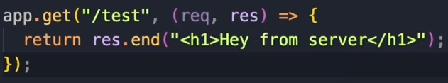

https://ejs.co/

https://www.digitalocean.com/community/tutorials/how-to-use-ejs-to-template-your-node-application

Templating engine for Server Side Rendering

- .ejs files are made inside views folder ( V in MVC Model ).
- ejs files are also basically HTML files    
# IMPORTANT LINKS !!!!!


- use `nodemon` dependency to make your server live
***Note ***: MongoDB Integration in place of Local Database** Commit on 4 april is the version of the project 1 before adopting the MVC Model.**


---

🔗 **References**
- https://www.npmjs.com/ → https://www.npmjs.com/
- https://ejs.co/ → https://ejs.co/
- https://www.digitalocean.com/community/tutorials/how-to-use-ejs-to-template-your-node-application → https://www.digitalocean.com/community/tutorials/how-to-use-ejs-to-template-your-node-application
- MongoDB Integration in place of Local Database → https://github.com/Saarvik-got-it/piyush-garg-backend-notes/commit/8b2945d3b1c5d190397ee76eac49038b2a900658

