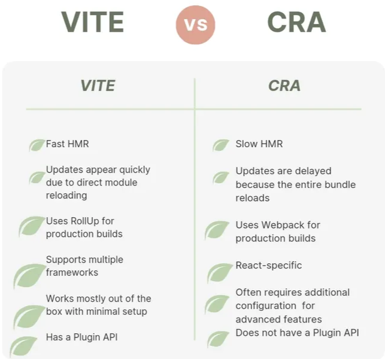
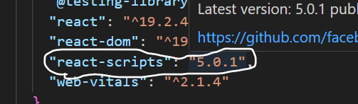
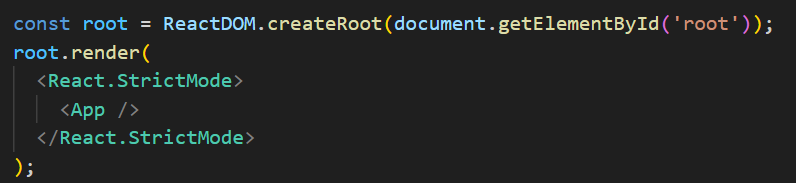
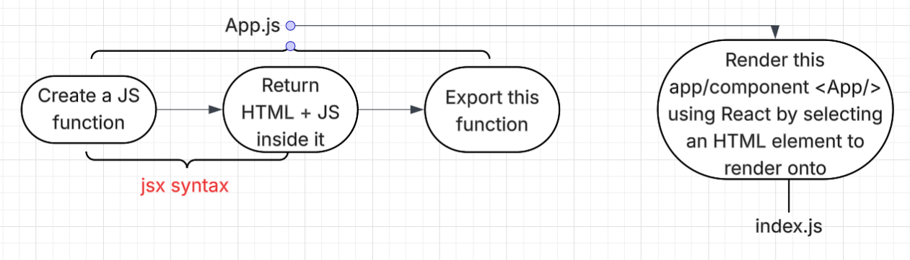
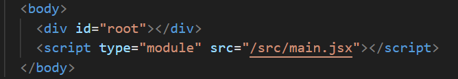
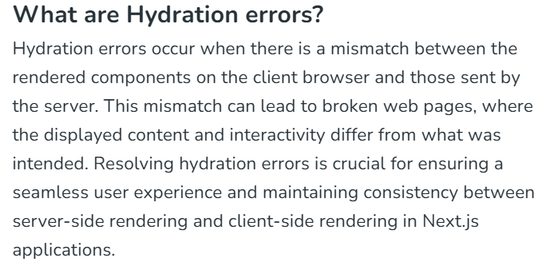
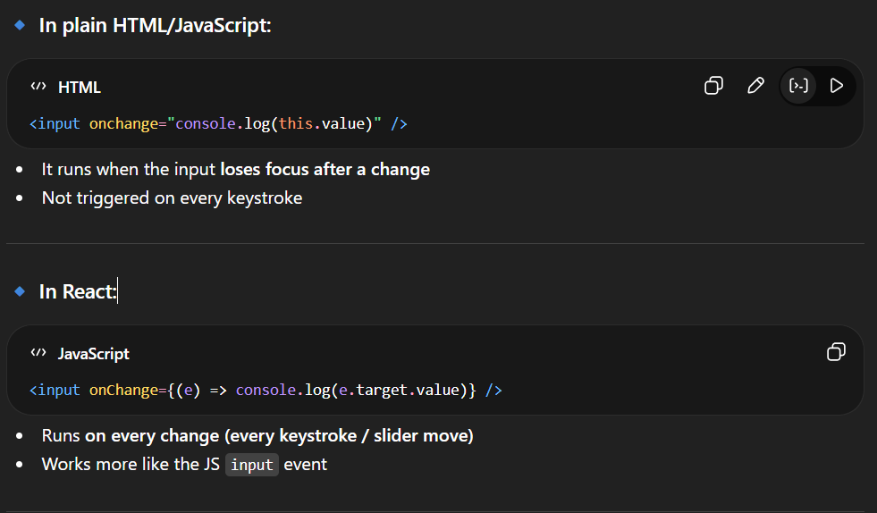
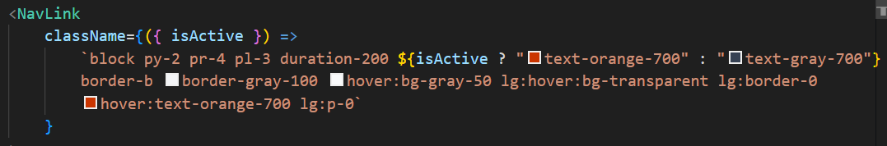

**DOCUMENTATION **:

 https://react.dev/

https://vite.dev/

# PROJECT BASED LEARNING PLAYLIST


# Why react was created ?


Syncing problem between JS and DOM, facebook *“Phantom Message Problem” .*

- ***Properties*** in JS are nothing but key value pairs of objects.
- React makes** SPA **(Single Page Application).
- **BAAS** - Backend as a Service
- Next.js allows us to write both backend and frontend together.
- React - DOM : Web
- React - Native : Mobile


# 




# WHAT IS REACT ?


JSX is just a special syntax, but React is a JavaScript library that uses that syntax to build interactive user interfaces.

# 1️⃣ Creating React Applications (or Websites)


## Method 1 (using `create-react-app`)


```javascript
	npx create-react-app project_name 
	
	npm run start
```

- This is a very slow process and not recommended.
## Method 2 (Using `VITE`)


```javascript
npm create vite@latest
npm install

npm run dev
```

- The first file which you must go through after creating a react app is `package.json`.
- To start working on a react project, we need to run the start script first
`npm run start`

- For shipping the project after production we use
`npm run build`

⇒We can also use any other bundlers like parcel for compiling a react project.

VITE is also a bundler actually.

# 2️⃣ Concept of Virtual DOM


Apart from the DOM of the browser , react also creates it own *“Virtual DOM”., *it then compares this DOM with the original DOM, and adds to the original DOM only those things which are unique in the Virtual DOM.

# 3️⃣ What is a React App ?


A React app is essentially built around JavaScript functions (called components) in which we can write HTML-like syntax (JSX). These components are then exported and rendered by a JavaScript file to display the application in the browser.

# 4️⃣ How does index.js load without linking it in the HTML File ?




Tis `react-scripts `is responsible for this act. 

# 5️⃣ Creation and rendering of virtual DOM (IMP..)




`App.js` is basically a JavaScript function which returns an HTML element

Here, `root` is a tag from the index.html file where we will load our react component.




# 6️⃣ How does VITE link index.js to index.html ?




By conventional method (`create-react-app` does this using hidden scripts)

# 7️⃣ Some conventions


- The name of the components (functions) should start from a capital letter.
- The filename of the component should also follow the same convention.
# 8️⃣ Return of multiple elements from a JS function


JSX only allows return of one element from a function.

But many elements can be returned too by enclosing them within `<> ...... </>` .These are known as fragments.

# 9️⃣ What does React do internally ?


We will demonstrate this by creating a custom react

SOURCE FILE :  

Explanation Slides (Must Go through)

- The HTML element which we send through a function is not received as it by react for rendering.
- React tries to create a ***tree*** structure from the received elements. 
VIDEO SOURCE (Rewatch)

https://youtu.be/kAOuj6o7Kxs?list=PLu71SKxNbfoDqgPchmvIsL4hTnJIrtige

# 🔟 Why do we need HOOKS and PROJECT ?


***“UI Updation ko React control karta hai hooks ke through”***

We are facing problem in UI updation (check `02counter` project) without hooks and project.

- This problem is because, say on clicking a button, 5 things can be updated, but when and who among the 5 components would be updated has to be decided by React not us. 
- React reacts on the updating of variables. 
- *Jahan pe bhi UI mein update ki baat hogi wahan React decisions lega saare.*
**eg : **Counter updation

Without `useState`, you'd have to: 

**1**. Grab the display element with `document.querySelector`. 

**2**. Get the button element. 

**3**. Add an event listener to the button. 

**4**. Inside the event listener, update the text content of the display element. 

With `useState`, you'd simply declare a piece of state called `count` and a function to update it, say `setCount`. Then, when the button is clicked, you'd call `setCount(count + 1)`, and React would automatically update the number displayed in your component.

To solve this problem, React gives us some ways/methods known as hooks, and data will be updated only through these *hooks*.

# 1️⃣1️⃣ Virtual DOM, Fibre


- Nowadays, virtual DOM is no more used in React.
- `createRoot` is responsible for creating virtual DOM
- React maintains a tree of **Virtual DOM**, tracks its changes and updates only those things which have changed instead of reloading the whole DOM.  
- Behind the scenes, React uses this Fiber Algorithm to update the Virtual DOM 



## Fibre

In React, **hydration** is **the process of transforming static HTML content, which was pre-rendered on the server, into a fully interactive web application on the client-side or can also be said as the injection of JavaScript into a static webpage**. This is a core concept in Server-Side Rendering (SSR) frameworks

In **React (JavaScript library)**, **Fiber** is the internal **reconciliation engine** used to update the UI efficiently.

### Why React Needed Fiber

Before Fiber (React <16), React used a **stack-based reconciliation algorithm**. The problem was:

- Rendering large component trees could **block the main thread**
- The browser couldn’t respond to **user interactions, animations, or scrolling**
- Updates had to finish **all at once**
- Diffing of lists is performed using keys.
This sometimes caused **janky or frozen UI**.

Fiber was introduced to solve this.

Read the given **Documentation for Fiber : **

# 1️⃣2️⃣ Tailwind and Props in ReactJS


https://tailwindcss.com/

https://www.pexels.com/ 

- Props make UI components reusable.
- All react components have access to props.
- Whenever we include a component in our app.jsx, for example `<Card />` , if we pass some values in this tag, it acts as arguments to the props of that component
- **eg: **`<Card channel='chaiaurcode' someObj={myObj} />` 
- *Note here, the object is passed as a variable*

```javascript
let myObj = {
username: "Saarvik",
age: 19
}
```

- To have receive the props, a component should have props as its argument in function declaration

```javascript
function Card(props) {
	return (
		<>
		...
		</>
	}
}
```

- Props is also an object
***Working of props***


```javascript
app.jsx

function App() {
	return (
		<>
			<Card username = 'Saarvik" />
		</>
	)
}

Card.jsx

function Card(props) {

console.log(props.username)                    //prints Saarvik on console
	return (
		<>
		...
		</>
	}
}			

NOTE : We can also do destructing and avoid repitition of the props word by
directly passing that property in brackets 
				function App ({username, .... , .....})

NOTE : We can also pass default value to props so that if we forget to pass its
			value from App.jsx the program can still work
				function App({username, btnText = "visit me", ..... ,....}
				
```

# 1️⃣3️⃣ A react interview question on count


***State as a snapshot concept***

https://www.youtube.com/watch?v=tOYkV6Yhrhs&list=PLu71SKxNbfoDqgPchmvIsL4hTnJIrtige&index=8

# 1️⃣4️⃣ bgChanger Project


- `onClick()` expects a function as an argument, not a return value, neither a reference to a function
- Hence we need to pass a function (generally using callback)
  


```javascript
<button onClick = {setColor}>                      //wrong
<button onClick = {setColor("red")}>               //wrong

<button onClick = {() => setColor("red")}>         //correct
```

# 1️⃣5️⃣ `useEffect`**, **`useRef`** and **`useCallback`


https://react.dev/reference/react/useCallback

## `useCallback(function, dependencies)`

- `useCallback` is used to memoize a function so that it doesn’t get recreated on every render, helping maintain referential equality.
- This prevents unnecessary re-renders of child components (especially when using `React.memo`) and improves performance.
- dependencies are passed in an array
- We never decide when to render a component in react, it is always decided by react
- That is why we never manually call a function in React, unlike JavaScript where we generally manually call a function when required, but here things are different, it is react who decides when to call a function. Though we can call it through a component like a button but not like randomly say

```javascript
const passwordGenerator = useCallback( () => {
				.....
				.....
}, [] )


passwordGenerator();       ❌❌❌ This would give too many renders errors in react.
```


```javascript
const passwordGenerator = useCallback( () ⇒ {….function….}, [dependencies] )
```

- To solve this problem mentioned in the last point we get introduced to another hook
## `useEffect(function, dependencies)`

https://react.dev/reference/react/useEffect

- This hook runs when the page is first loaded 
- Also this hook runs as soon as there is a slightest change in any one of the passed dependencies.
- This runs whenver the component loads (in which we are using useEffect)
- You should also clearly understand the difference in the dependencies of useCallback and useEffect
## `useRef()`

https://react.dev/reference/react/useRef

- Used when we want to take reference of anything/any component.
- To use useRef() we need to make it a variable.
- To connect interelated things
## ✅ What is `onChange` in React?

- `onChange` is an **event handler** that runs whenever the value of an input element changes.
- “Run this function whenever the user changes something in the input.”
- 📌 Example:

```plain text
<inputonChange={(e) =>console.log(e.target.value)}/>
```

- User types → `onChange` triggers
- You get the latest value using `e.target.value`
- 🧠 Important React behavior:
- In React, `onChange` works **in real-time (on every keystroke)**
- **U**nlike normal HTML where it triggers only after losing focus
- `onChange`** runs a function every time the input value changes, letting you capture and use that value.**



## ✅ Why we use callback


```javascript
setNumberAllowed((prev) =>!prev)
```

Here:

- React **gives you the latest state value as **`prev`
- You safely toggle it → `!prev`

---

💡 But wait — why not this?


```javascript
setNumberAllowed(!numberAllowed)
```

This **works**, but has a hidden problem 👇


---

⚠️ Problem without callback (important)

React state updates are **asynchronous + batched**

If multiple updates happen quickly:


```javascript
setNumberAllowed(!numberAllowed)
setNumberAllowed(!numberAllowed)
```

👉 Both may use the **same old value** → wrong result


---

✅ Callback solves this:


```plain text
setNumberAllowed((prev) =>!prev)
setNumberAllowed((prev) =>!prev)
```

👉 Each update gets the **latest updated value**


---

🧠 Simple analogy:

- `numberAllowed` → might be outdated snapshot
- `prev` → always **fresh, real current value**


---

# 1️⃣6️⃣ React Router


At its core, **React Router** is the standard library for routing in React. It enables the creation of **Single Page Applications (SPAs)** with navigation that feels like a traditional multi-page website, but without the clunky full-page reloads.

In a standard web app, clicking a link sends a request to a server and refreshes the whole page. In a React app using React Router, the library intercepts that click, updates the URL in the browser bar, and swaps out only the necessary components on the screen.

https://reactrouter.com/home

- When we use react router we use `Link` tag instead of `a` tag , as a tag refreshes the whole page, while react doesn’t refresh the whole page, it only injects changes in the same DOM, hence by using `link`tab we prevent the full refresh of page.

```javascript
<a href = ""></a>         ❌❌
<Link to=""></Link>       ✅✅
```

- `NAVLINK ??` : Gives some additional functionalities for URL such as isActive



- `import { Outlet } from 'react-router’`
- Used for setting layout and dynamically importing components
- `import { RouterProvider, createBrowserRouter } from 'react-router'` 
## Method 1 of connecting components


```javascript
import { StrictMode } from 'react'
import { createRoot } from 'react-dom/client'
import './index.css'
import App from './App.jsx'
import { RouterProvider, createBrowserRouter } from 'react-router'
import Layout from './Layout.jsx'
import Home from './Components/Home/Home.jsx'
import About from './Components/About/About.jsx'
import Contact from './Components/Contact/Contact.jsx'

const router = createBrowserRouter([
  {
    path: '/',
    element: <Layout />,
    children: [
      {
        path: "",
        element: <Home />
      },

      {
        path: "about",
        element: <About />
      },

      {
        path: "contact-us",
        element: <Contact />
      }
    ]
  }
])

createRoot(document.getElementById('root')).render(
  <StrictMode>

    <RouterProvider router={router} />
  </StrictMode>,
)
```

## Method 2 of connecting components


```javascript
const router = createBrowserRouter(
  createRoutesFromElements(
    <Route path="/" element={<Layout />}>
      <Route path="" element={<Home />}>
      </Route>
      <Route path="/about" element={<About />}>
      </Route>
      <Route path="/contact-us" element={<Contact />}>
      </Route>
    </Route>
  )
)
```

## `useLoaderData()`  and loader function

The primary benefit of using `loader` functions and the `useLoaderData` hook is the **elimination of "loading waterfalls"** and the **decoupling of data fetching from component rendering.**

In traditional React, you often fetch data inside a `useEffect` after the component mounts. If a parent component fetches data and then renders a child that *also* needs to fetch data, the child’s request can't start until the parent’s request finishes. This creates a "waterfall" delay.


---

### 1. Parallelized Fetching

Because `loader` functions run as soon as a navigation starts (before the React components even begin to render), React Router can fetch data for all nested routes in parallel.

- **Efficiency:** If you have a layout, a sidebar, and a main content area all needing data, they all start fetching at the $t = 0$ mark.
### 2. Cleaner Component Logic

You no longer need to manage `isLoading`, `isError`, or `data` states manually using `useState` and `useEffect`.

- **Standard Way:** You define the fetch logic in the `loader`.
- **The Hook:** `useLoaderData` provides the data directly. If the loader fails, React Router can automatically catch the error and show an `errorElement` instead of crashing your UI.
### 3. "Render-as-you-fetch" Pattern

Traditional React follows a "Fetch-on-render" pattern (Render → Fetch → Re-render). React Router loaders enable "Render-as-you-fetch." The browser starts fetching the data and the code for the next page simultaneously. By the time the component is ready to paint, the data is often already there.

### 4. Better UX with Navigation States

Since React Router is aware of the loading process, you can use the `useNavigation` hook to build a single, global loading indicator (like a top progress bar) that reacts to any data being fetched during a transition.


---

### Comparison Table


| Feature | useEffect Fetching | loader + useLoaderData |
| --- | --- | --- |
| Start Time | After component mounts | As soon as URL changes |
| Waterfalls | Common in nested routes | Minimized/Eliminated |
| Code Location | Inside the component UI | Segregated in route definition |
| State Management | Manual (useState, Loading...) | Automatic (via useLoaderData) |


## `useParams()` hook

## IMPORTANT 

`<Route path="/user/:userid" element={<User />} />`

Important for dynamic pages (the colon for id)

`import { useParams } from 'react-router’`

# 1️⃣7️⃣ Context API


# Glossary 


### `npx`

 node package executer (used to execute node packages directly without installing them

### `npm` 

node package manager

### `create-react-app` 

 utility

### `VITE` 

 bundler

### `npm install` 

 to install node modules folder in any directory

### `manifest.jsx` 

 used for mobile development

### `robots.txt` 

for search engine

### `DOM` 

 Tree Data Structure

### `JSX` 

 JSX is a syntax extension for JavaScript that lets you write HTML-like code inside JavaScript. 

### `./filename` 

path to a file in the same directory

### `>reload` 

to refresh whole project

### `props` 

an object for properties of HTML elements

### `ReactDOM`

implementation of react on web

### `Diffing`

Comparison of current DOM with the previous version to detect changes 

### `Reconciliation`

It is the algorithm behind what is popularl understood as the “Virtual DOM”. The algorithm React uses to diff one tree with another to determine which parts need to be changed. It is the algorithm behind what is popularly understood as the "Virtual DOM.” One tree is the Browser DOM Tree and other one is the tree which is received through `createRoot`. React compares the previous Virtual DOM with the New Virtual DOM using a process called reconciliation. **Reconciliation **is the process** React** uses to figure out how to efficiently update the DOM (Document Object Model) when changes occur in the UI. React's goal is to update the page as efficiently as possible, without unnecessary re-rendering or slow performance.

### `Page Reload`

DOM is rebuilt / repainted

### `Update`

A change in the data used to render a React app. Usually the result of `setState`. Eventually results in a re-render.


---

🔗 **References**
- https://react.dev/ → https://react.dev/
- https://vite.dev/ → https://vite.dev/
- https://youtu.be/kAOuj6o7Kxs?list=PLu71SKxNbfoDqgPchmvIsL4hTnJIrtige → https://youtu.be/kAOuj6o7Kxs?list=PLu71SKxNbfoDqgPchmvIsL4hTnJIrtige
- https://tailwindcss.com/ → https://tailwindcss.com/
- https://www.pexels.com/ → https://www.pexels.com/
- https://www.youtube.com/watch?v=tOYkV6Yhrhs&list=PLu71SKxNbfoDqgPchmvIsL4hTnJIrtige&index=8 → https://www.youtube.com/watch?v=tOYkV6Yhrhs&list=PLu71SKxNbfoDqgPchmvIsL4hTnJIrtige&index=8
- https://react.dev/reference/react/useCallback → https://react.dev/reference/react/useCallback
- https://react.dev/reference/react/useEffect → https://react.dev/reference/react/useEffect
- https://react.dev/reference/react/useRef → https://react.dev/reference/react/useRef
- https://reactrouter.com/home → https://reactrouter.com/home
- reconciliation → https://www.geeksforgeeks.org/reactjs/reactjs-reconciliation/

